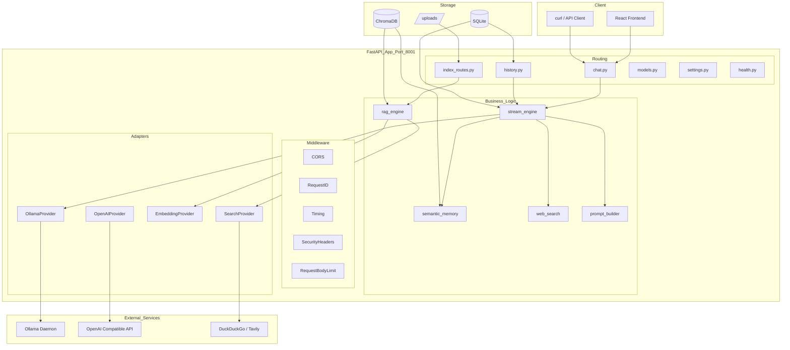

# AI Intelligent Assistant

<p align="right">
  <strong>English</strong> | <a href="./README.md">中文</a>
</p>

<p align="center">
  
</p>

<p align="center">
  <strong>A fully local, full-stack AI chat assistant</strong>
</p>

<p align="center">
  
  
  
  
  
  
</p>

---

## What is this?

An AI chat assistant that runs entirely on your local machine — no cloud APIs, no OpenAI dependency, 100% data privacy. Supports **RAG (file upload Q&A)**, **web search**, **cross-session semantic memory**, and ships with a ready-to-use **React frontend**.

The core idea is simple: **put the power of LLMs into a local web application**. The interface feels like ChatGPT, but your data and models stay on your own hardware.

---

## ✨ Features

| Feature | Description |
|---------|-------------|
| 💬 **Streaming Chat** | SSE token-by-token streaming with a 10-step pipeline: parallel prefetch, speculative search, heartbeat keepalive |
| 📄 **RAG Knowledge Base** | Upload files → smart chunking → vector search → HyDE → BM25 re-ranking |
| 🧠 **Semantic Memory** | Dialogues embedded into ChromaDB, cross-session semantic retrieval — not just a time window |
| 🔍 **Web Search** | DuckDuckGo / Tavily dual providers, LLM intent prediction + speculative parallel search |
| 🗜️ **History Compression** | Hybrid trim + incremental summarization with watermark markers, solves long-context token explosion |
| 🔌 **Multi-Model Support** | Ollama local models + OpenAI-compatible APIs (vLLM / TGI / DeepSeek) |
| 🔥 **Model Warmup** | Priority queue warmup + heartbeat keepalive, eliminates cold-start latency |
| 📊 **Full Request Tracing** | RequestID tracing from HTTP request to log output, simplifies debugging and auditing |

---

## 🏗️ Architecture Overview



---

## 🚀 Quick Start

### 1. Prerequisites

```bash
# Required: Python 3.11+ and Ollama
python --version   # >= 3.11
ollama --version    # Install from https://ollama.com
```

### 2. Pull Models

```bash
# Recommended: qwen3.5 (good Chinese + English support)
ollama pull qwen3.5:latest

# Embedding model for RAG
ollama pull bge-m3
```

### 3. Clone & Install

```bash
git clone <your-repo-url> && cd "AI Intelligent Assistant"
pip install -r requirements.txt
```

### 4. Run

```bash
# Windows
start.bat

# macOS / Linux
python main.py
```

After startup, open `http://127.0.0.1:8001` in your browser.

---

## 📂 Project Structure

```
AI Intelligent Assistant/
├── main.py                    # FastAPI entry, lifespan management
├── config.py                  # Infrastructure config (pydantic-settings)
├── runtime_config.py          # Hot-reloadable runtime parameters
├── requirements.txt           # Python dependencies
├── logging_config.py          # Structured logging + request tracing
├── start.bat                  # Windows one-click start
│
├── middleware/                 # ASGI middleware
│   ├── request_id.py          # RequestID tracing
│   ├── timing.py              # Request timing stats
│   └── security.py            # Security headers + body limit
│
├── routers/                   # API routes
│   ├── chat.py                # SSE streaming chat
│   ├── history.py             # Session history management
│   ├── index_routes.py        # File upload & indexing
│   ├── models.py              # Model discovery
│   ├── settings.py            # Runtime config API
│   └── health.py              # Health check
│
├── services/                  # Business logic (core)
│   ├── stream_engine.py       # SSE streaming engine
│   ├── rag_engine.py          # RAG orchestration
│   ├── memory.py              # Semantic memory
│   ├── compress.py            # History compression
│   ├── web_search.py          # Web search
│   ├── prompt_builder.py      # Prompt construction
│   └── providers/             # Adapters
│       ├── model.py           # Model providers
│       ├── embedding.py       # Embeddings
│       └── search.py          # Search providers
│
├── database/                  # Persistence (aiosqlite)
│   ├── sessions.py            # Sessions table
│   ├── messages.py            # Messages table
│   └── tasks.py               # Index tasks table
│
├── models/schemas.py          # Pydantic data models
├── prompts/default_system.md  # System prompt
├── frontend/                  # React frontend (Vite + Tailwind)
├── data/                      # Runtime data (SQLite + ChromaDB)
└── tutorial/                  # 📖 Step-by-step tutorial (Chinese)
```

---

## 📖 Tutorial

Want to learn how this project was built **from the first line of code to a complete application**? We provide a 14-chapter tutorial based on the actual source code:

| Module | Content | Difficulty |
|--------|---------|------------|
| **Foundation** (Ch 1-3) | Environment setup, FastAPI skeleton, dual-layer config | ⭐——⭐⭐ |
| **Core** (Ch 4-7) | Database, Provider pattern, SSE engine, React frontend | ⭐⭐——⭐⭐⭐ |
| **Advanced** (Ch 8-11) | Full RAG pipeline, semantic memory, web search, history compression | ⭐⭐——⭐⭐⭐ |
| **Production** (Ch 12-14) | Middleware onion model, model warmup, deployment | ⭐⭐——⭐⭐⭐ |

👉 **Start reading**: [English version](./tutorial/en/README.md) | [中文版](./tutorial/README.md)

---

## ⚙️ Configuration

All settings are managed via `.env` file or environment variables:

```bash
# Ollama
OLLAMA_HOST=http://localhost:11434
OLLAMA_MODEL=qwen3.5:latest

# RAG
EMBEDDING_MODEL=bge-m3
CHROMA_PERSIST_DIR=data/chroma_db

# Web search (optional)
SEARCH_PROVIDER=tavily        # or duckduckgo (default)
TAVILY_API_KEY=your_key_here

# Service port
PORT=8001
```

See [config.py](./config.py) and the [configuration guide](./tutorial/03-配置管理体系.md) for more options.

---

## 📜 License

MIT
