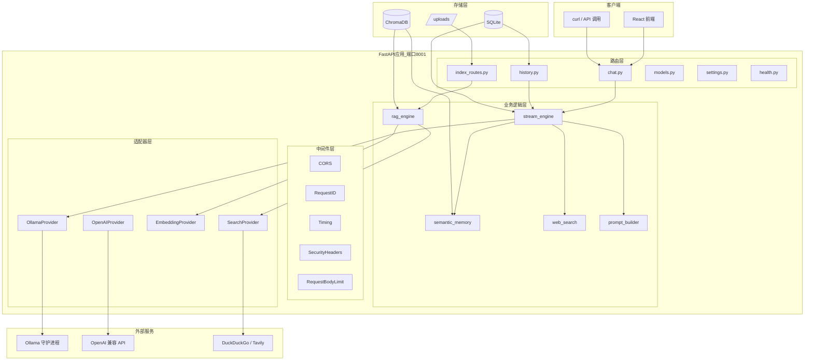

# AI 智能助手

<p align="right">
  <a href="./README.en.md">English</a> | <strong>中文</strong>
</p>

<p align="center">
  
</p>

<p align="center">
  <strong>一个运行在本地设备上的全栈 AI 对话助手</strong>
</p>

<p align="center">
  
  
  
  
  
  
</p>

---

## 这是什么？

一个可以跑在你本地电脑上的 AI 对话助手——不需要云 API、不依赖 OpenAI、数据完全本地化。支持**上传文件进行知识问答（RAG）**、**联网搜索**、**跨轮次语义记忆**，并且配备一个开箱即用的 **React 前端界面**。

核心思路很简单：**把大模型的能力装进一个本地 Web 应用里**，界面像 ChatGPT，但数据和模型都在你自己的机器上。

---

## ✨ 功能亮点

| 功能 | 说明 |
|------|------|
| 💬 **流式对话** | SSE 逐字推送，10 步编排流水线：并行预取、投机搜索、心跳保活 |
| 📄 **RAG 知识库** | 上传文件 → 智能分块 → 向量检索 → HyDE → BM25 重排序 |
| 🧠 **语义记忆** | 对话嵌入 ChromaDB，跨轮次语义检索历史，不只是时间窗口 |
| 🔍 **联网搜索** | DuckDuckGo / Tavily 双 Provider，LLM 意图预判 + 投机并行搜索 |
| 🗜️ **历史压缩** | 混合裁剪 + 增量摘要，水位线机制，解决长对话 token 爆炸 |
| 🔌 **多模型支持** | Ollama 本地模型 + OpenAI 兼容 API（vLLM / TGI / DeepSeek） |
| 🔥 **模型预热** | 优先级队列预热 + 心跳保活，消除冷启动延迟 |
| 📊 **全链路追踪** | RequestID 从请求到日志全程可追溯，便于调试和审计 |

---

## 🏗️ 架构全景



---

## 🚀 快速开始

### 1. 前置依赖

```bash
# 必装：Python 3.11+ 和 Ollama
python --version   # ≥ 3.11
ollama --version    # 需提前安装：https://ollama.com
```

### 2. 拉取模型

```bash
# 推荐使用 qwen3.5（中文能力强）
ollama pull qwen3.5:latest

# 用于 RAG 的 embedding 模型
ollama pull bge-m3
```

### 3. 克隆并安装依赖

```bash
git clone https://github.com/HelloWorld-Open/AI-Intelligent-Assistant.git && cd "AI Intelligent Assistant"
pip install -r requirements.txt
```

### 4. 启动

```bash
# Windows
start.bat

# macOS / Linux
python main.py
```

启动后会自动打开浏览器访问 `http://127.0.0.1:8001`。

---

## 📂 项目结构

```
AI Intelligent Assistant/
├── main.py                    # FastAPI 入口，lifespan 管理
├── config.py                  # 基础设施配置 (pydantic-settings)
├── runtime_config.py          # 热可调运行时参数
├── requirements.txt           # Python 依赖
├── logging_config.py          # 结构化日志 + 全链路追踪
├── start.bat                  # Windows 一键启动
│
├── middleware/                 # ASGI 中间件
│   ├── request_id.py          # 全链路 RequestID
│   ├── timing.py              # 请求耗时统计
│   └── security.py            # 安全响应头 + 请求体限流
│
├── routers/                   # API 路由层
│   ├── chat.py                # SSE 流式对话
│   ├── history.py             # 会话历史管理
│   ├── index_routes.py        # 文件上传与索引
│   ├── models.py              # 模型发现
│   ├── settings.py            # 运行时配置 API
│   └── health.py              # 健康检查
│
├── services/                  # 业务逻辑（核心）
│   ├── stream_engine.py       # SSE 流式对话引擎
│   ├── rag_engine.py          # RAG 检索编排
│   ├── memory.py              # 语义记忆
│   ├── compress.py            # 历史压缩
│   ├── web_search.py          # 联网搜索
│   ├── prompt_builder.py      # 提示词构建
│   └── providers/             # 适配器
│       ├── model.py           # 模型 Provider
│       ├── embedding.py       # 嵌入向量
│       └── search.py          # 搜索 Provider
│
├── database/                  # 数据持久化 (aiosqlite)
│   ├── sessions.py            # 会话表
│   ├── messages.py            # 消息表
│   └── tasks.py               # 索引任务表
│
├── models/schemas.py          # Pydantic 数据模型
├── prompts/default_system.md  # 系统提示词
├── frontend/                  # React 前端 (Vite + Tailwind)
├── data/                      # 运行时数据 (SQLite + ChromaDB)
└── tutorial/                  # 📖 从零构建教程
```

---

## 📖 从零构建教程

如果你想知道这个项目**从第一行代码到完整应用**的全过程，我们准备了一份基于源码的 14 章教程：

| 篇章 | 内容 | 难度 |
|------|------|------|
| **基础篇** (第1-3章) | 环境搭建、FastAPI骨架、双层配置体系 | ⭐——⭐⭐ |
| **核心篇** (第4-7章) | 数据库、Provider模式、SSE流式引擎、React前端 | ⭐⭐——⭐⭐⭐ |
| **进阶篇** (第8-11章) | RAG全链路、语义记忆、联网搜索、历史压缩 | ⭐⭐——⭐⭐⭐ |
| **工程篇** (第12-14章) | 中间件洋葱模型、模型预热、生产部署 | ⭐⭐——⭐⭐⭐ |

👉 **开始阅读：[tutorial/README.md](./tutorial/README.md)**

教程特点：
- **严格基于源码**：每段代码都可溯源到项目文件
- **20+ 张 Mermaid 图表**：架构图、序列图、流程图
- **脚手架理论设计**：从入门到生产，梯度递进
- **面向零基础**：降低认知负荷，不牺牲技术准确性

---

## ⚙️ 配置

所有配置通过 `.env` 文件或环境变量管理：

```bash
# ollama
OLLAMA_HOST=http://localhost:11434
OLLAMA_MODEL=qwen3.5:latest

# RAG
EMBEDDING_MODEL=bge-m3
CHROMA_PERSIST_DIR=data/chroma_db

# 联网搜索 (可选)
SEARCH_PROVIDER=tavily        # 或 duckduckgo (默认)
TAVILY_API_KEY=your_key_here

# 服务端口
PORT=8001
```

更多配置项见 [config.py](./config.py) 和 [运行时调参指南](./tutorial/03-配置管理体系.md)。

---

## 📜 License

MIT
