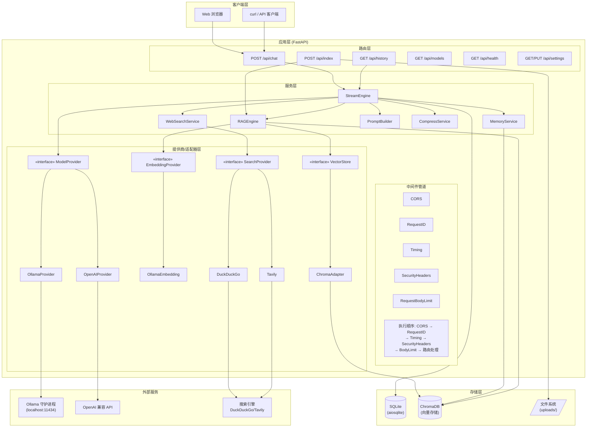

# 第1章：项目概览与环境搭建

> **本章目标**：理解项目全貌，完成开发环境搭建，拉取模型并首次启动应用。

## 1.1 我们在构建什么

我们正在构建的是一个**完全本地化**的 AI 智能助手——这意味着：

- **对话模型**运行在你的电脑上，不需要网络（Ollama）
- **知识库**（RAG）存储在本地向量数据库（ChromaDB）
- **对话记录**保存在本地 SQLite 数据库中
- **没有数据**离开你的机器

它具备以下核心功能：

| 功能 | 说明 | 涉及模块 |
|------|------|----------|
| 💬 多轮对话 | 基于本地 LLM 的流式对话，支持 SSE 实时推送 | `stream_engine.py` |
| 📄 文件知识库 | 上传文件后自动索引，对话时可检索相关内容 | `rag_engine.py`, `indexer.py` |
| 🧠 语义记忆 | 自动回忆与当前话题相关的历史对话 | `memory.py` |
| 🌐 联网搜索 | 按需搜索互联网获取实时信息 | `web_search.py` |
| ⚙️ 热可调参数 | 不重启即可调整温度、top_p、RAG 参数等 | `runtime_config.py` |
| 🎨 React 前端 | 现代化 Web UI，开箱即用 | `frontend/` |

### 使用场景举例

**场景一：知识库问答**
> 你上传了一份公司产品手册 PDF，然后问："我们的退货政策是什么？"
> 系统会检索 PDF 中找到相关段落，结合 LLM 的理解能力生成精准回答。

**场景二：多轮编程助手**
> 先问："用 Python 写一个快速排序"
> 再问："给它加上类型注解" ← 语义记忆让它知道"它"指什么
> 最后："能优化一下空间复杂度吗？"

**场景三：联网研究**
> 问："今天有什么 AI 领域的重要新闻？"
> 系统检测到你需要实时信息，自动调用搜索，将搜索结果作为上下文喂给 LLM。

## 1.2 架构全景

在写任何代码之前，先理解系统的整体架构。这个架构是所有后续章节的"地图"：



### 架构设计原则

这个架构遵循几个关键的设计原则，它们贯穿整个项目：

**1. 分层架构：职责清晰**

```
路由层 (routers/)  →  只做 HTTP 校验，调用服务层
服务层 (services/) →  包含所有业务逻辑
存储层 (database/) →  纯粹的 CRUD 操作
```

从代码中你能很明显地看到这一原则。路由层的函数非常薄：

```python
# routers/chat.py — 路由层只做 HTTP 校验
@router.post("/chat")
async def chat(body: ChatRequest, db=Depends(db_session)):
    msg_count_before = await database.count_messages(db, body.session_id)
    # HTTP 层校验：消息长度截断
    message = body.message
    max_len = get_settings().max_input_length
    if len(message) > max_len:
        message = message[:max_len] + "\n\n[消息过长，已截断]"
    # ... 然后委托给服务层
```

**2. Provider/Adapter 模式：可替换性**

模型、向量存储、嵌入服务、搜索——全部通过接口抽象，你可以替换任何一个组件而不影响其他部分：

```python
# services/providers/model.py — 抽象基类
class ModelProvider(ABC):
    @abstractmethod
    async def generate_stream(self, messages, **kwargs) -> AsyncGenerator[str, None]:
        ...

# 具体实现可以任意替换
class OllamaProvider(ModelProvider): ...
class OpenAIProvider(ModelProvider): ...
```

**3. SSE 作为一等公民**

对话的回复不是一次性返回的，而是逐 token 流式推送——这需要 Server-Sent Events 的支持。项目中从路由到引擎，SSE 贯穿了整个对话链路。

## 1.3 技术栈选型

让我们快速过一遍选用的技术及其理由——理解"为什么选这个"能帮你建立更好的技术判断力：

| 技术 | 用途 | 为什么选它 |
|------|------|------------|
| **FastAPI** | Web 框架 | 原生异步支持、自动 OpenAPI 文档、类型安全 |
| **Ollama** | 本地 LLM 运行环境 | 一键安装、模型管理方便、兼容 OpenAI API |
| **ChromaDB** | 向量数据库 | 轻量级、Python 原生、无需额外服务 |
| **SQLite + aiosqlite** | 关系数据库 | 零配置、单文件、完全异步 |
| **pydantic-settings** | 配置管理 | 类型安全、环境变量自动映射、.env 支持 |
| **MarkItDown** | 文件文本提取 | 统一处理 PDF/Word/PPT/Excel 等多种格式 |
| **rank_bm25** | BM25 重排序 | 轻量级、纯 Python、与向量检索互补 |
| **tiktoken** | Token 计数 | OpenAI 兼容的 token 计数，控制上下文长度 |
| **cachetools** | 缓存工具 | 减少重复计算（搜索缓存、embedding 缓存） |

## 1.4 环境搭建

### 1.4.1 安装 Python 3.11+

```bash
# Windows：从 https://www.python.org/downloads/ 下载安装包
# 安装时勾选 "Add Python to PATH"

# macOS：
brew install python@3.11

# Linux (Ubuntu/Debian)：
sudo apt update
sudo apt install python3.11 python3.11-venv
```

验证安装：

```bash
python --version
# 输出: Python 3.11.x 或更高
```

### 1.4.2 安装 Ollama

从 [ollama.com](https://ollama.com) 下载对应操作系统的一键安装包。

验证安装：

```bash
ollama --version
# 输出: ollama version x.x.x
```

### 1.4.3 拉取模型

我们推荐 **qwen3.5**（通义千问3.5），它在中文对话上表现优秀且资源占用适中：

```bash
# 拉取对话模型（约 4-8GB，根据量化版本不同）
ollama pull qwen3.5:latest

# 拉取嵌入模型（用于 RAG 向量化，约 1-2GB）
ollama pull bge-m3
```

验证模型可用：

```bash
ollama list
# 应该看到 qwen3.5:latest 和 bge-m3
```

> **提示**：如果你的机器配置较低，可以尝试 `qwen3.5:2b` 或 `qwen3.5:4b` 这些较小的量化版本。将 `config.py` 中的 `ollama_model` 改为对应名称即可。

### 1.4.4 克隆项目并安装依赖

```bash
# 进入项目目录
cd "c:/Users/xiele/Desktop/AI Intelligent Assistant"

# 创建虚拟环境（推荐）
python -m venv venv

# 激活虚拟环境
# Windows:
venv\Scripts\activate
# macOS/Linux:
source venv/bin/activate

# 安装依赖
pip install -r requirements.txt
```

`requirements.txt` 的内容：

```
fastapi>=0.115.0          # Web 框架
starlette>=0.40.0         # Starlette 底层 ASGI 框架
uvicorn[standard]>=0.34.0 # ASGI 服务器
pydantic>=2.0.0           # 数据校验
httpx>=0.28.0             # HTTP 客户端
numpy>=1.26.0             # 数值计算
ollama>=0.4.0             # Ollama Python 客户端
python-multipart>=0.0.9   # 文件上传解析
pydantic-settings>=2.0.0  # 配置管理
aiosqlite>=0.20.0         # 异步 SQLite
chromadb>=0.5.0           # 向量数据库
markitdown[all]           # 文件文本提取
duckduckgo_search>=8.0.0 # 默认搜索引擎
cachetools>=5.5.0         # 缓存工具
rank_bm25>=0.2.2          # BM25 算法
tiktoken>=0.7.0           # Token 计数
```

### 1.4.5 首次启动

确保 Ollama 服务正在运行：

```bash
# 检查 Ollama 状态
ollama list
```

然后启动应用：

```bash
# 在项目根目录下执行
python main.py
```

你会看到类似这样的日志输出：

```
2026-07-05 10:00:00 | INFO     | main                          | 向量存储就绪: data/chroma_db
2026-07-05 10:00:00 | INFO     | main                          | Embedding 提供就绪: bge-m3
2026-07-05 10:00:00 | INFO     | main                          | 正在初始化数据库...
2026-07-05 10:00:01 | INFO     | main                          | 应用启动完成 [model=qwen3.5:latest] [rag=True]
```

浏览器将自动打开 `http://127.0.0.1:8001`，显示完整的 Web 界面。

### 1.4.6 快速测试

用 curl 验证 API 是否正常：

```bash
# 健康检查
curl http://127.0.0.1:8001/api/health

# 发送第一条消息
curl -X POST http://127.0.0.1:8001/api/chat \
  -H "Content-Type: application/json" \
  -d '{"session_id": "test-session", "message": "你好，请介绍一下你自己"}'
```

如果你看到流式返回的 SSE 事件（以 `data:` 开头），恭喜——你的 AI 助手已经跑起来了！

## 1.5 关键文件初识

在进入第2章写代码之前，先浏览几个核心文件，建立对项目"骨架"的直观印象：

| 文件 | 作用 | 关键内容 |
|------|------|----------|
| `main.py` | 应用入口 | FastAPI 初始化、中间件注册、路由挂载、lifespan 事件 |
| `config.py` | 基础设施配置 | Ollama 地址、模型名、数据库路径、端口等 |
| `runtime_config.py` | 运行时配置 | temperature、top_p、RAG 参数等热可调项 |
| `requirements.txt` | 依赖清单 | 所有 Python 包的版本约束 |
| `prompts/default_system.md` | 系统提示词 | 定义 AI 助手的身份与行为规范 |

### main.py 初览

```python
# main.py 的核心结构（简化版）
from fastapi import FastAPI
from contextlib import asynccontextmanager

@asynccontextmanager
async def lifespan(app: FastAPI):
    """应用生命周期：启动时初始化，关闭时清理"""
    # 启动：初始化数据库、向量存储、warmup...
    await init_db()
    yield  # ← 应用运行期间
    # 关闭：清理连接
    await close_db()

app = FastAPI(title="AI 智能助手", version="2.0.0", lifespan=lifespan)

# 注册中间件
_register_middleware(app)

# 挂载路由
app.include_router(health.router, prefix="/api")
app.include_router(chat.router, prefix="/api")
# ... 更多路由
```

这个结构是所有 FastAPI 应用的通用模式：
1. 用 `lifespan` 管理启动/关闭逻辑
2. 注册中间件形成处理管道
3. 挂载路由定义 API 端点

### 系统提示词

`prompts/default_system.md` 定义了 AI 助手的行为规范——这是 prompt engineering 的重要实践：

```markdown
你是一个专业的 AI 智能助手，运行在用户的本地设备上。

## 身份
- 你的名字是「AI 智能助手」，由本地模型驱动
- 你不是 ChatGPT、Claude、Gemini、DeepSeek 或其他云服务
- 不要声称自己有联网能力或云服务身份

## 回答规范
1. 准确性优先：不确定或不知道时必须明确说明
2. 引用规范：知识库资料标注来源
3. 一致性：回答与对话历史保持一致
4. 结构化：复杂回答使用小标题、列表组织
5. 语言跟随：用户用什么语言问，就用什么语言答
```

## 1.6 实践任务

在进入下一章之前，请完成以下任务以巩固理解：

1. **修改系统提示词**：在 `prompts/default_system.md` 中添加一条新的行为规范，重启后观察 AI 的行为变化
2. **尝试不同模型**：将 `config.py` 中的 `ollama_model` 改为 `qwen3.5:2b`（需先 `ollama pull qwen3.5:2b`），对比回答质量差异
3. **查看 API 文档**：启动应用后访问 `http://127.0.0.1:8001/docs`，浏览 FastAPI 自动生成的 Swagger 文档
4. **探索目录结构**：用 `ls` 或文件管理器查看项目目录，对照 README 中的结构图找到每个文件

---

**下一章**：[第2章：最小可运行骨架](./02-最小可运行骨架.md) — 我们将从一个最精简的 FastAPI 应用开始，逐步理解 `main.py` 的每一行代码。
