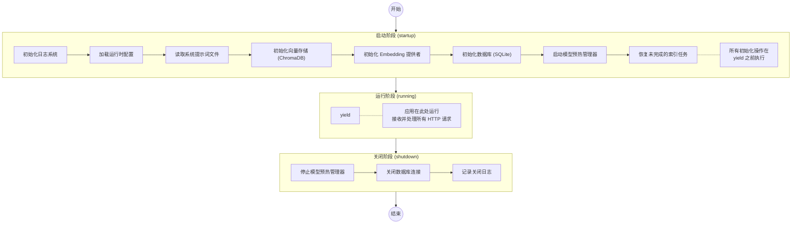
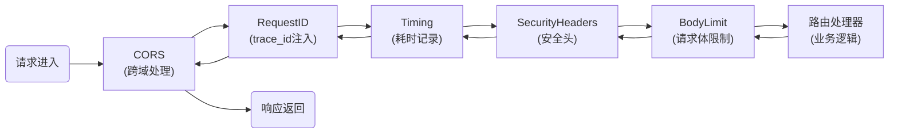
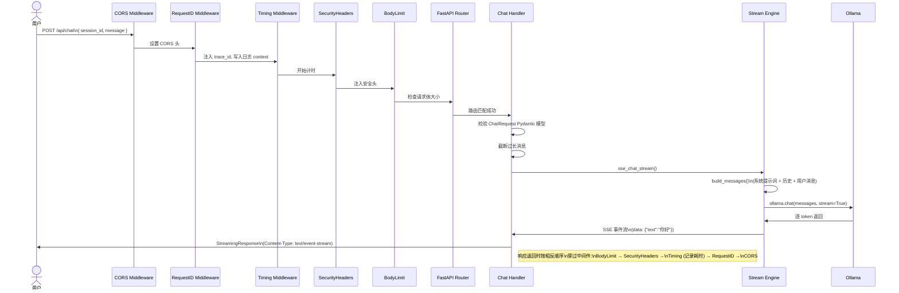

# 第2章：最小可运行骨架

> **本章目标**：理解 FastAPI 应用的生命周期，从零搭建最小可运行的骨架，掌握路由注册和中间件机制。

## 2.1 FastAPI 入门极简概览

如果你从未使用过 FastAPI，这里是一个 30 秒速览：

```python
# hello.py — 世界上最短的 FastAPI 应用
from fastapi import FastAPI

app = FastAPI()

@app.get("/")
def root():
    return {"message": "Hello World"}
```

运行它：

```bash
pip install fastapi uvicorn
uvicorn hello:app --reload
```

访问 `http://127.0.0.1:8000` → 看到 JSON 响应。访问 `http://127.0.0.1:8000/docs` → 看到自动生成的交互式 API 文档。

这就是 FastAPI 的核心魅力：**类型注解驱动** + **自动文档生成** + **原生异步支持**。

## 2.2 从零搭建应用骨架

现在让我们剥去项目中的所有复杂功能，只保留最核心的骨架。我们将分四步构建 `main.py`：

### 步骤一：导入与基础配置

```python
"""
AI 智能助手 — 应用入口（最小骨架版）
"""
import os
import asyncio
import logging
from contextlib import asynccontextmanager

from fastapi import FastAPI
from fastapi.responses import HTMLResponse
from fastapi.staticfiles import StaticFiles

logger = logging.getLogger(__name__)
```

关键导入说明：

| 导入 | 用途 |
|------|------|
| `asynccontextmanager` | 将 async 生成器转换为上下文管理器，用于 lifespan |
| `FastAPI` | 应用核心类 |
| `StaticFiles` | 挂载静态文件（如前端构建产物） |
| `HTMLResponse` | 返回 HTML 页面 |

### 步骤二：lifespan — 应用生命周期管理

这是 FastAPI 应用最核心的模式之一。`lifespan` 定义了应用启动和关闭时需要执行的逻辑：

```python
@asynccontextmanager
async def lifespan(app: FastAPI):
    """应用生命周期管理：启动时初始化资源。"""
    # ===== 启动阶段（yield 之前）=====
    logger.info("应用启动中...")
    
    # 初始化数据库
    await init_db()
    logger.info("数据库就绪")

    # 初始化向量存储
    init_vector_store(ChromaAdapter())
    logger.info("向量存储就绪")

    # 启动模型预热（消除首次调用的冷启动延迟）
    asyncio.create_task(get_warmup_manager().start())

    logger.info("应用启动完成")

    # ===== 运行阶段 =====
    yield  # ← 应用在这里运行，接收并处理请求

    # ===== 关闭阶段（yield 之后）=====
    await get_warmup_manager().shutdown()
    await close_db()
    logger.info("应用关闭")
```

`lifespan` 的三段式结构是一个"三明治"：



对应项目中的实际代码（`main.py:70-107`）：

```python
@asynccontextmanager
async def lifespan(app: FastAPI):
    settings = get_settings()
    setup_logging(settings.log_level)

    RuntimeSettingsStore.init()

    # 读取系统提示词
    prompt_path = os.path.join(os.path.dirname(__file__), settings.system_prompt_path)
    if os.path.isfile(prompt_path):
        with open(prompt_path, "r", encoding="utf-8") as f:
            settings.system_prompt = f.read()

    # 初始化向量存储和嵌入服务
    from services.vector_store import ChromaAdapter
    from services.providers import OllamaEmbeddingProvider

    init_vector_store(ChromaAdapter())
    init_embedder(OllamaEmbeddingProvider())

    # 初始化数据库
    await init_db()

    # 后台任务：恢复未完成的索引 + 启动模型预热
    asyncio.create_task(resume_incomplete_indexing())
    await get_warmup_manager().start()

    logger.info("应用启动完成 [model=%s]", settings.ollama_model)

    yield  # ← 关键分隔点

    await get_warmup_manager().shutdown()
    await close_db()
    logger.info("应用关闭")
```

### 步骤三：创建应用实例

```python
app = FastAPI(
    title="AI 智能助手",
    version="2.0.0",
    lifespan=lifespan,
)
```

三个参数都很直白——`title` 和 `version` 会显示在自动生成的 `/docs` 页面上，`lifespan` 挂载了上一步定义的生命周期管理器。

### 步骤四：注册中间件

项目中的中间件注册是一个独立的函数 `_register_middleware`（`main.py:116-141`）：

```python
def _register_middleware(app: FastAPI) -> None:
    """注册所有中间件（注意：注册顺序与执行顺序相反）"""
    settings = get_settings()

    # 最内层：请求体限制
    max_body = settings.max_upload_size + 1024 * 1024
    app.add_middleware(RequestBodyLimitMiddleware, max_size=max_body)

    # 安全头
    app.add_middleware(SecurityHeadersMiddleware)

    # 耗时统计
    app.add_middleware(TimingMiddleware)

    # 请求ID（外层，先注入 trace_id）
    app.add_middleware(RequestIDMiddleware)

    # 最外层：CORS
    app.add_middleware(
        CORSMiddleware,
        allow_origins=settings.cors_origins,
        allow_credentials=True,
        allow_methods=["*"],
        allow_headers=["*"],
    )

_register_middleware(app)
```

**关键知识点：中间件注册顺序与执行顺序相反**

FastAPI 的 `add_middleware` 是栈式注册——**最后注册的最先执行**。上面的代码中：

| 注册顺序 | 中间件 | 执行顺序（请求进入时） |
|---------|--------|----------------------|
| 第5个 add | CORS | ① 最先执行 |
| 第4个 add | RequestID | ② |
| 第3个 add | Timing | ③ |
| 第2个 add | SecurityHeaders | ④ |
| 第1个 add | BodyLimit | ⑤ 最后执行 |

这形成了一个"洋葱模型"——请求从外向内穿过每一层中间件，最终到达路由处理器：



**为什么 RequestIDMiddleware 使用纯 ASGI 实现？** 

在 `middleware/request_id.py` 中可以看到，`RequestIDMiddleware` 不是 `BaseHTTPMiddleware` 的子类，而是直接实现了 ASGI 协议：

```python
class RequestIDMiddleware:
    def __init__(self, app: ASGIApp) -> None:
        self.app = app

    async def __call__(self, scope: Scope, receive: Receive, send: Send) -> None:
        if scope["type"] != "http":
            await self.app(scope, receive, send)
            return
        # 生成或读取 request_id
        request_id = uuid.uuid4().hex[:16]
        _trace_id.set(request_id)  # 注入到 contextvars
        # 包装 send 以注入响应头
        ...
```

注释中的"纯 ASGI 而非 BaseHTTPMiddleware 以避免 anyio 子任务导致的 contextvars 隔离问题"——这是生产环境中的真实踩坑经验。`BaseHTTPMiddleware` 使用 `anyio.create_task_group` 会创建新的 context，可能导致 `contextvars` 丢失。纯 ASGI 实现则直接在当前事件循环中运行，context 得以保持。

### 步骤五：挂载路由

```python
# API 路由（优先于静态文件挂载）
app.include_router(health.router, prefix="/api")
app.include_router(chat.router, prefix="/api")
app.include_router(history.router, prefix="/api")
app.include_router(index_routes.router, prefix="/api")
app.include_router(models.router, prefix="/api")
app.include_router(model_sources.router, prefix="/api")
app.include_router(events.router, prefix="/api")
app.include_router(settings.router)  # settings 路由自带 prefix
```

**为什么路由要优先于静态文件？** FastAPI 按注册顺序匹配路由，如果 `/` 的静态文件处理器排在前面，API 路由可能被误匹配。所以始终先注册 API，再挂载静态文件。

## 2.3 运行应用

### 开发模式

```bash
# 方式一：通过 main.py 直接运行（项目内置）
python main.py
# 会在 1.5 秒后自动打开浏览器

# 方式二：使用 uvicorn 命令行（支持热重载）
uvicorn main:app --host 127.0.0.1 --port 8001 --reload
```

`main.py:172-185` 中的运行逻辑：

```python
if __name__ == "__main__":
    import uvicorn
    import webbrowser
    import threading

    settings = get_settings()
    port = settings.port

    def open_browser():
        webbrowser.open(f"http://127.0.0.1:{port}")

    threading.Timer(1.5, open_browser).start()
    uvicorn.run("main:app", host="127.0.0.1", port=port, reload=settings.dev_reload)
```

这里用 `threading.Timer` 延迟 1.5 秒打开浏览器——确保 uvicorn 已经完成启动才开始接受连接。

## 2.4 深入理解：最小路由示例

让我们看一个最简单的路由——健康检查 (`routers/health.py`)：

```python
from fastapi import APIRouter

router = APIRouter(tags=["health"])

@router.get("/health")
async def health_check():
    """服务健康检查端点"""
    result = await health_service.check_all_health()
    return HealthResponse(status=result["overall"], checks=...)
```

拆解这个路由：

| 元素 | 含义 |
|------|------|
| `APIRouter(tags=["health"])` | 创建路由器，`tags` 用于 Swagger 文档分组 |
| `@router.get("/health")` | 注册 GET 请求处理器 |
| `async def` | 异步函数，不会阻塞事件循环 |
| `response_model=HealthResponse` | Pydantic 模型，FastAPI 自动校验输出格式 |

**RESTful 约定**：项目中的 URL 设计遵循 REST 风格：

| 方法 | 路径 | 含义 |
|------|------|------|
| `GET` | `/api/health` | 读取健康状态 |
| `POST` | `/api/chat` | 创建对话（发送消息） |
| `GET` | `/api/history` | 读取会话列表 |
| `DELETE` | `/api/history/{id}` | 删除指定会话 |
| `PUT` | `/api/settings` | 更新运行时设置 |

## 2.5 数据库连接管理

项目使用 `aiosqlite` 进行数据库操作。数据库模块（`database/__init__.py`）管理着一个全局单例连接：

```python
import aiosqlite

_db: aiosqlite.Connection | None = None

async def init_db() -> None:
    """应用启动时调用一次"""
    global _db
    db_path = get_settings().db_path
    os.makedirs(os.path.dirname(db_path), exist_ok=True)

    _db = await aiosqlite.connect(db_path)
    _db.row_factory = aiosqlite.Row
    await _db.execute("PRAGMA journal_mode=WAL")  # 启用 WAL 模式提升并发性能
    await _db.execute("PRAGMA foreign_keys=ON")

    # 初始化表结构
    await init_sessions_table(_db)
    await init_messages_table(_db)
    await init_tasks_table(_db)

async def get_db() -> aiosqlite.Connection:
    """获取全局连接（路由通过 Depends 注入使用）"""
    if _db is None:
        raise RuntimeError("数据库未初始化")
    return _db

async def close_db() -> None:
    """应用关闭时调用"""
    global _db
    if _db:
        await _db.close()
        _db = None
```

两个有趣的细节：

**WAL 模式** (`PRAGMA journal_mode=WAL`)：Write-Ahead Logging 允许读写并发——写操作不阻塞读操作，这对 Web 应用至关重要。

**依赖注入**：路由通过 FastAPI 的 `Depends` 机制获取数据库连接（`routers/dependencies.py`）：

```python
from fastapi import Depends
from database import get_db

async def db_session():
    """注入数据库连接"""
    return await get_db()

# 路由中使用：
@router.post("/chat")
async def chat(body: ChatRequest, db=Depends(db_session)):
    # db 自动注入为 aiosqlite.Connection
    msg_count = await database.count_messages(db, body.session_id)
```

## 2.6 请求生命周期完整流程

让我们追踪一个完整的请求——从用户发送消息到收到回复：



## 2.7 实践任务

1. **手写最小骨架**：创建一个新文件 `minimal.py`，只包含 FastAPI 实例、一个路由 `@app.get("/ping")` 和 lifespan，用 uvicorn 启动并测试
2. **追踪请求ID**：用浏览器开发者工具查看任意 API 请求的响应头，找到 `X-Request-Id` 和 `X-Process-Time`
3. **观察中间件顺序**：在 `_register_middleware` 中临时交换两个中间件的注册顺序，观察启动日志的变化
4. **阅读 API 文档**：访问 `http://127.0.0.1:8001/docs`，尝试"Try it out"功能直接调用 `/api/health`

---

**下一章**：[第3章：配置管理体系](./03-配置管理体系.md) — 为什么项目有两套配置系统？基础设施配置和运行时参数如何分工协作？
