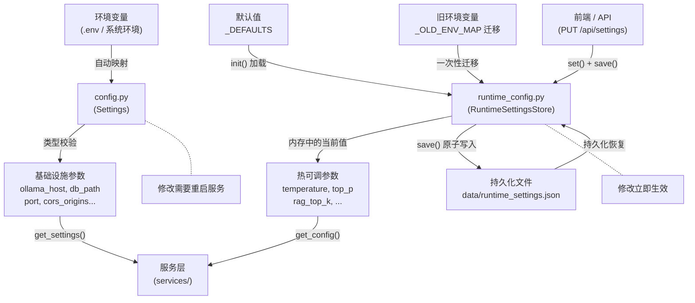

# 第3章：配置管理体系

> **本章目标**：理解项目"双层配置"的设计哲学，掌握 `config.py`（基础设施配置）和 `runtime_config.py`（热可调参数）的协作方式。

## 3.1 为什么要双层配置

大多数项目的配置是一个"大杂烩"——所有参数塞在一个文件里，改个 temperature 也要重启服务。本项目采用**双层配置**设计，将配置分为两类：

| 层级 | 文件 | 特性 | 包含什么 |
|------|------|------|----------|
| **基础设施配置** | `config.py` | 重启生效 | 模型地址、数据库路径、端口、CORS 等 |
| **运行时配置** | `runtime_config.py` | 热加载 | temperature、top_p、RAG 参数、搜索参数等 |

**设计核心问题**：下面这些参数，哪些需要重启，哪些可以实时调？

```
ollama_host = "http://localhost:11434"    ← 改了这个，不重启行吗？
temperature = 0.3                          ← 改了这个，必须重启吗？
db_path = "data/chat.db"                   ← 改了这个呢？
rag_top_k = 5                              ← 改了这个呢？
```

直觉上——连接地址、数据库路径改了需要重启（资源已初始化），而推理参数、检索参数只是"下次调用时用新值"，不需要重启。

这正是双层配置的**设计直觉**来源：

```mermaid
flowchart TD
    Start((开始))
    S1[用户想改一个参数]
    Q1{改了连接地址\n或资源路径?}
    A1[config.py\n(pydantic-settings)]
    A2[修改 .env 或环境变量]
    A3[重启服务生效]
    Q2{改了推理/检索\n调优参数?}
    B1[runtime_config.py\n(RuntimeSettingsStore)]
    B2[通过 API 或前端修改]
    B3[下次调用立即生效]
    C1[检查是否需要新增配置项]
    Stop((结束))

    Start --> S1
    S1 --> Q1
    Q1 -- 是 --> A1
    A1 --> A2
    A2 --> A3
    A3 --> Stop
    Q1 -- 否 --> Q2
    Q2 -- 是 --> B1
    B1 --> B2
    B2 --> B3
    B3 --> Stop
    Q2 -- 否 --> C1
    C1 --> Stop
```

## 3.2 config.py：基础设施配置

`config.py` 使用 **pydantic-settings** 实现类型安全的配置管理。pydantic-settings 的核心能力：

- **环境变量自动映射**：类属性 `ollama_host` 自动对应环境变量 `OLLAMA_HOST`
- **.env 文件支持**：开发时填写 `.env`，部署时用真实环境变量覆盖
- **类型校验**：配置错误在启动时就会被发现，而非运行时崩溃

### 完整实现

```python
"""
应用配置模块
使用 pydantic-settings 管理所有配置项，支持：
- 环境变量覆盖（自动映射，如 OLLAMA_HOST）
- .env 文件加载
- 类型校验与默认值
"""
import os
from pydantic import BaseModel
from pydantic_settings import BaseSettings


class ModelSourceConfig(BaseModel):
    """模型来源配置（嵌套模型）"""
    name: str
    label: str = ""
    type: str = "ollama"
    base_url: str = ""
    api_key: str = ""


class Settings(BaseSettings):
    """应用全局配置"""

    # ── Ollama 连接 ──
    ollama_host: str = "http://localhost:11434"
    ollama_model: str = "qwen3.5:latest"
    ollama_timeout: int = 300
    ollama_keep_alive: str = "-1"  # -1 表示永久保持
    ollama_num_ctx: int = 20480    # 上下文窗口大小
    ollama_num_batch: int = 2048   # 批处理大小

    # ── 对话 ──
    max_input_length: int = 2000
    system_prompt_path: str = "prompts/default_system.md"
    system_prompt: str = ""  # 启动时从文件读取

    # ── 文件上传 ──
    upload_dir: str = "uploads"
    max_upload_size: int = 30 * 1024 * 1024  # 30MB

    # ── 数据库 ──
    db_path: str = "data/chat.db"

    # ── RAG 基础设施 ──
    rag_distance_metric: str = "cosine"
    embedding_model: str = "bge-m3"
    chroma_persist_dir: str = "data/chroma_db"

    # ── 语义记忆 ──
    memory_enabled: bool = True

    # ── 联网搜索 ──
    search_provider: str = "duckduckgo"
    search_cache_ttl: int = 300  # 搜索缓存有效期（秒）
    web_search_precheck: bool = True
    tavily_api_key: str = ""

    # ── 模型管理 ──
    model_sources: list[ModelSourceConfig] = [
        ModelSourceConfig(name="ollama", label="本地 Ollama", type="ollama"),
    ]

    # ── 服务 ──
    log_level: str = "INFO"
    cors_origins: list[str] = ["*"]
    port: int = 8001
    dev_reload: bool = False  # 开发模式热重载

    model_config = {
        "env_file": ".env",
        "env_file_encoding": "utf-8",
        "env_ignore_empty": True,
    }


# ── 单例访问 ──
_settings: Settings | None = None

def get_settings() -> Settings:
    """获取全局 Settings 单例。"""
    global _settings
    if _settings is None:
        _settings = Settings()
    return _settings
```

### pydantic-settings 的魔法

看看它是如何工作的。假设你创建了一个 `.env` 文件：

```env
# .env
OLLAMA_HOST=http://192.168.1.100:11434
OLLAMA_MODEL=qwen3.5:14b
PORT=9000
LOG_LEVEL=DEBUG
TAVILY_API_KEY=tvly-xxxxxxxxxxxxxxxx
```

pydantic-settings 会自动：

1. 读取 `.env` 文件中的键值对
2. 将 `OLLAMA_HOST` 映射到 `Settings.ollama_host`
3. 将 `PORT` 映射到 `Settings.port`
4. 进行类型转换（字符串 `"9000"` → 整数 `9000`）
5. **环境变量优先级高于 `.env` 文件**（这是安全的最佳实践）

### 嵌套配置：ModelSourceConfig

项目中有一个值得注意的设计——嵌套 Pydantic 模型作为配置项：

```python
class ModelSourceConfig(BaseModel):
    name: str
    label: str = ""
    type: str = "ollama"
    base_url: str = ""
    api_key: str = ""

class Settings(BaseSettings):
    model_sources: list[ModelSourceConfig] = [
        ModelSourceConfig(name="ollama", label="本地 Ollama", type="ollama"),
    ]
```

这允许用户在 `.env` 中用 JSON 格式配置多个模型来源：

```env
MODEL_SOURCES='[{"name":"deepseek","label":"DeepSeek","type":"openai","base_url":"https://api.deepseek.com/v1","api_key":"sk-xxx"}]'
```

pydantic-settings 会自动将 JSON 字符串反序列化为 `list[ModelSourceConfig]`。

## 3.3 runtime_config.py：热可调参数

`runtime_config.py` 的设计完全不同于 `config.py`——它不使用 pydantic-settings，而是自己实现了一个 **类级别的 Store**：

```python
"""
运行时配置 — 调优参数的单一权威源。
所有可热改的推理/RAG/搜索参数集中在 RuntimeSettingsStore 中。
config.Settings 只负责基础设施参数。
"""
import os
import logging
from typing import Any
from utils.json_store import atomic_json_write, atomic_json_read

logger = logging.getLogger(__name__)
```

### 默认值字典

```python
_DEFAULTS: dict[str, Any] = {
    # 推理参数
    "temperature": 0.3,
    "top_p": 0.9,
    "max_context_tokens": 20480,
    "max_history_messages": 40,
    "max_output_tokens": 4096,

    # RAG 参数
    "rag_enabled": True,
    "rag_chunk_size": 800,
    "rag_chunk_overlap": 200,
    "rag_top_k": 3,
    "rag_score_threshold": 0.35,
    "rag_query_rewrite": True,
    "rag_hyde_enabled": True,
    "rag_hyde_max_tokens": 150,
    "rag_candidate_k": 20,
    "rag_bm25_weight": 0.4,

    # 搜索参数
    "search_max_results": 5,
    "search_max_context_tokens": 4000,
}

_TYPES: dict[str, type] = {k: type(v) for k, v in _DEFAULTS.items()}
```

`_TYPES` 字典很有用——它自动从 `_DEFAULTS` 的值推断类型，用于后续的类型强制转换。

### RuntimeSettingsStore 类

```python
class RuntimeSettingsStore:
    _data: dict[str, Any] = {}
    _persist_path: str = "data/runtime_settings.json"

    @classmethod
    def init(cls) -> None:
        """启动时调用：初始化默认值 + 加载持久化数据"""
        cls._data = dict(_DEFAULTS)

        runtime_file_exists = os.path.isfile(cls._persist_path)
        cls._load()  # 从文件加载覆盖默认值

        # 一次性迁移：将旧版 .env 中的调优参数迁移到 JSON 文件
        if not runtime_file_exists:
            migrated = False
            for env_key, runtime_key in _OLD_ENV_MAP.items():
                env_val = os.environ.get(env_key)
                if env_val is not None:
                    cls._data[runtime_key] = cls._coerce(runtime_key, env_val)
                    migrated = True
            if migrated:
                logger.info("已从环境变量迁移 %d 个运行时设置", ...)

    @classmethod
    def get(cls, key: str, default: Any = None) -> Any:
        return cls._data.get(key, default)

    @classmethod
    def set(cls, key: str, value: Any) -> None:
        cls._data[key] = cls._coerce(key, value)

    @classmethod
    def all(cls) -> dict[str, Any]:
        return dict(cls._data)

    @classmethod
    def save(cls) -> None:
        """持久化到 JSON 文件"""
        atomic_json_write(cls._persist_path, cls._data)
```

### 类型强制转换

`_coerce` 方法确保从环境变量或 API 传入的值被正确转换类型：

```python
@classmethod
def _coerce(cls, key: str, value: Any) -> Any:
    expected = _TYPES.get(key)
    if expected is None:
        return value
    if isinstance(value, expected):
        return value
    # 布尔值特殊处理
    if expected is bool:
        if isinstance(value, str):
            return value.lower() in ("true", "1", "yes")
        return bool(value)
    # 尝试直接转换
    try:
        return expected(value)
    except (ValueError, TypeError):
        return _DEFAULTS.get(key, value)
```

比如 `"true"` → `True`，`"0.7"` → `0.7`，`"5"` → `5`——用户通过 API 传入的字符串会被正确转换。

### 旧配置迁移

`_OLD_ENV_MAP` 是一个迁移字典——将旧版本使用环境变量管理的调优参数迁移到新的 JSON 持久化体系：

```python
_OLD_ENV_MAP: dict[str, str] = {
    "OLLAMA_TEMPERATURE": "temperature",
    "OLLAMA_TOP_P": "top_p",
    "MAX_OUTPUT_TOKENS": "max_output_tokens",
    "RAG_ENABLED": "rag_enabled",
    # ... 更多映射
}
```

这段代码体现了**向后兼容的设计意识**——定义旧配置到新配置的映射，启动时自动迁移，避免用户升级后丢失设置。

### 便捷访问函数

```python
def get_config(key: str):
    """读取调优参数：优先运行时设置，未命中返回 _DEFAULTS。"""
    val = RuntimeSettingsStore.get(key)
    if val is not None:
        return val
    return _DEFAULTS.get(key)
```

这个函数被服务层广泛使用。例如在 `rag_engine.py` 中：

```python
from runtime_config import get_config

top_k = get_config("rag_top_k")       # 读取热可调的 top_k
threshold = get_config("rag_score_threshold")  # 读取相关性阈值
```

## 3.4 两种配置的协作

来看看实际代码中两种配置如何配合使用。以流式对话引擎 `stream_engine.py` 为例：

```python
from config import get_settings      # 基础设施配置
from runtime_config import get_config  # 运行时配置

# 基础设施配置：Ollama 连接
settings = get_settings()
model = settings.ollama_model        # 重启才生效

# 运行时配置：推理参数
temperature = get_config("temperature")  # 热可调
top_p = get_config("top_p")              # 热可调

# 组装调用参数
options = {
    "temperature": temperature,  # 来自 runtime_config
    "top_p": top_p,              # 来自 runtime_config
    "num_ctx": settings.ollama_num_ctx,  # 来自 config
}
```

## 3.5 原子化持久化：为什么重要

`runtime_config.py` 的 `save()` 方法使用了 `atomic_json_write`，这是一个被低估的安全设计：

```python
def atomic_json_write(path: str, data: object) -> None:
    """原子方式写入 JSON 文件（.tmp → os.replace），防止崩溃导致文件损坏。"""
    os.makedirs(os.path.dirname(path) or ".", exist_ok=True)
    tmp_path = path + ".tmp"
    try:
        with open(tmp_path, "w", encoding="utf-8") as f:
            json.dump(data, f, ensure_ascii=False, indent=2)
            f.flush()
            os.fsync(f.fileno())       # ← 确保写入磁盘
        os.replace(tmp_path, path)      # ← 原子替换
    except Exception as e:
        logger.warning("JSON 写入失败 %s: %s", path, e)
        if os.path.exists(tmp_path):
            try:
                os.remove(tmp_path)
            except OSError:
                pass
```

关键步骤：
1. **先写临时文件**：如果写入过程中崩溃，损坏的是 `.tmp` 文件
2. **fsync 落盘**：确保数据真正写入磁盘而非停留在 OS 缓存
3. **原子替换**：`os.replace()` 是原子操作——要么是旧文件，要么是新文件，不会出现"写到一半"的状态

对比一下"普通写法"的风险：

```python
# 危险写法：如果在这两行之间崩溃...
with open(path, "w") as f:
    json.dump(data, f)
    # ← 崩溃！文件内容残缺
```

## 3.6 配置流全景



## 3.7 日志配置：一个特殊的存在

`logging_config.py` 介于基础设施和运行时之间——日志级别在 `config.py` 中定义（重启生效），但日志格式、trace_id 注入机制是应用级的底层设置：

```python
import contextvars
import logging

_trace_id: contextvars.ContextVar[str] = contextvars.ContextVar("trace_id", default="")

TRACE_FORMAT = (
    "%(asctime)s | %(levelname)-8s | %(name)-30s | %(trace_id)s%(message)s"
)

class TraceFilter(logging.Filter):
    """从 contextvars 读取 trace_id 并注入到每条日志记录。"""
    def filter(self, record: logging.LogRecord) -> bool:
        tid = _trace_id.get()
        record.trace_id = f"[{tid}] " if tid else ""
        return True

def setup_logging(level: str = "INFO") -> None:
    """应用启动时调用一次"""
    root = logging.getLogger()
    root.setLevel(getattr(logging, level.upper(), logging.INFO))

    for handler in root.handlers[:]:
        root.removeHandler(handler)

    console = logging.StreamHandler(sys.stdout)
    console.setFormatter(logging.Formatter(TRACE_FORMAT, datefmt="%Y-%m-%d %H:%M:%S"))
    console.addFilter(TraceFilter())
    root.addHandler(console)

    # 降低第三方库的日志噪音
    logging.getLogger("httpx").setLevel(logging.WARNING)
    logging.getLogger("uvicorn.access").setLevel(logging.WARNING)
```

启动时的调用链：`lifespan → setup_logging(settings.log_level)`，这里的 `log_level` 来自 `config.py`。

**为什么用 contextvars？** 因为异步环境下，`threading.local` 不管用——同一个线程可能处理多个并发请求。`contextvars.ContextVar` 是 Python 3.7+ 提供的协程安全的上下文变量，每个 asyncio Task 有独立的上下文。`RequestIDMiddleware` 设置它，`TraceFilter` 读取它——完美配合。

## 3.8 如何添加自己的配置项

现在你已经理解了双层配置的套路，添加新配置项就很简单了。假设你想添加一个"是否启用流式响应"的开关：

### 需要重启的 → 加到 config.py

```python
class Settings(BaseSettings):
    # ... 已有配置 ...
    enable_streaming: bool = True  # 新增
```

### 热可调的 → 加到 runtime_config.py

```python
_DEFAULTS: dict[str, Any] = {
    # ... 已有配置 ...
    "enable_streaming": True,  # 新增
}
```

然后通过 API 修改：

```bash
curl -X PUT http://127.0.0.1:8001/api/settings \
  -H "Content-Type: application/json" \
  -d '{"enable_streaming": false}'
```

服务层读取：

```python
from runtime_config import get_config
streaming_enabled = get_config("enable_streaming")
```

## 3.9 实践任务

1. **创建 `.env` 文件**：在项目根目录创建 `.env`，设置 `PORT=9000` 和 `LOG_LEVEL=DEBUG`，重启后观察端口和日志级别变化
2. **修改运行时参数**：通过前端界面或 API 调整 `temperature` 为 `0.8`，发送相同问题观察回答风格的变化
3. **查看持久化文件**：打开 `data/runtime_settings.json`，观察修改后的参数如何保存
4. **理解原子写入**：找到 `utils/json_store.py`，对比"普通写入"和"原子写入"的区别，思考什么场景下原子写入能避免数据损坏
5. **断点测试**：修改 `config.py` 中的 `ollama_model` 为一个不存在的模型名，观察启动时的表现——pydantic-settings 会报什么错？（其实不会报错，因为模型可用性在运行时才检查，思考这对配置校验意味着什么）

---

**下一章**：第4章：路由层与SSE流式对话（敬请期待）—— 深入 `routers/chat.py` 和 `services/stream_engine.py`，理解 SSE 流式对话的完整链路。
