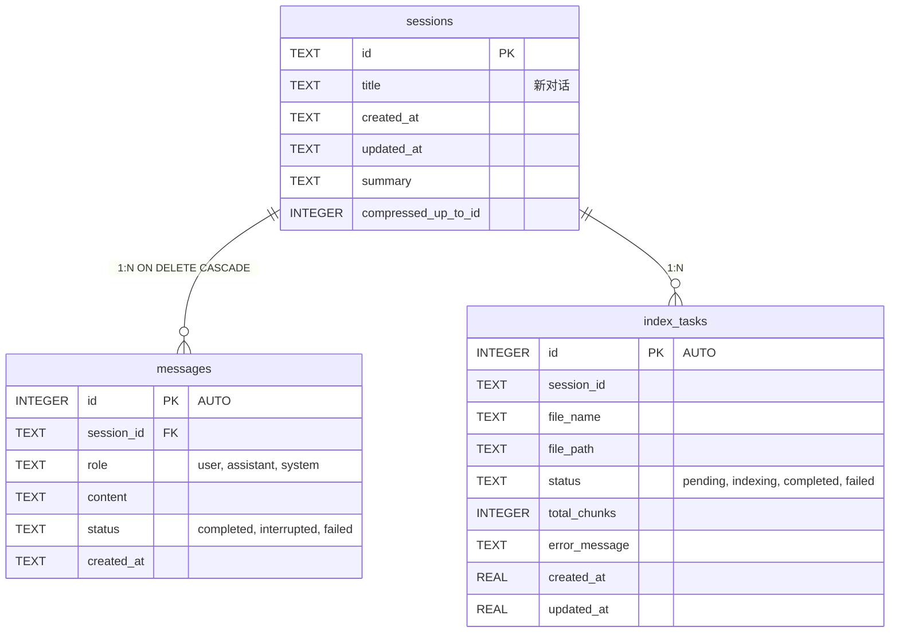

# 第 4 章：数据持久化层

在前三章中，我们完成了项目搭建、最小可运行骨架和双层配置体系。一个 AI 助手的基本骨架已经立起来了——但它还没有"记忆"。每次重启，所有对话都会消失。

本章将带你为 AI 助手注入"大脑的记忆系统"：使用 **SQLite + aiosqlite** 构建一套轻量却完整的数据持久化层。

## 4.1 为什么是 SQLite？

在设计本地 AI 助手时，数据库选择是一个关键决策。我们面临几种选择：

| 选项 | 优势 | 劣势 |
|------|------|------|
| PostgreSQL / MySQL | 功能完整，并发强 | 需要独立安装和运维，过于笨重 |
| JSON 文件 | 零配置，人类可读 | 无查询能力，大文件性能差，无并发安全 |
| **SQLite** | 零配置、单文件、标准 SQL | 写并发有限（但对于单用户本地应用完全够用） |

SQLite 是一个嵌入式关系型数据库引擎，它的数据库就是一个文件。对于本地 AI 助手这种单用户、低并发的场景，SQLite 几乎是**完美的选择**：

1. **零配置**：无需安装数据库服务，`pip install aiosqlite` 即可
2. **单文件存储**：所有对话、消息都存在一个 `.db` 文件中，便于备份和迁移
3. **标准 SQL**：支持 JOIN、子查询、索引，比手写文件 I/O 强大得多
4. **事务支持**：保证数据一致性，不会出现写一半崩溃的情况
5. **WAL 模式**：Write-Ahead Logging 模式让读写可以并发，性能大幅提升

> **设计洞见**：本地应用不需要 MySQL。很多开发者习惯性地往项目里塞一个 PostgreSQL，其实是对复杂度的过度投资。SQLite 每年处理数万亿次查询，已经足够应对绝大多数本地场景。

## 4.2 aiosqlite：异步化 SQLite

Python 标准库的 `sqlite3` 是**同步**的，会在事件循环中造成阻塞。对于 FastAPI 这样的异步框架，我们需要 `aiosqlite`，它在线程池中执行 SQLite 操作，将控制权交还给事件循环：

```python
import aiosqlite

# 同步写法（会阻塞事件循环） ❌
import sqlite3
conn = sqlite3.connect("data.db")

# 异步写法（不阻塞） ✅
conn = await aiosqlite.connect("data.db")
await conn.execute("SELECT * FROM sessions")
```

`aiosqlite` 的 API 与标准库高度相似，学习成本几乎为零，同时支持 `await`、上下文管理器、行工厂等所有常用功能。

## 4.3 数据库单例设计

我们的设计理念是：**应用启动时创建一个全局连接，整个生命周期复用，关闭时释放。** 这比每次操作都创建/关闭连接高效得多，也避免了连接管理的复杂性。

```python
# database/__init__.py（核心结构）

_db: aiosqlite.Connection | None = None  # 全局单例

def _db_path() -> str:
    """从配置中读取数据库文件路径"""
    return get_settings().db_path

async def init_db() -> None:
    """应用启动时调用一次，初始化连接和表结构"""
    global _db
    db_path = _db_path()
    os.makedirs(os.path.dirname(db_path), exist_ok=True)

    _db = await aiosqlite.connect(db_path)
    _db.row_factory = aiosqlite.Row
    await _db.execute("PRAGMA journal_mode=WAL")
    await _db.execute("PRAGMA foreign_keys=ON")

    await init_sessions_table(_db)
    await init_messages_table(_db)
    await init_tasks_table(_db)

    await _db.commit()

async def close_db() -> None:
    """应用关闭时调用"""
    global _db
    if _db:
        await _db.close()
        _db = None

async def get_db() -> aiosqlite.Connection:
    """获取全局连接（运行时调用）"""
    if _db is None:
        raise RuntimeError("数据库未初始化，请先调用 init_db()")
    return _db
```

### 关键设计点

**1. `row_factory = aiosqlite.Row`**

这让我们可以用 `row["column_name"]` 的方式访问查询结果，而不是 `row[0]` 这种魔法数字：

```python
cursor = await db.execute("SELECT id, title FROM sessions")
row = await cursor.fetchone()
print(row["title"])  # 清晰明了
# vs
print(row[1])       # 这是啥？维护者的噩梦
```

**2. WAL 模式**

`PRAGMA journal_mode=WAL` 启用 Write-Ahead Logging。在默认的 DELETE 模式下，一个写操作会阻塞所有读操作；而在 WAL 模式下，读写可以并发进行。对于需要同时读取历史消息和保存新消息的聊天应用，这是性能的关键保障。

**3. 外键约束**

`PRAGMA foreign_keys=ON` 确保删除会话时，关联的消息也会被级联删除（通过 `ON DELETE CASCADE`），保持数据完整性。

**4. 模块化表初始化**

每个表的 DDL 和迁移逻辑封装在自己的模块中（`database/sessions.py`、`database/messages.py` 等），通过延迟导入避免循环依赖。`init_db()` 只负责编排调用顺序。

**5. 重新导出保持 API 整洁**

```python
# database/__init__.py 底部
from database.sessions import (
    create_session, get_sessions, get_session,
    rename_session, delete_session, search_sessions,
)
from database.messages import (
    save_message, delete_message, get_messages,
    count_messages, get_last_user_message, ...
)
```

这样，业务代码只需 `from database import get_sessions` 而无需关心函数定义在哪个子模块。

## 4.4 表设计详解

该项目围绕三个核心表构建数据模型。它们的关系如下：



### 4.4.1 sessions 表——对话容器

每个对话是一个 session，类似于 ChatGPT 中的一个"聊天"。核心字段：

- `id`：UUID 字符串，唯一标识一个会话
- `title`：会话标题，初始为"新对话"，首条消息后自动生成
- `created_at` / `updated_at`：时间戳，用于排序和展示
- `summary`：历史摘要缓存（压缩策略的核心，见 6.3 节）
- `compressed_up_to_id`：压缩水位线，标记"此 ID 之前的消息已被压缩到 summary 中"

```sql
CREATE TABLE IF NOT EXISTS sessions (
    id          TEXT PRIMARY KEY,
    title       TEXT NOT NULL DEFAULT '新对话',
    created_at  TEXT NOT NULL DEFAULT (datetime('now', 'localtime')),
    updated_at  TEXT NOT NULL DEFAULT (datetime('now', 'localtime'))
);
```

### 4.4.2 messages 表——对话内容

每条用户发言和 AI 回复都是一条 message：

- `id`：自增主键（按发送顺序递增，天然有序）
- `session_id`：外键关联到 sessions
- `role`：`user` / `assistant` / `system`，通过 CHECK 约束校验
- `content`：消息文本
- `status`：`completed`（正常完成）/ `interrupted`（用户打断）/ `failed`（异常终止）

```sql
CREATE TABLE IF NOT EXISTS messages (
    id          INTEGER PRIMARY KEY AUTOINCREMENT,
    session_id  TEXT NOT NULL,
    role        TEXT NOT NULL CHECK(role IN ('user', 'assistant', 'system')),
    content     TEXT NOT NULL,
    status      TEXT NOT NULL DEFAULT 'completed'
                CHECK(status IN ('completed', 'interrupted', 'failed')),
    created_at  TEXT NOT NULL DEFAULT (datetime('now', 'localtime')),
    FOREIGN KEY (session_id) REFERENCES sessions(id) ON DELETE CASCADE
);
```

推荐索引设计：

```sql
-- 会话消息列表查询（最高频操作）
CREATE INDEX idx_messages_session ON messages(session_id, created_at);
-- 按角色查询（获取最后一条用户消息等）
CREATE INDEX idx_messages_session_role ON messages(session_id, role, id);
-- 按状态查询（检索中断/失败消息）
CREATE INDEX idx_messages_status ON messages(status);
```

### 4.4.3 index_tasks 表——文件索引追踪

上传文件后，系统需要在后台将文件内容分块（chunk）、向量化（embedding）、存入向量数据库。`index_tasks` 追踪整个索引生命周期：

```
pending → indexing → completed
                   → failed
```

```sql
CREATE TABLE IF NOT EXISTS index_tasks (
    id              INTEGER PRIMARY KEY AUTOINCREMENT,
    session_id      TEXT NOT NULL,
    file_name       TEXT NOT NULL,
    file_path       TEXT NOT NULL DEFAULT '',
    status          TEXT NOT NULL DEFAULT 'pending',
    total_chunks    INTEGER DEFAULT 0,
    error_message   TEXT,
    created_at      REAL NOT NULL,
    updated_at      REAL NOT NULL
);
```

注意这里用了 `REAL` 类型存储时间戳（`time.time()` 浮点数），而不是 TEXT。这是一种务实的权衡：对于任务追踪这种高频更新的场景，浮点比较比字符串比较更快，且不需要精确到毫秒以下的精度。

### CRUD 操作示例

以 sessions 为例，典型的 CRUD 模式：

```python
# 创建
async def create_session(db: aiosqlite.Connection, title: str = "新对话") -> str:
    session_id = str(uuid.uuid4())
    await db.execute(
        "INSERT INTO sessions (id, title) VALUES (?, ?)",
        (session_id, title),
    )
    await db.commit()
    return session_id

# 查询列表（按更新时间降序）
async def get_sessions(db: aiosqlite.Connection) -> list[dict]:
    cursor = await db.execute(
        "SELECT id, title, created_at, updated_at FROM sessions ORDER BY updated_at DESC"
    )
    rows = await cursor.fetchall()
    return [dict(r) for r in rows]

# 搜索（标题 + 消息内容联合搜索）
async def search_sessions(db, query: str, limit: int = 20) -> list[dict]:
    cursor = await db.execute(
        """SELECT id, title, created_at, updated_at FROM sessions WHERE title LIKE ?
           UNION
           SELECT id, title, created_at, updated_at FROM sessions
           WHERE id IN (SELECT session_id FROM messages WHERE content LIKE ?)
           ORDER BY updated_at DESC LIMIT ?""",
        (f"%{query}%", f"%{query}%", limit),
    )
    return [dict(r) for r in await cursor.fetchall()]
```

> **设计亮点评析**：`search_sessions` 使用 UNION 联合查询标题和消息内容，让用户可以用一个关键词同时匹配对话标题和对话内容，大幅提升重找到历史对话的效率。

## 4.5 聪明的迁移策略

SQLite 的 `ALTER TABLE` 能力有限——它不能修改已有列的定义，但可以**添加新列**。我们的项目利用这一点，用 `try/except` 实现了一种**无痛的增量迁移**：

```python
# database/sessions.py
async def init_sessions_table(db: aiosqlite.Connection) -> None:
    # 1. 先创建基础表（IF NOT EXISTS 保证幂等）
    await db.execute("""CREATE TABLE IF NOT EXISTS sessions (
        id TEXT PRIMARY KEY, title TEXT, created_at TEXT, updated_at TEXT
    )""")

    # 2. 尝试添加新列——如果已存在则静默跳过
    try:
        await db.execute("ALTER TABLE sessions ADD COLUMN summary TEXT DEFAULT ''")
        await db.commit()
    except Exception:
        pass  # 列已存在，无需操作

    try:
        await db.execute("ALTER TABLE sessions ADD COLUMN compressed_up_to_id INTEGER DEFAULT NULL")
        await db.commit()
    except Exception:
        pass
```

### 为什么不在 `CREATE TABLE` 中直接定义所有列？

这是一个精妙的设计选择。假设最初的表只有 4 个基础列：

```sql
CREATE TABLE IF NOT EXISTS sessions (id TEXT, title TEXT, created_at TEXT, updated_at TEXT);
```

用户使用 v1.0 创建了 100 个会话后，升级到 v1.1（需要添加 `summary` 列）。此时 `CREATE TABLE IF NOT EXISTS` **会静默跳过**（表已存在），新列永远不会被添加。但 `ALTER TABLE ADD COLUMN IF NOT EXISTS` 并非标准 SQL，SQLite 也不支持。

于是我们用 `try/except` 曲线救国：尝试 ALTER，如果因为列已存在而失败，就忽略错误。**这种模式让新老数据库都能平滑升级**，用户无需手动执行任何迁移脚本。

> **迁移诚信检查**：虽然 `try/except Exception` 范围较宽，不够严格，但在 SQLite 中 `ALTER TABLE ADD COLUMN` 只会因为"列已存在"而报错——这是一个相对安全的"鸭子判断"。如果你是完美主义者，可以检查错误消息内容，但在实践中，宽捕获的简洁性值得这点不精确。

## 4.6 动手实践：添加一个新表

假设我们要为系统添加一个"用户偏好"功能，让每个会话可以记录一些自定义设置（如模型温度、回复长度等）。让我们在实际代码中添加 `session_preferences` 表。

### Step 1：创建 `database/preferences.py`

```python
import aiosqlite

async def init_preferences_table(db: aiosqlite.Connection) -> None:
    await db.execute("""
        CREATE TABLE IF NOT EXISTS session_preferences (
            session_id  TEXT PRIMARY KEY,
            temperature REAL DEFAULT 0.7,
            max_tokens  INTEGER DEFAULT 2048,
            top_p       REAL DEFAULT 0.9,
            FOREIGN KEY (session_id) REFERENCES sessions(id) ON DELETE CASCADE
        )
    """)

async def get_preferences(db: aiosqlite.Connection, session_id: str) -> dict:
    cursor = await db.execute(
        "SELECT * FROM session_preferences WHERE session_id = ?", (session_id,)
    )
    row = await cursor.fetchone()
    if row:
        return dict(row)
    # 返回默认值
    return {"session_id": session_id, "temperature": 0.7, "max_tokens": 2048, "top_p": 0.9}

async def save_preferences(db: aiosqlite.Connection, session_id: str, **kwargs) -> None:
    await db.execute(
        """INSERT INTO session_preferences (session_id, temperature, max_tokens, top_p)
           VALUES (?, ?, ?, ?)
           ON CONFLICT(session_id) DO UPDATE SET
               temperature = excluded.temperature,
               max_tokens = excluded.max_tokens,
               top_p = excluded.top_p""",
        (session_id, kwargs.get("temperature", 0.7),
         kwargs.get("max_tokens", 2048), kwargs.get("top_p", 0.9)),
    )
    await db.commit()
```

### Step 2：在 `database/__init__.py` 中注册

```python
# 在 init_db() 中添加
from database.preferences import init_preferences_table
await init_preferences_table(_db)

# 在重新导出区添加
from database.preferences import get_preferences, save_preferences
```

### Step 3：使用

```python
db = await get_db()
prefs = await get_preferences(db, session_id)
# 使用 prefs["temperature"] 调整模型行为
```

整个流程不超过 5 分钟，这就是好的架构设计带来的扩展便利性。

## 4.7 性能提示

1. **参数化查询**：始终使用 `?` 占位符而非 f-string 拼接，防止 SQL 注入
2. **批量操作**：大量插入时，在一个事务内完成（SQLite 的默认行为就是每条语句一个隐式事务，显式管理可以减少 fsync 次数）
3. **索引策略**：只为高频查询创建索引。每多一个索引，写操作就慢一点。本项目的索引数量刚好在性能和存储之间取得平衡
4. **不在数据库层做复杂计算**：数据聚合、排序可以在 Python 层完成，SQL 只负责 I/O

## 本章小结

- SQLite + aiosqlite 是本地 AI 应用数据存储的最优组合
- 全局单例连接模式简化了连接管理
- 三张核心表（sessions / messages / index_tasks）覆盖了对话系统的所有数据需求
- `try/except` 增量迁移策略让数据库升级零摩擦
- 良好的模块划分让添加新表只需几分钟

下一章，我们将深入模型抽象层，看看如何用一个 Provider 接口统一 Ollama 和 OpenAI 兼容 API 的调用方式。
