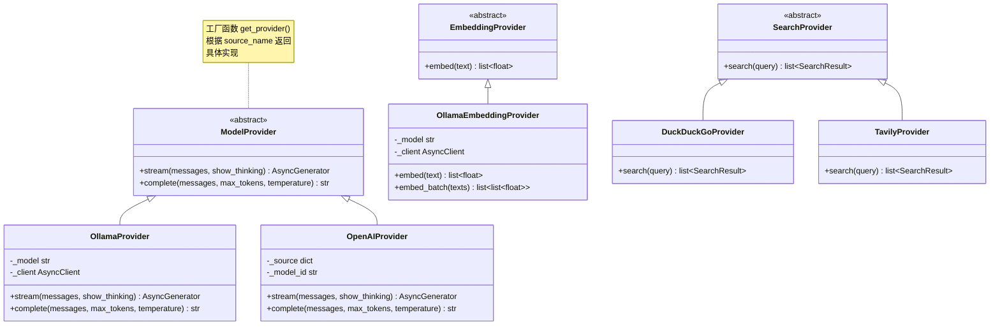

# 第 5 章：模型抽象层

有了数据持久化层（第 4 章），对话历史和文件索引已经可以安全存储。但 AI 助手的核心能力——**与语言模型对话**——还没有被统一管理。

当前大模型生态百花齐放：Ollama 本地部署、OpenAI API、DeepSeek、vLLM、TGI……每个服务商都有自己的 API 格式和调用方式。如果我们的代码直接与每个服务商耦合，那维护成本将是指数级的。

本章将介绍如何用 **Provider 模式** 构建一个模型抽象层，让你用**同一套接口**调用任何模型。

## 5.1 Provider 模式：为什么要抽象？

假设不用抽象层，调用不同模型会变成这样：

```python
# 调用 Ollama
async with httpx.AsyncClient() as client:
    resp = await client.post("http://localhost:11434/api/chat", json={...})

# 调用 OpenAI
async with httpx.AsyncClient() as client:
    resp = await client.post("https://api.openai.com/v1/chat/completions",
        headers={"Authorization": f"Bearer {api_key}"}, json={...})
```

两个 API 的请求格式、响应结构、错误处理方式完全不同。当你有 5 个模型来源时，这 5 套逻辑散落在代码各处——这是 **Shotgun Surgery**（霰弹式修改）的典型案例。

Provider 模式用**多态**解决这个问题：定义一个统一接口，每个服务商实现自己的适配器。上层代码只依赖接口，不关心具体实现。



## 5.2 ModelProvider：统一契约

```python
# services/providers/model.py

from abc import ABC, abstractmethod
from typing import AsyncGenerator

class ModelProvider(ABC):
    """模型提供商接口 — 从模型来源流式生成 token。"""

    @abstractmethod
    async def stream(
        self,
        messages: list[dict],
        show_thinking: bool = True,
    ) -> AsyncGenerator[dict, None]:
        """流式生成对话回复。

        Yields:
            {"type": "thinking", "text": str}  — 思考过程片段
            {"type": "content", "text": str}   — 回复内容片段
        """
        ...

    async def complete(
        self,
        messages: list[dict],
        *,
        max_tokens: int = 100,
        temperature: float = 0,
    ) -> str:
        """非流式完成（默认实现：消费 stream 拼接结果）"""
        parts: list[str] = []
        async for chunk in self.stream(messages, show_thinking=False):
            if chunk["type"] == "content":
                parts.append(chunk["text"])
        return "".join(parts)
```

### 抽象类的两个层次

注意 `stream()` 是 `@abstractmethod`（必须由子类实现），而 `complete()` 有**默认实现**——它内部调用 `stream()`，收集所有 `content` 类型的 chunk 拼接返回。

这种设计有两个精妙之处：

1. **子类只需实现 stream()**：最小化适配工作量。如果一个新服务商的 API 只有流式接口，你不需要再写一个非流式实现
2. **子类可以覆盖 complete()**：如果服务商提供原生的非流式端点（如 Ollama），重写 `complete()` 可以获得更好的性能（少一次 HTTP 往返）

## 5.3 OllamaProvider 深入剖析

OllamaProvider 通过 Ollama 原生 API 与本地模型通信。它使用**共享 HTTP 客户端**复用连接：

```python
class OllamaProvider(ModelProvider):
    def __init__(self, model: str | None = None):
        settings = get_settings()
        self._model = model or settings.ollama_model
        self._client = get_ollama_async_client()  # 共享单例

    async def stream(
        self, messages: list[dict], show_thinking: bool = True,
    ) -> AsyncGenerator[dict, None]:
        settings = get_settings()
        options = {
            "num_predict": get_config("max_output_tokens"),
            "num_ctx": settings.ollama_num_ctx,
            "num_batch": settings.ollama_num_batch,
            "temperature": get_config("temperature"),
            "top_p": get_config("top_p"),
        }
```

### think 参数的优雅降级

Ollama 的某些模型支持 `think` 参数暴露推理过程，但并非所有模型都支持。如果后端不支持该参数，API 会直接报错。OllamaProvider 的处理方式是**静默回退**：

```python
try:
    stream = await self._client.chat(
        model=self._model, messages=messages, stream=True,
        think=show_thinking, keep_alive=settings.ollama_keep_alive,
        options=options,
    )
except Exception as e:
    if "think" in str(e).lower() or "unexpected" in str(e).lower():
        # 模型不支持 think 参数，回退到无思考模式
        logger.warning("模型不支持 think 参数，回退到无思考模式")
        stream = await self._client.chat(
            model=self._model, messages=messages, stream=True,
            keep_alive=settings.ollama_keep_alive, options=options,
        )
    else:
        raise  # 其他错误原样抛出
```

> **设计原则**：对于"可选特性"，优雅降级优于硬性要求。用户不应该因为使用了不支持 think 的模型而收到错误——他们只是看不到思考过程而已。

### 异常映射：将底层错误翻译为用户可理解的消息

```python
msg = str(e)
if "ConnectionRefused" in msg or "Connection refused" in msg:
    raise OllamaConnectionError("AI 服务未运行，请先启动 Ollama")
elif "timeout" in msg.lower() or "timed out" in msg.lower():
    raise OllamaTimeoutError("AI 服务响应超时")
elif "not found" in msg.lower() or "model" in msg.lower():
    raise OllamaModelError(
        f"模型 {self._model} 不存在，请先拉取模型：ollama pull {self._model}"
    )
else:
    raise OllamaError(f"AI 服务调用失败：{e}")
```

这里定义了三级异常层次：

```
OllamaError (基类)
├── OllamaConnectionError  → "请检查 Ollama 是否启动"
├── OllamaTimeoutError     → "AI 服务响应超时"
└── OllamaModelError       → "模型不存在，请先 ollama pull"
```

前端收到这些异常后，可以直接展示给用户的**中文错误提示**，而不是原始的 `ConnectionRefusedError: [Errno 61] Connection refused`。

### 流式 token 生成

```python
async for chunk in stream:
    message = chunk.message
    thinking = getattr(message, "thinking", "") or ""
    content = getattr(message, "content", "") or ""

    if thinking and show_thinking:
        yield {"type": "thinking", "text": thinking}
    if content:
        yield {"type": "content", "text": content}
```

使用 `getattr` 而非 `message.thinking`，是因为 Ollama Python SDK 的 `Message` 对象是动态属性——没有思考内容时属性可能不存在。`getattr` 配合默认值保证了代码的健壮性。

### 覆盖 complete()——直接非流式调用

Ollama 提供了原生非流式端点，跳过拼接步骤可以节省开销：

```python
async def complete(self, messages, *, max_tokens=100, temperature=0) -> str:
    response = await self._client.chat(
        model=self._model, messages=messages, stream=False,
        options={"num_predict": max_tokens, "temperature": temperature, ...},
        keep_alive=settings.ollama_keep_alive,
    )
    return (response.message.content or "").strip()
```

## 5.4 OpenAIProvider：SSE 解析与 reasoning_content

OpenAIProvider 通过 OpenAI 兼容 API（包括 DeepSeek、vLLM、TGI 等）进行流式对话。它使用项目自带的 `HttpClientPool` 管理 HTTP 连接：

```python
class OpenAIProvider(ModelProvider):
    def __init__(self, source: dict, model_id: str | None = None):
        self._source = source      # 包含 base_url, api_key 等配置
        self._model_id = model_id

    async def stream(self, messages, show_thinking=True) -> AsyncGenerator[dict, None]:
        headers = {"Content-Type": "application/json"}
        if self._source.get("api_key"):
            headers["Authorization"] = f"Bearer {self._source['api_key']}"

        body = {
            "model": self._model_id,
            "messages": messages,
            "stream": True,
            "max_tokens": get_config("max_output_tokens"),
        }

        client = HttpClientPool.get("default", timeout=get_settings().ollama_timeout)
        async with client.stream(
            "POST", f"{self._source['base_url']}/chat/completions",
            headers=headers, json=body,
        ) as resp:
            if resp.status_code != 200:
                error_body = await resp.aread()
                raise RuntimeError(f"API 返回 {resp.status_code}: {error_body.decode()[:200]}")
```

### 手动解析 SSE 数据行

OpenAI 兼容 API 的流式响应是标准 SSE（Server-Sent Events），每行以 `data: ` 开头：

```python
async for line in resp.aiter_lines():
    if not line.startswith("data: "):
        continue
    data = line[6:]           # 去掉 "data: " 前缀
    if data == "[DONE]":      # 流结束标记
        break

    try:
        chunk = json.loads(data)
    except json.JSONDecodeError:
        continue              # 忽略解析失败的行

    choices = chunk.get("choices", [])
    if not choices:
        continue
    delta = choices[0].get("delta", {})

    # 推理内容（DeepSeek-R1 等思维链模型）
    reasoning = delta.get("reasoning_content", "") or ""
    if reasoning and show_thinking:
        yield {"type": "thinking", "text": reasoning}

    # 普通回复内容
    content = delta.get("content", "") or ""
    if content:
        yield {"type": "content", "text": content}
```

关键点：
- `[DONE]` 是 OpenAI SSE 协议的流结束信号
- `reasoning_content` 是 DeepSeek-R1 等推理模型的特有字段，里面对应 Ollama 的 `thinking`
- JSON 解析失败时不中断流（容错设计），因为某些代理可能插入非 JSON 行

### HttpClientPool：连接复用

```python
# utils/http_client.py
class HttpClientPool:
    _clients: dict[str, httpx.AsyncClient] = {}

    @classmethod
    def get(cls, name: str = "default", timeout: float = 30) -> httpx.AsyncClient:
        if name not in cls._clients:
            cls._clients[name] = httpx.AsyncClient(timeout=timeout)
        return cls._clients[name]
```

这是一个极简的命名连接池。`HttpClientPool.get("default")` 返回同一个 `AsyncClient` 实例，实现跨 Provider 的 HTTP 连接复用。相比每次创建新的 `AsyncClient`，连接复用可以显著减少 TLS 握手开销和 TCP 连接数。

## 5.5 EmbeddingProvider：向量化接口

Embedding 是 RAG（检索增强生成）的基础——将文本转化为高维向量，用于语义搜索。它的抽象更加简洁：

```python
class EmbeddingProvider(ABC):
    @abstractmethod
    async def embed(self, text: str) -> list[float]:
        ...

class OllamaEmbeddingProvider(EmbeddingProvider):
    def __init__(self):
        settings = get_settings()
        self._model = settings.embedding_model
        self._client = get_ollama_async_client()

    async def embed(self, text: str) -> list[float]:
        response = await self._client.embeddings(
            model=self._model, prompt=text, keep_alive=self._keep_alive,
        )
        return response.embedding
```

### 批量 Embedding 与降级策略

文件索引需要将成百上千个文本块向量化，逐条调用太慢。`embed_batch` 方法先尝试批量 API，失败则降级为并发单条：

```python
async def embed_batch(self, texts: list[str]) -> list[list[float]]:
    results = []
    for i in range(0, len(texts), self._max_batch_size):
        batch = texts[i:i + self._max_batch_size]
        try:
            resp = await self._client.embed(
                model=self._model, input=batch, keep_alive=self._keep_alive,
            )
            results.extend(resp.embeddings)
        except Exception as e:
            # 批量失败 → 并发单条重试
            tasks = [
                self._client.embeddings(model=self._model, prompt=text, ...)
                for text in batch
            ]
            emb_results = await asyncio.gather(*tasks, return_exceptions=True)
            for r in emb_results:
                if isinstance(r, Exception):
                    results.append([0.0] * 1024)  # 零向量占位
                else:
                    results.append(r.embedding)
    return results
```

**降级策略**：批量 API 可能因为模型不支持或超时失败，此时自动切换到 `asyncio.gather` 并发单条调用。单条调用也失败时，用零向量占位——宁可丢失部分向量，也不阻断整个索引流程。

## 5.6 工厂函数：一行代码切换模型

```python
# services/providers/__init__.py
def get_provider(model_source: str | None, model_id: str | None):
    """工厂函数：根据来源名称和模型 ID 创建对应的提供商。"""
    from services.providers.model import OllamaProvider, OpenAIProvider

    settings = get_settings()
    source_name = model_source or "ollama"

    if source_name != "ollama":
        from services.model_manager import get_model_sources
        sources = get_model_sources()
        source = next((s for s in sources if s["name"] == source_name), None)
        if not source:
            raise OllamaError(f"模型来源 '{source_name}' 未配置")
        return OpenAIProvider(source=source, model_id=model_id)

    return OllamaProvider(model=model_id or settings.ollama_model)
```

业务代码中只需要一行：

```python
provider = get_provider(ctx.model_source, ctx.model_id)
async for token in provider.stream(messages, show_thinking=True):
    yield format_sse("token", token)
```

切换模型来源只需改变 `model_source` 参数，**其余代码零改动**。

## 5.7 如何添加一个新的模型提供商

假设你想支持 Anthropic Claude API。以下是完整步骤：

### Step 1：创建 AnthropicProvider

```python
# services/providers/anthropic_provider.py
from services.providers.model import ModelProvider
from typing import AsyncGenerator

class AnthropicProvider(ModelProvider):
    def __init__(self, api_key: str, model: str = "claude-3-5-sonnet"):
        self._api_key = api_key
        self._model = model

    async def stream(self, messages, show_thinking=True) -> AsyncGenerator[dict, None]:
        headers = {
            "x-api-key": self._api_key,
            "anthropic-version": "2023-06-01",
            "Content-Type": "application/json",
        }
        body = {
            "model": self._model,
            "messages": messages,
            "max_tokens": 4096,
            "stream": True,
        }
        # 发送 HTTP 请求，解析 SSE 响应
        # yield {"type": "content", "text": token}
        ...

    # complete() 自动继承自 ModelProvider 的默认实现
```

### Step 2：在工厂函数中注册

```python
def get_provider(model_source, model_id):
    if model_source == "anthropic":
        return AnthropicProvider(api_key=settings.anthropic_api_key, model=model_id)
    # ... 其他来源
```

### Step 3：在前端添加模型来源配置

在 SettingsModal 中添加 Anthropic 的 API Key 配置项。

**就这么简单。** 整个过程不需要修改 `stream_engine.py`、`chat.py`、`prompt_builder.py` 任何一行代码——这就是 Provider 模式的价值。

## 本章小结

- Provider 模式用接口 + 多态统一了多模型来源的调用方式
- `ModelProvider` 抽象类定义了 `stream()` + `complete()` 契约，子类最少只需实现 `stream()`
- `OllamaProvider` 实现了 think 优雅降级和异常层级映射
- `OpenAIProvider` 手动解析 SSE 并通过 `HttpClientPool` 复用 HTTP 连接
- `OllamaEmbeddingProvider` 提供批量 + 降级策略，确保索引流程的鲁棒性
- 工厂函数 `get_provider()` 让上层代码零修改即可切换模型

下一章，我们将把这些 Provider 串接到流式对话引擎中，构建完整的 SSE 流式响应管线。
