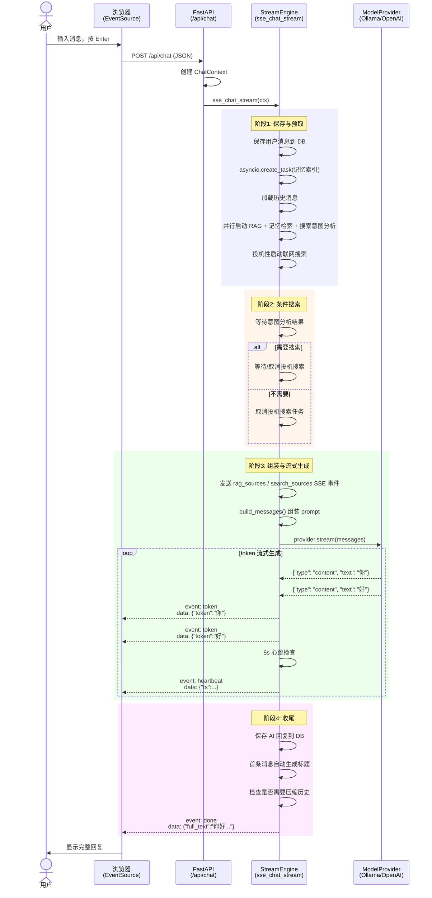

# 第 6 章：流式对话引擎

前面三章分别搭建了应用骨架、配置系统和数据层，第 5 章构建了模型抽象层。现在，是时候把这些积木**串接**起来，构建整个 AI 助手的核心——**流式对话引擎**。

这个引擎负责从"用户发送消息"到"AI 逐字回复显示在屏幕上"之间的**全部协调工作**。它不是一个简单的请求-响应模型，而是一个精心编排的**多阶段流水线**。

## 6.1 为什么是 SSE？

在讨论引擎设计之前，先回答一个基础问题：AI 对话为什么要"流式"传输？

GPT 类大模型生成一个完整回复可能需要 5-30 秒。如果等全部生成完再一次性返回，用户会在白屏前盯着转圈圈——体验极差。流式传输让用户**看到每个 token 逐个出现**，感知到的等待时间大幅缩短（心理学上的"进度条效应"）。

流式传输有三种主流技术方案：

| 方案 | 方向 | 复杂度 | 适用场景 |
|------|------|--------|----------|
| **SSE** (Server-Sent Events) | 服务器→客户端 | 低 | AI 流式输出 |
| WebSocket | 双向 | 中 | 实时协作编辑 |
| 长轮询 (Long Polling) | 服务器→客户端 | 低 | 兼容老旧浏览器 |

SSE 基于标准 HTTP 协议，不需要特殊升级（upgrade）步骤，天然支持断线重连，浏览器原生提供 `EventSource` API。对于"服务器推送给客户端"的 AI 对话场景，SSE 是最简单的正确选择。



## 6.2 ChatContext：参数聚合器

流式对话牵涉的参数很多：会话 ID、消息文本、思考模式开关、RAG 模式、联网搜索、模型来源、图片列表……如果把这些参数作为函数参数，签名会变得臃肿且难以扩展。

`ChatContext` 是一个 **dataclass**，作为"参数篮子"，把所有入参封装到一个对象中：

```python
# services/stream_engine.py
@dataclass
class ChatContext:
    session_id: str
    user_message: str
    show_thinking: bool = False
    msg_count_before: int = 0        # 发消息前的消息数（用于判断首条消息）
    title_source: str = ""            # 标题生成的原始文本
    images: list[str] | None = None   # 图片 base64 列表
    rag_mode: str = "off"             # off / auto / force
    web_search: bool = False
    model_source: str | None = None
    model_id: str | None = None
    current_file: str | None = None   # 当前上传文件名（RAG 过滤用）
```

使用方式简单明了：

```python
ctx = ChatContext(
    session_id=body.session_id,
    user_message=message,
    show_thinking=body.show_thinking,
    msg_count_before=msg_count_before,
    title_source=message,
    rag_mode=body.rag_mode,
    web_search=body.web_search,
    model_source=body.model_source,
    model_id=body.model_id,
)
return StreamingResponse(
    sse_chat_stream(ctx),
    media_type="text/event-stream",
    headers=SSE_HEADERS,
)
```

`StreamingResponse` 是 FastAPI 内置的流式响应类，它接收一个异步生成器，将每次 `yield` 的内容作为 HTTP 响应体的一块发送出去。

## 6.3 sse_chat_stream 10 步流水线

```python
async def sse_chat_stream(ctx: ChatContext) -> AsyncGenerator[str, None]:
```

这个异步生成器是对话引擎的**全部逻辑**。它包含 10 个步骤，每步承担不同的职责：

### 步骤 1：保存用户消息 + 记忆索引

```python
db = await get_db()
user_msg_id = await save_message(db, ctx.session_id, "user", ctx.user_message)
_index_message(ctx.session_id, user_msg_id, "user", ctx.user_message)
```

保存是同步等待的（消息必须落库才能继续），但**语义记忆索引**是 fire-and-forget 的：

```python
def _index_message(session_id, message_id, role, content):
    try:
        if get_settings().memory_enabled:
            from services.memory import index_message
            asyncio.create_task(index_message(session_id, message_id, role, content))
    except Exception:
        logger.warning("语义记忆索引失败")
```

> **设计原则**：非关键路径的操作使用 `asyncio.create_task` 异步执行，不阻塞主流程。记忆索引用不上，对话还能进行；但消息没存上，对话就无法继续。

### 步骤 2：加载历史消息（尊重压缩水位线）

```python
session = await get_session(db, ctx.session_id)
compressed_up_to_id = (session or {}).get("compressed_up_to_id") or None
history = await get_messages(
    db, ctx.session_id, get_config("max_history_messages"),
    after_id=compressed_up_to_id,
)
session_summary = (session or {}).get("summary") or None
```

`compressed_up_to_id` 是压缩水位线——只有 ID 大于此值的消息才会被加载。旧消息已经被压缩为一个 `summary` 字符串（如"用户询问了 Python 异步编程的基础知识，AI 详细介绍了 asyncio 的使用方式..."），以极低的 token 成本提供了历史上下文。

### 步骤 3：并行预取——引擎的性能核心

这是整个引擎最精妙的设计。传统做法是：先 RAG 检索 → 等待结果 → 再记忆检索 → 等待结果 → 再判断是否需要搜索 → 再做搜索。但这些都是**独立操作**，彼此之间没有数据依赖！

```python
# 四个任务同时启动，互不等待！
rag_task = asyncio.create_task(
    _do_rag_search(ctx.session_id, ctx.user_message, ctx.rag_mode, history, ctx.current_file)
)
memory_task = asyncio.create_task(
    memory_retrieve(ctx.session_id, ctx.user_message, top_k=50, min_score=0.0)
) if get_settings().memory_enabled else None
intent_task = asyncio.create_task(
    analyze_search_intent(ctx.user_message, history)
) if ctx.web_search else None
spec_web_task = asyncio.create_task(
    do_web_search(ctx.user_message)
) if ctx.web_search else None
```

**投机性联网搜索** (speculative web search)：我们不需要等意图分析的结果——直接用用户原始消息发起搜索。如果意图分析说"不需要搜索"，取消投机任务即可。如果意图分析说"需要搜索"，投机任务已经在执行了，节省了等待时间。

### 步骤 4：等待关键结果

```python
await asyncio.wait(
    [t for t in [rag_task, intent_task, memory_task] if t is not None]
)
```

只等待 RAG、记忆检索和意图分析。投机搜索不等待（它可能在后台继续运行）。

### 步骤 5：条件搜索

```python
if intent_task:
    intent_result = intent_task.result()
    if intent_result and spec_web_task:
        # 需要搜索 → 等待投机任务（最多 3 秒）
        done, _ = await asyncio.wait([spec_web_task], timeout=3.0)
        if done:
            web_context = spec_web_task.result()
        else:
            # 投机未完成，如果意图改写了查询，用新查询重搜
            if intent_result != ctx.user_message:
                spec_web_task.cancel()
                web_context = await do_web_search(intent_result)
            else:
                web_context = await spec_web_task
    elif spec_web_task:
        # 不需要搜索 → 取消投机任务
        spec_web_task.cancel()
```

这段逻辑的核心思想是**"先做了再说"**——先投机搜索，用意图分析结果来决定是等它完成还是取消它。相比"先判断再搜索"的串行方式，在有搜索结果需要的场景下，可以节省完整的搜索耗时。

### 步骤 6：发送检索来源 SSE 事件

```python
if rag_context:
    yield f"event: rag_sources\ndata: {json.dumps({'sources': [{'file': r['source_file'], 'score': r['score'], 'type': 'rag'} for r in rag_context]})}\n\n"

if web_context:
    yield f"event: search_sources\ndata: {json.dumps([{'index': i+1, 'title': r.get('title',''), 'url': r['source_file']} for i,r in enumerate(web_context)])}\n\n"
```

这些事件让前端在模型开始回复之前，就可以展示"参考了哪些资料"——提升透明度和信任感。

### 步骤 7：组装 messages

```python
messages = build_messages(
    system_prompt=settings.system_prompt,
    history=history,
    current_message=ctx.user_message,
    rag_context=rag_context,
    web_context=web_context,
    images=ctx.images,
    memory_hits=memory_hits,
    session_summary=session_summary,
    max_history=get_config("max_history_messages"),
    max_context_tokens=get_config("max_context_tokens"),
)
```

`build_messages`（见 `services/prompt_builder.py`）负责：
- **Token 预算分配**：系统提示 + 输出预留 + RAG 上下文 + 历史消息 + 用户消息 ≤ max_context_tokens
- **RAG 自适应选择**：按相关度降序选择文档块，最多占剩余预算的 35%
- **智能历史裁剪**：语义相关的消息优先装入，其余按时间从新到旧装入
- **指令策略**：根据 RAG/Web 组合选择不同的引用指令（严格引用 vs 标注来源）

### 步骤 8：流式生成 + 心跳

```python
heartbeat_interval = 5.0
last_heartbeat = asyncio.get_event_loop().time()

provider = get_provider(ctx.model_source, ctx.model_id)
async for token in provider.stream(messages, ctx.show_thinking):
    now = asyncio.get_event_loop().time()
    if now - last_heartbeat >= heartbeat_interval:
        last_heartbeat = now
        yield f"event: heartbeat\ndata: {json.dumps({'ts': now})}\n\n"

    if token["type"] == "thinking":
        full_thinking += token["text"]
        yield f"event: thinking\ndata: {json.dumps({'text': token['text']})}\n\n"
    elif token["type"] == "content":
        full_text += token["text"]
        yield f"event: token\ndata: {json.dumps({'token': token['text']})}\n\n"
```

**心跳机制**：如果模型思考时间很长（某些推理模型可能沉默 10-20 秒），代理服务器（如 nginx、Cloudflare）可能因为超时断开连接。每 5 秒发送一个 heartbeat 事件，维持连接活性，避免"假断连"。

### 步骤 9：保存回复 + 记忆索引 + 自动标题

```python
if full_text:
    assistant_msg_id = await save_message(db, ctx.session_id, "assistant", full_text)
    _index_message(ctx.session_id, assistant_msg_id, "assistant", full_text)

if ctx.msg_count_before == 0:
    title = _safe_title(ctx.title_source)
    if title:
        await rename_session(db, ctx.session_id, title)

yield f"event: done\ndata: {json.dumps({'full_text': full_text, 'session_title': title})}\n\n"
```

自动标题生成使用简单的启发式方法，不消耗额外的 LLM 调用：

```python
def _safe_title(text: str, max_len: int = 30) -> str:
    clean = text.strip().replace("\n", " ")
    if len(clean) <= max_len:
        return clean
    truncated = clean[:max_len]
    match = re.search(r'^(.*)[\s,，。！？!?]', truncated)
    if match:
        return match.group(1) + "..."
    return truncated + "..."
```

它从用户第一条消息中截取前 30 个字符，尽量在自然断句处截断——简洁且有效。

### 步骤 10：触发混合压缩

```python
uncompressed_count = await count_messages(db, ctx.session_id, after_id=compressed_up_to_id)
if uncompressed_count >= get_config("max_history_messages") * 0.8:
    from services.compress import maybe_compress
    asyncio.create_task(maybe_compress(db, ctx.session_id, get_config("max_history_messages")))
```

当未压缩消息数达到预算上限的 80% 时，触发后台压缩任务。这确保对话可以无限延续，不会因为历史消息过多撑爆上下文窗口。压缩是异步后台任务，不阻塞当前请求。

## 6.4 错误恢复：优雅的中断与异常处理

### CancelledError——用户主动停止

```python
except asyncio.CancelledError:
    logger.warning("对话流被中断 session=%s partial=%d", ctx.session_id[:8], len(full_text))
    if full_text:
        # 有部分内容 → 保存为 interrupted 状态
        await save_message(db, ctx.session_id, "assistant",
            full_text + "\n\n[回复被中断]", status="interrupted")
    elif user_msg_id is not None:
        # 没有任何回复 → 连用户消息也删除，保持界面干净
        await delete_message(db, user_msg_id)
    return  # 不抛出异常
```

当用户在前端点击"停止生成"按钮时，`AbortController.abort()` 会取消 HTTP 请求，触发 FastAPI 向 `sse_chat_stream` 注入 `CancelledError`。引擎的处理策略：

- **部分回复已生成**：保存并标记为 `interrupted`，用户可以看到部分结果
- **完全没有回复**：删除用户消息，界面恢复为发送前的状态

### 通用异常

```python
except Exception as e:
    if user_msg_id is not None:
        try:
            await delete_message(db, user_msg_id)
        except Exception:
            pass  # 删除失败不掩盖原始错误
    yield f"event: error\ndata: {json.dumps({'detail': str(e)})}\n\n"
```

删除用户消息是为了保证数据一致性——如果 AI 没有回复，保留一条孤立的用户消息会让对话列表看起来很奇怪。

## 6.5 SSE 事件格式参考

以下是客户端实际收到的 SSE 事件流示例：

```
event: thinking
data: {"text": "让我分析一下这个问题..."}

event: token
data: {"token": "你"}

event: token
data: {"token": "好"}

event: heartbeat
data: {"ts": 1720000001.5}

event: token
data: {"token": "！"}

event: done
data: {"full_text": "你好！", "full_thinking": "让我分析一下这个问题...", "session_title": null}
```

完整的事件类型汇总：

| 事件类型 | 含义 | 数据 |
|----------|------|------|
| `thinking` | 模型推理过程（think mode） | `{"text": "..."}` |
| `token` | 回复内容片段 | `{"token": "..."}` |
| `rag_sources` | RAG 检索到的来源 | `{"sources": [...]}` |
| `search_sources` | 联网搜索来源（含角标） | `[{"index": 1, "title": "...", "url": "..."}]` |
| `heartbeat` | 存活信号（5 秒间隔） | `{"ts": 1234567890.0}` |
| `done` | 对话完成 | `{"full_text": "...", "session_title": "..."}` |
| `error` | 错误 | `{"detail": "错误描述"}` |

## 6.6 前端如何消费 SSE 流

前端不使用原生 `EventSource` API（它不支持 POST 请求和自定义请求头），而是通过 `fetch` + `ReadableStream` 手动解析：

```typescript
// frontend/src/services/api.ts
export function parseSSEStream(
  reader: ReadableStreamDefaultReader<Uint8Array>,
  onEvent: (event: string, data: string) => void,
  onDone: () => void,
  onError: (err: Error) => void,
): Promise<void> {
  return (async () => {
    const decoder = new TextDecoder();
    let buffer = '';

    while (true) {
      const { done, value } = await reader.read();
      if (done) break;

      buffer += decoder.decode(value, { stream: true });
      const lines = buffer.split('\n');
      buffer = lines.pop() || '';  // 保留不完整的行

      let currentEvent = '';
      for (const line of lines) {
        if (line.startsWith('event: ')) {
          currentEvent = line.slice(7).trim();
        } else if (line.startsWith('data: ')) {
          if (currentEvent) {
            onEvent(currentEvent, line.slice(6));
            currentEvent = '';
          }
        }
      }
    }
    onDone();
  })();
}
```

前端在 Zustand store 中处理事件：

```typescript
// frontend/src/stores/chatStore.ts
const handlers = {
  onEvent: (event: string, data: string) => {
    switch (event) {
      case 'thinking':
        set((s) => ({ thinking: s.thinking + JSON.parse(data).text }));
        break;
      case 'token':
        bufferedUpdate(JSON.parse(data).token);  // rAF 节流累加
        break;
      case 'rag_sources':
        set({ ragSources: JSON.parse(data).sources || [] });
        break;
      case 'search_sources':
        updateLastAssistantSearchSources(JSON.parse(data));
        break;
      case 'done':
        set({ streaming: false });
        break;
      case 'error':
        bufferedUpdate(`错误: ${JSON.parse(data).detail}`);
        set({ streaming: false });
        break;
    }
  },
};
```

注意 `bufferedUpdate` 使用了 `requestAnimationFrame` 进行 token 累加缓冲——避免每个 token 都触发一次 React 重渲染（想象一下每秒 50 个 token，就是每秒 50 次 setState）。`rAF` 将 16ms 内的 token 合并为一次状态更新，渲染性能提升了一个数量级。

## 本章小结

- SSE 是 AI 流式对话的最优传输协议，简单且浏览器原生支持
- `ChatContext` dataclass 优雅地聚合了大量参数
- 10 步流水线涵盖了保存、检索、构建、生成、收尾的完整对话生命周期
- 并行预取（`asyncio.gather`）将多个独立 I/O 操作并行化，显著降低首 token 延迟
- 投机性搜索用"先做再说"的策略隐藏搜索耗时
- 5 秒心跳维持长连接，防止代理超时断连
- 错误恢复兼顾部分回复保存和数据一致性
- 前端通过 `fetch` + `ReadableStream` 手动解析 SSE，配合 rAF 节流优化渲染

下一章，我们将从前端视角出发，看看 React 如何将这些 SSE 事件转化为用户看到的聊天界面。
