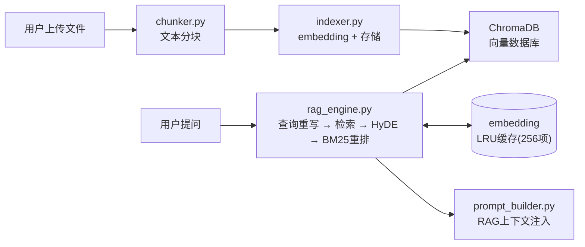
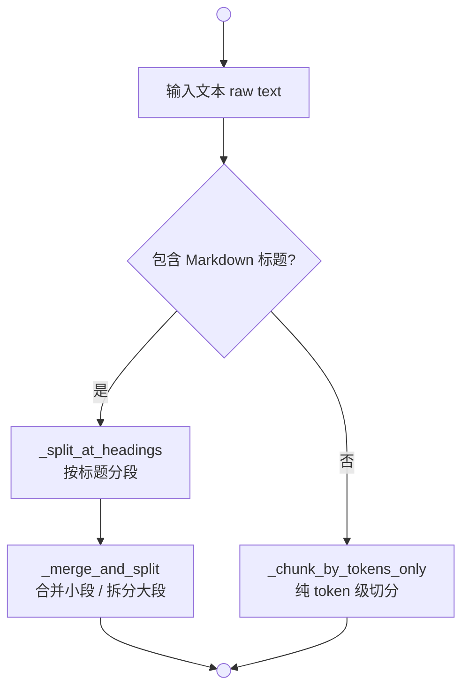
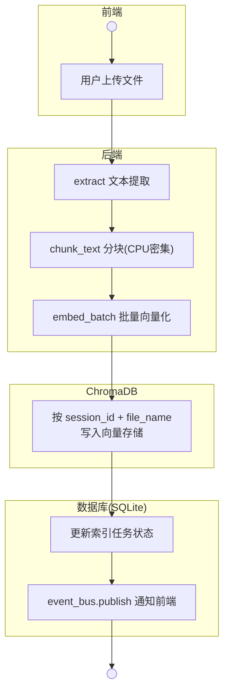
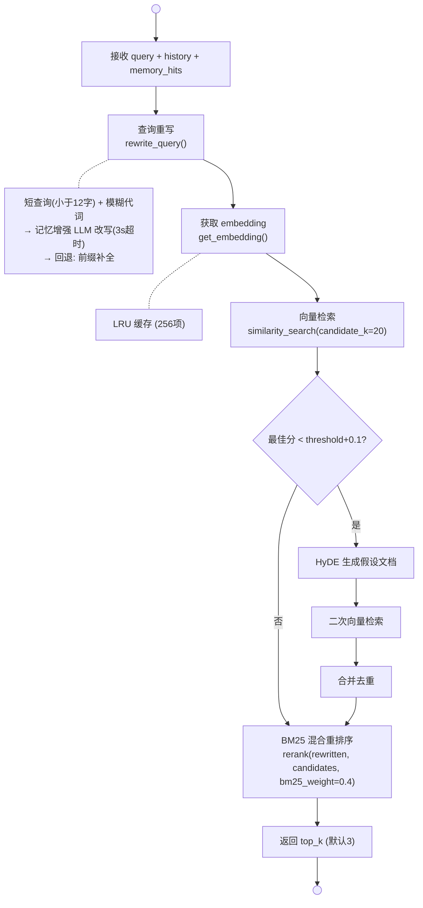

# 第 8 章 RAG 检索增强生成

> **前置章节**：第 1–7 章（项目搭建 → 前后端骨架）  
> **本章重点**：将文档变成可检索的知识，让 AI 能引用你的私有数据作答。

---

## 8.1 什么是 RAG？

**RAG（Retrieval-Augmented Generation）** 是解决 LLM 两大痛点的工程化方案：

| 痛点 | RAG 如何解决 |
|---|---|
| **私有知识缺失** | 把你的文档切成片段，存为向量，查询时检索最相关的内容注入 Prompt |
| **幻觉问题** | 检索到的原文作为"参考答案"，模型被指令约束优先引用而非编造 |

一句话总结：**"先搜后答"**。用户提问时，系统不是直接调用 LLM，而是先去文档库中找到相关内容，再一并喂给 LLM。

这个项目的 RAG 实现非常完整，在本章中我们会仔细拆解从文件上传到回答引用的整条链路。

---

## 8.2 整体架构



两条主干路径清晰分离：

1. **写入路径**：文件 → 分块 → 向量化 → 存入 ChromaDB（离线/后台执行）
2. **查询路径**：提问 → 重写 → 向量检索 → 可选 HyDE → BM25 重排 → 注入 Prompt（热路径，要求低延迟）

---

## 8.3 向量存储抽象

### 8.3.1 为什么要抽象？

不同的向量数据库（ChromaDB、Milvus、FAISS、Pgvector）API 各异。如果上层直接依赖具体实现，切换成本极高。这个项目用经典的 **接口+适配器** 模式解决了这个问题。

### 8.3.2 VectorStore 接口

```python
class VectorStore(ABC):
    @abstractmethod
    async def add(self, ids, embeddings, documents, metadatas) -> None: ...
    
    @abstractmethod
    async def similarity_search(
        self, query_embedding, filter=None, top_k=10
    ) -> list[dict]: ...
    
    @abstractmethod
    async def get_ids(self, filter) -> list[str]: ...
    
    @abstractmethod
    async def delete(self, ids) -> None: ...
    
    @abstractmethod
    async def count(self, filter=None) -> int: ...
    
    @abstractmethod
    async def health_check(self) -> tuple[bool, str]: ...
```

六个方法覆盖了完整的 CRUD + 健康检查。**全部为 `async`**，因为向量操作可能涉及 I/O，异步化保证不阻塞事件循环。

### 8.3.3 ChromaAdapter 实现

项目选型 **ChromaDB** 作为向量数据库，理由：

- **零服务依赖**：`PersistentClient` 模式，数据存在本地目录，无需额外进程
- **元数据过滤**：支持 `where` 子句按 `session_id`、`source_file` 等字段精确过滤
- **多种距离度量**：默认使用 `cosine` 距离

关键设计决策：

```python
class ChromaAdapter(VectorStore):
    def __init__(self, distance_metric=None):
        self._distance_metric = distance_metric or settings.rag_distance_metric
        self._collection_name = "rag_documents"
```

**全局单例客户端**：`get_chroma_client()` 返回共享的 `PersistentClient`，避免重复初始化：

```python
_client = None

def get_chroma_client():
    global _client
    if _client is None:
        settings = get_settings()
        os.makedirs(settings.chroma_persist_dir, exist_ok=True)
        _client = chromadb.PersistentClient(
            path=settings.chroma_persist_dir,
            settings=ChromaSettings(anonymized_telemetry=False),
        )
    return _client
```

**同步转异步**：ChromaDB 的 SDK 是同步的，所有调用通过 `run_in_executor` 包装：

```python
async def similarity_search(self, query_embedding, filter=None, top_k=10):
    loop = asyncio.get_running_loop()
    return await loop.run_in_executor(
        None, self._sync_similarity_search, query_embedding, filter, top_k
    )
```

这种方法简单可靠——我们不需要 ChromaDB 本身是异步的，只需要在我们的协程框架中不阻塞。

**距离→分数转换**：ChromaDB 返回的是距离（越小越相似），统一转为分数（越大越相似）：

```python
for doc, meta, dist in zip(docs, metas, dists):
    score = 1.0 - dist  # 距离转相似度
    if score >= threshold:  # 低分过滤
        hits.append({...})
```

**自动建表**：首次访问时若 Collection 不存在则自动创建，免去手动运维步骤。

---

## 8.4 智能文本分块

文本分块是 RAG 检索质量的基础——块太大导致检索不精确，块太小导致上下文碎片化。这个项目的分块器有三层递进策略。

### 8.4.1 三层策略



### 8.4.2 标题感知分段

```python
_HEADING_RE = re.compile(r"^#{1,6}\s+.+", re.MULTILINE)

def _split_at_headings(text, _cache=None):
    # 按 # 到 ###### 标题分割
    # 同一标题下的内容归为一个 section
    # 记录每个 section 的 token 数
```

这个设计很巧妙：遇到标题就另起一节，标题本身作为 context 信息被保留。后续检索时，一个 chunk 自带标题上下文（如"3.2 部署配置\n具体内容..."），LLM 能更好地理解其出处。

### 8.4.3 合并与拆分

```python
def _merge_and_split(sections, max_tokens, step):
    # 策略1: 小 section 合并到 buffer，不超过 max_tokens
    # 策略2: 超大 section 进一步按 token 切分
    # 策略3: 切分时保留所属标题
```

一些精心设计的细节：

- **标题继承**：超大 section 切分后的每个子块都带上原标题，避免上下文丢失
- **step = chunk_size - overlap**：重叠窗口保证相邻 chunk 的语义连续性
- **tiktoken 缓存**：每次编码调用都缓存结果，避免重复计算

### 8.4.4 代码块保护

这是容易被忽视但至关重要的一点——没有它，分块器会把 README 里的 Python 代码拦腰切断。

```python
# 识别代码围栏
if stripped.startswith("```") or stripped.startswith("~~~"):
    # 进入/退出代码块状态
    # 代码块内不进行标题分割

# 识别 HTML 注释
if "<!--" in line:
    # 进入注释状态，--> 退出
```

代码块和 HTML 注释内部的行不会被当作分块边界。这保证了技术文档（如 API 文档里嵌了 JSON 示例）的完整性。

---

## 8.5 文件索引生命周期

### 8.5.1 索引流程



核心代码在 `FileIndexer.index_file()`：

```python
async def index_file(self, db, session_id, file_name, text, task_id=None):
    # 1. 分块（CPU 密集，走 run_in_executor）
    chunks = await loop.run_in_executor(None, chunk_text, text)
    
    # 2. 批量 embedding（一次网络调用处理所有 chunk）
    embeddings = await self._embedder.embed_batch(chunks)
    
    # 3. 生成 ID 和元数据
    ids = [f"{session_id}_{file_name}_{i}" for i in range(len(chunks))]
    metadatas = [{
        "session_id": session_id,
        "source_file": file_name,
        "chunk_index": i,
        "total_chunks": len(chunks),
    } for i in range(len(chunks))]
    
    # 4. 写入向量存储
    await self._store.add(ids=ids, embeddings=embeddings, 
                          documents=chunks, metadatas=metadatas)
    
    # 5. 更新数据库任务状态
    await mark_completed(db, task_id, len(chunks))
```

关键优化：**批量 embedding**。不是逐 chunk 调 embedding API，而是一次性把所有 chunks 发过去，减少网络往返。

### 8.5.2 后台索引 + 事件总线

大文件索引存在延迟，用户不应该等待。项目用后台任务解决：

```python
async def index_file_background(self, db, session_id, file_name, file_content):
    try:
        task_id = await create_task(db, session_id, file_name)
        await self.index_file(db, session_id, file_name, file_content, task_id=task_id)
        await publish(session_id, "index_status", {
            "file": file_name, "status": "completed",
        })
    except Exception as e:
        await publish(session_id, "index_status", {
            "file": file_name, "status": "failed", "error": str(e),
        })
```

`event_bus.publish()` 通过 SSE 将索引进度推送到前端，用户在聊天窗口能实时看到"文件 X 索引完成"的状态更新。

### 8.5.3 索引管理

```python
# 按会话统计
await count_indexed_chunks(session_id)

# 按文件删除
await delete_file_index(session_id, file_name)

# 删除整个会话的索引
await delete_session_index(session_id)

# 列出已索引文件
await list_indexed_files(db, session_id)
```

索引管理完整——增删查都支持，删除操作同时清理 ChromaDB 和 SQLite 中的元数据。

---

## 8.6 RAG 引擎深度拆解

`RAGEngine.search()` 是整个系统最核心的方法，一条完整的检索链路如下：



### 8.6.1 查询重写

用户常问"这个怎么改？""它为什么错了？"——这类短查询包含模糊代词，直接做向量检索效果很差。

```python
@staticmethod
def _needs_rewrite(query):
    if _QUESTION_HEAD_RE.match(query):
        return False  # 独立问句不需要
    return len(query) < 12 and bool(_VAGUE_PRONOUN_RE.search(query))
    # "这"、"那"、"它"、"他"...
```

触发改写后有两种策略：

1. **记忆增强重写**（优先）：如果有语义记忆命中，用相关对话上下文让 LLM 补全短查询
2. **前缀补全**（回退）：取上一条用户消息的前 80 字拼接当前查询

```python
async def rewrite_query(self, query, history, memory_hits=None):
    if memory_hits:
        # LLM 重写，3 秒超时
        rewritten = await asyncio.wait_for(
            provider.complete([...], max_tokens=50, temperature=0),
            timeout=3,
        )
    # 回退
    if last_user:
        return f"{last_user[:80]} -> {query}"
```

### 8.6.2 HyDE 二次检索

**HyDE（Hypothetical Document Embeddings）** 是一种聪明的检索增强技巧：让 LLM 根据查询"猜"一个可能的答案文档，用假文档的向量去检索，往往比直接用问题向量检索效果更好。

```python
if best_score < hyde_threshold and get_config("rag_hyde_enabled"):
    hypo = await self.generate_hypothetical(rewritten, memory_hits=memory_hits)
    hypo_emb = await self.get_embedding(hypo)
    hyde_candidates = await self._store.similarity_search(
        query_embedding=hypo_emb, filter=filter_cond, top_k=candidate_k,
    )
    # 去重合并
    seen_ids = {c.get("id") for c in candidates}
    for c in hyde_candidates:
        if c.get("id") not in seen_ids:
            candidates.append(c)
```

HyDE 的触发条件是 `best_score < threshold + 0.1`——只有检索质量不够好时才启用，避免不必要的 LLM 调用开销。

### 8.6.3 BM25 混合重排

纯向量检索擅长语义匹配，但对关键词不敏感。比如搜索"Ollama 配置"时，"Ollama 启动参数"可能得分最高，而"配置 Ollama 的超时时间"反而排在后面。

BM25 是一个经典的关键词匹配算法，将它与向量分数加权融合能兼顾语义和关键词：

```python
def rerank(query, candidates, bm25_weight=0.4):
    # 1. 对所有候选文档做 BM25 分词（CJK 按 bigram）
    tokenized_corpus = [_tokenize(c["text"]) for c in candidates]
    bm25 = BM25Okapi(tokenized_corpus)
    bm25_scores = bm25.get_scores(_tokenize(query))
    
    # 2. 归一化 BM25 分数
    bm25_max = bm25_scores.max() if bm25_scores.max() > 0 else 1.0
    
    # 3. 加权融合：0.6×向量 + 0.4×BM25
    for i, c in enumerate(candidates):
        vec_part = c["score"] * (1 - bm25_weight)
        bm25_norm = bm25_scores[i] / bm25_max
        c["score"] = round(vec_part + bm25_weight * bm25_norm, 4)
    
    candidates.sort(key=lambda c: c["score"], reverse=True)
    return candidates
```

分词器对中英文做了差异化处理：
- **英文**：按单词切分
- **中文/日文/韩文**：按 bigram（二字组）切分，这是对无空格语言的标准做法

### 8.6.4 Embedding LRU 缓存

同样的文本可能被多次查询（如用户连问"它为什么？""那怎么改？"），每次都调 embedding API 很浪费。

```python
_embedding_cache: OrderedDict[str, list[float]] = OrderedDict()
_EMBEDDING_CACHE_MAX = 256

async def get_embedding(self, text):
    if text in _embedding_cache:
        _embedding_cache.move_to_end(text)  # 标记为最近使用
        return _embedding_cache[text]
    
    vector = await self._embedder.embed(text)
    if len(_embedding_cache) >= _EMBEDDING_CACHE_MAX:
        _embedding_cache.popitem(last=False)  # 淘汰最旧项
    _embedding_cache[text] = vector
    return vector
```

用 `OrderedDict` 实现 LRU 非常简洁：`move_to_end` 标记最近使用，`popitem(last=False)` 淘汰最旧。256 项的上限确保缓存不无限膨胀。

---

## 8.7 RAG 上下文注入 Prompt

检索结果最终要被注入到发给 LLM 的消息中。这个过程由 `prompt_builder.py` 完成：

```python
def _format_rag_section(rag_context):
    lines = []
    for i, chunk in enumerate(rag_context):
        lines.append(
            f"[知识库] [{i+1}] {chunk['source_file']}"
            f"（相关度：{chunk['score']}）\n\n{chunk['text']}"
        )
    return "<参考资料>\n" + "\n\n".join(lines) + "\n</参考资料>"
```

注入的 Prompt 结构清晰：

```xml
<参考资料>
[知识库] [1] 部署文档.md（相关度：0.85）

Docker Compose 部署需要配置环境变量...

[知识库] [2] API接口.md（相关度：0.72）

POST /api/chat 接口的参数说明...
</参考资料>

<指令>
请严格依据以上参考资料回答，必要时标注来源。
若资料不足请直接说不知道。
</指令>

<用户问题>
如何部署这个服务？
</用户问题>
```

`<参考资料>` 和 `<指令>` 两个 XML 标签明确划分了不同信息域，LLM 被指令约束"严格依据"——这是减少幻觉的关键。

chunk 选择遵循**贪心填充**策略：按相关度降序，填到 token 预算为止（占上下文预算的 35%）：

```python
def _select_rag_chunks(rag_context, budget):
    selected = []
    used = 0
    for chunk in sorted(rag_context, key=lambda c: c["score"], reverse=True):
        if used + count_tokens(chunk["text"]) <= budget:
            selected.append(chunk)
            used += count_tokens(chunk["text"])
    return selected
```

---

## 8.8 服务层外观

`rag_service.py` 使用外观模式，将底层的 `RAGEngine` 和 `FileIndexer` 封装为简洁的函数式接口：

```python
class _RAGService:
    """类级单例，避免 uvicorn --reload 导致的全局变量污染"""
    vector_store = None
    embedder = None
    _rag_engine = None
    _file_indexer = None

# 使用者直接调用函数
await search(query, session_id, history=history)
await index_file(db, session_id, file_name, text)
await delete_file_index(session_id, file_name)
```

路由器层不感知 `RAGEngine` 的具体实现，切换向量数据库或重排算法时无需改动路由代码。

---

## 8.9 性能调优参数

所有调优参数集中在 `runtime_config.py`，支持运行时热修改：

| 参数 | 默认值 | 说明 |
|---|---|---|
| `rag_chunk_size` | 800 | 每个 chunk 的 token 上限 |
| `rag_chunk_overlap` | 200 | 相邻 chunk 重叠 token 数 |
| `rag_top_k` | 3 | 最终返回给 LLM 的 chunk 数 |
| `rag_score_threshold` | 0.35 | 低分过滤阈值 |
| `rag_candidate_k` | 20 | 向量检索的候选数 |
| `rag_bm25_weight` | 0.4 | BM25 在混合排序中的权重 |
| `rag_hyde_enabled` | True | 是否启用 HyDE 二次检索 |

**调优建议**：

- **长文档（>10页）**：增大 `rag_chunk_size` 到 1000-1200，减少碎片化
- **问答场景**：`rag_top_k` 设为 5，配合 `rag_bm25_weight` 提升到 0.5，加强关键词匹配
- **低延迟场景**：关闭 `rag_hyde_enabled`，减少一轮 LLM 调用

---

## 8.10 本章小结

本章我们详细拆解了 RAG 的完整链路：

1. **向量存储**：`VectorStore` 抽象 + `ChromaAdapter` 实现，用 `run_in_executor` 解决同步 SDK 的异步化问题
2. **智能分块**：标题感知 + token 级切分 + 代码块保护，三层递进策略
3. **文件索引**：分块 → 批量 embedding → 写入 ChromaDB，后台执行 + SSE 推送状态
4. **RAG 引擎**：查询重写（短查询补全）→ 向量检索 → HyDE 二次检索（低质时触发）→ BM25 混合重排
5. **上下文注入**：贪心填充，XML 标签结构化，来源标注
6. **优化**：Embedding LRU 缓存（256项），批量向量化，可热调的运行时参数

有了 RAG，AI 就能引用你的文档作答。下一章我们将引入**语义记忆**，让 AI 记住你们聊过什么。
