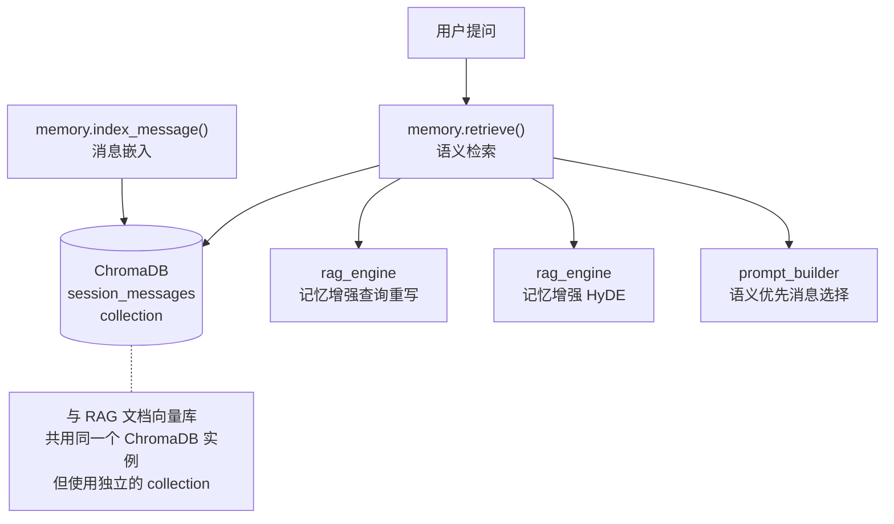
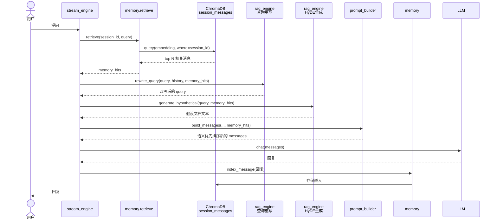

# 第 9 章 语义记忆系统

> **前置章节**：第 8 章（RAG 检索增强生成，理解向量存储的基础）  
> **本章重点**：让 AI 记住你们聊过什么——不是死记硬背，而是按语义关联的"智能回忆"。

---

## 9.1 问题的本质

LLM 本身是**无状态**的。你问它"刚才说的那个参数改成什么了？"，它不知道"刚才说的"指什么——因为每次请求都是孤立的，上下文窗口里塞入的只是前几十条消息的原文。

但你和我聊天时不是这样的：

- 你不需要复述三个回合前提到过的项目背景
- 我说"那个配置"时你能联想到半小时前聊的 `rag_chunk_size`
- 记忆是按**语义相关度**唤起的，不是按时间顺序

这个项目的记忆系统就在模拟这种机制——它叫 **Semantic Active Working Memory（语义活跃工作记忆）**。

### 9.1.1 对比：朴素历史 vs. 语义记忆

```
朴素历史方案：
  [msg1] [msg2] [msg3] ... [msg50] → 塞满上下文，旧信息被挤出

语义记忆方案：
  当前 query → 向量检索 → Top 5 最相关的历史消息 → 注入上下文
```

朴素方案的问题是**被动截断**——最早的消息总是最先被丢弃，无论它们多重要。语义记忆是**主动选择**——和当前问题最相关的消息永远能被检索出来，哪怕它发生在 100 轮之前。

---

## 9.2 架构设计



记忆系统复用已有的 ChromaDB 和 embedding 基础设施，使用独立的 `session_messages` collection，与 `rag_documents` 完全隔离。

---

## 9.3 消息索引

每条消息产生后立即索引到向量库：

```python
async def index_message(
    session_id: str,
    message_id: int,
    role: str,
    content: str,
    max_per_session: int = 500,
    cleanup_batch: int = 100,
):
    _ensure()  # 懒初始化 collection

    text = content[:2000]  # 截取前 2000 字符用于 embedding
    if not text.strip():
        return

    embedding = await get_embedding(text)

    await loop.run_in_executor(
        None,
        lambda: _collection.add(
            ids=[f"msg_{session_id[:8]}_{message_id}"],
            embeddings=[embedding],
            documents=[f"{role}: {text}"],
            metadatas=[{
                "session_id": session_id,
                "role": role,
                "message_id": message_id,
            }],
        ),
    )

    # 超出容量时清理最旧消息
    await loop.run_in_executor(
        None,
        lambda: _cleanup_session(session_id, max_per_session, cleanup_batch),
    )
```

几个值得注意的设计选择：

**截取 2000 字符**：embedding 模型的输入通常有 512 token 左右的限制，2000 字符对这个限制来说是安全的。同时大多数消息的语义在前 2000 字符内就足够表达了。

**文档格式 `{role}: {content}`**：存入的文本是带角色前缀的，后续检索时你看到的直接就是 `"user: Ollama 的超时参数在哪里设置？"` 这样的完整上下文。

**同步转异步**：和 RAG 篇一样，ChromaDB 的同步调用通过 `run_in_executor` 包装，不影响事件循环。

---

## 9.4 语义检索

检索是和索引对称的操作——拿到当前 query 的向量，在 `session_messages` collection 中找到最相似的 N 条：

```python
async def retrieve(
    session_id: str,
    query: str,
    top_k: int = 5,
    min_score: float = 0.4,
) -> list[dict]:
    query_emb = await get_embedding(query)

    results = await loop.run_in_executor(
        None,
        lambda: _collection.query(
            query_embeddings=[query_emb],
            where={"session_id": session_id},
            n_results=top_k + 5,  # 多取一些再过滤
            include=["documents", "metadatas", "distances"],
        ),
    )

    hits = []
    for doc, meta, dist in zip(docs, metas, dists):
        score = round(1.0 - dist, 4)
        if score >= min_score:  # 低相关度过滤
            hits.append({
                "text": doc,
                "role": meta.get("role", "user"),
                "message_id": meta.get("message_id"),
                "score": score,
            })
    return hits[:top_k]
```

`min_score=0.4` 是低相关度过滤——相关性太低的"回忆"还不如不要，避免给 LLM 注入噪音。

`n_results=top_k+5` 是多取策略：先多取一些候选，过滤低分后再截取，避免有效结果不足。

---

## 9.5 记忆增强查询重写

第 8 章讲查询重写时提到"记忆增强重写"，现在来看看具体实现：

```python
async def rewrite_query(self, query, history, memory_hits=None):
    if memory_hits:
        # 取前 3 条记忆，每条截取前 200 字符
        ctx_lines = [h.get("text", "")[:200] for h in memory_hits[:3]]
        memory_ctx = "\n".join(ctx_lines)
        
        prompt = (
            "你是一个查询改写助手。下面有一段相关对话历史和原始问题。\n"
            "请将原始问题改写得更加完整、独立，保留所有关键信息。\n"
            f"相关对话：\n{memory_ctx}\n\n"
            f"原始问题：{query}"
        )
        
        rewritten = await asyncio.wait_for(
            provider.complete([...], max_tokens=50, temperature=0),
            timeout=3,  # 3 秒超时，不阻塞主流程
        )
        if rewritten:
            return rewritten
```

实际效果举例：

```
原始查询: "它的默认值是多少？"
记忆命中: "user: Ollama 的超时参数在哪里设置？"

改写结果: "Ollama 超时参数的默认值是多少？"
```

没有记忆时，"它"只能通过上一条消息做简单拼接；有记忆后，能追溯到任意轮次的相关内容做精准补全。

---

## 9.6 会话清理策略

向量存储不能无限增长。过期的记忆会拖慢检索、占用磁盘、降低检索相关性（因为 pool 太大了）。

```python
def _cleanup_session(session_id, max_messages, batch_size):
    result = _collection.get(where={"session_id": session_id}, include=["metadatas"])
    ids = result.get("ids", [])
    metas = result.get("metadatas", [])

    if len(ids) <= max_messages:
        return  # 未超限，不清理

    # 按 message_id 排序，删除最旧的 batch_size 条
    sorted_pairs = sorted(zip(ids, metas), 
                          key=lambda x: x[1].get("message_id", 0))
    delete_count = min(len(ids) - max_messages, batch_size)
    delete_ids = [p[0] for p in sorted_pairs[:delete_count]]
    _collection.delete(ids=delete_ids)
```

清理策略非常克制：

- **触发条件**：消息数超过 500 条（`max_per_session` 默认值）
- **清理量**：每次只删 100 条（`cleanup_batch`），渐进式清理
- **删除规则**：按 `message_id` 升序删最旧的——时间越远，相关性通常越低

避免"一刀切"清理带来的性能抖动。

---

## 9.7 记忆在 Prompt 构建中的运用

记忆检索结果也会传给 `prompt_builder.py`，实现"语义优先"的历史消息选择：

```python
def build_messages(..., memory_hits=None, max_context_tokens=24000):
    # 获取所有历史消息
    past = history[:-1]
    
    # 区分语义相关 vs. 其他消息
    relevant_ids = {h["message_id"] for h in (memory_hits or [])}
    relevant_msgs = [msg for msg in past if msg.get("id") in relevant_ids]
    other_msgs = [msg for msg in past if msg.get("id") not in relevant_ids]

    # 1) 优先装入语义相关消息（按相关度降序）
    for msg in relevant_msgs:
        if accumulated + msg_tokens > history_budget: break
        selected.append(msg)

    # 2) 再按时间从新到旧装入其余消息
    for msg in reversed(other_msgs):
        if accumulated + msg_tokens > history_budget: break
        selected.append(msg)

    # 3) 按原始 id 排序恢复时间顺序
    selected.sort(key=lambda m: m.get("id", 0))
```

这个双重优先级策略非常精巧：

1. **语义相关性优先**：记忆命中的消息无论多老，都被优先保留
2. **时间新近性次之**：剩余空间按从新到旧填充
3. **最终排序恢复时间线**：LLM 看到的是一个有序的对话时间线，而非杂乱拼接

---

## 9.8 配置控制

记忆系统通过 `config.py` 中的全局开关控制：

```python
class Settings(BaseSettings):
    memory_enabled: bool = True  # 默认开启
```

关闭后 `index_message` 和 `retrieve` 都不会被调用，记忆系统完全静默。这在以下场景很有用：

- **一次性咨询**：用户只是问一两个问题就结束，记忆没有成本效益
- **敏感场景**：涉及隐私数据，不希望任何内容被持久化
- **调试排查**：排除记忆系统干扰，定位问题

---

## 9.9 记忆检索完整流程



整个流程中记忆参与了四个环节：

1. **检索**：找出与当前问题语义相关的历史消息
2. **查询重写**：用记忆上下文补全模糊代词和短查询
3. **HyDE 生成**：用记忆上下文生成更准确的假设文档
4. **Prompt 构建**：语义相关的历史消息优先装入上下文窗口

---

## 9.10 使用场景分析

### 记忆有效时

- **长对话中的追溯问**："你刚才说的那个参数怎么改？"——记忆能精准定位到 30 轮前的参数讨论
- **多话题穿插**：先聊部署，后聊 API 认证，再回部署——记忆按语义找回而不是按时间
- **协同排查**：用户不断试错，每次报错都和前几次有关联

### 记忆用处不大时

- **单次 FAQ**："Python 的 `__init__` 是什么意思？"——只有一个回合，无需记忆
- **高度重复**：每次都是同样的问题，记忆检索结果没什么变化
- **上下文已足够**：问题本身在最近的 10 条消息中已有充分信息

---

## 9.11 会话生命周期

```python
# 删除会话的所有记忆
async def delete_session(session_id):
    result = await loop.run_in_executor(
        None, lambda: _collection.get(where={"session_id": session_id}, include=[])
    )
    ids = result.get("ids", [])
    if ids:
        await loop.run_in_executor(None, lambda: _collection.delete(ids=ids))
```

用户删除会话或整个会话历史时，相关记忆同步清理，不留残留数据。

---

## 9.12 本章小结

语义记忆系统用很低的工程成本（复用现有的 ChromaDB + embedding）解决了 LLM "记不住事"的痛点：

1. **消息索引**：每条消息截取前 2000 字符，生成 embedding 存入专门的 `session_messages` collection
2. **语义检索**：用当前查询检索最相关的历史消息，按相关度过滤
3. **多重利用**：记忆同时用于查询重写、HyDE 生成和 Prompt 构建
4. **可控清理**：每会话 500 条上限，渐进式删除最旧消息
5. **全局开关**：`memory_enabled` 控制，敏感场景可关闭

这是典型的"小而美"设计——不造轮子，不引入新依赖，用已有的向量基础设施实现了跨越式的用户体验提升。

下一章我们将讨论**联网搜索集成**——当本地知识库不够用时，如何智能地"上网搜"。
