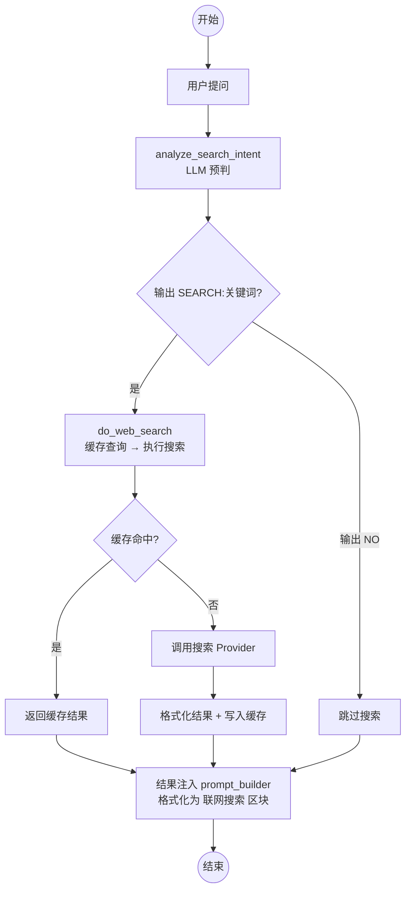
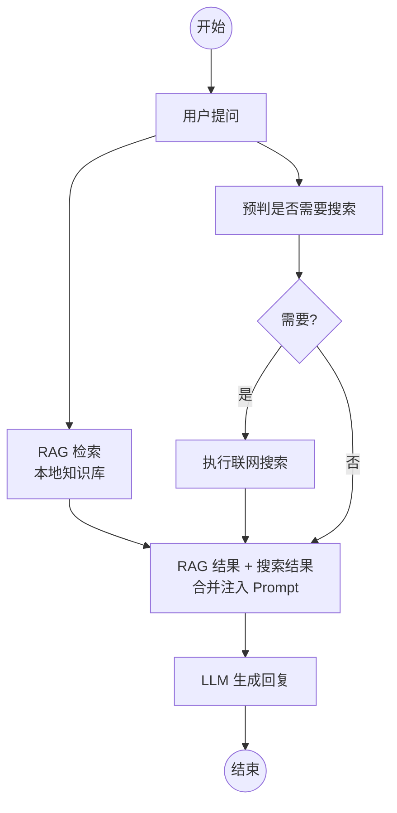

# 第 10 章 联网搜索集成

> **前置章节**：第 8 章（RAG，了解上下文富化的机制）  
> **本章重点**：当本地知识库不够用时，让 AI 智能判断并上网搜索。

---

## 10.1 为什么需要联网搜索？

RAG 解决的是**私有知识**的问题——你的文档、代码、会议记录。但有一类问题是 RAG 无法覆盖的：

| 问题类型 | RAG 能不能答？ | 例子 |
|---|---|---|
| 你的项目部署文档 | 能，因为索引了 | "Redis 怎么配置密码？" |
| 前天的新闻 | 不能，没那个文档 | "OpenAI 昨天发布了什么？" |
| 最新 API 文档 | 不能，版本太新 | "Python 3.14 的新特性？" |
| 实时数据 | 不能，过时了 | "比特币现在多少钱？" |

联网搜索补上了这块拼图——它让 AI 在遇到"知识盲区"时能主动上网查，而不是瞎编（幻觉）或甩一句"我不知道"。

但这个项目不会对每个问题都去搜索。**盲目搜索 = 浪费资源 + 引入噪音**。它有一个智能的"要不要搜"的决策流程。

---

## 10.2 搜索决策流程



整个流程分为三层：**预判 → 执行 → 注入**。预判是零成本的决策（LLM 调用，但只有 15 token 输出），执行有搜索成本，注入是纯文本格式化。

---

## 10.3 搜索 Provider 抽象

项目支持两种搜索后端，通过配置切换：

```python
# config.py
search_provider: str = "duckduckgo"
tavily_api_key: str = ""
```

### 10.3.1 DuckDuckGo（默认，免费）

- **零配置**：无需 API Key，即装即用
- **隐私友好**：不追踪用户，不存储搜索历史
- **线程并发**：`ThreadPoolExecutor` 加速多页面抓取
- **限制**：非结构化，需要自己提取内容

### 10.3.2 Tavily（可选，增强）

- **结构化结果**：自带内容摘要，含标题、URL、相关性评分
- **面向 AI**：专门为 AI 应用设计的搜索 API
- **需要 API Key**：`TAVILY_API_KEY` 环境变量配置

Provider 的切换对上层完全透明——`get_search_provider()` 根据配置返回对应的实例，调用方只关心 `provider.search(query, max_results)`。

---

## 10.4 智能预判：要不要搜？

这是搜索模块最有价值的设计——不是所有问题都需要搜索。用 LLM 做一次**极轻量的意图分析**（15 token 输出 + 3 秒超时）：

```python
async def analyze_search_intent(query, history):
    if not settings.web_search_precheck:  # 开关
        return query  # 跳过预判，直接搜索

    context_parts = []
    if history:
        # 取最近 2 条用户消息作为对话上下文
        for msg in reversed(history[-6:]):
            if msg.get("role") == "user" and len(context_parts) < 2:
                context_parts.append(msg.get("content", ""))

    prompt = (
        "判断是否需要联网搜索。\n\n"
        f"历史对话：{' | '.join(reversed(context_parts))}\n\n"
        f"问题：{query}\n\n"
        "仅输出：\n"
        "SEARCH:关键词（需搜索）\n"
        "NO（不需要）"
    )

    content = await asyncio.wait_for(
        provider.complete([...], max_tokens=15, temperature=0),
        timeout=3,
    )

    if content.startswith("SEARCH:"):
        return content[len("SEARCH:"):].strip()  # 返回搜索关键词
    return None  # 不需要搜索
```

输出协议只有两种可能：

| LLM 输出 | 含义 | 后续动作 |
|---|---|---|
| `SEARCH:OpenAI o3 发布` | 需要搜索，关键词已提取 | 用关键词执行搜索 |
| `NO` | 不需要 | 跳过搜索 |
| 其他/超时 | 无法判断 | 降级为 `query`，执行搜索 |

预判的正确率依赖 LLM 的判断力。不过 3 秒超时 + 15 token 的输出量决定了它的成本极低——即使偶尔误判，"该搜没搜"远比"不该搜瞎搜"好。

**降级策略**也很重要——如果预判超时或异常，默认**执行搜索**。宁可多搜一次也不要漏掉。

---

## 10.5 搜索执行 + 缓存

```python
# TTLCache: 128 条，5 分钟自动过期
_search_cache: TTLCache = TTLCache(maxsize=128, ttl=300)

async def cached_search(provider, query, max_results=5):
    key = (query.strip(), max_results)
    if key in _search_cache:
        return _search_cache[key]  # 缓存命中

    results = await provider.search(query, max_results=max_results)
    _search_cache[key] = results
    return results
```

`TTLCache` 是 `cachetools` 库提供的数据结构，同时支持两项淘汰策略：

- **TTL 过期**：5 分钟自动过期，避免返回过时数据
- **LRU 淘汰**：最多 128 条，超出时淘汰最久未访问的

缓存键是 `(query, max_results)` 的元组——相同的搜索词和结果数在 5 分钟内只执行一次。

### 结果格式化

搜索结果按 **token 预算** 截断，避免塞爆上下文窗口：

```python
async def do_web_search(query, max_results=5):
    results = await cached_search(provider, query, max_results)
    
    context = [
        {"source_file": r.url, "score": r.score, 
         "text": r.content, "title": r.title}
        for r in results
    ]
    
    # 按字符预算截断（1 token ≈ 4 字符）
    max_chars = get_config("search_max_context_tokens") * 4
    total = 0
    for i, item in enumerate(context):
        total += len(item["text"])
        if total > max_chars:
            context = context[:i]
            break
    return context
```

这里的容错处理很贴心：`total > max_chars` 时**保留已装入的结果**，而非直接丢弃当前项——确保至少有部分搜索结果可用。

---

## 10.6 搜索上下文注入 Prompt

搜索结果和 RAG 结果的格式类似，但**指令不同**：

```python
def _format_web_section(web_context):
    lines = []
    for i, r in enumerate(web_context):
        title = r.get("title", "") or r["source_file"]
        lines.append(f"[联网搜索] [{i+1}] {title}\n\n{r['text']}")
    return "<联网搜索>\n" + "\n\n".join(lines) + "\n</联网搜索>"

def _pick_instruction(has_rag, has_web):
    if has_rag and has_web:
        return (
            "请参考以上资料回答。对于参考资料中的内容请严格依据并标注来源；"
            "对于联网搜索结果请结合你的知识回答，不要照搬原文。"
            "引用联网搜索时用 [N] 标注来源编号（如 [1][2]）。"
            "若资料不足请直接说不知道。"
        )
    if has_rag:
        return "请严格依据以上参考资料回答，必要时标注来源。若资料不足请直接说不知道。"
    return (
        "以下是联网搜索结果，每项以 [N] 编号。请结合你的知识回答，"
        "引用时用 [N] 标注来源（如 [1][2]）。"
        "不要直接照搬搜索内容。"
    )
```

RAG 场景下指令是"严格依据"，因为你信任自己的文档。搜索场景下指令是"结合你的知识，标注来源，不要照搬"——因为搜索结果的可靠性参差不齐。

来源标注 `[1] [2]` 给用户提供了可验证的引用，这也是减少幻觉的关键机制。

---

## 10.7 搜索与 RAG 的协作模式

在 `stream_engine.py` 中，搜索和 RAG 是**并行执行**的：



这不是先搜 RAG、不够再搜 Web 的串行模式，而是**同时执行**。优点：

- **延迟最小**：两个搜索并行，总延迟 = `max(RAG延迟, 搜索延迟)`
- **不互相阻塞**：RAG 很快返回但质量差？Web 也已经在搜了
- **结果可对照**：LLM 能同时参考两类来源，交叉验证

---

## 10.8 配置参数

| 参数 | 默认值 | 说明 |
|---|---|---|
| `search_provider` | `"duckduckgo"` | 搜索后端选择 |
| `web_search_precheck` | `True` | 是否启用 LLM 预判（关闭则全部搜索） |
| `search_cache_ttl` | `300` | 缓存有效期（秒） |
| `search_max_results` | `5` | 每次搜索返回结果数 |
| `search_max_context_tokens` | `4000` | 搜索结果占上下文的最大 token 数 |

所有参数都支持运行时热修改（通过 `runtime_config.py` 的 JSON 持久化）。

---

## 10.9 隐私考量

项目默认使用 **DuckDuckGo** 作为搜索 Provider，这是有意的选择：

1. **不追踪**：DDG 不收集用户搜索历史
2. **本地运行**：搜索请求从本地发出，无需经过第三方 AI 服务
3. **无 API Key**：不存在密钥泄露风险

切换到 **Tavily** 时需要注意：
- 搜索内容经过 Tavily 的服务器
- 需要 `TAVILY_API_KEY` 配置（建议通过 `.env` 文件管理）
- 适合对搜索质量要求更高且对隐私不那么敏感的场景

---

## 10.10 错误处理与降级

搜索模块的容错设计很健壮：

```python
# 预判超时 → 降级为原始 query，继续搜索
except asyncio.TimeoutError:
    return query

# 预判异常 → 降级为原始 query，继续搜索  
except Exception:
    return query

# 搜索失败 → 返回 None，上层感知为"无搜索结果"
if not results:
    return None
```

**搜索失败不影响主问答流程**。即使搜索挂了，RAG 的结果依然可用，LLM 只基于本地知识作答。

---

## 10.11 搜索状态 API

前端可以通过 API 查询搜索配置状态（已配置/未配置），给用户清晰的能力提示：

- DuckDuckGo：始终可用（免费，本地）
- Tavily：检查 API Key 是否配置

这使得 UI 能动态展示"当前可以使用联网搜索吗？"的状态。

---

## 10.12 本章小结

联网搜索让 AI 助手的能力边界从"你文档里有的"扩展到"互联网上能找到的"：

1. **Provider 抽象**：DuckDuckGo（免费/隐私）和 Tavily（结构化）双后端，配置切换
2. **智能预判**：LLM 以 15 token 输出 + 3 秒超时的极低成本判断"要不要搜"
3. **结果缓存**：TTLCache（128 条，5 分钟），避免重复搜索
4. **Token 预算**：搜索结果按字符预算截断，防止撑爆上下文
5. **并行执行**：搜索与 RAG 同时进行，不相互阻塞
6. **降级容错**：搜索失败不影响主流程，预判异常时默认执行搜索

下一章我们将讨论**历史压缩策略**——当对话长度超出上下文窗口时，如何智能裁剪和摘要，保证长对话的质量。
