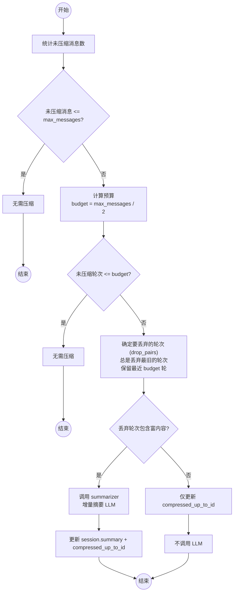
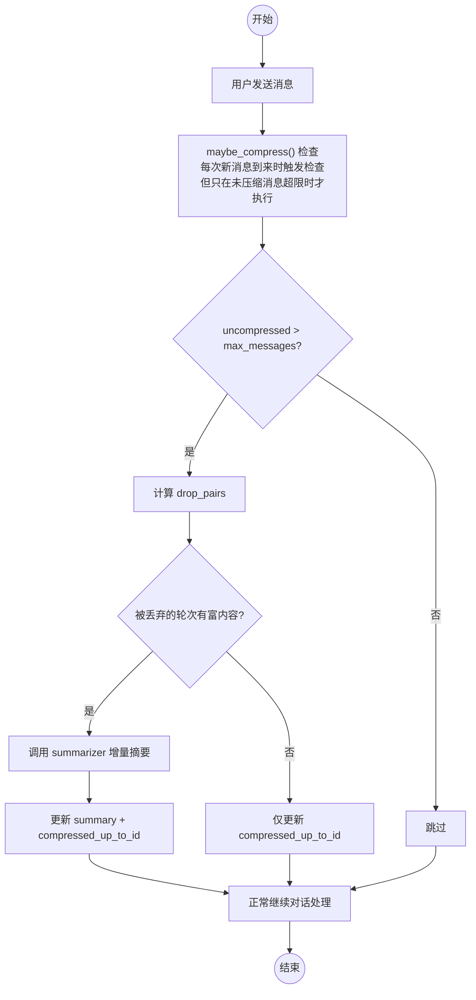

# 第 11 章 历史压缩策略

> **前置章节**：第 8 章（RAG/上下文预算），第 9 章（语义记忆）  
> **本章重点**：长对话不会无限膨胀——智能裁剪 + 按需摘要，保持上下文质量。

---

## 11.1 上下文窗口悖论

LLM 的上下文窗口越来越大（从 4K 到 128K 甚至 1M），但这并没有解决根本问题：

| 现象 | 原因 |
|---|---|
| 窗口越大，回答越慢 | 更多 token = 更长的推理时间 |
| 关键信息被稀释 | 旧消息占位，LLM 的注意力机制在长上下文中退化（Lost in the Middle） |
| 成本线性增长 | API 按 token 计费，104 条消息和一个 10 轮对话的成本差一个数量级 |

**上下文窗口像桌子——更大未必更好，关键是怎么摆放。** 这个项目的压缩策略不是暴力裁剪，而是**混合压缩**：裁剪（免费）+ 摘要（按需），只花必要的成本。

---

## 11.2 混合压缩策略



核心设计理念：**两种工具，不同成本**。

| 工具 | 成本 | 做什么 | 触发条件 |
|---|---|---|---|
| **裁剪（Trim）** | 零 LLM 成本 | 丢弃最旧的 N 轮对话 | 总是执行 |
| **摘要（Summarize）** | 一次 LLM 调用 | 对被丢弃的轮次生成一句话摘要 | 被丢弃的轮次包含"富内容" |

---

## 11.3 数据模型：水位线模式

压缩不修改或删除数据库中的消息记录，而是用一个**水位线**标记哪部分历史已被"处理过"：

```python
# 会话表的关键字段
compressed_up_to_id: int | None  # 到此 ID 为止的消息已压缩
summary: str | None              # 累积摘要文本
```

工作原理：

```
消息表：
  id=1  id=2  id=3  ......  id=50  id=51  id=52
  |<---- compressed_up_to_id=50 ---->|<-- 未压缩 -->|

Prompt 构建时：
  - 已压缩部分：用 summary 字段代表（一句话）
  - 未压缩部分：原样加载（最近的消息，完整保留）
```

这是一个经典的水位线（Watermark）模式。它有几个优点：

1. **不丢失数据**：数据库中的消息一条没删，随时可以回溯完整历史
2. **幂等重入**：每次压缩只处理"水位线之上"的消息，不会重复处理
3. **增量友好**：每次压缩更新水位线即可，不需要重新计算全部消息

---

## 11.4 压缩触发条件

```python
async def maybe_compress(db, session_id, max_messages):
    session = await get_session(db, session_id)
    compressed_up_to_id = session.get("compressed_up_to_id") if session else None

    # 只统计未压缩部分
    uncompressed = await count_messages(db, session_id, 
                                         after_id=compressed_up_to_id)

    if uncompressed <= max_messages:
        return (0, False)  # 无需压缩

    # 获取未压缩消息
    all_msgs = await get_messages(db, session_id, 
                                   limit=uncompressed, after_id=compressed_up_to_id)
```

触发条件非常直白：**未压缩消息数超过阈值**。不是按"消息总数"判断，而是按"未压缩消息数"——已压缩部分不会再触压缩。

---

## 11.5 裁剪策略

```python
pairs = _extract_pairs(all_msgs)  # user-assistant 配对

budget = max_messages // 2  # 轮次预算 = 消息数/2
if len(pairs) <= budget:
    return (0, False)

# 丢弃最旧的轮次，保留最近 budget 轮
drop_pairs = pairs[:len(pairs) - budget]
last_id = drop_pairs[-1].last_id
```

关键设计点：

- **预算减半**：`budget = max_messages // 2`，确保压缩后仍有足够空间
- **最少保留两轮**：`_COMPRESS_MIN_ROUNDS` 保证不会过度压缩导致上下文贫瘠
- **按轮次裁剪**：不是按消息条数，而是按"用户-助手"配对裁剪——逻辑干净

`_extract_pairs` 的实现：

```python
def _extract_pairs(msgs):
    """从有序消息列表中提取 user-assistant 轮次对"""
    pairs = []
    i = 0
    while i < len(msgs):
        if msgs[i].get("role") == "user":
            user_msg = msgs[i]
            asst_msg = None
            last_id = user_msg["id"]
            if i + 1 < len(msgs) and msgs[i + 1].get("role") == "assistant":
                asst_msg = msgs[i + 1]
                last_id = asst_msg["id"]
                i += 2
            else:
                i += 1  # 用户消息后没有助手回复（可能正在等待）
            pairs.append(_Pair(user=user_msg, assistant=asst_msg, last_id=last_id))
        else:
            i += 1
    return pairs
```

`last_id` 取每轮中最后一条消息的 ID。这个值用于更新水位线——只有完整的 user-assistant 轮次被标记为已压缩。

---

## 11.6 富内容检测

不是所有被丢弃的轮次都值得摘要。闲聊"你好呀"被丢弃了就丢弃了，没必要摘。但如果用户花了半小时和 AI 调试了一个 Bug，被丢弃时不做摘要是严重的信息丢失。

```python
_RICH_THRESHOLD = 200  # 助手回复超过 200 字符视为"富内容"

def _has_rich_content(pairs):
    for p in pairs:
        if p.assistant and len(p.assistant.get("content", "")) > _RICH_THRESHOLD:
            return True
    return False
```

200 字符是个经验阈值——超过这个长度的助手回复通常包含代码示例、配置说明、错误分析等有价值的信息。

---

## 11.7 增量摘要

只有在检测到富内容时，才调用 LLM 生成摘要。这避免了为闲聊浪费 LLM 调用：

```python
if _has_rich_content(drop_pairs):
    summary = await summarize_rich_rounds(drop_pairs, existing_summary=existing)
    if summary:
        await save_session_summary(db, session_id, summary, last_id)
        did_summarize = True
```

摘要生成器做了专门针对**本地小模型**的优化：

```python
async def summarize_rich_rounds(pairs, existing_summary=""):
    # 只输入用户消息，减半 input token
    user_msgs = []
    for p in pairs:
        text = p.user.get("content", "")[:300]
        if text:
            user_msgs.append(text)

    if existing_summary:
        prompt = (
            "以下是已有的对话摘要和新的对话内容。"
            "请将它们合并为一段简洁的新摘要（50字以内），保留关键信息：\n\n"
            f"已有摘要：{existing_summary}\n\n"
            f"新对话：\n" + "\n".join(user_msgs)
        )
    else:
        prompt = (
            "以下对话的核心内容是什么？用一句话概括（50字以内）：\n"
            + "\n".join(user_msgs)
        )

    summary = await provider.complete(
        [{"role": "user", "content": prompt}],
        max_tokens=100, temperature=0,
    )
```

三个优化点：

| 优化 | 做法 | 收益 |
|---|---|---|
| **只输入用户消息** | 不传助手回复，输入减半 | 更快、更省 token |
| **temperature=0** | 确定性输出，不浪费算力"创作" | 更快、更稳定 |
| **max_tokens=100** | 50-80 字中文摘要足矣 | 输出成本极低 |

增量合并的 Prompt 设计也值得一提——不是每次都从零摘要，而是"已有摘要 + 新内容 → 合并摘要"。这保证了摘要的**连续性**。

```python
if existing_summary:
    # 增量模式：合并已有摘要和新内容
    prompt = (
        "请将它们合并为一段简洁的新摘要（50字以内）..."
    )
else:
    # 首次压缩：从头摘要
    prompt = (
        "以下对话的核心内容是什么？用一句话概括..."
    )
```

### 无富内容的压缩

即使没有富内容，`compressed_up_to_id` 仍然会更新——只是 summary 保持不变：

```python
if not did_summarize:
    existing = session.get("summary", "") if session else ""
    await save_session_summary(db, session_id, existing, last_id)
```

这保证了水位线始终前进，不会因为"这次没有富内容"而导致下次压缩重复处理同一批消息。

---

## 11.8 Prompt 构建中的压缩上下文

会话摘要如何注入 Prompt？在 `prompt_builder.py` 中：

```python
def build_messages(..., session_summary=None, ...):
    messages = [{"role": "system", "content": system_prompt}]
    
    if session_summary:
        # 摘要作为第二条 system 消息注入
        messages.append({
            "role": "system", 
            "content": f"[会话摘要] {session_summary}"
        })
    
    # 然后是未压缩的历史消息和当前用户消息
    messages.extend(selected)
    messages.append({"role": "user", "content": user_content})
```

摘要被放在 system prompt 之后、历史消息之前。LLM 先读完系统指令，再看会话摘要（快速了解"前情提要"），最后按时间线阅读最近的完整对话。这个位置设计确保了摘要作为"背景知识"而非"对话内容"被 LLM 理解。

---

## 11.9 压缩决策树总结



压缩的触发时机是**每次收到新消息时**检查——这是一种被动触发策略，简单且可靠。不需要定时任务，不需要手动触发。

---

## 11.10 调优参数

| 参数 | 默认值 | 说明 |
|---|---|---|
| `max_history_messages` | 40 | 未压缩消息的触发阈值 |
| `_RICH_THRESHOLD` | 200 | 助手回复超过此字符数视为有价值内容 |
| `_COMPRESS_MIN_ROUNDS` | 2 | 最少保留的未压缩轮次 |
| `max_context_tokens` | 20480 | Prompt 构建时的 token 预算上限 |

调优建议：

- **长文档问答**：增大 `max_history_messages` 到 60-80，保留更多对话上下文
- **性能优先**：减小 `max_history_messages` 到 20-30，上下文更干净，推理更快
- **记忆配合**：如果已启用语义记忆（第 9 章），可以适当减小 `max_history_messages`，因为相关历史会通过记忆召回

---

## 11.11 与语义记忆的配合

压缩和记忆是互补的两种机制：

| 维度 | 历史压缩 | 语义记忆 |
|---|---|---|
| 保留什么 | 最近 N 轮 + 累积摘要 | 与当前问题语义相关的内容 |
| 存储位置 | SQLite（摘要 + 水位线） | ChromaDB（embedding） |
| 触发条件 | 消息数超限 | 每次查询 |
| 成本 | 零（裁剪）+ 偶尔 LLM（摘要） | 每次消息索引 + 每次检索 |

两者并用时的工作流程：

1. **会话摘要**提供"整体背景"——这个对话大致在聊什么
2. **语义记忆**提供"精准回忆"——和当前问题最相关的几轮详细对话
3. **未压缩历史**提供"最近上下文"——刚才说了什么

三种信息源的组合，比任何一种单一方案都更完整。

---

## 11.12 本章小结

历史压缩策略用最小的 LLM 开销解决了长对话的上下文管理问题：

1. **混合策略**：裁剪（零成本）+ 摘要（按需），各取所长
2. **水位线模式**：`compressed_up_to_id` 标记已处理范围，不丢数据，支持增量
3. **富内容检测**：200 字符阈值判断是否值得摘要，避免浪费
4. **增量摘要**：只输入用户消息（减半 input），temperature=0，50 字输出
5. **被动触发**：每次新消息时检查，简单可靠
6. **与记忆协同**：压缩处理"整体背景"，记忆处理"精准关联"

这是本教程系列的最后一章。回顾整个项目，我们从一个 FastAPI 骨架开始，逐步构建了数据库层、模型 Provider 抽象、SSE 流式引擎、React 前端、RAG 检索增强、语义记忆、联网搜索、历史压缩——一个完整且生产质量不错的 AI 智能助手。

希望这个系列能帮你理解：构建一个好用的 AI 应用，关键不在于调用 API，而在于**工程化的思考和实现**——抽象分层、错误处理、缓存、预算控制、降级策略——这些才是让 AI 从"能用"变成"好用"的关键。
