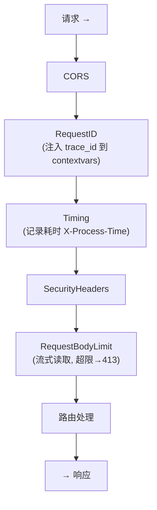
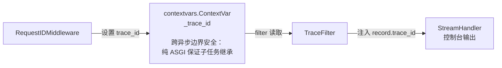

# 第 12 章：中间件体系

> 本章将带你深入理解 FastAPI 中间件的"洋葱模型"，从全链路追踪到安全加固，从性能监控到流控防护，逐一拆解本项目中间件层的每一层设计决策。

---

## 12.1 什么是中间件？

如果把手写框架比作盖房子，那中间件就是房子的"管道系统"——水电煤气的每一根管子都按特定顺序铺设，水从总阀门（请求入口）进入，依次经过层层阀门（中间件），最终流到水龙头（路由处理函数），再原路返回。

FastAPI 的中间件遵循 **洋葱模型**：



**关键洞察**：注册顺序与执行顺序相反。`add_middleware` 相当于一层层"包"洋葱——最先 add 的中间件在最外层，最后 add 的在最内层（最靠近路由）。

---

## 12.2 项目中间件全景

本项目共注册了 5 个中间件，按执行顺序排列：

| 顺序 | 中间件 | 职责 | 实现方式 |
|------|--------|------|----------|
| 1 | CORSMiddleware | 跨域安全 | 框架内置 |
| 2 | RequestIDMiddleware | 全链路追踪 | **纯 ASGI** |
| 3 | TimingMiddleware | 性能监控 | BaseHTTPMiddleware |
| 4 | SecurityHeadersMiddleware | 安全响应头 | BaseHTTPMiddleware |
| 5 | RequestBodyLimitMiddleware | 请求体限流 | BaseHTTPMiddleware |

中间件注册代码（`main.py:116-141`）：

```python
def _register_middleware(app: FastAPI) -> None:
    settings = get_settings()

    # 最内层：请求体限制
    max_body = settings.max_upload_size + 1024 * 1024
    app.add_middleware(RequestBodyLimitMiddleware, max_size=max_body)

    # 安全头
    app.add_middleware(SecurityHeadersMiddleware)

    # 耗时统计
    app.add_middleware(TimingMiddleware)

    # 请求 ID（最外层，先注入 trace_id）
    app.add_middleware(RequestIDMiddleware)

    # CORS（框架内置，在最外层）
    app.add_middleware(
        CORSMiddleware,
        allow_origins=settings.cors_origins,
        allow_credentials=True,
        allow_methods=["*"],
        allow_headers=["*"],
    )
```

**为什么 RequestID 在 Timing 外层？** 因为 Timing 的日志中要用 trace_id，所以 trace_id 必须先被注入到 contextvars 中。这就是"先注册，后执行；外层的代码先跑"的含义。

---

## 12.3 RequestIDMiddleware：全链路追踪的基石

这是本章设计最考究的中间件。它解决一个核心问题：**如何在一堆交织的异步日志里，快速找到属于同一个请求的所有日志？**

答案是给每个请求打上一个唯一 ID。

### 12.3.1 为什么是纯 ASGI 而不是 BaseHTTPMiddleware？

这是本项目中间件设计中最关键的抉择之一。`BaseHTTPMiddleware` 基于 `starlette` 的 `anyio` 实现，它在内部使用 `anyio.start_soon()` 创建子任务，而 `anyio` 的子任务 **默认不继承父任务的 contextvars 上下文**。这意味着在 `BaseHTTPMiddleware` 中设置的 `contextvars` 值，可能在下游的异步调用链中丢失。

本项目的 `RequestIDMiddleware` 使用 **纯 ASGI 协议实现**（`middleware/request_id.py`）：

```python
from starlette.types import ASGIApp, Scope, Receive, Send, Message

class RequestIDMiddleware:
    def __init__(self, app: ASGIApp) -> None:
        self.app = app

    async def __call__(self, scope: Scope, receive: Receive, send: Send) -> None:
        if scope["type"] != "http":
            await self.app(scope, receive, send)
            return

        # 1. 读取或生成 request_id
        request_id = None
        for key, value in scope.get("headers", []):
            if key == b"x-request-id":
                request_id = value.decode()
                break
        if not request_id:
            request_id = uuid.uuid4().hex[:16]

        # 2. 注入到 contextvars（日志系统从这里获取）
        _trace_id.set(request_id)

        # 3. 注入到 ASGI scope（供下游 starlette.Request.state 访问）
        scope.setdefault("state", {}).setdefault("request_id", request_id)

        # 4. 包装 send，将 trace_id 写入响应头
        orig_send = send
        async def send_with_header(message: Message) -> None:
            if message["type"] == "http.response.start":
                headers = message.get("headers", [])
                headers.append((b"x-request-id", request_id.encode()))
                message["headers"] = headers
            await orig_send(message)

        await self.app(scope, receive, send_with_header)
```

**设计亮点**：

1. **优先使用上游传入的 ID**：如果请求头已经携带 `x-request-id`（比如前端传入或上游服务转发），则沿用该 ID，实现跨服务链路追踪。

2. **双通道注入**：同时写入 `contextvars`（日志系统用）和 `scope.state`（下游路由用），覆盖不同消费场景。

3. **非 HTTP 协议透传**：对于 WebSocket 等非 HTTP 请求，直接透传，不干扰。

### 12.3.2 实际效果

启动应用后，控制台日志会显示类似：

```
2026-07-05 14:32:01 | INFO     | middleware.timing              | [a3b2c9d1e4f5a6b7] GET /api/models -> 200 (45.3ms)
```

`[a3b2c9d1e4f5a6b7]` 就是 trace_id。当多个用户同时使用时，你可以通过这个 ID 把每个用户的请求链路串起来。

---

## 12.4 TimingMiddleware：性能监控的"秒表"

这个中间件非常简单但极其实用——它为每个请求计时，并写入响应头和日志。

```python
class TimingMiddleware(BaseHTTPMiddleware):
    async def dispatch(self, request: Request, call_next: RequestResponseEndpoint) -> Response:
        start = time.perf_counter()
        response = await call_next(request)
        duration_ms = (time.perf_counter() - start) * 1000
        response.headers["X-Process-Time"] = f"{duration_ms:.1f}ms"

        if not request.url.path.startswith("/static"):
            logger.info(
                "%s %s -> %d (%.1fms)",
                request.method, request.url.path,
                response.status_code, duration_ms,
            )

        return response
```

**设计决策**：

- **`perf_counter()` 而非 `time()`**：`perf_counter()` 是进程级别的单调钟，不受系统时间调整影响，是性能测量的标准选择。
- **排除 `/static` 路径**：静态文件请求量极大，全部打日志会淹没有效信息。
- **响应头暴露**：前端开发者可以直接在浏览器 DevTools 的 Response Headers 中看到 `X-Process-Time: 45.3ms`，方便调试。

---

## 12.5 SecurityHeadersMiddleware：纵深防御

安全不是某个单一措施，而是一层层的防护。这个中间件为每个响应注入防御性 HTTP 头。

```python
class SecurityHeadersMiddleware(BaseHTTPMiddleware):
    SECURITY_HEADERS = {
        "X-Content-Type-Options": "nosniff",
        "X-Frame-Options": "DENY",
        "Referrer-Policy": "strict-origin-when-cross-origin",
        "X-XSS-Protection": "1; mode=block",
        "Permissions-Policy": "camera=(), microphone=(), geolocation=()",
    }

    async def dispatch(self, request: Request, call_next: RequestResponseEndpoint) -> Response:
        response = await call_next(request)
        for header, value in self.SECURITY_HEADERS.items():
            response.headers[header] = value
        return response
```

**每个头的含义**：

| 响应头 | 作用 | 防御的攻击 |
|--------|------|------------|
| `X-Content-Type-Options: nosniff` | 禁止浏览器 MIME 嗅探 | MIME 混淆攻击 |
| `X-Frame-Options: DENY` | 禁止页面被 iframe 嵌入 | 点击劫持 |
| `Referrer-Policy: strict-origin-when-cross-origin` | 跨域时不发送完整 Referrer | 信息泄露 |
| `X-XSS-Protection: 1; mode=block` | 启用浏览器内置 XSS 过滤器 | 反射型 XSS |
| `Permissions-Policy` | 禁用摄像头、麦克风、定位 | 权限滥用 |

**为什么不是安全防御的全部？** HTML 响应头只是纵深防御的一层。真正的安全还需要：
- 输入校验和参数化查询（防 SQL 注入）
- Content-Security-Policy（防 XSS 和数据注入）
- HTTPS（防中间人攻击）
- 速率限制（防 DDoS）

本项目作为本地运行的助手工具，安全头的配置水平处于**合理且稳健**的级别。

---

## 12.6 RequestBodyLimitMiddleware：流式大小校验

大文件上传可能导致服务器内存被耗尽。传统的做法是读取完整 body 后检查大小——但这恰恰是最耗内存的方式。

本项目的方案是**流式校验**：边接收边计数，超限立即中断。

```python
class RequestBodyLimitMiddleware(BaseHTTPMiddleware):
    def __init__(self, app, max_size: int):
        super().__init__(app)
        self.max_size = max_size

    async def dispatch(self, request: Request, call_next: RequestResponseEndpoint) -> Response:
        original_receive = request.receive
        state = {"received": 0}

        async def guarded_receive():
            message = await original_receive()
            if message.get("type") == "http.request":
                state["received"] += len(message.get("body", b""))
                if state["received"] > self.max_size:
                    raise _BodyTooLarge()
            return message

        request._receive = guarded_receive

        try:
            return await call_next(request)
        except _BodyTooLarge:
            logger.warning(
                "请求体超过大小限制 (%d bytes), client=%s, path=%s",
                state["received"], request.client.host, request.url.path,
            )
            return JSONResponse(
                {"detail": "请求体超过大小限制"},
                status_code=413,
            )
```

**设计亮点**：

- **无侵入替换**：通过替换 `request._receive` 实现对底层 ASGI receive 的透明包装，下游代码无需任何改动。
- **1MB 余量设计**：`max_size = settings.max_upload_size + 1024 * 1024`。为什么多 1MB？因为 HTTP 请求不只是文件内容，还包括 multipart 边界、表单字段等开销。
- **即时中断**：抛出内部异常 `_BodyTooLarge` 并捕获，转换为标准的 `413 Payload Too Large` JSON 响应。

---

## 12.7 日志系统：contextvars + TraceFilter

日志系统是中间件的"消费者"——各中间件写入 contextvars，日志系统读取 contextvars。

### 12.7.1 架构概览



### 12.7.2 实现细节

```python
import contextvars
import logging

# 定义跨协程传递的上下文变量
_trace_id: contextvars.ContextVar[str] = contextvars.ContextVar("trace_id", default="")

# 日志格式中预留 trace_id 占位符
TRACE_FORMAT = (
    "%(asctime)s | %(levelname)-8s | %(name)-30s | %(trace_id)s%(message)s"
)

class TraceFilter(logging.Filter):
    """从 contextvars 读取 trace_id 并注入到每条日志记录"""
    def filter(self, record: logging.LogRecord) -> bool:
        tid = _trace_id.get()
        record.trace_id = f"[{tid}] " if tid else ""
        return True  # 永远不过滤，只是注入字段

def setup_logging(level: str = "INFO") -> None:
    root = logging.getLogger()
    root.setLevel(getattr(logging, level.upper(), logging.INFO))

    # 清空已有处理器（避免重复添加）
    for handler in root.handlers[:]:
        root.removeHandler(handler)

    console = logging.StreamHandler(sys.stdout)
    console.setFormatter(logging.Formatter(TRACE_FORMAT, datefmt="%Y-%m-%d %H:%M:%S"))
    console.addFilter(TraceFilter())
    root.addHandler(console)

    # 抑制第三方库的噪音
    logging.getLogger("httpx").setLevel(logging.WARNING)
    logging.getLogger("httpcore").setLevel(logging.WARNING)
    logging.getLogger("uvicorn.access").setLevel(logging.WARNING)
    logging.getLogger("ollama").setLevel(logging.WARNING)
```

**设计要点**：

- **`contextvars` 生命周期**：`_trace_id` 的值只在当前请求的处理协程树中可见。两个并发请求各自拥有独立的 trace_id，不会互相干扰。
- **字段注入而非过滤**：`TraceFilter.filter()` 永远返回 `True`——它的职责是注入字段，不是过滤日志。
- **沉默的第三方库**：`httpx`、`httpcore`、`uvicorn.access`、`ollama` 这 4 个第三方库的日志在日常运行中毫无价值，统一调到 WARNING 级别。

---

## 12.8 动手实践：添加自定义 IP 中间件

假设你想添加一个"记录所有请求来源 IP"的功能。这个练习将帮助你理解中间件的实际开发。

**需求**：将每个请求的客户端 IP 附加到日志中。

**代码**（新建 `middleware/client_ip.py`）：

```python
import contextvars
import logging
from starlette.middleware.base import BaseHTTPMiddleware
from starlette.requests import Request
from starlette.responses import Response

logger = logging.getLogger(__name__)

class ClientIPMiddleware(BaseHTTPMiddleware):
    async def dispatch(self, request, call_next):
        client_ip = request.client.host if request.client else "unknown"
        logger.info("客户端 IP: %s", client_ip)
        return await call_next(request)
```

**注册**（在 `_register_middleware` 中，插在 RequestID 后面）：

```python
app.add_middleware(ClientIPMiddleware)
```

**运行效果**：

```
2026-07-05 14:32:01 | INFO     | middleware.client_ip            | [a3b2c9d1] 客户端 IP: 192.168.1.100
2026-07-05 14:32:01 | INFO     | middleware.timing               | [a3b2c9d1] GET /api/chat -> 200 (152.3ms)
```

你会发现两条日志共享同一个 `[a3b2c9d1]` trace_id——这正是 RequestIDMiddleware 在更外层先注入 contextvars 的效果。

---

## 12.9 本章小结

| 中间件 | 核心技巧 | 适用场景 |
|--------|----------|----------|
| RequestID | 纯 ASGI 绕过 anyio 隔离 | 全链路追踪 |
| Timing | perf_counter 高精度计时 | 性能监控 |
| SecurityHeaders | HTTP 响应头防御 | 安全加固 |
| RequestBodyLimit | 流式字节计数 | 防资源耗尽 |
| CORS | 框架内置 | 跨域控制 |

**本章关键词**：洋葱模型、纯 ASGI 中间件、contextvars 上下文传递、流式校验、纵深防御。

**下一步**：中间件为请求处理提供了"管道"，但 AI 助手还需要"燃料"——模型。下一章将介绍本项目的多模型发现与管理架构。

---

*上一章：[第 11 章 · 历史压缩与对话管理](11-历史压缩.md)* | *下一章：[第 13 章 · 模型管理与预热](13-模型管理与预热.md)*
