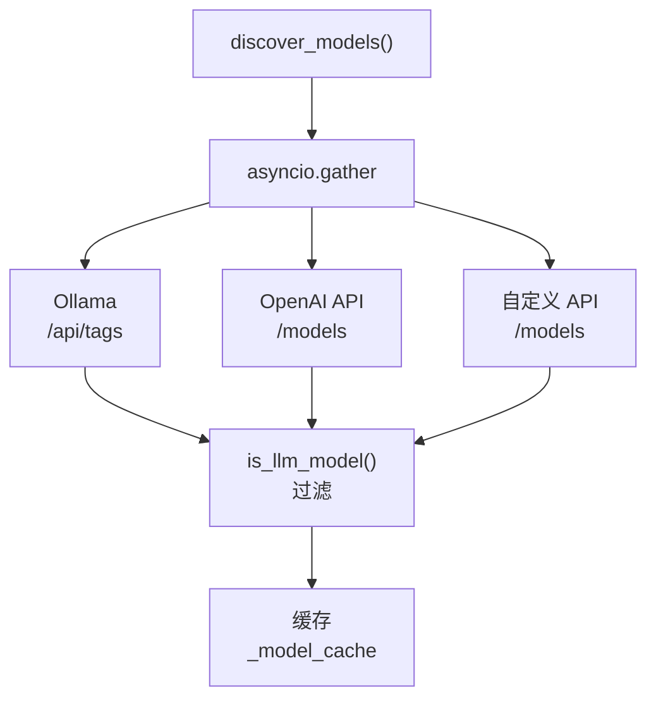
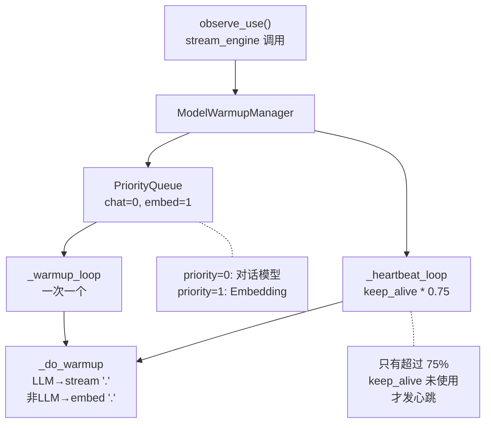
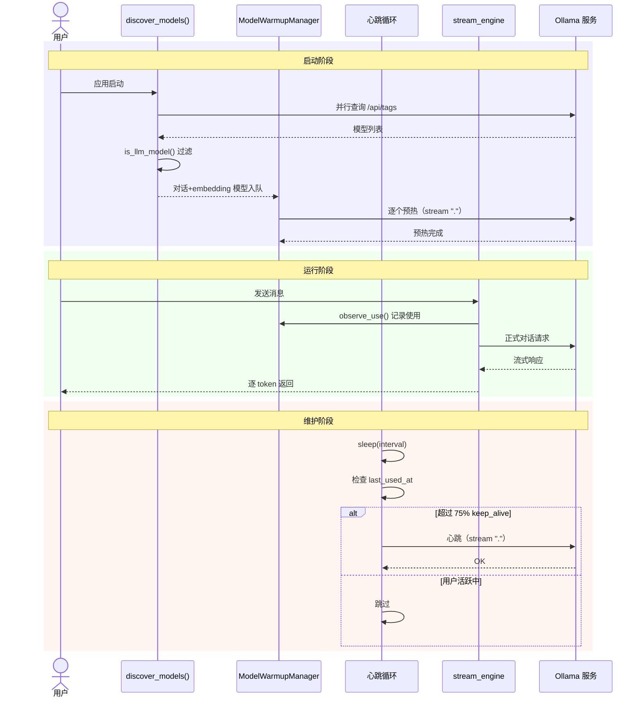

# 第 13 章：模型管理与预热

> 一个 AI 助手如果启动后要等十几秒才能开始对话，用户体验会大打折扣。本章将揭示本项目如何实现"即开即用"的模型预热机制，以及面向多模型来源的统一管理层架构。

---

## 13.1 为什么需要模型管理层？

现代 AI 应用的模型来源越来越丰富：

- **Ollama**：本地运行的开源大模型（Qwen、Llama、DeepSeek...）
- **OpenAI 兼容 API**：vLLM 部署的私有模型、第三方 API 代理
- **云端服务**：部分场景需要混合使用本地和云端模型

如果每个用到模型的地方都自己去发现、连接、管理，代码会迅速膨胀成"意大利面条"。本项目的答案是：**统一的模型发现层 + 对上层透明的调用抽象**。

---

## 13.2 多来源模型发现

### 13.2.1 并行查询架构

模型发现的核心思路：**`asyncio.gather` 并行查询所有来源，合并结果后缓存**。



实现代码（`services/model_manager.py:145-168`）：

```python
async def discover_models(force_refresh: bool = False) -> list[dict]:
    global _model_cache
    if _model_cache is not None and not force_refresh:
        return _model_cache

    sources = get_model_sources()
    tasks = [_discover_source(s) for s in sources]
    results = await asyncio.gather(*tasks, return_exceptions=True)

    models: list[dict] = []
    for source, result in zip(sources, results):
        if isinstance(result, Exception):
            logger.warning("模型发现失败 [%s]: %s", source["name"], result)
        else:
            models.extend(result)
            logger.info("模型发现: %s 返回 %d 个模型", source["name"], len(result))

    _model_cache = models
    return models
```

**设计亮点**：

1. **容错并行**：`return_exceptions=True` 确保一个来源挂掉不影响其他来源的结果。
2. **按需刷新**：`_model_cache` 作为模块级缓存，避免频繁 HTTP 查询 Ollama/API。只有 `force_refresh=True` 或自定义来源变更时才重新查询。
3. **统一定价模型**：所有来源的模型都转换为 `{"id": str, "source": str, "name": str, "type": str}` 格式。

### 13.2.2 单来源发现

```python
async def _discover_source(source: dict) -> list[dict]:
    client = HttpClientPool.get("discovery", timeout=10)
    if source["type"] == "ollama":
        base_url = source.get("base_url") or get_settings().ollama_host
        resp = await client.get(f"{base_url}/api/tags")
        if resp.status_code != 200:
            return []
        discovered = []
        for model in resp.json().get("models", []):
            name = model["name"]
            if is_llm_model(name):
                discovered.append({
                    "id": name, "source": source["name"],
                    "name": name, "type": "ollama",
                })
        return discovered

    if source["type"] == "openai":
        headers = {}
        if source.get("api_key"):
            headers["Authorization"] = f"Bearer {source['api_key']}"
        resp = await client.get(
            f"{source['base_url']}/models", headers=headers
        )
        if resp.status_code != 200:
            return []
        return [
            {"id": m["id"], "source": source["name"],
             "name": m["id"], "type": "openai"}
            for m in resp.json().get("data", [])
        ]

    return []
```

`HttpClientPool.get("discovery", timeout=10)` 是项目的 HTTP 客户端池——为"模型发现"这个场景分配专属的连接池，10 秒超时。不同场景使用不同的池实例，避免连接复用冲突。

---

## 13.3 非 LLM 过滤策略

Ollama 上可能安装了几十个模型，但不是每个都能拿来对话。你需要把"能聊天"的模型筛出来。

```python
_NON_LLM_NAMES = frozenset({
    # 嵌入模型（用来向量化，不能聊天）
    "nomic-embed-text", "mxbai-embed-large", "bge-m3", "bge-large",
    "e5-large", "e5-base", "jina-embeddings", "stella", "m3e",
    # 视觉模型（纯视觉，不能文字对话）
    "llava", "bakllava", "minicpm-v", "cogvlm", "qwen-vl",
    # 重排序/工具
    "reranker", "cross-encoder",
})


def is_llm_model(model_name: str) -> bool:
    """判断是否为可对话的 LLM 模型"""
    base_name = model_name.split(":")[0].strip()
    if base_name in _NON_LLM_NAMES:
        return False
    return True
```

**为什么用 `frozenset`？** 这是 Python 最佳实践：`frozenset` 是不可变集合，`in` 操作是 O(1)，而且作为模块级常量不会被意外修改。

**为什么用 `split(":")[0]`？** Ollama 模型名可能带 tag：`qwen2.5:7b`、`qwen2.5:14b`。我们只关心 base name 是否在非 LLM 列表中。

---

## 13.4 自定义 API 来源管理

除了配置文件中写死的来源（如 Ollama），用户可以在运行时动态添加 OpenAI 兼容的 API 端点。

### 13.4.1 持久化存储

用户添加的来源需要"活过"应用重启。项目使用 **原子 JSON 写入** 保证数据安全：

```python
def save_custom_sources(sources: list[dict]):
    """持久化自定义 API 来源列表（原子写，防中途崩溃损坏）"""
    try:
        atomic_json_write(get_custom_sources_path(), sources)
    except Exception as e:
        logger.warning("持久化自定义模型来源失败: %s", e)

def add_custom_source(source: dict) -> list[dict]:
    sources = load_custom_sources()
    existing = [s for s in sources if s["name"] != source["name"]]
    existing.append(source)
    save_custom_sources(existing)
    invalidate_cache()  # 强制下次重新发现
    return existing

def remove_custom_source(name: str) -> list[dict]:
    sources = load_custom_sources()
    sources = [s for s in sources if s["name"] != name]
    save_custom_sources(sources)
    invalidate_cache()
    return sources
```

**原子写**意味着：先写入临时文件，再原子性替换。不会出现写入一半崩溃导致 JSON 文件损坏的情况——这是生产环境的基础操作。

### 13.4.2 来源合并

```python
def get_model_sources() -> list[dict]:
    settings = get_settings()
    config_sources = [s.model_dump() for s in settings.model_sources]
    custom_sources = load_custom_sources()
    return config_sources + custom_sources
```

配置文件来源优先级更高（排在前面），自定义来源追加在后面。这样在重复名称的情况下，配置文件的定义优先。

---

## 13.5 模型预热：消除冷启动

### 13.5.1 冷启动的痛点

Ollama 默认行为是：如果模型 N 分钟未被使用，就从 GPU 显存中卸载。下次使用时要重新加载——这个过程可能耗时 **5-20 秒**。

想象用户在浏览器里键入"帮我分析一下..."按下发送，然后盯着转圈圈看了 15 秒——这是不能接受的。

### 13.5.2 预热管理器架构



### 13.5.3 预热流程

**第一步：优先级队列入队**

```python
async def start(self):
    settings = get_settings()

    # 对话模型最高优先级
    self._queue.put_nowait(_WarmupJob(
        priority=0, model_source="ollama", model_id=settings.ollama_model
    ))
    # Embedding 模型次要优先级
    self._queue.put_nowait(_WarmupJob(
        priority=1, model_source="ollama", model_id=settings.embedding_model
    ))

    self._warmup_task = asyncio.create_task(self._warmup_loop())
    if settings.ollama_keep_alive:
        self._heartbeat_task = asyncio.create_task(
            self._heartbeat_loop(settings.ollama_keep_alive)
        )
```

`asyncio.PriorityQueue` 按 priority 值排序——数字越小优先级越高。对话模型 priority=0 优先预热，embedding 模型 priority=1 次之。

**第二步：逐模型预热**

```python
async def _warmup_loop(self):
    while not self._shutdown_event.is_set():
        try:
            job = await asyncio.wait_for(self._queue.get(), timeout=1.0)
        except asyncio.TimeoutError:
            continue
        await self.warm(job.model_source, job.model_id)
```

**一次只预热一个模型**。这是针对本地小模型（资源受限）场景的关键设计——并行预热会导致 GPU 显存竞争，反而更慢。

**第三步：发送极轻量 payload**

```python
async def _do_warmup(self, model_source: str, model_id: str) -> None:
    if is_llm_model(model_id):
        from services.providers import get_provider
        provider = get_provider(model_source, model_id)
        async for _ in provider.stream(
            [{"role": "user", "content": "."}],
            show_thinking=False,
        ):
            break  # 只需一个 token 触发模型加载
    else:
        embedder = OllamaEmbeddingProvider()
        await embedder.embed(".")
```

对于 LLM：流式请求发送一个字符 `"."`，收到第一个 token 后立即中断——这足以让 Ollama 把模型加载到显存。
对于 embedding：调用 `embed(".")` 同理。

### 13.5.4 心跳机制

预热只解决了"启动后第一次使用"的问题。但模型在 `keep_alive` 时间后仍会卸载。心跳机制负责在模型即将过期前"续命"。

```python
async def _heartbeat_loop(self, keep_alive: str):
    seconds = _parse_keep_alive(keep_alive)
    if seconds <= 0:
        return
    interval = seconds / 2  # 检查频率 = keep_alive 的一半

    while not self._shutdown_event.is_set():
        await asyncio.sleep(interval)
        now = time.monotonic()
        for key, state in list(self._states.items()):
            if not state.warmed:
                continue
            # 只有超过 75% keep_alive 时间未被使用时才发心跳
            if now - state.last_used_at < seconds * 0.75:
                continue
            model_source, model_id = key.split("/", 1)
            try:
                await self._do_warmup(model_source, model_id)
                state.last_used_at = now
            except Exception as e:
                logger.debug("心跳失败 %s: %s", key, e)
```

**核心设计**：`seconds * 0.75` 阈值。如果模型在最近 75% 的 keep_alive 时间内被使用过，说明用户正在活跃，不需要心跳——让正常的对话请求自己去刷新计时器就够了。只有"快过期了还没人用"的模型才触发心跳。

### 13.5.5 observe_use()：用户行为感知

心跳机制需要一个"使用记录"来不打扰活跃用户：

```python
def observe_use(self, model_source: str, model_id: str):
    """记录模型被使用的时间戳，避免心跳打扰活跃模型"""
    key = f"{model_source}/{model_id}"
    if key in self._states:
        self._states[key].last_used_at = time.monotonic()
```

这个函数由 **`stream_engine`（对话流引擎）在每次用户发送消息时调用**。它是心跳的"抑制器"——告诉心跳系统："这个模型有人正在用，别发心跳干扰。"

### 13.5.6 keep_alive 解析器

Ollama 的 keep_alive 支持多种格式，本项目统一解析：

```python
def _parse_keep_alive(value: str | int) -> float:
    if isinstance(value, (int, float)):
        return float(value)
    if value.endswith("m"):
        return float(value[:-1]) * 60
    if value.endswith("h"):
        return float(value[:-1]) * 3600
    if value.endswith("s"):
        return float(value[:-1])
    if value == "-1" or value == "-1m":
        return 86400  # -1 表示永久，用 24h 近似
    try:
        return float(value)
    except ValueError:
        return 1800  # 默认 30 分钟
```

支持 `"30m"`、`"2h"`、`"60s"`、`"1800"`、`"-1"` 等格式，具有良好的用户友好性。

---

## 13.6 健康检查：一个指标看懂系统状态

健康检查不只是"活着"——它要回答：**哪些组件可用，哪些不可用，整体是否可用？**

```python
async def check_all_health() -> dict:
    settings = get_settings()
    checks = {}

    # 数据库
    db_ok = await check_db_health()
    checks["database"] = {
        "status": "healthy" if db_ok else "unhealthy",
        "detail": "SQLite 连接正常" if db_ok else "数据库不可达",
    }

    # Ollama
    ollama_ok, ollama_detail = await check_ollama_health()
    checks["ollama"] = {
        "status": "healthy" if ollama_ok else "degraded",
        "detail": ollama_detail,
    }

    # ChromaDB
    rag_ok, rag_detail = await check_rag_health()
    checks["chromadb"] = {
        "status": "healthy" if rag_ok else "degraded",
        "detail": rag_detail,
    }

    # 搜索服务
    search_ok = bool(settings.tavily_api_key)
    checks["search"] = {
        "status": "healthy" if search_ok else "degraded",
        "detail": "Tavily 已配置" if search_ok else "搜索 API key 未配置",
    }

    # 综合状态
    if db_ok and ollama_ok and rag_ok:
        overall = "healthy"
    elif db_ok:
        overall = "degraded"
    else:
        overall = "unhealthy"

    return {"overall": overall, "checks": checks}
```

**三级状态设计**：

| 状态 | 含义 | 数据库 | Ollama | ChromaDB |
|------|------|--------|--------|----------|
| `healthy` | 所有核心组件正常 | OK | OK | OK |
| `degraded` | 部分功能不可用，但核心可用 | OK | 任意 | 任意 |
| `unhealthy` | 核心组件故障，需要人工介入 | FAIL | - | - |

搜索服务（Tavily）的配置被归为 `degraded` 而非 `unhealthy`，因为即使没有搜索，对话功能仍然可用。

---

## 13.7 事件总线：让前端"听见"后端的变化

模型加载状态、索引进度——这些后台任务的变化需要实时推送给前端。这就是事件总线的用武之地。

### 13.7.1 轻量级内存 pub/sub

```python
_subscribers: dict[str, list[asyncio.Queue]] = {}

async def publish(session_id: str, event: str, data: dict) -> None:
    """向指定会话的所有订阅者发布事件"""
    queues = _subscribers.get(session_id, [])
    if not queues:
        return
    payload = {"event": event, "data": data}
    for q in queues:
        await q.put(payload)

def subscribe(session_id: str) -> asyncio.Queue:
    """为指定会话创建订阅队列"""
    q: asyncio.Queue = asyncio.Queue()
    _subscribers.setdefault(session_id, []).append(q)
    return q

def unsubscribe(session_id: str, queue: asyncio.Queue) -> None:
    """取消订阅并清理空列表"""
    queues = _subscribers.get(session_id)
    if queues:
        queues[:] = [q for q in queues if q is not queue]
        if not queues:
            _subscribers.pop(session_id, None)
```

**为什么不用 Redis/RabbitMQ？** 本项目是单进程本地应用，不需要分布式发布订阅。使用 `asyncio.Queue` 实现进程内 pub/sub 是**最轻量的正确方案**。

### 13.7.2 SSE 事件流生成器

```python
async def event_stream(session_id: str) -> AsyncGenerator[str, None]:
    queue = subscribe(session_id)
    try:
        while True:
            try:
                payload = await asyncio.wait_for(queue.get(), timeout=30)
                yield f"event: {payload['event']}\ndata: {json.dumps(payload['data'])}\n\n"
            except asyncio.TimeoutError:
                yield ": keepalive\n\n"  # 30s 无事件时发送 keepalive
    finally:
        unsubscribe(session_id, queue)
```

**`try/finally` 是这里的精髓**：无论客户端断连还是异常退出，`finally` 块都会执行资源清理，不会留下僵尸订阅者。

**30 秒 keepalive**：HTTP 长连接可能被反向代理（如 Nginx）超时断开。每秒或每分钟发送空事件（SSE 注释行以 `:` 开头）能保持连接活跃。

---

## 13.8 模型生命周期全景图

将本章的发现、预热、心跳、健康检查串联起来：



---

## 13.9 本章小结

| 组件 | 核心技巧 | 解决的问题 |
|------|----------|------------|
| 模型发现 | asyncio.gather 并行 + frozenset 过滤 | 多来源模型统管 |
| 预热管理器 | PriorityQueue + 单 token 触发 | 消除冷启动延迟 |
| 心跳机制 | 75% 阈值 + observe_use 抑制 | 避免打扰活跃模型 |
| 健康检查 | 三级状态 + 组件隔离 | 快速定位故障 |
| 事件总线 | 进程内 asyncio.Queue + SSE | 实时状态推送 |

**本章关键词**：并行发现、冷启动、预热、心跳、优先级队列、健康检查、事件驱动。

**下一步**：模型就绪了，中间件也搭好了。下一章将把这些组件串联起来，完成从启动到部署的完整闭环。

---

*上一章：[第 12 章 · 中间件体系](12-中间件体系.md)* | *下一章：[第 14 章 · 部署运维与总结](14-部署运维与总结.md)*
