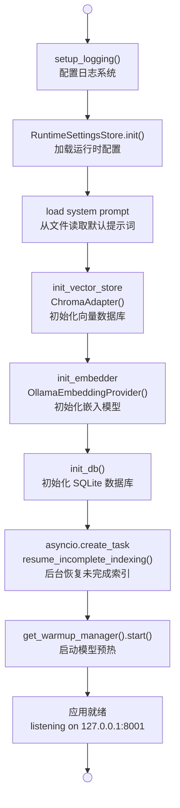
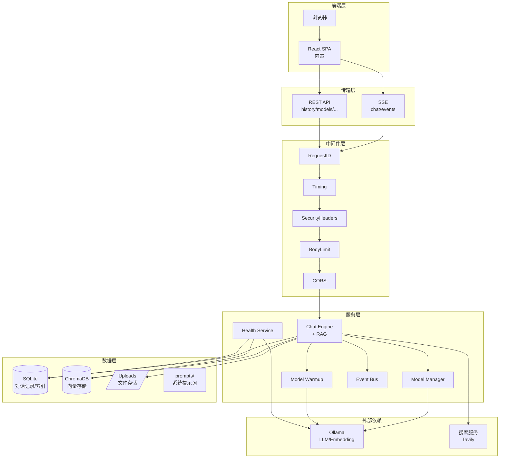

# 第 14 章：部署运维与总结

> 这是本教程的终章。我们将把前面 13 章构建的所有组件串成一条完整的启动流水线，然后讨论生产化部署的真实考量，最后回望我们共同构建了什么，以及接下来可以去哪里。

---

## 14.1 应用启动序列：一条流水线的诞生

按下 `python main.py` 的那一刻，用户看到的只是一个浏览器窗口自动打开。但在这 1.5 秒内，系统内部发生了近 10 步有序初始化。让我们追溯这条流水线。



### 14.1.1 lifespan 函数逐行解析

```python
@asynccontextmanager
async def lifespan(app: FastAPI):
    settings = get_settings()

    # 第 1 步：日志先行
    setup_logging(settings.log_level)

    # 第 2 步：运行时配置存储
    RuntimeSettingsStore.init()

    # 第 3 步：加载系统提示词
    prompt_path = os.path.join(os.path.dirname(__file__), settings.system_prompt_path)
    if os.path.isfile(prompt_path):
        with open(prompt_path, "r", encoding="utf-8") as f:
            settings.system_prompt = f.read()

    # 第 4 步：向量存储就绪
    from services.vector_store import ChromaAdapter
    from services.providers import OllamaEmbeddingProvider
    init_vector_store(ChromaAdapter())

    # 第 5 步：嵌入模型就绪
    init_embedder(OllamaEmbeddingProvider())

    # 第 6 步：数据库初始化
    await init_db()

    # 第 7 步：崩溃恢复（后台任务，不阻塞启动）
    asyncio.create_task(resume_incomplete_indexing())

    # 第 8 步：模型预热
    from services.model_warmup import get_warmup_manager
    await get_warmup_manager().start()

    logger.info("应用启动完成 [model=%s] [rag=%s]",
                settings.ollama_model, get_config("rag_enabled"))

    yield  # ← 应用在此开始接受请求

    # ---- 关闭阶段 ----
    await get_warmup_manager().shutdown()
    await close_db()
    logger.info("应用关闭")
```

**为什么是这个顺序？**

| 顺序 | 步骤 | 原因 |
|------|------|------|
| 1 | 日志 | 后面每一步的日志输出都需要它 |
| 2 | 运行时配置 | 后续组件初始化依赖配置项 |
| 3 | 系统提示词 | 对话功能的核心输入 |
| 4-5 | 向量存储 + 嵌入模型 | RAG 功能的一对基础组件 |
| 6 | 数据库 | 对话记录、文件索引的持久化 |
| 7 | 崩溃恢复 | 依赖数据库已初始化 |
| 8 | 模型预热 | 依赖所有基础组件就绪 |

### 14.1.2 为什么预热在最后？

模型预热是所有初始化中**最有耐心的**——它需要等待 Ollama 把几个 GB 的模型加载到显存。把它放在最后，意味着当预热进行时，应用**已经可以接受请求了**（`yield` 之后）。用户可以在预热完成前就打开界面，看不到明显的"等待启动"体验。

---

## 14.2 崩溃恢复：不丢失任何工作

设想这个场景：用户上传了一份 PDF，系统正在将其文本切片、向量化、存入 ChromaDB——这时应用崩溃了。

重启后怎么办？`resume_incomplete_indexing` 就是答案。

```python
async def resume_incomplete_indexing():
    try:
        from database import get_db, get_incomplete_tasks
        from services.rag_service import index_file

        db = await get_db()
        tasks = await get_incomplete_tasks(db)
        if not tasks:
            return

        logger.info("发现 %d 个未完成的索引任务，正在恢复...", len(tasks))
        for task in tasks:
            file_path = task.get("file_path", "")
            if file_path and os.path.exists(file_path):
                from services.file_service import extract_text
                try:
                    text = extract_text(file_path)
                    await index_file(
                        db, task["session_id"], task["file_name"],
                        text, task_id=task["id"],
                    )
                    logger.info("恢复索引成功: %s", task["file_name"])
                except Exception as e:
                    logger.error("恢复索引失败 %s: %s", task["file_name"], e)
            else:
                from database import mark_failed
                await mark_failed(db, task["id"], "原始文件已不存在")
    except Exception as e:
        logger.warning("恢复索引任务时出错: %s", e)
```

**设计思路**：

1. **标记未完成任务**：数据库中的索引任务有三态：`pending`、`processing`、`completed`。崩溃时，`processing` 状态的任务就是"未完成"的。
2. **幂等恢复**：重新执行索引，如果文件还存在就从头索引；如果文件已被删除，则标记为失败。无论重启多少次，结果都确定。
3. **后台运行**：`asyncio.create_task` 意味着这个恢复不阻塞应用启动——用户可以立即开始使用，索引在后台静默恢复。
4. **全面异常捕获**：单个文件恢复失败不影响其他文件，且不会导致整个启动流程崩溃。

这是一个**工业级实践**：永远不要假设系统不会崩溃，要假设它一定会崩溃，然后设计好恢复路径。

---

## 14.3 静态文件服务：前端与后端的"同居"

本项目是一个全栈应用——FastAPI 既提供 API，又直接托管 React 前端。

```python
# 上传文件静态目录（供前端预览上传的图片/文件）
app.mount("/uploads", StaticFiles(directory=get_settings().upload_dir), name="uploads")

# React 前端构建产物
_fe_dist = os.path.join(os.path.dirname(__file__), "frontend", "dist")
if os.path.isdir(_fe_dist):
    app.mount("/assets", StaticFiles(directory=os.path.join(_fe_dist, "assets")), name="fe_assets")

    @app.get("/", response_class=HTMLResponse)
    async def index_react():
        fe_index = os.path.join(_fe_dist, "index.html")
        if os.path.isfile(fe_index):
            with open(fe_index, "r", encoding="utf-8") as f:
                return HTMLResponse(f.read())
        return HTMLResponse("Frontend not built. Run: cd frontend && npm run build")
```

**路由优先级**：

| 路径 | 处理器 | 用途 |
|------|--------|------|
| `/api/*` | FastAPI 路由 | 所有 REST API |
| `/uploads/*` | StaticFiles | 上传文件预览 |
| `/assets/*` | StaticFiles | React 打包的 JS/CSS/图片 |
| `/` | index_react() | React SPA 入口 |

API 路由通过 `include_router` 挂载，静态文件通过 `mount` 挂载。FastAPI 优先匹配 `include_router` 的路由，所以 `/api/health` 能正常到达，不会被静态文件吞掉。

**开发友好提示**：如果 `frontend/dist` 文件夹不存在（前端没构建），访问根路径会看到 "Frontend not built" 的提示，而不是一个 500 错误。

### start.bat：一键启动

```batch
@echo off
chcp 65001 >nul
title AI Assistant
echo ========================================
echo   AI 智能助手 正在启动...
echo   启动后会自动打开浏览器
echo   关闭此窗口即可停止服务
echo ========================================
cd /d "%~dp0"
python main.py
pause
```

`chcp 65001` 设置控制台编码为 UTF-8，确保中文输出正常显示。

### main.py 自启动浏览器

```python
if __name__ == "__main__":
    import uvicorn, webbrowser, threading

    settings = get_settings()
    port = settings.port  # 8001

    threading.Timer(1.5, lambda: webbrowser.open(f"http://127.0.0.1:{port}")).start()
    uvicorn.run("main:app", host="127.0.0.1", port=port, reload=settings.dev_reload)
```

`threading.Timer(1.5, ...)` 给 uvicorn 1.5 秒启动时间，然后自动打开浏览器。这是一个小设计但对用户体验影响巨大——用户双击 `start.bat` 后不需要做任何事，浏览器会自动弹出助手界面。

---

## 14.4 生产化考量

本项目的目标场景是本地/单机运行，但它已经具备了向生产环境迁移的基础。以下是几个关键的升级方向。

### 14.4.1 从 uvicorn 到 gunicorn + uvicorn workers

单进程 uvicorn 受 GIL 限制，多核 CPU 无法充分利用。生产环境通常这样升级：

```bash
gunicorn main:app \
  --worker-class uvicorn.workers.UvicornWorker \
  --workers 4 \
  --bind 0.0.0.0:8001
```

`--workers 4` 启动 4 个 uvicorn 工作进程（建议 = CPU 核心数 × 2 + 1）。

**注意**：多进程模式下，第 14.5 节的事件总线（基于 `asyncio.Queue`）只在进程内有效。如果需要跨进程事件推送，需要引入 Redis pub/sub 或 WebSocket Broker。

### 14.4.2 Nginx 反向代理

```nginx
server {
    listen 80;
    server_name your-domain.com;

    client_max_body_size 50M;  # 匹配 max_upload_size

    location / {
        proxy_pass http://127.0.0.1:8001;
        proxy_set_header Host $host;
        proxy_set_header X-Real-IP $remote_addr;
        proxy_set_header X-Request-ID $request_id;  # 传递给 RequestIDMiddleware
        proxy_set_header X-Forwarded-For $proxy_add_x_forwarded_for;

        # SSE 长连接支持
        proxy_buffering off;
        proxy_cache off;
        proxy_read_timeout 300s;
    }
}
```

关键配置说明：

- **`proxy_buffering off`**：SSE 要求实时推送，Nginx 默认的缓冲会延迟事件到达。
- **`proxy_read_timeout 300s`**：SSE 是长连接，超时设置要足够长。
- **`X-Request-ID $request_id`**：Nginx 有自己的 `$request_id` 变量，传递给后端的 `RequestIDMiddleware` 实现从前端到后端的全链路追踪。

### 14.4.3 HTTPS 配置

```nginx
server {
    listen 443 ssl http2;
    server_name your-domain.com;

    ssl_certificate /etc/letsencrypt/live/your-domain.com/fullchain.pem;
    ssl_certificate_key /etc/letsencrypt/live/your-domain.com/privkey.pem;

    # ... 其余配置同上
}

server {
    listen 80;
    server_name your-domain.com;
    return 301 https://$host$request_uri;  # HTTP 强制跳转 HTTPS
}
```

推荐使用 Let's Encrypt + Certbot 自动获取和续期免费证书。

### 14.4.4 环境变量管理密钥

`config.py` 已经支持 `.env` 文件和环境变量。生产环境绝对不要将 API key 写在代码里：

```bash
# .env（已加入 .gitignore）
OLLAMA_MODEL=qwen2.5:7b
TAVILY_API_KEY=tvly-xxxxxxxxxxxx
PORT=8001
LOG_LEVEL=WARNING
DEV_RELOAD=false
```

```python
# config.py 中的对应字段
class Settings(BaseSettings):
    tavily_api_key: str = ""
    log_level: str = "INFO"
    port: int = 8001
    dev_reload: bool = False

    model_config = {
        "env_file": ".env",
        "env_file_encoding": "utf-8",
    }
```

pydantic-settings 自动完成：`.env` 文件 → 环境变量的优先级链。`tavily_api_key: str = ""` 意味着不配置也能启动（搜索功能降级但系统可用）。

---

## 14.5 完整架构回顾

当我们站远一点，俯瞰整个项目的架构全景：



---

## 14.6 我们构建了什么

从第 1 章的环境搭建到第 14 章的部署运维，这个项目已经从一个 "hello world" 成长为功能完整、架构清晰的 AI 应用。让我们回顾核心能力清单：

| 章节 | 能力 | 技术关键词 |
|------|------|------------|
| 1-2 | 项目骨架 | FastAPI, pydantic-settings, .env |
| 3 | 数据库层 | SQLite, aiosqlite, 异步 ORM |
| 4 | 模型接入 | Ollama, OpenAI 兼容 API, 流式 SSE |
| 5 | 前端 | React SPA, 消息气泡, 文件上传 |
| 6 | RAG 检索 | ChromaDB, 文档切片, 向量注入 |
| 7 | 语义记忆 | 关键信息抽取, 长期记忆召回 |
| 8 | 文件处理 | PDF/Word/TXT 解析, 自动索引 |
| 9 | 联网搜索 | Tavily/DuckDuckGo, 搜索缓存 |
| 10 | SSE 流式 | 逐 token 推送, 前端打字机效果 |
| 11 | 历史压缩 | 对话历史管理, 上下文窗口 |
| **12** | **中间件** | **全链路追踪, 安全加固, 性能监控** |
| **13** | **模型管理** | **多来源发现, 预热机制, 心跳保持** |
| **14** | **部署运维** | **启动序列, 崩溃恢复, 生产部署** |

### 架构亮点

1. **洋葱模型中件间**：纯 ASGI 的 RequestID、流式解耦的 BodyLimit、纵深防御的 SecurityHeaders——每一层各司其职。

2. **智能预热**：优先级队列 + 单 token 触发 + 自适应心跳，在不占用额外资源的前提下消灭冷启动延迟。

3. **优雅降级**：搜索服务不可用？对话仍然正常。Ollama 挂了？数据库还给力。健康检查用三级状态如实反映降级程度。

4. **崩溃恢复**：索引到一半应用挂了？重启自动续上。文件被删了？标记失败不阻塞。

5. **全栈一体**：单一 `python main.py` 启动，API + 前端 + 静态文件同进程托管，零运维门槛。

---

## 14.7 接下来可以去哪里

这个项目是一个"脚手架"——它提供了完整的骨架，但远不是终点。以下是一些可以探索的方向：

### 功能扩展

- **多模态支持**：接入视觉模型（Ollama 已支持 llava 等），实现"上传图片 + 文字提问"
- **语音交互**：集成 Whisper（语音转文字）+ TTS（文字转语音），实现全语音对话
- **Agent 工具调用**：让模型能调用外部工具（查天气、发邮件、控制智能家居）
- **多会话并行**：多人同时对话，互不干扰（需要 session 隔离升级）
- **插件系统**：允许用户写 Python 脚本扩展助手能力

### 性能优化

- **流式 RAG**：边检索边生成，而非"先检索完再生成"
- **量化模型**：使用 GGUF 量化版本降低显存占用
- **响应缓存**：对相似问题缓存答案
- **消息队列**：将索引任务从 API 线程中解耦

### 运维升级

- **Docker 容器化**：`docker-compose up` 一键启动（含 Ollama + ChromaDB）
- **监控告警**：Prometheus + Grafana 监控 QPS、延迟、显存使用
- **日志审计**：ELK 栈统一收集分析日志

---

## 14.8 学习资源

如果希望继续深入，以下资料值得关注：

- **FastAPI 官方文档**：https://fastapi.tiangolo.com/ — 路由、中间件、依赖注入的完整参考
- **Ollama 文档**：https://github.com/ollama/ollama — 本地运行 LLM 的最佳实践
- **LangChain / LlamaIndex**：两个主流的 LLM 应用框架，适合对比学习
- **ChromaDB 文档**：https://docs.trychroma.com/ — 向量数据库的深入指南
- **《系统设计面试》**：Alex Xu 著 — 帮助你从单机架构过渡到分布式思维

---

## 14.9 写在最后

恭喜你完成了从零搭建一个 AI 智能助手的完整旅程。

回顾第 1 章，你可能还在纠结 `pip install fastapi` 要不要加 `-U`。现在你亲手写出了一个包含中间件洋葱、多模型管理、RAG 检索、流式 SSE、崩溃恢复的全栈应用。

这个过程中最重要的收获不是某个具体的 API 用法，而是：

- **分层思考**：什么放中间件、什么放服务、什么放数据层
- **容错哲学**：假设一切都会失败，设计好恢复路径
- **用户体验优先**：1.5 秒打开浏览器、预热消灭冷启动、降级而非崩溃

代码会过时，框架会换代，但这些设计思路将伴随你的整个编程生涯。

---

*上一章：[第 13 章 · 模型管理与预热](13-模型管理与预热.md)*
