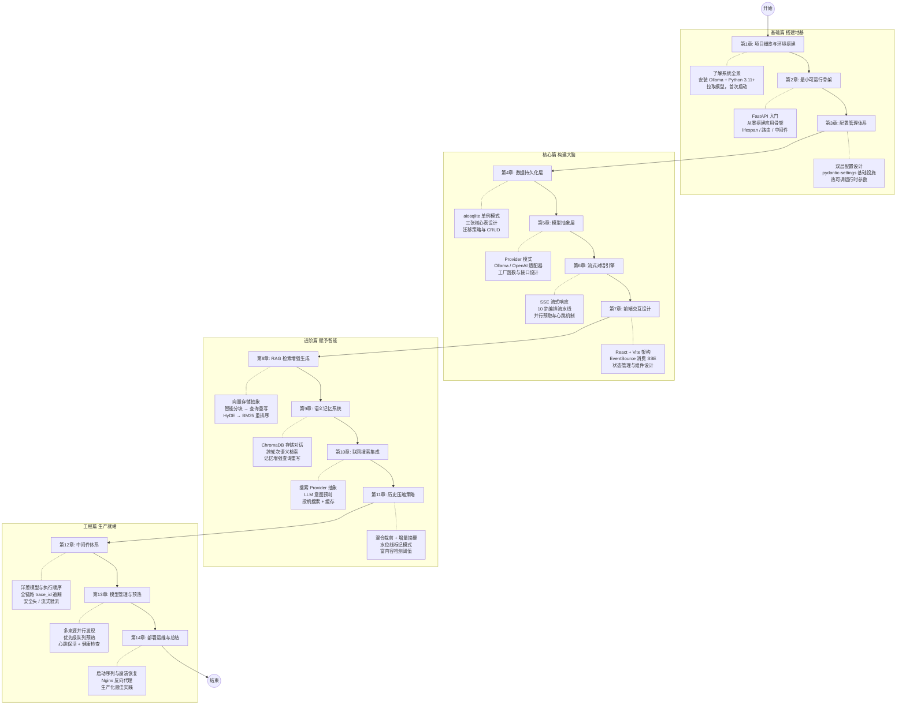

> **English version available**: [tutorial/en/README.md](./en/README.md) — 14 chapters fully translated

# 从零构建AI智能助手 — 基于FastAPI + Ollama + ChromaDB的完整实战教程

> **数据完全本地化** · **模型完全本地运行** · **零外部API依赖即可使用**

## 关于本教程

这是一份面向初学者的实战教程，带你从零开始构建一个功能完备的 AI 智能助手。我们不谈空泛的理论——**每一个概念都对应真实的源代码，每一行代码都是项目中的实战产出**。

完成全部章节后，你将拥有一个：
- 支持 **多轮对话** 的 AI 助手（基于本地 Ollama 模型）
- 支持 **文件上传与 RAG 检索** 的知识库问答系统
- 支持 **语义记忆** 的跨轮次上下文感知
- 支持 **联网搜索** 的实时信息获取能力
- 拥有完整 **React 前端** 的全栈应用

## 学习路径



## 章节导航

### 基础篇：搭建地基

| 章节 | 文件 | 主题 | 难度 |
|------|------|------|------|
| 导读 | [README.md](./README.md) | 教程概述与学习路径 | — |
| 第1章 | [01-项目概览与环境搭建.md](./01-项目概览与环境搭建.md) | 功能总览、架构全景、环境安装 | ⭐ 入门 |
| 第2章 | [02-最小可运行骨架.md](./02-最小可运行骨架.md) | FastAPI 基础、应用骨架从零搭建 | ⭐ 入门 |
| 第3章 | [03-配置管理体系.md](./03-配置管理体系.md) | 双层配置设计、热可调运行时参数 | ⭐⭐ 基础 |

### 核心篇：构建大脑

| 章节 | 文件 | 主题 | 难度 |
|------|------|------|------|
| 第4章 | [04-数据持久化层.md](./04-数据持久化层.md) | aiosqlite 单例、三表设计、迁移与 CRUD | ⭐⭐ 基础 |
| 第5章 | [05-模型抽象层.md](./05-模型抽象层.md) | Provider 模式、Ollama/OpenAI 适配器 | ⭐⭐ 基础 |
| 第6章 | [06-流式对话引擎.md](./06-流式对话引擎.md) | SSE 流式、10 步编排、并行预取 | ⭐⭐⭐ 进阶 |
| 第7章 | [07-前端交互设计.md](./07-前端交互设计.md) | React + Vite、EventSource、状态管理 | ⭐⭐ 基础 |

### 进阶篇：赋予智能

| 章节 | 文件 | 主题 | 难度 |
|------|------|------|------|
| 第8章 | [08-RAG检索增强生成.md](./08-RAG检索增强生成.md) | 向量存储、分块策略、查询重写→HyDE→BM25 | ⭐⭐⭐ 进阶 |
| 第9章 | [09-语义记忆系统.md](./09-语义记忆系统.md) | 对话嵌入存储、跨轮次语义检索 | ⭐⭐⭐ 进阶 |
| 第10章 | [10-联网搜索集成.md](./10-联网搜索集成.md) | 搜索 Provider、LLM 意图预判、投机搜索 | ⭐⭐ 基础 |
| 第11章 | [11-历史压缩策略.md](./11-历史压缩策略.md) | 混合裁剪+增量摘要、水位线模式 | ⭐⭐⭐ 进阶 |

### 工程篇：生产就绪

| 章节 | 文件 | 主题 | 难度 |
|------|------|------|------|
| 第12章 | [12-中间件体系.md](./12-中间件体系.md) | 洋葱模型、全链路追踪、安全头、流式限流 | ⭐⭐⭐ 进阶 |
| 第13章 | [13-模型管理与预热.md](./13-模型管理与预热.md) | 多来源发现、优先级预热、心跳保活 | ⭐⭐⭐ 进阶 |
| 第14章 | [14-部署运维与总结.md](./14-部署运维与总结.md) | 启动序列、崩溃恢复、Nginx、生产部署 | ⭐⭐ 基础 |

## 目标读者

- 具备 **Python 基础**，想学习如何构建 AI 应用的开发者
- 对 **FastAPI** 有基本了解或愿意边学边用的后端工程师
- 想了解 **RAG（检索增强生成）** 落地方案的学习者
- 希望构建 **本地化 AI 工具**（无需云 API）的个人开发者

## 前置条件

在开始之前，你需要准备好：

| 要求 | 说明 |
|------|------|
| **Python 3.11+** | 应用后端语言，需要异步支持 |
| **Git** | 克隆项目源码 |
| **Ollama** | 本地运行 LLM 模型 |
| **至少 8GB 内存** | 运行 qwen3.5 模型的最低要求 |
| **命令行基础** | 会使用终端执行基本命令 |
| **（可选）Node.js 18+** | 如需修改/构建前端 |

### 快速前置检查

```bash
# 检查 Python 版本
python --version  # 需要 >= 3.11

# 检查 Ollama 是否安装
ollama --version

# 检查 Git
git --version
```

## 你将构建什么

完整的项目结构如下——本教程将逐一拆解每个模块的设计思路与实现细节：

```
AI Intelligent Assistant/
├── main.py                  # FastAPI 应用入口
├── config.py                # 基础设施配置（pydantic-settings）
├── runtime_config.py        # 可热加载的运行时配置
├── requirements.txt         # Python 依赖
├── logging_config.py        # 结构化日志配置
├── CONTEXT.md               # 领域语言文档
│
├── middleware/               # ASGI 中间件
│   ├── request_id.py        # 请求ID全链路追踪
│   ├── timing.py            # 请求耗时统计
│   └── security.py          # 安全响应头
│
├── routers/                  # API 路由层
│   ├── chat.py              # 对话接口（SSE流式）
│   ├── history.py            # 会话历史管理
│   ├── index_routes.py       # RAG 索引管理
│   ├── models.py             # 模型发现
│   ├── model_sources.py      # 自定义API来源
│   ├── settings.py           # 运行时配置API
│   ├── events.py             # SSE 事件推送
│   ├── health.py             # 健康检查
│   └── dependencies.py       # 共享依赖注入
│
├── services/                 # 业务逻辑层（核心）
│   ├── stream_engine.py      # SSE 流式对话引擎
│   ├── rag_engine.py         # RAG 检索编排
│   ├── rag_service.py        # RAG 门面
│   ├── chunker.py            # 文本分块
│   ├── indexer.py            # 文件索引器
│   ├── memory.py             # 语义记忆
│   ├── compress.py           # 历史压缩
│   ├── web_search.py         # 联网搜索
│   ├── prompt_builder.py     # 提示词构建
│   └── providers/            # 适配器层
│       ├── model.py          # 模型提供商
│       ├── embedding.py      # 嵌入向量
│       └── search.py         # 搜索提供商
│
├── database/                 # 数据存储层
│   ├── sessions.py           # 会话表操作
│   ├── messages.py           # 消息表操作
│   └── tasks.py              # 索引任务表
│
├── utils/                    # 工具函数
│   ├── json_store.py         # 原子化JSON读写
│   ├── token_counter.py      # Token计数
│   └── http_client.py        # HTTP连接池
│
├── models/schemas.py         # Pydantic 数据模型
├── prompts/default_system.md # 系统提示词模板
├── frontend/                 # React 前端
└── data/                     # 运行时数据目录
```

## 如何使用本教程

### 循序渐进，拒绝跳读

教程采用 **脚手架理论 (Scaffolding Theory)** 设计——每一章都在前一章的基础上增加复杂度。建议按顺序阅读：

1. **第1-3章** 搭建地基：环境、骨架、配置
2. **第4-7章** 构建核心：数据库、模型抽象、对话引擎、前端
3. **第8-11章** 赋予智能：RAG、语义记忆、联网搜索、历史压缩
4. **第12-14章** 生产就绪：中间件、模型预热、部署运维

### 代码与解释并重

每一章都会引用真实项目中的关键代码片段，并配以详细注释。别担心初次看不懂——代码旁边会有"这一段在做什么"的说明。

### 动手实践

每章末尾都留有 **实践任务**，建议在阅读后自己动手尝试。最好的学习方式永远是"敲一遍代码，改一个参数，看看会发生什么"。

### 遇到问题？

- 检查 **环境是否正确安装**（Ollama 是否运行？模型是否已拉取？）
- 查看应用的 **控制台日志**——每条日志都带有请求ID，方便定位问题
- **回退到上一章的最小可用状态**，确认是哪一步引入的问题

## 项目亮点速览

在阅读教程的过程中，请特别关注以下几个**设计亮点**——它们是本项目区别于"玩具项目"的关键：

| 亮点 | 说明 | 相关章节 |
|------|------|----------|
| **双层配置管理** | 基础设施配置（重启生效）与调优参数（热加载）分离 | 第3章 |
| **Provider/Adapter 模式** | 模型、嵌入、搜索全部通过接口抽象，可替换实现 | 第5章 |
| **SSE 流式响应** | 对话回复逐字推送，用户体验流畅 | 第6章 |
| **语义记忆** | 跨轮次语义检索历史消息，不是简单的时间窗口 | 第9章 |
| **混合历史压缩** | trim + LLM 增量摘要，解决长对话 token 爆炸 | 第11章 |
| **RAG 管道** | 查询重写 → 向量检索 → HyDE → BM25 重排序 | 第8章 |
| **原子化持久化** | JSON 配置使用 write-to-tmp + os.replace 确保写入安全 | 第3章 |
| **全链路追踪** | RequestID 从请求到日志全程可追溯 | 第12章 |
| **模型预热管理** | 优先级队列 + 心跳保活，消除冷启动延迟 | 第13章 |

---

准备好了吗？让我们从 [第1章：项目概览与环境搭建](./01-项目概览与环境搭建.md) 开始吧！
