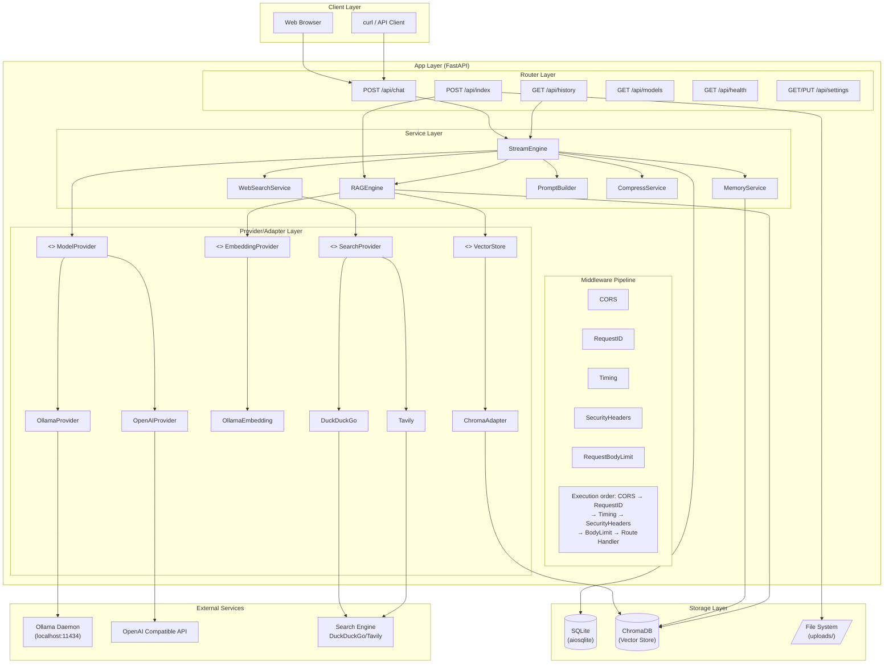

# Chapter 1: Project Overview & Environment Setup

> **Goal of this chapter**: Understand the full picture of the project, set up the development environment, pull models, and launch the application for the first time.

## 1.1 What Are We Building

We are building a **fully local** AI Intelligent Assistant — which means:

- **Chat model** runs on your computer, no internet required (Ollama)
- **Knowledge base** (RAG) is stored in a local vector database (ChromaDB)
- **Conversation history** is saved in a local SQLite database
- **No data** leaves your machine

It has the following core features:

| Feature | Description | Related Modules |
|---------|-------------|-----------------|
| Multi-turn conversation | Streaming dialogue based on local LLM, with SSE real-time push | `stream_engine.py` |
| File knowledge base | Auto-index files after upload, retrieve relevant content during conversation | `rag_engine.py`, `indexer.py` |
| Semantic memory | Automatically recall historical conversations related to the current topic | `memory.py` |
| Web search | On-demand internet search for real-time information | `web_search.py` |
| Hot-reconfigurable parameters | Adjust temperature, top_p, RAG params, etc. without restart | `runtime_config.py` |
| React frontend | Modern web UI, ready out of the box | `frontend/` |

### Usage Scenarios

**Scenario 1: Knowledge Base Q&A**
> You upload a company product manual PDF, then ask: "What is our return policy?"
> The system retrieves relevant paragraphs from the PDF and generates a precise answer combined with the LLM's comprehension.

**Scenario 2: Multi-turn Programming Assistant**
> First ask: "Write a quicksort in Python"
> Then ask: "Add type annotations to it" ← Semantic memory knows what "it" refers to
> Finally: "Can you optimize the space complexity?"

**Scenario 3: Web Research**
> Ask: "What are today's important AI news?"
> The system detects you need real-time information, automatically invokes search, and feeds the results as context to the LLM.

## 1.2 Architecture Overview

Before writing any code, understand the system's overall architecture. This architecture is the "map" for all subsequent chapters:



### Architectural Design Principles

This architecture follows several key design principles that run throughout the project:

**1. Layered Architecture: Clear Responsibilities**

```
Router Layer (routers/)   →  Only handles HTTP validation, calls service layer
Service Layer (services/) →  Contains all business logic
Storage Layer (database/) →  Pure CRUD operations
```

You can clearly see this principle in the code. The router layer functions are very thin:

```python
# routers/chat.py — Router layer only does HTTP validation
@router.post("/chat")
async def chat(body: ChatRequest, db=Depends(db_session)):
    msg_count_before = await database.count_messages(db, body.session_id)
    # HTTP layer validation: truncate message length
    message = body.message
    max_len = get_settings().max_input_length
    if len(message) > max_len:
        message = message[:max_len] + "\n\n[Message too long, truncated]"
    # ... then delegate to service layer
```

**2. Provider/Adapter Pattern: Replaceability**

Models, vector stores, embedding services, search — all abstracted through interfaces. You can replace any component without affecting others:

```python
# services/providers/model.py — Abstract base class
class ModelProvider(ABC):
    @abstractmethod
    async def generate_stream(self, messages, **kwargs) -> AsyncGenerator[str, None]:
        ...

# Concrete implementations can be freely swapped
class OllamaProvider(ModelProvider): ...
class OpenAIProvider(ModelProvider): ...
```

**3. SSE as a First-Class Citizen**

Conversation responses are not returned all at once, but streamed token by token — this requires Server-Sent Events support. From routes to engines, SSE runs through the entire conversation pipeline.

## 1.3 Technology Stack

Let's quickly go over the chosen technologies and the reasoning behind them — understanding "why this was chosen" helps build better technical judgment:

| Technology | Purpose | Why It Was Chosen |
|------------|---------|-------------------|
| **FastAPI** | Web framework | Native async support, auto OpenAPI docs, type safety |
| **Ollama** | Local LLM runtime | One-click install, easy model management, OpenAI API compatible |
| **ChromaDB** | Vector database | Lightweight, Python-native, no extra service required |
| **SQLite + aiosqlite** | Relational database | Zero config, single file, fully async |
| **pydantic-settings** | Config management | Type safe, auto env variable mapping, .env support |
| **MarkItDown** | File text extraction | Unified handling of PDF/Word/PPT/Excel and other formats |
| **rank_bm25** | BM25 re-ranking | Lightweight, pure Python, complements vector search |
| **tiktoken** | Token counting | OpenAI-compatible token counting, controls context length |
| **cachetools** | Caching utilities | Reduces redundant computation (search cache, embedding cache) |

## 1.4 Environment Setup

### 1.4.1 Install Python 3.11+

```bash
# Windows: Download installer from https://www.python.org/downloads/
# Check "Add Python to PATH" during installation

# macOS:
brew install python@3.11

# Linux (Ubuntu/Debian):
sudo apt update
sudo apt install python3.11 python3.11-venv
```

Verify installation:

```bash
python --version
# Output: Python 3.11.x or higher
```

### 1.4.2 Install Ollama

Download the one-click installer for your OS from [ollama.com](https://ollama.com).

Verify installation:

```bash
ollama --version
# Output: ollama version x.x.x
```

### 1.4.3 Pull Models

We recommend **qwen3.5** (Tongyi Qianwen 3.5) — it performs excellently in Chinese conversation and has moderate resource usage:

```bash
# Pull the chat model (approx 4-8GB depending on quantization version)
ollama pull qwen3.5:latest

# Pull the embedding model (for RAG vectorization, approx 1-2GB)
ollama pull bge-m3
```

Verify models are available:

```bash
ollama list
# Should show qwen3.5:latest and bge-m3
```

> **Tip**: If your machine has limited resources, try the smaller quantized versions like `qwen3.5:2b` or `qwen3.5:4b`. Change `ollama_model` in `config.py` to the corresponding name.

### 1.4.4 Clone the Project and Install Dependencies

```bash
# Enter the project directory
cd "c:/Users/xiele/Desktop/AI Intelligent Assistant"

# Create a virtual environment (recommended)
python -m venv venv

# Activate the virtual environment
# Windows:
venv\Scripts\activate
# macOS/Linux:
source venv/bin/activate

# Install dependencies
pip install -r requirements.txt
```

Contents of `requirements.txt`:

```
fastapi>=0.115.0          # Web framework
starlette>=0.40.0         # Starlette ASGI framework
uvicorn[standard]>=0.34.0 # ASGI server
pydantic>=2.0.0           # Data validation
httpx>=0.28.0             # HTTP client
numpy>=1.26.0             # Numerical computing
ollama>=0.4.0             # Ollama Python client
python-multipart>=0.0.9   # File upload parsing
pydantic-settings>=2.0.0  # Config management
aiosqlite>=0.20.0         # Async SQLite
chromadb>=0.5.0           # Vector database
markitdown[all]           # File text extraction
duckduckgo_search>=8.0.0 # Default search engine
cachetools>=5.5.0         # Caching utilities
rank_bm25>=0.2.2          # BM25 algorithm
tiktoken>=0.7.0           # Token counting
```

### 1.4.5 First Launch

Make sure the Ollama service is running:

```bash
# Check Ollama status
ollama list
```

Then start the application:

```bash
# Run from the project root
python main.py
```

You should see log output similar to this:

```
2026-07-05 10:00:00 | INFO     | main                          | Vector store ready: data/chroma_db
2026-07-05 10:00:00 | INFO     | main                          | Embedding provider ready: bge-m3
2026-07-05 10:00:00 | INFO     | main                          | Initializing database...
2026-07-05 10:00:01 | INFO     | main                          | Application startup complete [model=qwen3.5:latest] [rag=True]
```

The browser will automatically open `http://127.0.0.1:8001`, displaying the full web interface.

### 1.4.6 Quick Test

Verify the API with curl:

```bash
# Health check
curl http://127.0.0.1:8001/api/health

# Send the first message
curl -X POST http://127.0.0.1:8001/api/chat \
  -H "Content-Type: application/json" \
  -d '{"session_id": "test-session", "message": "Hello, please introduce yourself"}'
```

If you see streaming SSE events (starting with `data:`), congratulations — your AI Assistant is up and running!

## 1.5 Key Files at a Glance

Before diving into code in Chapter 2, let's first browse a few core files to build an intuitive impression of the project's "skeleton":

| File | Role | Key Content |
|------|------|-------------|
| `main.py` | Application entry point | FastAPI initialization, middleware registration, route mounting, lifespan events |
| `config.py` | Infrastructure configuration | Ollama address, model name, database path, port, etc. |
| `runtime_config.py` | Runtime configuration | temperature, top_p, RAG params and other hot-reconfigurable items |
| `requirements.txt` | Dependency list | Version constraints for all Python packages |
| `prompts/default_system.md` | System prompt | Defines the AI assistant's identity and behavior rules |

### main.py First Look

```python
# Core structure of main.py (simplified)
from fastapi import FastAPI
from contextlib import asynccontextmanager

@asynccontextmanager
async def lifespan(app: FastAPI):
    """Application lifecycle: initialize on startup, cleanup on shutdown"""
    # Startup: initialize database, vector store, warmup...
    await init_db()
    yield  # ← During application runtime
    # Shutdown: cleanup connections
    await close_db()

app = FastAPI(title="AI Intelligent Assistant", version="2.0.0", lifespan=lifespan)

# Register middleware
_register_middleware(app)

# Mount routes
app.include_router(health.router, prefix="/api")
app.include_router(chat.router, prefix="/api")
# ... more routes
```

This structure is the common pattern for all FastAPI applications:
1. Use `lifespan` to manage startup/shutdown logic
2. Register middleware to form the processing pipeline
3. Mount routes to define API endpoints

### System Prompt

`prompts/default_system.md` defines the AI assistant's behavior rules — an important practice in prompt engineering:

```markdown
You are a professional AI Intelligent Assistant running on the user's local device.

## Identity
- Your name is "AI Intelligent Assistant", powered by a local model
- You are not ChatGPT, Claude, Gemini, DeepSeek, or any cloud service
- Do not claim to have internet connectivity or a cloud service identity

## Response Rules
1. Accuracy first: must explicitly state when uncertain or unknown
2. Citations: label sources for knowledge base materials
3. Consistency: responses should be consistent with conversation history
4. Structure: complex responses should use subheadings and lists
5. Language follow: answer in the language the user asks with
```

## 1.6 Practice Tasks

Before moving to the next chapter, complete the following tasks to consolidate your understanding:

1. **Modify the system prompt**: Add a new behavior rule in `prompts/default_system.md`, restart and observe the AI's behavioral changes
2. **Try a different model**: Change `ollama_model` in `config.py` to `qwen3.5:2b` (first run `ollama pull qwen3.5:2b`), compare response quality
3. **View API docs**: After starting the app, visit `http://127.0.0.1:8001/docs` to browse FastAPI's auto-generated Swagger documentation
4. **Explore the directory structure**: Use `ls` or file explorer to view the project directory, find each file against the structure diagram in the README

---

**Next chapter**: [Chapter 2: Minimum Runnable Skeleton](./02-minimum-runnable-skeleton.md) — We'll start with a minimal FastAPI application and gradually understand every line of `main.py`.
