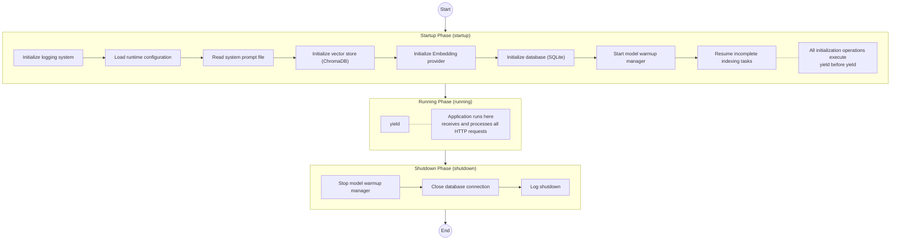
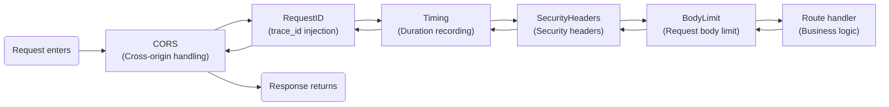
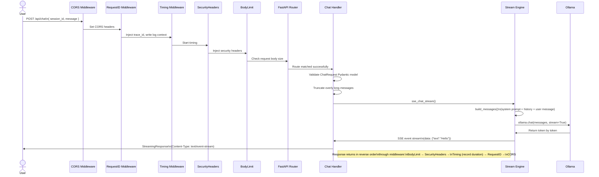

# Chapter 2: Minimum Runnable Skeleton

> **Chapter Objective**: Understand the FastAPI application lifecycle, build the minimum runnable skeleton from scratch, and master route registration and middleware mechanisms.

## 2.1 FastAPI Quick Intro

If you've never used FastAPI before, here's a 30-second overview:

```python
# hello.py — The shortest FastAPI application in the world
from fastapi import FastAPI

app = FastAPI()

@app.get("/")
def root():
    return {"message": "Hello World"}
```

Run it:

```bash
pip install fastapi uvicorn
uvicorn hello:app --reload
```

Visit `http://127.0.0.1:8000` → see the JSON response. Visit `http://127.0.0.1:8000/docs` → see the auto-generated interactive API documentation.

This is the core charm of FastAPI: **type-annotation driven** + **automatic documentation generation** + **native async support**.

## 2.2 Building the Application Skeleton from Scratch

Now let's strip away all the complex features in the project and keep only the core skeleton. We'll build `main.py` in four steps:

### Step 1: Imports and Basic Configuration

```python
"""
AI Intelligent Assistant — Application Entry (Minimum Skeleton)
"""
import os
import asyncio
import logging
from contextlib import asynccontextmanager

from fastapi import FastAPI
from fastapi.responses import HTMLResponse
from fastapi.staticfiles import StaticFiles

logger = logging.getLogger(__name__)
```

Key imports explanation:

| Import | Purpose |
|--------|---------|
| `asynccontextmanager` | Converts an async generator into a context manager, used for lifespan |
| `FastAPI` | Application core class |
| `StaticFiles` | Mount static files (e.g., frontend build artifacts) |
| `HTMLResponse` | Return HTML pages |

### Step 2: lifespan — Application Lifecycle Management

This is one of the most core patterns of a FastAPI application. `lifespan` defines the logic to execute when the application starts and shuts down:

```python
@asynccontextmanager
async def lifespan(app: FastAPI):
    """Application lifecycle management: initialize resources on startup."""
    # ===== Startup Phase (before yield) =====
    logger.info("Application starting...")
    
    # Initialize database
    await init_db()
    logger.info("Database ready")

    # Initialize vector store
    init_vector_store(ChromaAdapter())
    logger.info("Vector store ready")

    # Start model warmup (eliminate cold start latency on first call)
    asyncio.create_task(get_warmup_manager().start())

    logger.info("Application startup complete")

    # ===== Running Phase =====
    yield  # ← Application runs here, receives and processes requests

    # ===== Shutdown Phase (after yield) =====
    await get_warmup_manager().shutdown()
    await close_db()
    logger.info("Application shutdown")
```

The three-stage structure of `lifespan` is a "sandwich":



Corresponding to the actual code in the project (`main.py:70-107`):

```python
@asynccontextmanager
async def lifespan(app: FastAPI):
    settings = get_settings()
    setup_logging(settings.log_level)

    RuntimeSettingsStore.init()

    # Read system prompt
    prompt_path = os.path.join(os.path.dirname(__file__), settings.system_prompt_path)
    if os.path.isfile(prompt_path):
        with open(prompt_path, "r", encoding="utf-8") as f:
            settings.system_prompt = f.read()

    # Initialize vector store and embedding service
    from services.vector_store import ChromaAdapter
    from services.providers import OllamaEmbeddingProvider

    init_vector_store(ChromaAdapter())
    init_embedder(OllamaEmbeddingProvider())

    # Initialize database
    await init_db()

    # Background tasks: resume incomplete indexing + start model warmup
    asyncio.create_task(resume_incomplete_indexing())
    await get_warmup_manager().start()

    logger.info("Application startup complete [model=%s]", settings.ollama_model)

    yield  # ← Critical separation point

    await get_warmup_manager().shutdown()
    await close_db()
    logger.info("Application shutdown")
```

### Step 3: Create Application Instance

```python
app = FastAPI(
    title="AI Intelligent Assistant",
    version="2.0.0",
    lifespan=lifespan,
)
```

All three parameters are straightforward — `title` and `version` are displayed on the auto-generated `/docs` page, and `lifespan` attaches the lifecycle manager defined in the previous step.

### Step 4: Register Middleware

The middleware registration in the project is a standalone function `_register_middleware` (`main.py:116-141`):

```python
def _register_middleware(app: FastAPI) -> None:
    """Register all middleware (note: registration order is opposite to execution order)"""
    settings = get_settings()

    # Innermost: request body size limit
    max_body = settings.max_upload_size + 1024 * 1024
    app.add_middleware(RequestBodyLimitMiddleware, max_size=max_body)

    # Security headers
    app.add_middleware(SecurityHeadersMiddleware)

    # Timing statistics
    app.add_middleware(TimingMiddleware)

    # Request ID (outer layer, injects trace_id first)
    app.add_middleware(RequestIDMiddleware)

    # Outermost: CORS
    app.add_middleware(
        CORSMiddleware,
        allow_origins=settings.cors_origins,
        allow_credentials=True,
        allow_methods=["*"],
        allow_headers=["*"],
    )

_register_middleware(app)
```

**Key Insight: Middleware registration order is opposite to execution order**

FastAPI's `add_middleware` uses a stack-based registration — **the last registered executes first**. In the code above:

| Registration Order | Middleware | Execution Order (on request entry) |
|-------------------|-----------|-----------------------------------|
| 5th add | CORS | ① Executes first |
| 4th add | RequestID | ② |
| 3rd add | Timing | ③ |
| 2nd add | SecurityHeaders | ④ |
| 1st add | BodyLimit | ⑤ Executes last |

This forms an "onion model" — the request passes through each middleware layer from outside in, finally reaching the route handler:



**Why is RequestIDMiddleware implemented in pure ASGI?**

In `middleware/request_id.py`, you can see that `RequestIDMiddleware` is not a subclass of `BaseHTTPMiddleware`, but directly implements the ASGI protocol:

```python
class RequestIDMiddleware:
    def __init__(self, app: ASGIApp) -> None:
        self.app = app

    async def __call__(self, scope: Scope, receive: Receive, send: Send) -> None:
        if scope["type"] != "http":
            await self.app(scope, receive, send)
            return
        # Generate or read request_id
        request_id = uuid.uuid4().hex[:16]
        _trace_id.set(request_id)  # Inject into contextvars
        # Wrap send to inject response headers
        ...
```

The comment says "pure ASGI instead of BaseHTTPMiddleware to avoid contextvars isolation issues caused by anyio subtasks" — this is real-world production experience. `BaseHTTPMiddleware` uses `anyio.create_task_group` which creates a new context and may cause `contextvars` to be lost. The pure ASGI implementation runs directly in the current event loop, preserving the context.

### Step 5: Mount Routes

```python
# API routes (mounted before static files)
app.include_router(health.router, prefix="/api")
app.include_router(chat.router, prefix="/api")
app.include_router(history.router, prefix="/api")
app.include_router(index_routes.router, prefix="/api")
app.include_router(models.router, prefix="/api")
app.include_router(model_sources.router, prefix="/api")
app.include_router(events.router, prefix="/api")
app.include_router(settings.router)  # settings route has its own prefix
```

**Why should routes be mounted before static files?** FastAPI matches routes in registration order. If the static file handler for `/` is registered first, API routes might be incorrectly matched. So always register API routes first, then mount static files.

## 2.3 Running the Application

### Development Mode

```bash
# Method 1: Run directly via main.py (built-in)
python main.py
# Automatically opens the browser after 1.5 seconds

# Method 2: Use uvicorn command line (supports hot reload)
uvicorn main:app --host 127.0.0.1 --port 8001 --reload
```

The run logic in `main.py:172-185`:

```python
if __name__ == "__main__":
    import uvicorn
    import webbrowser
    import threading

    settings = get_settings()
    port = settings.port

    def open_browser():
        webbrowser.open(f"http://127.0.0.1:{port}")

    threading.Timer(1.5, open_browser).start()
    uvicorn.run("main:app", host="127.0.0.1", port=port, reload=settings.dev_reload)
```

The `threading.Timer` delays browser opening by 1.5 seconds — ensuring uvicorn has fully started before accepting connections.

## 2.4 Deep Dive: Minimum Route Example

Let's look at the simplest route — health check (`routers/health.py`):

```python
from fastapi import APIRouter

router = APIRouter(tags=["health"])

@router.get("/health")
async def health_check():
    """Service health check endpoint"""
    result = await health_service.check_all_health()
    return HealthResponse(status=result["overall"], checks=...)
```

Breaking down this route:

| Element | Meaning |
|---------|---------|
| `APIRouter(tags=["health"])` | Create a router, `tags` is used for Swagger doc grouping |
| `@router.get("/health")` | Register a GET request handler |
| `async def` | Async function, does not block the event loop |
| `response_model=HealthResponse` | Pydantic model, FastAPI automatically validates the output format |

**RESTful Conventions**: The project's URL design follows REST style:

| Method | Path | Meaning |
|--------|------|---------|
| `GET` | `/api/health` | Read health status |
| `POST` | `/api/chat` | Create a conversation (send a message) |
| `GET` | `/api/history` | Read session list |
| `DELETE` | `/api/history/{id}` | Delete a specific session |
| `PUT` | `/api/settings` | Update runtime settings |

## 2.5 Database Connection Management

The project uses `aiosqlite` for database operations. The database module (`database/__init__.py`) manages a global singleton connection:

```python
import aiosqlite

_db: aiosqlite.Connection | None = None

async def init_db() -> None:
    """Called once when the application starts"""
    global _db
    db_path = get_settings().db_path
    os.makedirs(os.path.dirname(db_path), exist_ok=True)

    _db = await aiosqlite.connect(db_path)
    _db.row_factory = aiosqlite.Row
    await _db.execute("PRAGMA journal_mode=WAL")  # Enable WAL mode for better concurrency
    await _db.execute("PRAGMA foreign_keys=ON")

    # Initialize table structure
    await init_sessions_table(_db)
    await init_messages_table(_db)
    await init_tasks_table(_db)

async def get_db() -> aiosqlite.Connection:
    """Get the global connection (used by routes via Depends injection)"""
    if _db is None:
        raise RuntimeError("Database not initialized")
    return _db

async def close_db() -> None:
    """Called when the application shuts down"""
    global _db
    if _db:
        await _db.close()
        _db = None
```

Two interesting details:

**WAL mode** (`PRAGMA journal_mode=WAL`): Write-Ahead Logging allows concurrent reads and writes — write operations do not block read operations, which is critical for web applications.

**Dependency Injection**: Routes obtain the database connection through FastAPI's `Depends` mechanism (`routers/dependencies.py`):

```python
from fastapi import Depends
from database import get_db

async def db_session():
    """Inject database connection"""
    return await get_db()

# Usage in routes:
@router.post("/chat")
async def chat(body: ChatRequest, db=Depends(db_session)):
    # db is automatically injected as aiosqlite.Connection
    msg_count = await database.count_messages(db, body.session_id)
```

## 2.6 Complete Request Lifecycle Flow

Let's trace a complete request — from the user sending a message to receiving a reply:



## 2.7 Practice Tasks

1. **Write the minimum skeleton**: Create a new file `minimal.py` containing only a FastAPI instance, one route `@app.get("/ping")`, and a lifespan. Start it with uvicorn and test it
2. **Trace the request ID**: Use browser developer tools to inspect the response headers of any API request, find `X-Request-Id` and `X-Process-Time`
3. **Observe middleware order**: Temporarily swap the registration order of two middlewares in `_register_middleware` and observe the change in startup logs
4. **Explore the API documentation**: Visit `http://127.0.0.1:8001/docs`, try the "Try it out" feature to directly call `/api/health`

---

**Next chapter**: [Chapter 3: Configuration Management System](./03-configuration-management.md) — Why does the project have two sets of configuration systems? How do infrastructure configuration and runtime parameters work together?
