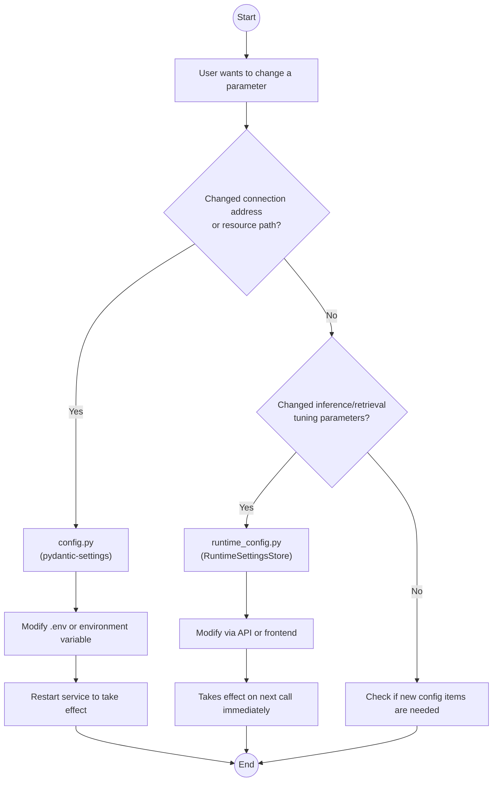
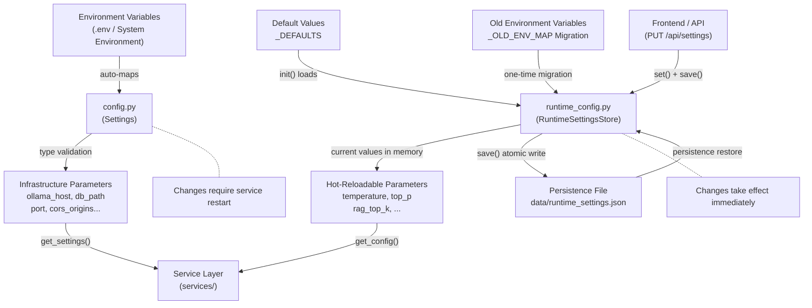

# Chapter 3: Configuration Management System

> **Chapter Goal**: Understand the design philosophy of the project's "two-layer configuration", and master how `config.py` (infrastructure configuration) and `runtime_config.py` (hot-reloadable parameters) work together.

## 3.1 Why a Two-Layer Configuration

Most projects treat configuration as a "hodgepodge" — all parameters crammed into a single file, and changing even the temperature requires a service restart. This project adopts a **two-layer configuration** design, dividing configuration into two categories:

| Layer | File | Characteristic | What It Contains |
|------|------|------|----------|
| **Infrastructure Configuration** | `config.py` | Takes effect on restart | Model address, database path, port, CORS, etc. |
| **Runtime Configuration** | `runtime_config.py` | Hot-reloadable | temperature, top_p, RAG parameters, search parameters, etc. |

**Core Design Question**: Which of these parameters require a restart, and which can be adjusted in real time?

```
ollama_host = "http://localhost:11434"    ← Change this, can we avoid restart?
temperature = 0.3                          ← Change this, must restart?
db_path = "data/chat.db"                   ← What about this?
rag_top_k = 5                              ← What about this?
```

Intuitively — changing connection addresses and database paths requires a restart (resources are already initialized), while inference parameters and retrieval parameters are simply "use the new value next time they're called" and don't need a restart.

This is precisely the **design intuition** behind the two-layer configuration:



## 3.2 config.py: Infrastructure Configuration

`config.py` uses **pydantic-settings** to achieve type-safe configuration management. The core capabilities of pydantic-settings:

- **Automatic environment variable mapping**: class attribute `ollama_host` automatically maps to environment variable `OLLAMA_HOST`
- **.env file support**: fill in `.env` during development, override with real environment variables in production
- **Type validation**: configuration errors are caught at startup, not at runtime crashes

### Full Implementation

```python
"""
Application configuration module
Uses pydantic-settings to manage all configuration items, supporting:
- Environment variable override (auto-mapping, e.g., OLLAMA_HOST)
- .env file loading
- Type validation and default values
"""
import os
from pydantic import BaseModel
from pydantic_settings import BaseSettings


class ModelSourceConfig(BaseModel):
    """Model source configuration (nested model)"""
    name: str
    label: str = ""
    type: str = "ollama"
    base_url: str = ""
    api_key: str = ""


class Settings(BaseSettings):
    """Application global configuration"""

    # ── Ollama Connection ──
    ollama_host: str = "http://localhost:11434"
    ollama_model: str = "qwen3.5:latest"
    ollama_timeout: int = 300
    ollama_keep_alive: str = "-1"  # -1 means keep permanently
    ollama_num_ctx: int = 20480    # Context window size
    ollama_num_batch: int = 2048   # Batch size

    # ── Conversation ──
    max_input_length: int = 2000
    system_prompt_path: str = "prompts/default_system.md"
    system_prompt: str = ""  # Read from file at startup

    # ── File Upload ──
    upload_dir: str = "uploads"
    max_upload_size: int = 30 * 1024 * 1024  # 30MB

    # ── Database ──
    db_path: str = "data/chat.db"

    # ── RAG Infrastructure ──
    rag_distance_metric: str = "cosine"
    embedding_model: str = "bge-m3"
    chroma_persist_dir: str = "data/chroma_db"

    # ── Semantic Memory ──
    memory_enabled: bool = True

    # ── Web Search ──
    search_provider: str = "duckduckgo"
    search_cache_ttl: int = 300  # Search cache TTL (seconds)
    web_search_precheck: bool = True
    tavily_api_key: str = ""

    # ── Model Management ──
    model_sources: list[ModelSourceConfig] = [
        ModelSourceConfig(name="ollama", label="Local Ollama", type="ollama"),
    ]

    # ── Service ──
    log_level: str = "INFO"
    cors_origins: list[str] = ["*"]
    port: int = 8001
    dev_reload: bool = False  # Dev mode hot-reload

    model_config = {
        "env_file": ".env",
        "env_file_encoding": "utf-8",
        "env_ignore_empty": True,
    }


# ── Singleton Access ──
_settings: Settings | None = None

def get_settings() -> Settings:
    """Get global Settings singleton."""
    global _settings
    if _settings is None:
        _settings = Settings()
    return _settings
```

### The Magic of pydantic-settings

See how it works. Suppose you create a `.env` file:

```env
# .env
OLLAMA_HOST=http://192.168.1.100:11434
OLLAMA_MODEL=qwen3.5:14b
PORT=9000
LOG_LEVEL=DEBUG
TAVILY_API_KEY=tvly-xxxxxxxxxxxxxxxx
```

pydantic-settings will automatically:

1. Read key-value pairs from the `.env` file
2. Map `OLLAMA_HOST` to `Settings.ollama_host`
3. Map `PORT` to `Settings.port`
4. Perform type conversion (string `"9000"` → integer `9000`)
5. **Environment variables take precedence over `.env` file** (this is a security best practice)

### Nested Configuration: ModelSourceConfig

One notable design in the project — nested Pydantic models as configuration items:

```python
class ModelSourceConfig(BaseModel):
    name: str
    label: str = ""
    type: str = "ollama"
    base_url: str = ""
    api_key: str = ""

class Settings(BaseSettings):
    model_sources: list[ModelSourceConfig] = [
        ModelSourceConfig(name="ollama", label="Local Ollama", type="ollama"),
    ]
```

This allows users to configure multiple model sources in JSON format within `.env`:

```env
MODEL_SOURCES='[{"name":"deepseek","label":"DeepSeek","type":"openai","base_url":"https://api.deepseek.com/v1","api_key":"sk-xxx"}]'
```

pydantic-settings will automatically deserialize the JSON string into `list[ModelSourceConfig]`.

## 3.3 runtime_config.py: Hot-Reloadable Parameters

`runtime_config.py` is designed completely differently from `config.py` — it does not use pydantic-settings, but instead implements its own **class-level Store**:

```python
"""
Runtime configuration — single authoritative source for tuning parameters.
All hot-reloadable inference/RAG/search parameters are centralized in RuntimeSettingsStore.
config.Settings is only responsible for infrastructure parameters.
"""
import os
import logging
from typing import Any
from utils.json_store import atomic_json_write, atomic_json_read

logger = logging.getLogger(__name__)
```

### Default Values Dictionary

```python
_DEFAULTS: dict[str, Any] = {
    # Inference parameters
    "temperature": 0.3,
    "top_p": 0.9,
    "max_context_tokens": 20480,
    "max_history_messages": 40,
    "max_output_tokens": 4096,

    # RAG parameters
    "rag_enabled": True,
    "rag_chunk_size": 800,
    "rag_chunk_overlap": 200,
    "rag_top_k": 3,
    "rag_score_threshold": 0.35,
    "rag_query_rewrite": True,
    "rag_hyde_enabled": True,
    "rag_hyde_max_tokens": 150,
    "rag_candidate_k": 20,
    "rag_bm25_weight": 0.4,

    # Search parameters
    "search_max_results": 5,
    "search_max_context_tokens": 4000,
}

_TYPES: dict[str, type] = {k: type(v) for k, v in _DEFAULTS.items()}
```

The `_TYPES` dictionary is quite useful — it automatically infers types from the values in `_DEFAULTS`, used for subsequent type coercion.

### RuntimeSettingsStore Class

```python
class RuntimeSettingsStore:
    _data: dict[str, Any] = {}
    _persist_path: str = "data/runtime_settings.json"

    @classmethod
    def init(cls) -> None:
        """Called at startup: initialize defaults + load persisted data"""
        cls._data = dict(_DEFAULTS)

        runtime_file_exists = os.path.isfile(cls._persist_path)
        cls._load()  # Load from file to override defaults

        # One-time migration: migrate tuning parameters from legacy .env to JSON file
        if not runtime_file_exists:
            migrated = False
            for env_key, runtime_key in _OLD_ENV_MAP.items():
                env_val = os.environ.get(env_key)
                if env_val is not None:
                    cls._data[runtime_key] = cls._coerce(runtime_key, env_val)
                    migrated = True
            if migrated:
                logger.info("Migrated %d runtime settings from environment variables", ...)

    @classmethod
    def get(cls, key: str, default: Any = None) -> Any:
        return cls._data.get(key, default)

    @classmethod
    def set(cls, key: str, value: Any) -> None:
        cls._data[key] = cls._coerce(key, value)

    @classmethod
    def all(cls) -> dict[str, Any]:
        return dict(cls._data)

    @classmethod
    def save(cls) -> None:
        """Persist to JSON file"""
        atomic_json_write(cls._persist_path, cls._data)
```

### Type Coercion

The `_coerce` method ensures values passed from environment variables or the API are properly type-converted:

```python
@classmethod
def _coerce(cls, key: str, value: Any) -> Any:
    expected = _TYPES.get(key)
    if expected is None:
        return value
    if isinstance(value, expected):
        return value
    # Boolean special handling
    if expected is bool:
        if isinstance(value, str):
            return value.lower() in ("true", "1", "yes")
        return bool(value)
    # Attempt direct conversion
    try:
        return expected(value)
    except (ValueError, TypeError):
        return _DEFAULTS.get(key, value)
```

For example, `"true"` → `True`, `"0.7"` → `0.7`, `"5"` → `5` — strings passed by the user through the API are correctly converted.

### Legacy Configuration Migration

`_OLD_ENV_MAP` is a migration dictionary — it migrates tuning parameters that were managed via environment variables in older versions to the new JSON persistence system:

```python
_OLD_ENV_MAP: dict[str, str] = {
    "OLLAMA_TEMPERATURE": "temperature",
    "OLLAMA_TOP_P": "top_p",
    "MAX_OUTPUT_TOKENS": "max_output_tokens",
    "RAG_ENABLED": "rag_enabled",
    # ... more mappings
}
```

This code demonstrates **backward compatibility design awareness** — defining mappings from old config to new config, automatically migrating at startup to prevent users from losing settings after upgrading.

### Convenience Access Function

```python
def get_config(key: str):
    """Read tuning parameter: prefer runtime settings, fall back to _DEFAULTS."""
    val = RuntimeSettingsStore.get(key)
    if val is not None:
        return val
    return _DEFAULTS.get(key)
```

This function is widely used in the service layer. For example in `rag_engine.py`:

```python
from runtime_config import get_config

top_k = get_config("rag_top_k")       # Read hot-reloadable top_k
threshold = get_config("rag_score_threshold")  # Read relevance score threshold
```

## 3.4 Collaboration Between the Two Configurations

Let's look at how the two configurations work together in actual code. Take the streaming conversation engine `stream_engine.py` as an example:

```python
from config import get_settings      # Infrastructure configuration
from runtime_config import get_config  # Runtime configuration

# Infrastructure configuration: Ollama connection
settings = get_settings()
model = settings.ollama_model        # Takes effect on restart

# Runtime configuration: inference parameters
temperature = get_config("temperature")  # Hot-reloadable
top_p = get_config("top_p")              # Hot-reloadable

# Assemble call parameters
options = {
    "temperature": temperature,  # from runtime_config
    "top_p": top_p,              # from runtime_config
    "num_ctx": settings.ollama_num_ctx,  # from config
}
```

## 3.5 Atomic Persistence: Why It Matters

The `save()` method in `runtime_config.py` uses `atomic_json_write`, an underappreciated safety design:

```python
def atomic_json_write(path: str, data: object) -> None:
    """Atomically write JSON file (.tmp → os.replace), preventing file corruption on crash."""
    os.makedirs(os.path.dirname(path) or ".", exist_ok=True)
    tmp_path = path + ".tmp"
    try:
        with open(tmp_path, "w", encoding="utf-8") as f:
            json.dump(data, f, ensure_ascii=False, indent=2)
            f.flush()
            os.fsync(f.fileno())       # ← Ensure data is written to disk
        os.replace(tmp_path, path)      # ← Atomic replacement
    except Exception as e:
        logger.warning("JSON write failed %s: %s", path, e)
        if os.path.exists(tmp_path):
            try:
                os.remove(tmp_path)
            except OSError:
                pass
```

Key steps:
1. **Write to a temporary file first**: if a crash occurs during writing, only the `.tmp` file is corrupted
2. **fsync to disk**: ensures data is actually written to disk rather than sitting in OS cache
3. **Atomic replacement**: `os.replace()` is an atomic operation — either the old file or the new file exists, never a "half-written" state

Compare the risk of the "naive approach":

```python
# Dangerous approach: if a crash occurs between these two lines...
with open(path, "w") as f:
    json.dump(data, f)
    # ← Crash! File content is incomplete
```

## 3.6 Configuration Flow Overview



## 3.7 Logging Configuration: A Special Case

`logging_config.py` sits somewhere between infrastructure and runtime — the log level is defined in `config.py` (takes effect on restart), but the log format, trace_id injection mechanism are application-level foundational settings:

```python
import contextvars
import logging

_trace_id: contextvars.ContextVar[str] = contextvars.ContextVar("trace_id", default="")

TRACE_FORMAT = (
    "%(asctime)s | %(levelname)-8s | %(name)-30s | %(trace_id)s%(message)s"
)

class TraceFilter(logging.Filter):
    """Read trace_id from contextvars and inject it into every log record."""
    def filter(self, record: logging.LogRecord) -> bool:
        tid = _trace_id.get()
        record.trace_id = f"[{tid}] " if tid else ""
        return True

def setup_logging(level: str = "INFO") -> None:
    """Called once at application startup"""
    root = logging.getLogger()
    root.setLevel(getattr(logging, level.upper(), logging.INFO))

    for handler in root.handlers[:]:
        root.removeHandler(handler)

    console = logging.StreamHandler(sys.stdout)
    console.setFormatter(logging.Formatter(TRACE_FORMAT, datefmt="%Y-%m-%d %H:%M:%S"))
    console.addFilter(TraceFilter())
    root.addHandler(console)

    # Reduce log noise from third-party libraries
    logging.getLogger("httpx").setLevel(logging.WARNING)
    logging.getLogger("uvicorn.access").setLevel(logging.WARNING)
```

The startup call chain: `lifespan → setup_logging(settings.log_level)`, where `log_level` comes from `config.py`.

**Why use contextvars?** Because in an async environment, `threading.local` doesn't work — the same thread may handle multiple concurrent requests. `contextvars.ContextVar` is a coroutine-safe context variable provided by Python 3.7+, where each asyncio Task has its own context. `RequestIDMiddleware` sets it, `TraceFilter` reads it — a perfect match.

## 3.8 How to Add Your Own Configuration Items

Now that you understand the two-layer configuration pattern, adding new config items is straightforward. Suppose you want to add a toggle for "enable streaming response":

### Requires Restart → Add to config.py

```python
class Settings(BaseSettings):
    # ... existing config ...
    enable_streaming: bool = True  # Newly added
```

### Hot-Reloadable → Add to runtime_config.py

```python
_DEFAULTS: dict[str, Any] = {
    # ... existing config ...
    "enable_streaming": True,  # Newly added
}
```

Then modify via API:

```bash
curl -X PUT http://127.0.0.1:8001/api/settings \
  -H "Content-Type: application/json" \
  -d '{"enable_streaming": false}'
```

Read in the service layer:

```python
from runtime_config import get_config
streaming_enabled = get_config("enable_streaming")
```

## 3.9 Practice Tasks

1. **Create `.env` file**: Create `.env` in the project root, set `PORT=9000` and `LOG_LEVEL=DEBUG`, then restart and observe the port and log level changes
2. **Modify runtime parameters**: Adjust `temperature` to `0.8` via the frontend interface or API, send the same question and observe the change in response style
3. **Inspect persistence file**: Open `data/runtime_settings.json` and observe how modified parameters are saved
4. **Understand atomic writes**: Find `utils/json_store.py`, compare the difference between "naive write" and "atomic write", and think about which scenarios atomic writes prevent data corruption
5. **Breakpoint test**: Change `ollama_model` in `config.py` to a non-existent model name and observe startup behavior — what error does pydantic-settings report? (Actually, it won't report an error because model availability is checked at runtime — think about what this means for configuration validation)

---

**Next Chapter**: Chapter 4: Routing Layer and SSE Streaming Conversation (Coming Soon) — Dive into `routers/chat.py` and `services/stream_engine.py`, understanding the complete SSE streaming conversation pipeline.
