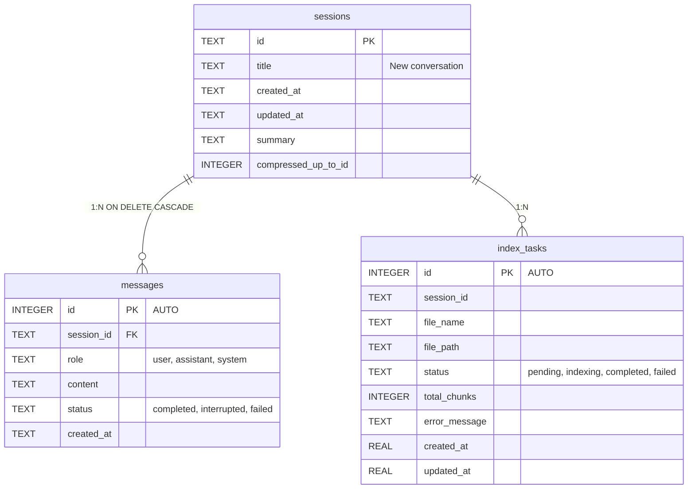

# Chapter 4: Data Persistence Layer

In the first three chapters, we completed project setup, a minimal runnable skeleton, and a two-tier configuration system. The basic framework of an AI assistant is in place — but it has no "memory". Every time it restarts, all conversations disappear.

This chapter will guide you through injecting a "brain memory system" into the AI assistant: building a lightweight yet complete data persistence layer using **SQLite + aiosqlite**.

## 4.1 Why SQLite?

When designing a local AI assistant, the database choice is a critical decision. We have several options:

| Option | Advantage | Disadvantage |
|--------|-----------|--------------|
| PostgreSQL / MySQL | Full-featured, strong concurrency | Requires separate installation and maintenance, too heavy |
| JSON files | Zero-config, human-readable | No query capability, poor performance with large files, no concurrency safety |
| **SQLite** | Zero-config, single file, standard SQL | Limited write concurrency (but sufficient for single-user local apps) |

SQLite is an embedded relational database engine — its database is a single file. For a single-user, low-concurrency scenario like a local AI assistant, SQLite is almost a **perfect choice**:

1. **Zero configuration**: No need to install a database server, just `pip install aiosqlite`
2. **Single file storage**: All conversations and messages are stored in one `.db` file, easy to backup and migrate
3. **Standard SQL**: Supports JOIN, subqueries, indexes — far more powerful than manual file I/O
4. **Transaction support**: Guarantees data consistency, no half-written crashes
5. **WAL mode**: Write-Ahead Logging allows concurrent reads and writes, significantly improving performance

> **Design insight**: Local applications don't need MySQL. Many developers habitually add PostgreSQL to their projects, but this is often an over-investment in complexity. SQLite handles trillions of queries every year, which is more than enough for most local scenarios.

## 4.2 aiosqlite: Async SQLite

Python's standard library `sqlite3` is **synchronous** and blocks the event loop. For async frameworks like FastAPI, we need `aiosqlite`, which executes SQLite operations in a thread pool and returns control to the event loop:

```python
import aiosqlite

# Synchronous (blocks event loop) ❌
import sqlite3
conn = sqlite3.connect("data.db")

# Asynchronous (non-blocking) ✅
conn = await aiosqlite.connect("data.db")
await conn.execute("SELECT * FROM sessions")
```

`aiosqlite` has an API very similar to the standard library, making the learning curve nearly zero, while supporting `await`, context managers, row factories, and all other common features.

## 4.3 Database Singleton Design

Our design philosophy is: **create a single global connection when the application starts, reuse it throughout the lifecycle, and release it on shutdown.** This is far more efficient than creating/closing connections for every operation, and avoids the complexity of connection management.

```python
# database/__init__.py (core structure)

_db: aiosqlite.Connection | None = None  # global singleton

def _db_path() -> str:
    """Read database file path from config"""
    return get_settings().db_path

async def init_db() -> None:
    """Called once at app startup, initialize connection and table structure"""
    global _db
    db_path = _db_path()
    os.makedirs(os.path.dirname(db_path), exist_ok=True)

    _db = await aiosqlite.connect(db_path)
    _db.row_factory = aiosqlite.Row
    await _db.execute("PRAGMA journal_mode=WAL")
    await _db.execute("PRAGMA foreign_keys=ON")

    await init_sessions_table(_db)
    await init_messages_table(_db)
    await init_tasks_table(_db)

    await _db.commit()

async def close_db() -> None:
    """Called on app shutdown"""
    global _db
    if _db:
        await _db.close()
        _db = None

async def get_db() -> aiosqlite.Connection:
    """Get global connection, create if not exists"""
    if _db is None:
        raise RuntimeError("Database not initialized, call init_db() first")
    return _db
```

### Key Design Points

**1. `row_factory = aiosqlite.Row`**

This allows us to access query results using `row["column_name"]` instead of magic numbers like `row[0]`:

```python
cursor = await db.execute("SELECT id, title FROM sessions")
row = await cursor.fetchone()
print(row["title"])  # clear and readable
# vs
print(row[1])       # what is this? a maintainer's nightmare
```

**2. WAL Mode**

`PRAGMA journal_mode=WAL` enables Write-Ahead Logging. In the default DELETE mode, a write operation blocks all reads; in WAL mode, reads and writes can proceed concurrently. For a chat application that needs to simultaneously read historical messages and save new ones, this is a key performance guarantee.

**3. Foreign Key Constraints**

`PRAGMA foreign_keys=ON` ensures that when a session is deleted, its associated messages are also cascade-deleted (via `ON DELETE CASCADE`), maintaining data integrity.

**4. Modular Table Initialization**

Each table's DDL and migration logic is encapsulated in its own module (`database/sessions.py`, `database/messages.py`, etc.), avoiding circular dependencies through lazy imports. `init_db()` only orchestrates the call order.

**5. Re-exporting Keeps the API Clean**

```python
# database/__init__.py lower level
from database.sessions import (
    create_session, get_sessions, get_session,
    rename_session, delete_session, search_sessions,
)
from database.messages import (
    save_message, delete_message, get_messages,
    count_messages, get_last_user_message, ...
)
```

This way, business code only needs `from database import get_sessions` without caring about which submodule defines the function.

## 4.4 Table Design Details

The project builds its data model around three core tables. Their relationships are as follows:



### 4.4.1 sessions Table — Conversation Container

Each conversation is a session, similar to a "chat" in ChatGPT. Core fields:

- `id`: UUID string, uniquely identifies a session
- `title`: Session title, initially "New conversation", auto-generated after the first message
- `created_at` / `updated_at`: Timestamps, used for sorting and display
- `summary`: Historical summary cache (core of the compression strategy, see Section 6.3)
- `compressed_up_to_id`: Compression watermark, marking "messages before this ID have been compressed into summary"

```sql
CREATE TABLE IF NOT EXISTS sessions (
    id          TEXT PRIMARY KEY,
    title       TEXT NOT NULL DEFAULT 'New conversation',
    created_at  TEXT NOT NULL DEFAULT (datetime('now', 'localtime')),
    updated_at  TEXT NOT NULL DEFAULT (datetime('now', 'localtime'))
);
```

### 4.4.2 messages Table — Conversation Content

Each user utterance and AI reply is a message:

- `id`: Auto-incrementing primary key (ordered by sending sequence, naturally sorted)
- `session_id`: Foreign key referencing sessions
- `role`: `user` / `assistant` / `system`, validated via CHECK constraint
- `content`: Message text
- `status`: `completed` (normal completion) / `interrupted` (user interruption) / `failed` (abnormal termination)

```sql
CREATE TABLE IF NOT EXISTS messages (
    id          INTEGER PRIMARY KEY AUTOINCREMENT,
    session_id  TEXT NOT NULL,
    role        TEXT NOT NULL CHECK(role IN ('user', 'assistant', 'system')),
    content     TEXT NOT NULL,
    status      TEXT NOT NULL DEFAULT 'completed'
                CHECK(status IN ('completed', 'interrupted', 'failed')),
    created_at  TEXT NOT NULL DEFAULT (datetime('now', 'localtime')),
    FOREIGN KEY (session_id) REFERENCES sessions(id) ON DELETE CASCADE
);
```

Recommended index design:

```sql
-- Session message list query (highest frequency operation)
CREATE INDEX idx_messages_session ON messages(session_id, created_at);
-- Query by role (get last user message, etc.)
CREATE INDEX idx_messages_session_role ON messages(session_id, role, id);
-- Query by status (find interrupted/failed messages)
CREATE INDEX idx_messages_status ON messages(status);
```

### 4.4.3 index_tasks Table — File Index Tracking

After uploading a file, the system needs to chunk the file content, generate embeddings, and store them in a vector database in the background. `index_tasks` tracks the entire indexing lifecycle:

```
pending → indexing → completed
                   → failed
```

```sql
CREATE TABLE IF NOT EXISTS index_tasks (
    id              INTEGER PRIMARY KEY AUTOINCREMENT,
    session_id      TEXT NOT NULL,
    file_name       TEXT NOT NULL,
    file_path       TEXT NOT NULL DEFAULT '',
    status          TEXT NOT NULL DEFAULT 'pending',
    total_chunks    INTEGER DEFAULT 0,
    error_message   TEXT,
    created_at      REAL NOT NULL,
    updated_at      REAL NOT NULL
);
```

Note that here the `REAL` type is used for timestamps (`time.time()` floating-point value) instead of TEXT. This is a pragmatic trade-off: for high-frequency update scenarios like task tracking, floating-point comparison is faster than string comparison, and sub-millisecond precision is not required.

### CRUD Operation Example

Using sessions as an example, the typical CRUD pattern:

```python
# Create
async def create_session(db: aiosqlite.Connection, title: str = "New conversation") -> str:
    session_id = str(uuid.uuid4())
    await db.execute(
        "INSERT INTO sessions (id, title) VALUES (?, ?)",
        (session_id, title),
    )
    await db.commit()
    return session_id

# Query list (descending by update time)
async def get_sessions(db: aiosqlite.Connection) -> list[dict]:
    cursor = await db.execute(
        "SELECT id, title, created_at, updated_at FROM sessions ORDER BY updated_at DESC"
    )
    rows = await cursor.fetchall()
    return [dict(r) for r in rows]

# Search (combined title + message content search)
async def search_sessions(db, query: str, limit: int = 20) -> list[dict]:
    cursor = await db.execute(
        """SELECT id, title, created_at, updated_at FROM sessions WHERE title LIKE ?
           UNION
           SELECT id, title, created_at, updated_at FROM sessions
           WHERE id IN (SELECT session_id FROM messages WHERE content LIKE ?)
           ORDER BY updated_at DESC LIMIT ?""",
        (f"%{query}%", f"%{query}%", limit),
    )
    return [dict(r) for r in await cursor.fetchall()]
```

> **Design highlight**: `search_sessions` uses UNION to jointly search titles and message content, allowing users to match both conversation titles and content with a single keyword, greatly improving the efficiency of finding historical conversations.

## 4.5 Smart Migration Strategy

SQLite's `ALTER TABLE` capabilities are limited — it cannot modify existing column definitions, but it can **add new columns**. Our project leverages this with a `try/except` approach to implement **painless incremental migration**:

```python
# database/sessions.py
async def init_sessions_table(db: aiosqlite.Connection) -> None:
    # 1. First create the base table (IF NOT EXISTS guarantees idempotency)
    await db.execute("""CREATE TABLE IF NOT EXISTS sessions (
        id TEXT PRIMARY KEY, title TEXT, created_at TEXT, updated_at TEXT
    )""")

    # 2. Try to add new columns — silently skip if they already exist
    try:
        await db.execute("ALTER TABLE sessions ADD COLUMN summary TEXT DEFAULT ''")
        await db.commit()
    except Exception:
        pass  # Column already exists, no action needed

    try:
        await db.execute("ALTER TABLE sessions ADD COLUMN compressed_up_to_id INTEGER DEFAULT NULL")
        await db.commit()
    except Exception:
        pass
```

### Why not define all columns directly in `CREATE TABLE`?

This is a clever design choice. Suppose the initial table only has 4 base columns:

```sql
CREATE TABLE IF NOT EXISTS sessions (id TEXT, title TEXT, created_at TEXT, updated_at TEXT);
```

The user creates 100 sessions using v1.0, then upgrades to v1.1 (which needs to add the `summary` column). At this point, `CREATE TABLE IF NOT EXISTS` **silently skips** (the table already exists), and the new column is never added. However, `ALTER TABLE ADD COLUMN IF NOT EXISTS` is not standard SQL, nor does SQLite support it.

So we use `try/except` as a workaround: try ALTER, and if it fails because the column already exists, ignore the error. **This pattern allows both old and new databases to upgrade smoothly**, without requiring users to manually run any migration scripts.

> **Migration honesty check**: Although `try/except Exception` has a broad scope and is not strictly precise, in SQLite `ALTER TABLE ADD COLUMN` will only error because "the column already exists" — this is a relatively safe "duck judgment". If you are a perfectionist, you can check the error message content, but in practice, the simplicity of a broad catch is worth this small imprecision.

## 4.6 Hands-on Practice: Adding a New Table

Suppose we want to add a "user preferences" feature to the system, allowing each session to record custom settings (such as model temperature, response length, etc.). Let's add a `session_preferences` table in the actual code.

### Step 1: Create `database/preferences.py`

```python
import aiosqlite

async def init_preferences_table(db: aiosqlite.Connection) -> None:
    await db.execute("""
        CREATE TABLE IF NOT EXISTS session_preferences (
            session_id  TEXT PRIMARY KEY,
            temperature REAL DEFAULT 0.7,
            max_tokens  INTEGER DEFAULT 2048,
            top_p       REAL DEFAULT 0.9,
            FOREIGN KEY (session_id) REFERENCES sessions(id) ON DELETE CASCADE
        )
    """)

async def get_preferences(db: aiosqlite.Connection, session_id: str) -> dict:
    cursor = await db.execute(
        "SELECT * FROM session_preferences WHERE session_id = ?", (session_id,)
    )
    row = await cursor.fetchone()
    if row:
        return dict(row)
    # Return default values
    return {"session_id": session_id, "temperature": 0.7, "max_tokens": 2048, "top_p": 0.9}

async def save_preferences(db: aiosqlite.Connection, session_id: str, **kwargs) -> None:
    await db.execute(
        """INSERT INTO session_preferences (session_id, temperature, max_tokens, top_p)
           VALUES (?, ?, ?, ?)
           ON CONFLICT(session_id) DO UPDATE SET
               temperature = excluded.temperature,
               max_tokens = excluded.max_tokens,
               top_p = excluded.top_p""",
        (session_id, kwargs.get("temperature", 0.7),
         kwargs.get("max_tokens", 2048), kwargs.get("top_p", 0.9)),
    )
    await db.commit()
```

### Step 2: Register in `database/__init__.py`

```python
# Add in init_db()
from database.preferences import init_preferences_table
await init_preferences_table(_db)

# Add in the re-export section
from database.preferences import get_preferences, save_preferences
```

### Step 3: Usage

```python
db = await get_db()
prefs = await get_preferences(db, session_id)
# Use prefs["temperature"] to adjust model behavior
```

The entire workflow takes no more than 5 minutes — this is the extensibility convenience that good architecture design brings.

## 4.7 Performance Tips

1. **Parameterized queries**: Always use `?` placeholders instead of f-string concatenation to prevent SQL injection
2. **Batch operations**: When inserting large amounts of data, complete them within a single transaction (SQLite's default behavior is one implicit transaction per statement; explicit management can reduce fsync calls)
3. **Index strategy**: Only create indexes for high-frequency queries. Every additional index slows down write operations. The index count in this project strikes a good balance between performance and storage
4. **Don't do complex computation in the database layer**: Data aggregation and sorting can be done in Python; SQL is only responsible for I/O

## Chapter Summary

- SQLite + aiosqlite is the optimal combination for local AI application data storage
- The global singleton connection pattern simplifies connection management
- Three core tables (sessions / messages / index_tasks) cover all data needs of a conversation system
- The `try/except` incremental migration strategy makes database upgrades frictionless
- Good module separation allows adding a new table in just a few minutes

In the next chapter, we will dive into the model abstraction layer, exploring how to unify Ollama and OpenAI-compatible API calls with a single Provider interface.
