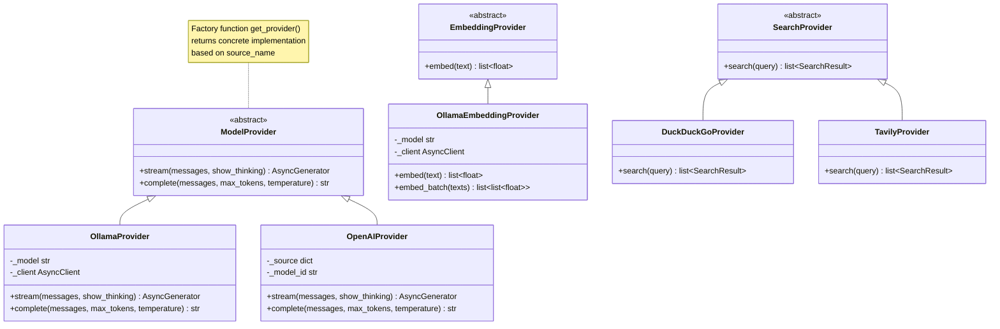

# Chapter 5: Model Abstraction Layer

With the data persistence layer (Chapter 4), conversation history and file indexes can be safely stored. But the core capability of the AI assistant—**conversing with language models**—has not yet been managed uniformly.

Today's LLM ecosystem is flourishing: locally deployed Ollama, OpenAI API, DeepSeek, vLLM, TGI... Each provider has its own API format and calling conventions. If our code were directly coupled to each provider, the maintenance cost would be exponential.

This chapter will introduce how to build a model abstraction layer using the **Provider pattern**, allowing you to call any model through the **same interface**.

## 5.1 Provider Pattern: Why Abstract?

Without an abstraction layer, calling different models would look like this:

```python
# Call Ollama
async with httpx.AsyncClient() as client:
    resp = await client.post("http://localhost:11434/api/chat", json={...})

# Call OpenAI
async with httpx.AsyncClient() as client:
    resp = await client.post("https://api.openai.com/v1/chat/completions",
        headers={"Authorization": f"Bearer {api_key}"}, json={...})
```

The two APIs differ completely in request format, response structure, and error handling. When you have 5 model sources, these 5 sets of logic are scattered throughout the code—this is a textbook case of **Shotgun Surgery**.

The Provider pattern solves this with **polymorphism**: define a unified interface, and each provider implements its own adapter. Upper-layer code depends only on the interface, not on any specific implementation.



## 5.2 ModelProvider: Unified Contract

```python
# services/providers/model.py

from abc import ABC, abstractmethod
from typing import AsyncGenerator

class ModelProvider(ABC):
    """Model provider interface — stream tokens from a model source."""

    @abstractmethod
    async def stream(
        self,
        messages: list[dict],
        show_thinking: bool = True,
    ) -> AsyncGenerator[dict, None]:
        """Stream a conversation response.

        Yields:
            {"type": "thinking", "text": str}  — thinking process fragment
            {"type": "content", "text": str}   — reply content fragment
        """
        ...

    async def complete(
        self,
        messages: list[dict],
        *,
        max_tokens: int = 100,
        temperature: float = 0,
    ) -> str:
        """Non-streaming completion (default implementation: consumes stream and concatenates result)"""
        parts: list[str] = []
        async for chunk in self.stream(messages, show_thinking=False):
            if chunk["type"] == "content":
                parts.append(chunk["text"])
        return "".join(parts)
```

### Two Levels of Abstraction

Note that `stream()` is `@abstractmethod` (must be implemented by subclasses), while `complete()` has a **default implementation**—it internally calls `stream()`, collects all `content`-type chunks, and concatenates the result.

This design has two nuances:

1. **Subclass only needs to implement stream()**: Minimizes adapter effort. If a new provider's API only has a streaming interface, you don't need to write a non-streaming implementation
2. **Subclass can override complete()**: If the provider offers a native non-streaming endpoint (like Ollama), overriding `complete()` can achieve better performance (one fewer HTTP round trip)

## 5.3 OllamaProvider In-Depth

OllamaProvider communicates with local models via the Ollama native API. It uses a **shared HTTP client** for connection reuse:

```python
class OllamaProvider(ModelProvider):
    def __init__(self, model: str | None = None):
        settings = get_settings()
        self._model = model or settings.ollama_model
        self._client = get_ollama_async_client()  # shared singleton

    async def stream(
        self, messages: list[dict], show_thinking: bool = True,
    ) -> AsyncGenerator[dict, None]:
        settings = get_settings()
        options = {
            "num_predict": get_config("max_output_tokens"),
            "num_ctx": settings.ollama_num_ctx,
            "num_batch": settings.ollama_num_batch,
            "temperature": get_config("temperature"),
            "top_p": get_config("top_p"),
        }
```

### Graceful Degradation of the think Parameter

Some Ollama models support the `think` parameter to expose reasoning, but not all models do. If the backend doesn't support this parameter, the API would error out directly. OllamaProvider handles this with **silent fallback**:

```python
try:
    stream = await self._client.chat(
        model=self._model, messages=messages, stream=True,
        think=show_thinking, keep_alive=settings.ollama_keep_alive,
        options=options,
    )
except Exception as e:
    if "think" in str(e).lower() or "unexpected" in str(e).lower():
        # Model does not support the think parameter; fall back to no-thinking mode
        logger.warning("Model does not support think parameter, falling back to no-thinking mode")
        stream = await self._client.chat(
            model=self._model, messages=messages, stream=True,
            keep_alive=settings.ollama_keep_alive, options=options,
        )
    else:
        raise  # re-raise other errors as-is
```

> **Design Principle**: For "optional features", graceful degradation is better than hard requirements. Users should not receive errors just because their model doesn't support `think`—they simply won't see the thinking process.

### Exception Mapping: Translating Low-Level Errors to User-Friendly Messages

```python
msg = str(e)
if "ConnectionRefused" in msg or "Connection refused" in msg:
    raise OllamaConnectionError("AI service is not running, please start Ollama first")
elif "timeout" in msg.lower() or "timed out" in msg.lower():
    raise OllamaTimeoutError("AI service response timed out")
elif "not found" in msg.lower() or "model" in msg.lower():
    raise OllamaModelError(
        f"Model {self._model} does not exist, please pull it first: ollama pull {self._model}"
    )
else:
    raise OllamaError(f"AI service call failed: {e}")
```

This defines a three-level exception hierarchy:

```
OllamaError (base)
├── OllamaConnectionError  → "Please check if Ollama is running"
├── OllamaTimeoutError     → "AI service response timed out"
└── OllamaModelError       → "Model does not exist, please ollama pull first"
```

After receiving these exceptions, the frontend can directly display **user-friendly error prompts** instead of raw `ConnectionRefusedError: [Errno 61] Connection refused`.

### Streaming Token Generation

```python
async for chunk in stream:
    message = chunk.message
    thinking = getattr(message, "thinking", "") or ""
    content = getattr(message, "content", "") or ""

    if thinking and show_thinking:
        yield {"type": "thinking", "text": thinking}
    if content:
        yield {"type": "content", "text": content}
```

Using `getattr` instead of `message.thinking` is because the Ollama Python SDK's `Message` object has dynamic attributes—when there is no thinking content, the attribute may not exist. `getattr` with a default value ensures code robustness.

### Overriding complete() — Direct Non-Streaming Call

Ollama provides a native non-streaming endpoint, avoiding the overhead of concatenation:

```python
async def complete(self, messages, *, max_tokens=100, temperature=0) -> str:
    response = await self._client.chat(
        model=self._model, messages=messages, stream=False,
        options={"num_predict": max_tokens, "temperature": temperature, ...},
        keep_alive=settings.ollama_keep_alive,
    )
    return (response.message.content or "").strip()
```

## 5.4 OpenAIProvider: SSE Parsing and reasoning_content

OpenAIProvider communicates via the OpenAI-compatible API (including DeepSeek, vLLM, TGI, etc.) for streaming dialogues. It uses the project's built-in `HttpClientPool` to manage HTTP connections:

```python
class OpenAIProvider(ModelProvider):
    def __init__(self, source: dict, model_id: str | None = None):
        self._source = source      # contains base_url, api_key and other config
        self._model_id = model_id

    async def stream(self, messages, show_thinking=True) -> AsyncGenerator[dict, None]:
        headers = {"Content-Type": "application/json"}
        if self._source.get("api_key"):
            headers["Authorization"] = f"Bearer {self._source['api_key']}"

        body = {
            "model": self._model_id,
            "messages": messages,
            "stream": True,
            "max_tokens": get_config("max_output_tokens"),
        }

        client = HttpClientPool.get("default", timeout=get_settings().ollama_timeout)
        async with client.stream(
            "POST", f"{self._source['base_url']}/chat/completions",
            headers=headers, json=body,
        ) as resp:
            if resp.status_code != 200:
                error_body = await resp.aread()
                raise RuntimeError(f"API returned {resp.status_code}: {error_body.decode()[:200]}")
```

### Manually Parsing SSE Data Lines

The streaming response of the OpenAI-compatible API is standard SSE (Server-Sent Events), where each line starts with `data: `:

```python
async for line in resp.aiter_lines():
    if not line.startswith("data: "):
        continue
    data = line[6:]           # strip "data: " prefix
    if data == "[DONE]":      # stream end signal
        break

    try:
        chunk = json.loads(data)
    except json.JSONDecodeError:
        continue              # skip lines that fail to parse

    choices = chunk.get("choices", [])
    if not choices:
        continue
    delta = choices[0].get("delta", {})

    # Reasoning content (for chain-of-thought models like DeepSeek-R1)
    reasoning = delta.get("reasoning_content", "") or ""
    if reasoning and show_thinking:
        yield {"type": "thinking", "text": reasoning}

    # Regular reply content
    content = delta.get("content", "") or ""
    if content:
        yield {"type": "content", "text": content}
```

Key points:
- `[DONE]` is the OpenAI SSE protocol's stream end signal
- `reasoning_content` is a field specific to reasoning models like DeepSeek-R1, corresponding to Ollama's `thinking`
- JSON parse failures do not interrupt the stream (fault-tolerant design), as some proxies may insert non-JSON lines

### HttpClientPool: Connection Reuse

```python
# utils/http_client.py
class HttpClientPool:
    _clients: dict[str, httpx.AsyncClient] = {}

    @classmethod
    def get(cls, name: str = "default", timeout: float = 30) -> httpx.AsyncClient:
        if name not in cls._clients:
            cls._clients[name] = httpx.AsyncClient(timeout=timeout)
        return cls._clients[name]
```

This is a minimal named connection pool. `HttpClientPool.get("default")` returns the same `AsyncClient` instance, enabling HTTP connection reuse across Providers. Compared to creating a new `AsyncClient` each time, connection reuse significantly reduces TLS handshake overhead and TCP connection count.

## 5.5 EmbeddingProvider: Vectorization Interface

Embedding is the foundation of RAG (Retrieval-Augmented Generation)—converting text into high-dimensional vectors for semantic search. Its abstraction is even simpler:

```python
class EmbeddingProvider(ABC):
    @abstractmethod
    async def embed(self, text: str) -> list[float]:
        ...

class OllamaEmbeddingProvider(EmbeddingProvider):
    def __init__(self):
        settings = get_settings()
        self._model = settings.embedding_model
        self._client = get_ollama_async_client()

    async def embed(self, text: str) -> list[float]:
        response = await self._client.embeddings(
            model=self._model, prompt=text, keep_alive=self._keep_alive,
        )
        return response.embedding
```

### Batch Embedding and Degradation Strategy

File indexing requires vectorizing hundreds or thousands of text chunks—calling one by one is too slow. The `embed_batch` method first attempts the batch API, and falls back to concurrent single calls on failure:

```python
async def embed_batch(self, texts: list[str]) -> list[list[float]]:
    results = []
    for i in range(0, len(texts), self._max_batch_size):
        batch = texts[i:i + self._max_batch_size]
        try:
            resp = await self._client.embed(
                model=self._model, input=batch, keep_alive=self._keep_alive,
            )
            results.extend(resp.embeddings)
        except Exception as e:
            # Batch failed → retry with concurrent single calls
            tasks = [
                self._client.embeddings(model=self._model, prompt=text, ...)
                for text in batch
            ]
            emb_results = await asyncio.gather(*tasks, return_exceptions=True)
            for r in emb_results:
                if isinstance(r, Exception):
                    results.append([0.0] * 1024)  # zero vector placeholder
                else:
                    results.append(r.embedding)
    return results
```

**Degradation Strategy**: The batch API may fail because the model doesn't support it or a timeout occurs, at which point it automatically switches to `asyncio.gather` for concurrent single calls. When a single call also fails, a zero-vector placeholder is used—better to lose some vectors than to block the entire indexing pipeline.

## 5.6 Factory Function: Switch Models with a Single Line

```python
# services/providers/__init__.py
def get_provider(model_source: str | None, model_id: str | None):
    """Factory function: creates the appropriate provider based on source name and model ID."""
    from services.providers.model import OllamaProvider, OpenAIProvider

    settings = get_settings()
    source_name = model_source or "ollama"

    if source_name != "ollama":
        from services.model_manager import get_model_sources
        sources = get_model_sources()
        source = next((s for s in sources if s["name"] == source_name), None)
        if not source:
            raise OllamaError(f"Model source '{source_name}' is not configured")
        return OpenAIProvider(source=source, model_id=model_id)

    return OllamaProvider(model=model_id or settings.ollama_model)
```

In business code, only one line is needed:

```python
provider = get_provider(ctx.model_source, ctx.model_id)
async for token in provider.stream(messages, show_thinking=True):
    yield format_sse("token", token)
```

Switching model sources only requires changing the `model_source` parameter—**zero changes to the rest of the code**.

## 5.7 How to Add a New Model Provider

Suppose you want to support the Anthropic Claude API. Here are the complete steps:

### Step 1: Create AnthropicProvider

```python
# services/providers/anthropic_provider.py
from services.providers.model import ModelProvider
from typing import AsyncGenerator

class AnthropicProvider(ModelProvider):
    def __init__(self, api_key: str, model: str = "claude-3-5-sonnet"):
        self._api_key = api_key
        self._model = model

    async def stream(self, messages, show_thinking=True) -> AsyncGenerator[dict, None]:
        headers = {
            "x-api-key": self._api_key,
            "anthropic-version": "2023-06-01",
            "Content-Type": "application/json",
        }
        body = {
            "model": self._model,
            "messages": messages,
            "max_tokens": 4096,
            "stream": True,
        }
        # Send HTTP request, parse SSE response
        # yield {"type": "content", "text": token}
        ...

    # complete() automatically inherits the default implementation from ModelProvider
```

### Step 2: Register in the Factory Function

```python
def get_provider(model_source, model_id):
    if model_source == "anthropic":
        return AnthropicProvider(api_key=settings.anthropic_api_key, model=model_id)
    # ... other sources
```

### Step 3: Add Model Source Configuration in the Frontend

Add the Anthropic API Key configuration item in SettingsModal.

**That's it.** The entire process requires modifying zero lines in `stream_engine.py`, `chat.py`, or `prompt_builder.py`—this is the value of the Provider pattern.

## Chapter Summary

- The Provider pattern uses interfaces + polymorphism to unify calling conventions across multiple model sources
- The `ModelProvider` abstract class defines the `stream()` + `complete()` contract; subclasses need only implement `stream()` at minimum
- `OllamaProvider` implements graceful degradation for the `think` parameter and an exception hierarchy mapping
- `OpenAIProvider` manually parses SSE and reuses HTTP connections via `HttpClientPool`
- `OllamaEmbeddingProvider` provides batch + degradation strategies to ensure indexing pipeline robustness
- The factory function `get_provider()` allows upper-layer code to switch models with zero modifications

Next chapter, we will wire these Providers into the streaming chat engine, building a complete SSE streaming response pipeline.
