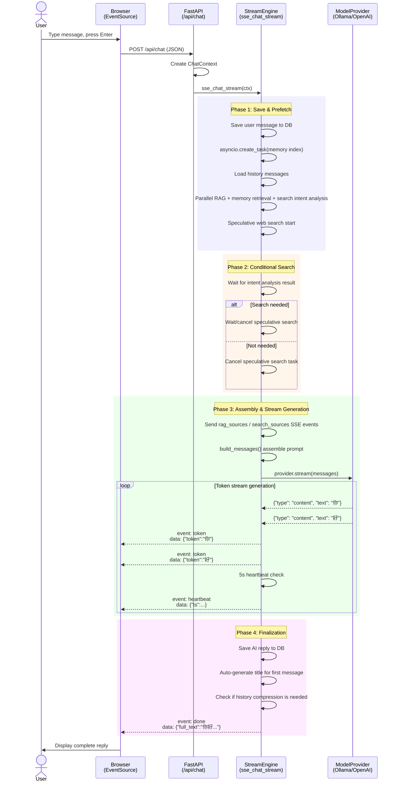

# Chapter 6: Streaming Chat Engine

The previous three chapters built the application skeleton, configuration system, and data layer respectively. Chapter 5 constructed the model abstraction layer. Now, it's time to **connect** these building blocks and construct the core of the entire AI assistant—the **Streaming Chat Engine**.

This engine is responsible for **all coordination** between "when the user sends a message" and "when the AI's word-by-word reply appears on the screen." It is not a simple request-response model, but a carefully orchestrated **multi-stage pipeline**.

## 6.1 Why SSE?

Before discussing the engine design, let's first answer a fundamental question: why does AI conversation need "streaming" transmission?

Large models like GPT may take 5-30 seconds to generate a complete response. If we waited until the entire response was generated and returned it all at once, the user would stare at a spinner in front of a blank screen—a terrible experience. Streaming transmission allows users to **see each token appear one by one**, significantly reducing perceived waiting time (the psychological "progress bar effect").

There are three mainstream technical solutions for streaming:

| Solution | Direction | Complexity | Use Case |
|----------|-----------|------------|----------|
| **SSE** (Server-Sent Events) | Server → Client | Low | AI streaming output |
| WebSocket | Bidirectional | Medium | Real-time collaborative editing |
| Long Polling | Server → Client | Low | Legacy browser compatibility |

SSE is based on the standard HTTP protocol, requires no special upgrade handshake, natively supports reconnection, and browsers provide the native `EventSource` API. For the "server pushes to client" AI conversation scenario, SSE is the simplest correct choice.



## 6.2 ChatContext: Parameter Aggregator

Streaming chat involves many parameters: session ID, message text, thinking mode toggle, RAG mode, web search, model source, image list... If these parameters were passed as function arguments, the signature would become bloated and hard to extend.

`ChatContext` is a **dataclass** that acts as a "parameter basket," encapsulating all inputs into a single object:

```python
# services/stream_engine.py
@dataclass
class ChatContext:
    session_id: str
    user_message: str
    show_thinking: bool = False
    msg_count_before: int = 0        # message count before sending (used to determine first message)
    title_source: str = ""            # raw text for title generation
    images: list[str] | None = None   # image base64 list
    rag_mode: str = "off"             # off / auto / force
    web_search: bool = False
    model_source: str | None = None
    model_id: str | None = None
    current_file: str | None = None   # current uploaded file name (for RAG filtering)
```

Usage is straightforward:

```python
ctx = ChatContext(
    session_id=body.session_id,
    user_message=message,
    show_thinking=body.show_thinking,
    msg_count_before=msg_count_before,
    title_source=message,
    rag_mode=body.rag_mode,
    web_search=body.web_search,
    model_source=body.model_source,
    model_id=body.model_id,
)
return StreamingResponse(
    sse_chat_stream(ctx),
    media_type="text/event-stream",
    headers=SSE_HEADERS,
)
```

`StreamingResponse` is FastAPI's built-in streaming response class. It accepts an async generator and sends each `yield`ed piece as a chunk of the HTTP response body.

## 6.3 sse_chat_stream 10-Step Pipeline

```python
async def sse_chat_stream(ctx: ChatContext) -> AsyncGenerator[str, None]:
```

This async generator contains **all the logic** of the chat engine. It consists of 10 steps, each with different responsibilities:

### Step 1: Save User Message + Memory Index

```python
db = await get_db()
user_msg_id = await save_message(db, ctx.session_id, "user", ctx.user_message)
_index_message(ctx.session_id, user_msg_id, "user", ctx.user_message)
```

The save is synchronous (the message must be persisted before proceeding), but **semantic memory indexing** is fire-and-forget:

```python
def _index_message(session_id, message_id, role, content):
    try:
        if get_settings().memory_enabled:
            from services.memory import index_message
            asyncio.create_task(index_message(session_id, message_id, role, content))
    except Exception:
        logger.warning("语义记忆索引失败")
```

> **Design Principle**: Non-critical path operations use `asyncio.create_task` to execute asynchronously without blocking the main flow. If memory indexing fails, the conversation can still proceed; but if the message isn't saved, the conversation cannot continue.

### Step 2: Load History Messages (Respecting Compression Watermark)

```python
session = await get_session(db, ctx.session_id)
compressed_up_to_id = (session or {}).get("compressed_up_to_id") or None
history = await get_messages(
    db, ctx.session_id, get_config("max_history_messages"),
    after_id=compressed_up_to_id,
)
session_summary = (session or {}).get("summary") or None
```

`compressed_up_to_id` is the compression watermark—only messages with an ID greater than this value are loaded. Older messages have been compressed into a `summary` string (e.g., "The user asked about the basics of Python asynchronous programming, and the AI introduced the usage of asyncio in detail..."), providing historical context at a very low token cost.

### Step 3: Parallel Prefetch — The Performance Core of the Engine

This is the most sophisticated design in the entire engine. The traditional approach is: RAG retrieval first → wait for results → then memory retrieval → wait for results → then determine if search is needed → then perform search. But these are all **independent operations** with no data dependencies between them!

```python
# 四个任务同时启动，互不等待！
rag_task = asyncio.create_task(
    _do_rag_search(ctx.session_id, ctx.user_message, ctx.rag_mode, history, ctx.current_file)
)
memory_task = asyncio.create_task(
    memory_retrieve(ctx.session_id, ctx.user_message, top_k=50, min_score=0.0)
) if get_settings().memory_enabled else None
intent_task = asyncio.create_task(
    analyze_search_intent(ctx.user_message, history)
) if ctx.web_search else None
spec_web_task = asyncio.create_task(
    do_web_search(ctx.user_message)
) if ctx.web_search else None
```

**Speculative web search**: We don't need to wait for the intent analysis result—we initiate the search directly with the user's original message. If the intent analysis says "no search needed," we simply cancel the speculative task. If the intent analysis says "search needed," the speculative task is already running, saving waiting time.

### Step 4: Wait for Key Results

```python
await asyncio.wait(
    [t for t in [rag_task, intent_task, memory_task] if t is not None]
)
```

Only wait for RAG, memory retrieval, and intent analysis. The speculative search is not waited for (it may continue running in the background).

### Step 5: Conditional Search

```python
if intent_task:
    intent_result = intent_task.result()
    if intent_result and spec_web_task:
        # 需要搜索 → 等待投机任务（最多 3 秒）
        done, _ = await asyncio.wait([spec_web_task], timeout=3.0)
        if done:
            web_context = spec_web_task.result()
        else:
            # 投机未完成，如果意图改写了查询，用新查询重搜
            if intent_result != ctx.user_message:
                spec_web_task.cancel()
                web_context = await do_web_search(intent_result)
            else:
                web_context = await spec_web_task
    elif spec_web_task:
        # 不需要搜索 → 取消投机任务
        spec_web_task.cancel()
```

The core idea of this logic is **"do first, decide later"**—start the speculative search first, then use the intent analysis result to decide whether to wait for it to complete or cancel it. Compared to the serial approach of "judge first, search later," this can save the entire search time in scenarios where search results are needed.

### Step 6: Send Retrieved Sources SSE Events

```python
if rag_context:
    yield f"event: rag_sources\ndata: {json.dumps({'sources': [{'file': r['source_file'], 'score': r['score'], 'type': 'rag'} for r in rag_context]})}\n\n"

if web_context:
    yield f"event: search_sources\ndata: {json.dumps([{'index': i+1, 'title': r.get('title',''), 'url': r['source_file']} for i,r in enumerate(web_context)])}\n\n"
```

These events allow the frontend to display "which sources were referenced" before the model starts replying—improving transparency and trust.

### Step 7: Assemble Messages

```python
messages = build_messages(
    system_prompt=settings.system_prompt,
    history=history,
    current_message=ctx.user_message,
    rag_context=rag_context,
    web_context=web_context,
    images=ctx.images,
    memory_hits=memory_hits,
    session_summary=session_summary,
    max_history=get_config("max_history_messages"),
    max_context_tokens=get_config("max_context_tokens"),
)
```

`build_messages` (see `services/prompt_builder.py`) is responsible for:
- **Token Budget Allocation**: system prompt + output reservation + RAG context + history messages + user message ≤ max_context_tokens
- **Adaptive RAG Selection**: Select document chunks in descending order of relevance, up to 35% of the remaining budget
- **Smart History Trimming**: Semantically relevant messages are loaded first, the rest are loaded newest to oldest
- **Instruction Strategy**: Choose different citation instructions based on the RAG/Web combination (strict citation vs. source attribution)

### Step 8: Stream Generation + Heartbeat

```python
heartbeat_interval = 5.0
last_heartbeat = asyncio.get_event_loop().time()

provider = get_provider(ctx.model_source, ctx.model_id)
async for token in provider.stream(messages, ctx.show_thinking):
    now = asyncio.get_event_loop().time()
    if now - last_heartbeat >= heartbeat_interval:
        last_heartbeat = now
        yield f"event: heartbeat\ndata: {json.dumps({'ts': now})}\n\n"

    if token["type"] == "thinking":
        full_thinking += token["text"]
        yield f"event: thinking\ndata: {json.dumps({'text': token['text']})}\n\n"
    elif token["type"] == "content":
        full_text += token["text"]
        yield f"event: token\ndata: {json.dumps({'token': token['text']})}\n\n"
```

**Heartbeat Mechanism**: If the model takes a long time to think (some reasoning models may be silent for 10-20 seconds), proxy servers (such as nginx, Cloudflare) may disconnect due to timeout. Sending a heartbeat event every 5 seconds keeps the connection alive and prevents "false disconnections."

### Step 9: Save Reply + Memory Index + Auto Title

```python
if full_text:
    assistant_msg_id = await save_message(db, ctx.session_id, "assistant", full_text)
    _index_message(ctx.session_id, assistant_msg_id, "assistant", full_text)

if ctx.msg_count_before == 0:
    title = _safe_title(ctx.title_source)
    if title:
        await rename_session(db, ctx.session_id, title)

yield f"event: done\ndata: {json.dumps({'full_text': full_text, 'session_title': title})}\n\n"
```

Auto title generation uses a simple heuristic method without consuming additional LLM calls:

```python
def _safe_title(text: str, max_len: int = 30) -> str:
    clean = text.strip().replace("\n", " ")
    if len(clean) <= max_len:
        return clean
    truncated = clean[:max_len]
    match = re.search(r'^(.*)[\s,，。！？!?]', truncated)
    if match:
        return match.group(1) + "..."
    return truncated + "..."
```

It takes the first 30 characters from the user's first message, trying to cut off at a natural break point—simple and effective.

### Step 10: Trigger Hybrid Compression

```python
uncompressed_count = await count_messages(db, ctx.session_id, after_id=compressed_up_to_id)
if uncompressed_count >= get_config("max_history_messages") * 0.8:
    from services.compress import maybe_compress
    asyncio.create_task(maybe_compress(db, ctx.session_id, get_config("max_history_messages")))
```

When the number of uncompressed messages reaches 80% of the budget limit, a background compression task is triggered. This ensures the conversation can continue indefinitely without overflowing the context window due to excessive history messages. Compression is an async background task that does not block the current request.

## 6.4 Error Recovery: Graceful Interruption & Exception Handling

### CancelledError — User-Initiated Stop

```python
except asyncio.CancelledError:
    logger.warning("对话流被中断 session=%s partial=%d", ctx.session_id[:8], len(full_text))
    if full_text:
        # 有部分内容 → 保存为 interrupted 状态
        await save_message(db, ctx.session_id, "assistant",
            full_text + "\n\n[回复被中断]", status="interrupted")
    elif user_msg_id is not None:
        # 没有任何回复 → 连用户消息也删除，保持界面干净
        await delete_message(db, user_msg_id)
    return  # 不抛出异常
```

When the user clicks the "Stop Generation" button on the frontend, `AbortController.abort()` cancels the HTTP request, triggering FastAPI to inject `CancelledError` into `sse_chat_stream`. The engine's handling strategy:

- **Partial reply generated**: Save and mark as `interrupted`, the user can see partial results
- **No reply at all**: Delete the user message, the UI reverts to the state before sending

### General Exceptions

```python
except Exception as e:
    if user_msg_id is not None:
        try:
            await delete_message(db, user_msg_id)
        except Exception:
            pass  # 删除失败不掩盖原始错误
    yield f"event: error\ndata: {json.dumps({'detail': str(e)})}\n\n"
```

Deleting the user message is to ensure data consistency—if the AI did not reply, keeping an orphaned user message would look strange in the conversation list.

## 6.5 SSE Event Format Reference

Below is an example of the SSE event stream that the client actually receives:

```
event: thinking
data: {"text": "让我分析一下这个问题..."}

event: token
data: {"token": "你"}

event: token
data: {"token": "好"}

event: heartbeat
data: {"ts": 1720000001.5}

event: token
data: {"token": "！"}

event: done
data: {"full_text": "你好！", "full_thinking": "让我分析一下这个问题...", "session_title": null}
```

Complete event type summary:

| Event Type | Meaning | Data |
|------------|---------|------|
| `thinking` | Model reasoning process (think mode) | `{"text": "..."}` |
| `token` | Reply content fragment | `{"token": "..."}` |
| `rag_sources` | Sources retrieved by RAG | `{"sources": [...]}` |
| `search_sources` | Web search sources (with index) | `[{"index": 1, "title": "...", "url": "..."}]` |
| `heartbeat` | Keep-alive signal (5s interval) | `{"ts": 1234567890.0}` |
| `done` | Conversation complete | `{"full_text": "...", "session_title": "..."}` |
| `error` | Error | `{"detail": "error description"}` |

## 6.6 How the Frontend Consumes SSE Streams

The frontend does not use the native `EventSource` API (it doesn't support POST requests and custom headers), but instead manually parses via `fetch` + `ReadableStream`:

```typescript
// frontend/src/services/api.ts
export function parseSSEStream(
  reader: ReadableStreamDefaultReader<Uint8Array>,
  onEvent: (event: string, data: string) => void,
  onDone: () => void,
  onError: (err: Error) => void,
): Promise<void> {
  return (async () => {
    const decoder = new TextDecoder();
    let buffer = '';

    while (true) {
      const { done, value } = await reader.read();
      if (done) break;

      buffer += decoder.decode(value, { stream: true });
      const lines = buffer.split('\n');
      buffer = lines.pop() || '';  // keep incomplete line

      let currentEvent = '';
      for (const line of lines) {
        if (line.startsWith('event: ')) {
          currentEvent = line.slice(7).trim();
        } else if (line.startsWith('data: ')) {
          if (currentEvent) {
            onEvent(currentEvent, line.slice(6));
            currentEvent = '';
          }
        }
      }
    }
    onDone();
  })();
}
```

The frontend handles events in the Zustand store:

```typescript
// frontend/src/stores/chatStore.ts
const handlers = {
  onEvent: (event: string, data: string) => {
    switch (event) {
      case 'thinking':
        set((s) => ({ thinking: s.thinking + JSON.parse(data).text }));
        break;
      case 'token':
        bufferedUpdate(JSON.parse(data).token);  // rAF throttled accumulation
        break;
      case 'rag_sources':
        set({ ragSources: JSON.parse(data).sources || [] });
        break;
      case 'search_sources':
        updateLastAssistantSearchSources(JSON.parse(data));
        break;
      case 'done':
        set({ streaming: false });
        break;
      case 'error':
        bufferedUpdate(`错误: ${JSON.parse(data).detail}`);
        set({ streaming: false });
        break;
    }
  },
};
```

Note that `bufferedUpdate` uses `requestAnimationFrame` for token accumulation buffering—avoiding a React re-render for every single token (imagine 50 tokens per second, that's 50 setState calls per second). `rAF` merges tokens within 16ms into a single state update, improving rendering performance by an order of magnitude.

## Chapter Summary

- SSE is the optimal transport protocol for AI streaming chat, simple and natively supported by browsers
- `ChatContext` dataclass elegantly aggregates numerous parameters
- The 10-step pipeline covers the complete conversation lifecycle: save, retrieve, assemble, generate, finalize
- Parallel prefetch (`asyncio.gather`) parallelizes multiple independent I/O operations, significantly reducing first-token latency
- Speculative search uses the "do first, decide later" strategy to hide search latency
- 5-second heartbeat maintains long connections, preventing proxy timeout disconnections
- Error recovery balances partial reply preservation and data consistency
- The frontend manually parses SSE via `fetch` + `ReadableStream`, optimized with rAF throttling for rendering

Next chapter, we will look from the frontend perspective at how React transforms these SSE events into the chat interface that users see.
