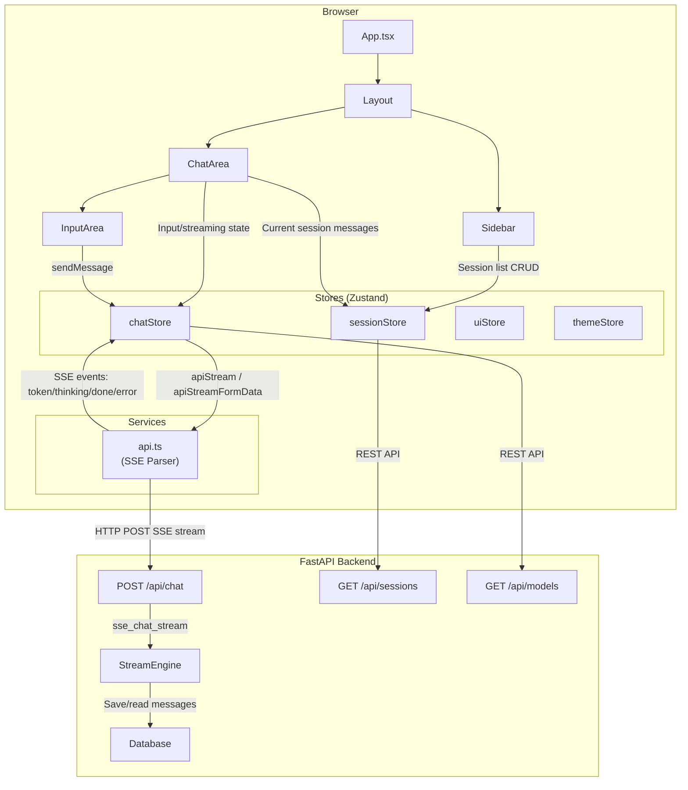

# Chapter 7: Frontend Interaction Design

The first six chapters focused mainly on the backend — from project scaffolding to the data layer, from model abstraction to the streaming engine. But an AI assistant is ultimately for people to use. This chapter takes the frontend perspective and introduces how to build a modern AI chat interface using **React + Vite + Zustand**.

## 7.1 Technology Selection and Project Structure

| Technology | Purpose | Why This |
|------------|---------|----------|
| **React 18** | UI Framework | Richest ecosystem, well-integrated with Zustand |
| **Vite** | Build Tool | Sub-second cold start, blazing HMR |
| **Zustand** | State Management | 10x simpler than Redux, natively supports selector optimization |
| **TypeScript** | Type Safety | API contracts, model definitions, prevents typos |
| **KaTeX** | Math Formula Rendering | LaTeX math support |

The project structure uses **feature-based layering** rather than file-type-based layering:

```
frontend/
├── src/
│   ├── components/
│   │   ├── chat/          # Chat-related components
│   │   │   ├── ChatArea.tsx
│   │   │   ├── InputArea.tsx
│   │   │   ├── MessageBubble.tsx
│   │   │   ├── MarkdownRenderer.tsx
│   │   │   ├── ModelPicker.tsx
│   │   │   ├── ThinkingPanel.tsx
│   │   │   ├── FilePreview.tsx
│   │   │   └── FileAttachmentUpload.tsx
│   │   ├── layout/        # Layout components
│   │   │   ├── Layout.tsx
│   │   │   ├── Sidebar.tsx
│   │   │   └── TopBar.tsx
│   │   ├── modals/        # Modal components
│   │   │   ├── SettingsModal.tsx
│   │   │   └── ShortcutCheatsheet.tsx
│   │   └── ui/            # Generic UI components
│   │       ├── EmptyState.tsx
│   │       ├── ScrollToBottom.tsx
│   │       ├── Toast.tsx
│   │       └── ErrorBoundary.tsx
│   ├── stores/            # Zustand state management
│   │   ├── chatStore.ts
│   │   ├── sessionStore.ts
│   │   ├── uiStore.ts
│   │   └── themeStore.ts
│   ├── services/          # API call wrappers
│   │   ├── api.ts
│   │   ├── sessions.ts
│   │   ├── models.ts
│   │   └── settings.ts
│   ├── hooks/             # Custom Hooks
│   │   ├── useKeyboardShortcuts.ts
│   │   ├── useVoiceInput.ts
│   │   ├── useClickOutside.ts
│   │   └── useDraftAutoSave.ts
│   ├── types/             # TypeScript type definitions
│   │   ├── chat.ts
│   │   ├── session.ts
│   │   ├── model.ts
│   │   └── settings.ts
│   ├── App.tsx
│   └── main.tsx
├── index.html
├── package.json
├── vite.config.ts
└── tsconfig.json
```

> **Structural Philosophy**: Group related components together (e.g., `components/chat/` contains all chat-related UI) rather than scattering them by file type (e.g., `components/`, `stores/` each having chat logic everywhere). When you need to modify "chat functionality," all related files are in one or two directories.

## 7.2 Frontend-Backend Interaction Overview




## 7.3 SSE Stream Consumption: From bytes to UI State

Chapter 6 has already introduced how the backend generates SSE event streams. Now let's look at how the frontend consumes them.

### Why not use the native EventSource?

The browser's native `EventSource` API has 3 major flaws:

1. **Only supports GET requests**: AI chat requires POST to send message bodies
2. **Does not support custom request headers**: Cannot carry tracking info like `X-Request-ID`
3. **Does not support `AbortController`**: Cannot gracefully cancel the stream

Therefore, the project uses `fetch` + `ReadableStream` to manually implement SSE parsing:

```typescript
// frontend/src/services/api.ts
function _apiStreamInternal(
  path: string,
  options: { body: unknown; isJson: boolean },
  onEvent: (event: string, data: string) => void,
  onError: (err: Error) => void,
  onDone: () => void,
): AbortController {
  const controller = new AbortController();

  (async () => {
    try {
      const res = await fetch(`${BASE}${path}`, {
        method: 'POST',
        signal: controller.signal,
        headers: { 'Content-Type': 'application/json', 'X-Request-ID': nextRequestId() },
        body: JSON.stringify(options.body),
      });

      if (!res.ok) {
        onError(new ApiError(res.status, `HTTP ${res.status}`));
        return;
      }

      const reader = res.body?.getReader();
      if (!reader) {
        onError(new Error('No response body'));
        return;
      }

      await parseSSEStream(reader, onEvent, onDone, onError);
    } catch (err) {
      if (err instanceof Error && err.name === 'AbortError') return;
      onError(err instanceof Error ? err : new Error(String(err)));
    }
  })();

  return controller;
}
```

`AbortController` is the key — it allows the user to click a "Stop generating" button and immediately interrupt the stream transmission without waiting for the model to finish.

### SSE Parser

```typescript
export function parseSSEStream(
  reader: ReadableStreamDefaultReader<Uint8Array>,
  onEvent: (event: string, data: string) => void,
  onDone: () => void,
  onError: (err: Error) => void,
): Promise<void> {
  const decoder = new TextDecoder();
  let buffer = '';

  return (async () => {
    while (true) {
      const { done, value } = await reader.read();
      if (done) break;

      buffer += decoder.decode(value, { stream: true });
      const lines = buffer.split('\n');
      buffer = lines.pop() || '';  // The last line may be incomplete, keep it for next concatenation

      let currentEvent = '';
      for (const line of lines) {
        if (line.startsWith('event: ')) {
          currentEvent = line.slice(7).trim();
        } else if (line.startsWith('data: ')) {
          if (currentEvent) {
            onEvent(currentEvent, line.slice(6));
            currentEvent = '';
          }
        }
      }
    }
    onDone();
  })();
}
```

There is an easily overlooked detail here: `buffer = lines.pop() || ''`. At the TCP level, an SSE event may be split across multiple data packets, and the last line may be incomplete. Keeping it in the buffer and concatenating it when the next packet arrives avoids parsing errors.

## 7.4 Core Components of the Chat Interface

### ChatArea: Chat Container

`ChatArea` is the main container of the chat interface, responsible for:
- Rendering the message list (`MessageBubble` list)
- Controlling auto-scroll to bottom
- Rendering the thinking panel (`ThinkingPanel`)
- Fix-rendering `InputArea` at the bottom

The core layout pattern is "message list + fixed input area." The input area uses `shrink-0` to ensure it is not compressed.

### InputArea: Input Interaction Core

```tsx
// frontend/src/components/chat/InputArea.tsx (core structure)
export function InputArea() {
  const input = useChatStore((s) => s.input);
  const setInput = useChatStore((s) => s.setInput);
  const streaming = useChatStore((s) => s.streaming);
  const sendMessage = useChatStore((s) => s.sendMessage);
  const stopStreaming = useChatStore((s) => s.stopStreaming);
  const currentRagMode = useChatStore((s) => s.currentRagMode);
  const toggleRagMode = useChatStore((s) => s.toggleRagMode);

  const handleSend = () => {
    if (!currentSessionId || streaming) return;
    if (!input.trim()) return;
    sendMessage(currentSessionId, input.trim());
    setInput('');
  };

  const handleKeyDown = (e: KeyboardEvent<HTMLTextAreaElement>) => {
    if (e.key === 'Enter' && !e.shiftKey) {
      e.preventDefault();
      handleSend();
    }
  };
  // ...
}
```

`Enter` to send, `Shift+Enter` for newline — this is the de facto standard for AI chat applications, and this project follows the convention.

### Input Area Action Buttons

There is a row of action buttons above the input area:

- **Upload File**: Click to open a file picker, supports `.txt/.pdf/.docx/.xlsx/.md` and image formats
- **Voice Input**: Click to start recording, uses Web Speech API to convert speech to text
- **Web Search**: Toggle button to enable/disable Web search
- **Knowledge Base Mode**: Three-state toggle `off → auto → force`
- **Model Selector** (`ModelPicker`): Select model source and specific model

All these button states are stored in `chatStore`, enabling precise re-rendering through Zustand's selector mechanism — only components using that state will update.

### MessageBubble: Message Bubble

Each message is rendered as a bubble, with different styles distinguishing user messages from AI replies. AI replies are rendered using `MarkdownRenderer`, supporting code highlighting, math formulas, tables, etc.

AI messages also support:
- **Copy**: One-click copy of the entire reply
- **Regenerate**: Delete the current reply and re-request
- **Edit**: Edit the user message and truncate subsequent messages (version rollback)

### MarkdownRenderer: Content Rendering Enhancement

AI replies are typically in Markdown format. `MarkdownRenderer` uses `react-markdown` for rendering, with plugin support for:

- Code block syntax highlighting (`CodeBlock` component, supports one-click copy)
- KaTeX math formula rendering (inline `$...$` and block `$$...$$`)
- Tables, lists, blockquotes, and other standard GFM elements
- Interactive rendering of `[N]` reference superscripts

### ThinkingPanel: Thought Process Display

When the model supports think mode, `ThinkingPanel` foldably displays the model's reasoning process (similar to DeepSeek-R1's chain of thought), providing transparency without interfering with normal reply reading.

## 7.5 State Management: Advantages of Zustand

The project uses Zustand instead of Redux. Comparison between the two:

```typescript
// Zustand — defining a store only needs create()
export const useChatStore = create<ChatState>((set, get) => ({
  input: '',
  streaming: false,
  thinking: '',
  ragSources: [],
  currentRagMode: 'auto',
  webSearchEnabled: false,

  setInput: (v) => set({ input: v }),
  setStreaming: (v) => set({ streaming: v }),
  toggleRagMode: () => set((s) => ({
    currentRagMode: s.currentRagMode === 'off' ? 'auto'
      : s.currentRagMode === 'auto' ? 'force' : 'off',
  })),

  sendMessage: (sessionId, message) => {
    // Business logic + API call
  },
  stopStreaming: () => {
    get().abortController?.abort();
    set({ streaming: false, abortController: null });
  },
}));

// Usage — minimal
const input = useChatStore((s) => s.input);
const streaming = useChatStore((s) => s.streaming);
```

Compared to Redux, which requires defining action types, action creators, reducers, selectors, dispatch, Provider wrapping... Zustand reduces code volume by over 80%, while being fully feature-equivalent.

### rAF-throttled Token Accumulator

This is a key frontend performance optimization:

```typescript
function createBufferedUpdate(update: (text: string) => void): (text: string) => void {
  let buffer = '';
  let scheduled = false;

  const flush = () => {
    scheduled = false;
    if (buffer) {
      update(buffer);
      buffer = '';
    }
  };

  return (text: string) => {
    buffer += text;
    if (!scheduled) {
      scheduled = true;
      requestAnimationFrame(flush);
    }
  };
}
```

A large language model generates 30-80 tokens per second. If each token triggers a `setState` + React re-render, the browser will stutter. `createBufferedUpdate` uses `requestAnimationFrame` (approximately 16ms per frame) to merge all tokens within the same frame into a single state update — reducing the render frequency from 80 Hz to 60 Hz, with negligible performance cost.

### Store Splitting Strategy

The project splits state into four independent stores:

| Store | Responsibility | Example State |
|-------|---------------|---------------|
| `chatStore` | Current input and streaming state | input, streaming, thinking, ragSources |
| `sessionStore` | Session list and current session messages | sessions[], currentSessionId, messages[] |
| `uiStore` | Global UI state | sidebarOpen, settingsOpen, toast |
| `themeStore` | Theme preferences | darkMode, accentColor |

Benefits of splitting: When `streaming` changes, only components subscribed to `chatStore` will re-render. The message list in `sessionStore` will not be recalculated on every streaming state change.

## 7.6 File Upload Interaction

The file upload workflow involves coordinating multiple frontend states:

```tsx
// Select file
const handleFileSelect = (e: React.ChangeEvent<HTMLInputElement>) => {
  const file = e.target.files?.[0];
  if (!file) return;
  setPendingFile(file);  // Stage, don't send immediately
  e.target.value = '';
};

// Execute upload on send
const doFileUpload = (file: File) => {
  if (!currentSessionId) return;
  const msgText = input || 'Please analyze this file';
  setInput('');
  setPendingFile(null);
  sendFileMessage(currentSessionId, msgText, file);  // FormData + SSE
};
```

File upload also uses SSE streaming (`apiStreamFormData`), differing from normal chat only in using `FormData` instead of a JSON body. After receiving the file, the backend first sends a `file_info` event to inform the frontend of file metadata (URL, size, type), followed by the normal chat SSE event stream:

```typescript
const ctrl = apiStreamFormData('/chat/upload', formData,
  (event, data) => {
    if (event === 'file_info') {
      try { updateLastUserMessageFileInfo(JSON.parse(data)); } catch {}
    } else {
      onEvent(event, data);  // Handle other events normally
    }
  },
  onError, onComplete,
);
```

On the frontend, if an uploaded file is an image, an image preview is displayed in the user message bubble; if it is a document file, a file type icon and name are displayed.

## 7.7 Settings Panel Integration

`SettingsModal` is a centralized settings panel that manages:

- **System Prompt**: Editable textarea for modifying the AI assistant's role setting
- **Model Parameters**: Temperature, Top-P, max output tokens
- **Context Parameters**: Max context tokens, max history messages
- **RAG Settings**: Knowledge base toggle
- **Memory Settings**: Semantic memory toggle
- **Search Settings**: Search provider selection (DuckDuckGo / Tavily)
- **Model Source Management**: Add/edit/delete OpenAI-compatible API endpoints
- **Shortcut Cheatsheet**: `ShortcutCheatsheet` modal

These settings are read and saved via REST API (`/api/settings`), with all changes taking effect immediately and persisting to `runtime_config.json` (see Chapter 3).

## 7.8 Keyboard Shortcuts and Voice Input

Keyboard shortcuts implemented via the `useKeyboardShortcuts` hook:

```
Ctrl+N      → New session
Ctrl+K      → Search sessions
Ctrl+Shift+S → Open settings
Ctrl+B      → Toggle sidebar
Escape      → Close modal / Stop generation
```

Voice input uses the `useVoiceInput` hook, based on the browser's Web Speech API (`SpeechRecognition`), supporting Chinese speech recognition:

```typescript
// hooks/useVoiceInput.ts core logic
const recognition = new (window.SpeechRecognition || window.webkitSpeechRecognition)();
recognition.lang = 'zh-CN';
recognition.continuous = false;
recognition.interimResults = false;

recognition.onresult = (event) => {
  const text = event.results[0][0].transcript;
  onResult(text);  // Append to input box
};
```

## 7.9 Build and Deployment

### Development Mode

```bash
cd frontend
npm install
npm run dev          # Vite dev server, HMR hot reload
```

The Vite dev server starts at `localhost:5173`, proxying `/api` requests to the FastAPI backend via the proxy configuration in `vite.config.ts`:

```typescript
// vite.config.ts
export default defineConfig({
  server: {
    proxy: {
      '/api': 'http://127.0.0.1:8000',
    },
  },
});
```

### Production Build

```bash
cd frontend
npm run build        # Output to frontend/dist/
```

After the build completes, FastAPI directly serves the frontend static files:

```python
# main.py
_fe_dist = os.path.join(os.path.dirname(__file__), "frontend", "dist")
if os.path.isdir(_fe_dist):
    app.mount("/assets", StaticFiles(directory=os.path.join(_fe_dist, "assets")), name="fe_assets")

    @app.get("/", response_class=HTMLResponse)
    async def index_react():
        fe_index = os.path.join(_fe_dist, "index.html")
        if os.path.isfile(fe_index):
            with open(fe_index, "r", encoding="utf-8") as f:
                return HTMLResponse(f.read())
        return HTMLResponse("Frontend not built. Run: cd frontend && npm run build")
```

This deployment approach packages a full-stack application into a single Python process:
- API routes (`/api/*`) are handled by FastAPI
- Frontend static files (`/assets/*`, `/`) are served by `StaticFiles` mount and index.html
- No nginx, no Node.js runtime, no Docker required

The user only needs one command:

```bash
python main.py
```

## 7.10 Draft Auto-Save

The `useDraftAutoSave` hook implements automatic draft saving for the input box:

```typescript
// hooks/useDraftAutoSave.ts
export function useDraftAutoSave(sessionId: string, input: string) {
  const saveTimer = useRef<number>();

  // Debounced save on input change
  useEffect(() => {
    if (!sessionId) return;
    clearTimeout(saveTimer.current);
    saveTimer.current = window.setTimeout(() => {
      localStorage.setItem(`draft_${sessionId}`, input);
    }, 1000);
    return () => clearTimeout(saveTimer.current);
  }, [input, sessionId]);

  // Clear draft after successful send
  const clearDraft = (id: string) => {
    localStorage.removeItem(`draft_${id}`);
  };

  // Load draft when switching sessions
  const loadDraft = (id: string): string => {
    return localStorage.getItem(`draft_${id}`) || '';
  };

  return { clearDraft, loadDraft };
}
```

Using `localStorage` is the simplest approach for draft saving — no backend APIs, no database, and drafts can be recovered even after a browser crash.

## Chapter Summary

- React + Vite + Zustand builds a high-performance AI chat frontend
- Manual SSE parsing (`fetch` + `ReadableStream`) overcomes the limitations of the native `EventSource`
- `createBufferedUpdate` uses rAF to accumulate tokens and optimize rendering performance
- Four Zustand stores each fulfill their own responsibilities, avoiding unnecessary re-renders
- File upload uses FormData + SSE mixed stream, sending `file_info` first then entering the chat stream
- `SettingsModal` provides centralized configuration management
- After production build, FastAPI directly serves the app — a single Python process for the full-stack application

At this point, the complete technology stack of the AI Intelligent Assistant has been fully presented. From basic scaffolding to the data layer, from model abstraction to the streaming engine, from frontend interaction to deployment — you now have the complete knowledge system to build a production-grade AI chat application.
