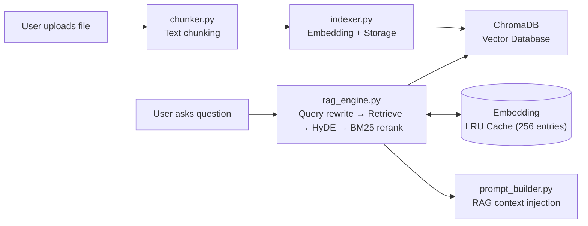
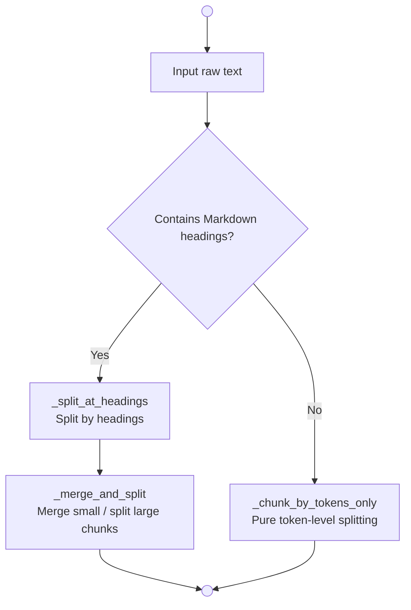
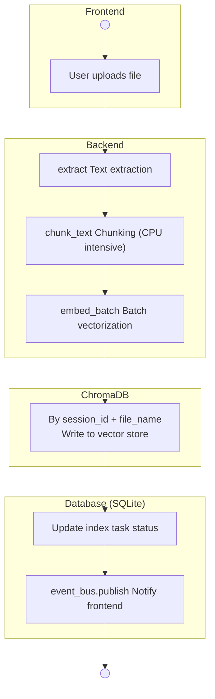
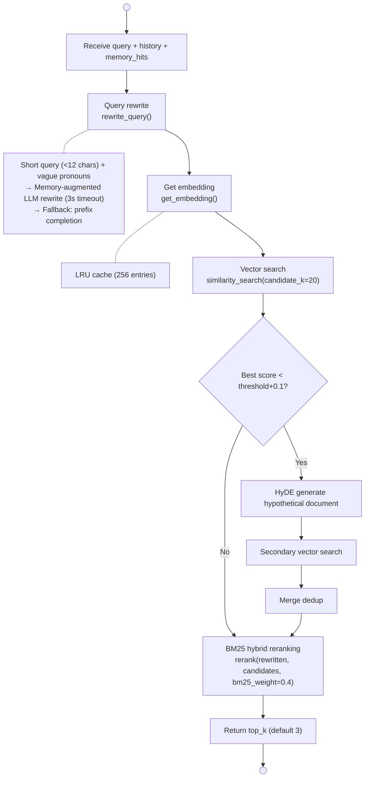

# Chapter 8: RAG Retrieval-Augmented Generation

> **Prerequisite**: Chapters 1–7 (Project Setup → Frontend & Backend Skeleton)
> **Focus of this chapter**: Turn documents into searchable knowledge, enabling AI to answer using your private data.

---

## 8.1 What is RAG?

**RAG (Retrieval-Augmented Generation)** is an engineering solution that addresses two major pain points of LLMs:

| Pain Point | How RAG Solves It |
|---|---|
| **Missing private knowledge** | Split your documents into chunks, store them as vectors, retrieve the most relevant content on query and inject into the Prompt |
| **Hallucination problem** | Retrieved original text serves as "reference answers"; the model is instructed to prioritize citing rather than fabricating |

In a nutshell: **"Search first, answer later."** When a user asks a question, the system does not call the LLM directly—it first finds relevant content from the document store and then feeds it to the LLM.

This project has a very complete RAG implementation. In this chapter, we will carefully break down the entire pipeline from file upload to answer citation.

---

## 8.2 Overall Architecture



Two main paths are clearly separated:

1. **Write path**: File → Chunk → Vectorize → Store in ChromaDB (offline / background execution)
2. **Query path**: Question → Rewrite → Vector retrieval → Optional HyDE → BM25 rerank → Inject into Prompt (hot path, requires low latency)

---

## 8.3 Vector Store Abstraction

### 8.3.1 Why Abstract?

Different vector databases (ChromaDB, Milvus, FAISS, Pgvector) have different APIs. If upper layers depend directly on a concrete implementation, switching costs are high. This project uses the classic **Interface + Adapter** pattern to solve this.

### 8.3.2 VectorStore Interface

```python
class VectorStore(ABC):
    @abstractmethod
    async def add(self, ids, embeddings, documents, metadatas) -> None: ...
    
    @abstractmethod
    async def similarity_search(
        self, query_embedding, filter=None, top_k=10
    ) -> list[dict]: ...
    
    @abstractmethod
    async def get_ids(self, filter) -> list[str]: ...
    
    @abstractmethod
    async def delete(self, ids) -> None: ...
    
    @abstractmethod
    async def count(self, filter=None) -> int: ...
    
    @abstractmethod
    async def health_check(self) -> tuple[bool, str]: ...
```

Six methods cover full CRUD + health check. **All are `async`**, because vector operations may involve I/O, and asynchrony ensures the event loop is not blocked.

### 8.3.3 ChromaAdapter Implementation

The project chose **ChromaDB** as the vector database for the following reasons:

- **Zero service dependency**: `PersistentClient` mode stores data in a local directory, no extra process needed
- **Metadata filtering**: Supports `where` clauses for precise filtering by fields such as `session_id`, `source_file`
- **Multiple distance metrics**: Uses `cosine` distance by default

Key design decisions:

```python
class ChromaAdapter(VectorStore):
    def __init__(self, distance_metric=None):
        self._distance_metric = distance_metric or settings.rag_distance_metric
        self._collection_name = "rag_documents"
```

**Global singleton client**: `get_chroma_client()` returns a shared `PersistentClient`, avoiding repeated initialization:

```python
_client = None

def get_chroma_client():
    global _client
    if _client is None:
        settings = get_settings()
        os.makedirs(settings.chroma_persist_dir, exist_ok=True)
        _client = chromadb.PersistentClient(
            path=settings.chroma_persist_dir,
            settings=ChromaSettings(anonymized_telemetry=False),
        )
    return _client
```

**Sync to async**: ChromaDB's SDK is synchronous; all calls are wrapped via `run_in_executor`:

```python
async def similarity_search(self, query_embedding, filter=None, top_k=10):
    loop = asyncio.get_running_loop()
    return await loop.run_in_executor(
        None, self._sync_similarity_search, query_embedding, filter, top_k
    )
```

This approach is simple and reliable—we don't need ChromaDB itself to be async, we just need it not to block within our coroutine framework.

**Distance → Score conversion**: ChromaDB returns distance (smaller = more similar), which is uniformly converted to a score (larger = more similar):

```python
for doc, meta, dist in zip(docs, metas, dists):
    score = 1.0 - dist  # Convert distance to similarity
    if score >= threshold:  # Filter low scores
        hits.append({...})
```

**Auto-create collection**: If the Collection does not exist on first access, it is created automatically, eliminating manual operations.

---

## 8.4 Intelligent Text Chunking

Text chunking is the foundation of RAG retrieval quality—chunks too large cause inaccurate retrieval, chunks too small cause fragmented context. This project's chunker employs a three-tier progressive strategy.

### 8.4.1 Three-Tier Strategy



### 8.4.2 Heading-Aware Splitting

```python
_HEADING_RE = re.compile(r"^#{1,6}\s+.+", re.MULTILINE)

def _split_at_headings(text, _cache=None):
    # Split by # to ###### headings
    # Content under the same heading belongs to one section
    # Record the token count for each section
```

This design is clever: when a heading is encountered, start a new section; the heading itself is retained as context information. During retrieval, a chunk carries its heading context (e.g., "3.2 Deployment Config\nSpecific content..."), allowing the LLM to better understand its source.

### 8.4.3 Merge and Split

```python
def _merge_and_split(sections, max_tokens, step):
    # Strategy 1: Merge small sections into buffer, not exceeding max_tokens
    # Strategy 2: Further split oversized sections by token count
    # Strategy 3: Retain the parent heading when splitting
```

Some carefully designed details:

- **Heading inheritance**: Every sub-chunk from an oversized section carries the original heading, preventing context loss
- **step = chunk_size - overlap**: The sliding window ensures semantic continuity between adjacent chunks
- **tiktoken caching**: Each encoding call caches the result, avoiding redundant computation

### 8.4.4 Code Block Protection

This is an easily overlooked but critical point—without it, the chunker would cut Python code in README files right in the middle.

```python
# Identify code fences
if stripped.startswith("```") or stripped.startswith("~~~"):
    # Enter/exit code block state
    # No heading splitting inside code blocks

# Identify HTML comments
if "<!--" in line:
    # Enter comment state, exit at -->
```

Lines inside code blocks and HTML comments are not treated as chunk boundaries. This ensures the integrity of technical documents (e.g., API docs containing embedded JSON examples).

---

## 8.5 File Index Lifecycle

### 8.5.1 Indexing Flow



Core code in `FileIndexer.index_file()`:

```python
async def index_file(self, db, session_id, file_name, text, task_id=None):
    # 1. Chunking (CPU intensive, via run_in_executor)
    chunks = await loop.run_in_executor(None, chunk_text, text)
    
    # 2. Batch embedding (one network call for all chunks)
    embeddings = await self._embedder.embed_batch(chunks)
    
    # 3. Generate IDs and metadata
    ids = [f"{session_id}_{file_name}_{i}" for i in range(len(chunks))]
    metadatas = [{
        "session_id": session_id,
        "source_file": file_name,
        "chunk_index": i,
        "total_chunks": len(chunks),
    } for i in range(len(chunks))]
    
    # 4. Write to vector store
    await self._store.add(ids=ids, embeddings=embeddings, 
                          documents=chunks, metadatas=metadatas)
    
    # 5. Update database task status
    await mark_completed(db, task_id, len(chunks))
```

Key optimization: **Batch embedding**. Instead of calling the embedding API per chunk, all chunks are sent at once, reducing network round trips.

### 8.5.2 Background Indexing + Event Bus

Large file indexing has latency; users should not have to wait. The project uses background tasks to solve this:

```python
async def index_file_background(self, db, session_id, file_name, file_content):
    try:
        task_id = await create_task(db, session_id, file_name)
        await self.index_file(db, session_id, file_name, file_content, task_id=task_id)
        await publish(session_id, "index_status", {
            "file": file_name, "status": "completed",
        })
    except Exception as e:
        await publish(session_id, "index_status", {
            "file": file_name, "status": "failed", "error": str(e),
        })
```

`event_bus.publish()` pushes indexing progress to the frontend via SSE, so users can see real-time status updates like "File X indexing completed" in the chat window.

### 8.5.3 Index Management

```python
# Count by session
await count_indexed_chunks(session_id)

# Delete by file
await delete_file_index(session_id, file_name)

# Delete entire session index
await delete_session_index(session_id)

# List indexed files
await list_indexed_files(db, session_id)
```

Index management is complete—add, delete, and query are all supported; deletion cleans up metadata in both ChromaDB and SQLite.

---

## 8.6 RAG Engine Deep Dive

`RAGEngine.search()` is the most central method in the entire system. The complete retrieval pipeline is as follows:



### 8.6.1 Query Rewrite

Users often ask "How to fix this?" or "Why is it wrong?"—these short queries contain vague pronouns and yield poor results with direct vector search.

```python
@staticmethod
def _needs_rewrite(query):
    if _QUESTION_HEAD_RE.match(query):
        return False  # Independent question, no rewrite needed
    return len(query) < 12 and bool(_VAGUE_PRONOUN_RE.search(query))
    # "this", "that", "it", "they"...
```

Two strategies are used when rewrite is triggered:

1. **Memory-augmented rewrite** (preferred): If semantic memory hits are available, use relevant conversation context to let the LLM complete the short query
2. **Prefix completion** (fallback): Concatenate the first 80 characters of the previous user message with the current query

```python
async def rewrite_query(self, query, history, memory_hits=None):
    if memory_hits:
        # LLM rewrite, 3-second timeout
        rewritten = await asyncio.wait_for(
            provider.complete([...], max_tokens=50, temperature=0),
            timeout=3,
        )
    # Fallback
    if last_user:
        return f"{last_user[:80]} -> {query}"
```

### 8.6.2 HyDE Secondary Retrieval

**HyDE (Hypothetical Document Embeddings)** is a clever retrieval enhancement technique: it asks the LLM to "guess" a possible answer document based on the query, then uses the fake document's vector for retrieval—often yielding better results than using the question vector directly.

```python
if best_score < hyde_threshold and get_config("rag_hyde_enabled"):
    hypo = await self.generate_hypothetical(rewritten, memory_hits=memory_hits)
    hypo_emb = await self.get_embedding(hypo)
    hyde_candidates = await self._store.similarity_search(
        query_embedding=hypo_emb, filter=filter_cond, top_k=candidate_k,
    )
    # Dedup merge
    seen_ids = {c.get("id") for c in candidates}
    for c in hyde_candidates:
        if c.get("id") not in seen_ids:
            candidates.append(c)
```

The trigger condition for HyDE is `best_score < threshold + 0.1`—it is only activated when retrieval quality is insufficient, avoiding unnecessary LLM calls.

### 8.6.3 BM25 Hybrid Reranking

Pure vector search excels at semantic matching but is insensitive to keywords. For example, when searching for "Ollama configuration", "Ollama startup parameters" might score highest, while "Configuring Ollama's timeout" ends up lower.

BM25 is a classic keyword matching algorithm. Weighted fusion with vector scores balances semantics and keywords:

```python
def rerank(query, candidates, bm25_weight=0.4):
    # 1. BM25 tokenization for all candidate documents (CJK by bigram)
    tokenized_corpus = [_tokenize(c["text"]) for c in candidates]
    bm25 = BM25Okapi(tokenized_corpus)
    bm25_scores = bm25.get_scores(_tokenize(query))
    
    # 2. Normalize BM25 scores
    bm25_max = bm25_scores.max() if bm25_scores.max() > 0 else 1.0
    
    # 3. Weighted fusion: 0.6×vector + 0.4×BM25
    for i, c in enumerate(candidates):
        vec_part = c["score"] * (1 - bm25_weight)
        bm25_norm = bm25_scores[i] / bm25_max
        c["score"] = round(vec_part + bm25_weight * bm25_norm, 4)
    
    candidates.sort(key=lambda c: c["score"], reverse=True)
    return candidates
```

The tokenizer handles Chinese and English differently:
- **English**: Split by word
- **Chinese / Japanese / Korean**: Split by bigram (two-character groups), the standard approach for languages without spaces

### 8.6.4 Embedding LRU Cache

The same text may be queried multiple times (e.g., a user asks "Why?" then "How to fix that?"), and calling the embedding API each time is wasteful.

```python
_embedding_cache: OrderedDict[str, list[float]] = OrderedDict()
_EMBEDDING_CACHE_MAX = 256

async def get_embedding(self, text):
    if text in _embedding_cache:
        _embedding_cache.move_to_end(text)  # Mark as most recently used
        return _embedding_cache[text]
    
    vector = await self._embedder.embed(text)
    if len(_embedding_cache) >= _EMBEDDING_CACHE_MAX:
        _embedding_cache.popitem(last=False)  # Evict oldest
    _embedding_cache[text] = vector
    return vector
```

Using `OrderedDict` for LRU is very clean: `move_to_end` marks the most recently used, `popitem(last=False)` evicts the oldest. The cap of 256 entries ensures the cache does not grow indefinitely.

---

## 8.7 RAG Context Injection into Prompt

The retrieved results must ultimately be injected into the message sent to the LLM. This is handled by `prompt_builder.py`:

```python
def _format_rag_section(rag_context):
    lines = []
    for i, chunk in enumerate(rag_context):
        lines.append(
            f"[Knowledge Base] [{i+1}] {chunk['source_file']}"
            f" (Relevance: {chunk['score']})\n\n{chunk['text']}"
        )
    return "<Reference>\n" + "\n\n".join(lines) + "\n</Reference>"
```

The injected prompt structure is clear:

```xml
<Reference>
[Knowledge Base] [1] deployment_doc.md (Relevance: 0.85)

Docker Compose deployment requires configuring environment variables...

[Knowledge Base] [2] API_interface.md (Relevance: 0.72)

POST /api/chat interface parameter description...
</Reference>

<Instruction>
Please answer strictly based on the above reference materials; cite sources when necessary.
If the materials are insufficient, directly state that you do not know.
</Instruction>

<User Question>
How to deploy this service?
</User Question>
```

The two XML tags `<Reference>` and `<Instruction>` clearly separate different information domains. The LLM is instructed to "strictly base" its answer on the references—this is key to reducing hallucinations.

Chunk selection follows a **greedy fill** strategy: sort by relevance descending, fill up to the token budget (35% of context budget):

```python
def _select_rag_chunks(rag_context, budget):
    selected = []
    used = 0
    for chunk in sorted(rag_context, key=lambda c: c["score"], reverse=True):
        if used + count_tokens(chunk["text"]) <= budget:
            selected.append(chunk)
            used += count_tokens(chunk["text"])
    return selected
```

---

## 8.8 Service Layer Facade

`rag_service.py` uses the Facade pattern, wrapping the underlying `RAGEngine` and `FileIndexer` into concise functional interfaces:

```python
class _RAGService:
    """Class-level singleton to avoid global variable pollution from uvicorn --reload"""
    vector_store = None
    embedder = None
    _rag_engine = None
    _file_indexer = None

# Callers directly invoke functions
await search(query, session_id, history=history)
await index_file(db, session_id, file_name, text)
await delete_file_index(session_id, file_name)
```

The router layer is unaware of `RAGEngine`'s concrete implementation; switching vector databases or reranking algorithms requires no changes to routing code.

---

## 8.9 Performance Tuning Parameters

All tuning parameters are centralized in `runtime_config.py` and support hot modification at runtime:

| Parameter | Default | Description |
|---|---|---|
| `rag_chunk_size` | 800 | Token limit per chunk |
| `rag_chunk_overlap` | 200 | Overlap tokens between adjacent chunks |
| `rag_top_k` | 3 | Number of chunks finally returned to the LLM |
| `rag_score_threshold` | 0.35 | Low-score filtering threshold |
| `rag_candidate_k` | 20 | Number of candidates for vector retrieval |
| `rag_bm25_weight` | 0.4 | BM25 weight in hybrid reranking |
| `rag_hyde_enabled` | True | Whether to enable HyDE secondary retrieval |

**Tuning recommendations**:

- **Long documents (>10 pages)**: Increase `rag_chunk_size` to 1000-1200 to reduce fragmentation
- **Q&A scenarios**: Set `rag_top_k` to 5, increase `rag_bm25_weight` to 0.5 to enhance keyword matching
- **Low-latency scenarios**: Disable `rag_hyde_enabled` to reduce one round of LLM calls

---

## 8.10 Chapter Summary

In this chapter, we thoroughly dissected the complete RAG pipeline:

1. **Vector store**: `VectorStore` abstraction + `ChromaAdapter` implementation, using `run_in_executor` to solve async wrapping of a synchronous SDK
2. **Intelligent chunking**: Heading-aware + token-level splitting + code block protection, a three-tier progressive strategy
3. **File indexing**: Chunk → batch embedding → write to ChromaDB, background execution + SSE status push
4. **RAG engine**: Query rewrite (short query completion) → vector retrieval → HyDE secondary retrieval (triggered on low quality) → BM25 hybrid reranking
5. **Context injection**: Greedy fill, XML tag structuring, source annotation
6. **Optimization**: Embedding LRU cache (256 entries), batch vectorization, hot-tunable runtime parameters

With RAG, AI can reference your documents when answering. The next chapter introduces **semantic memory**, allowing AI to remember what you've talked about.
