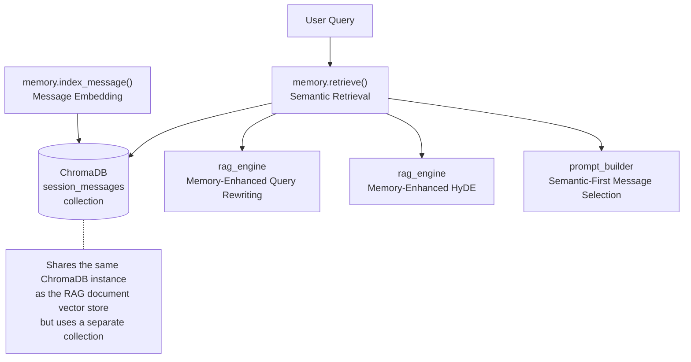
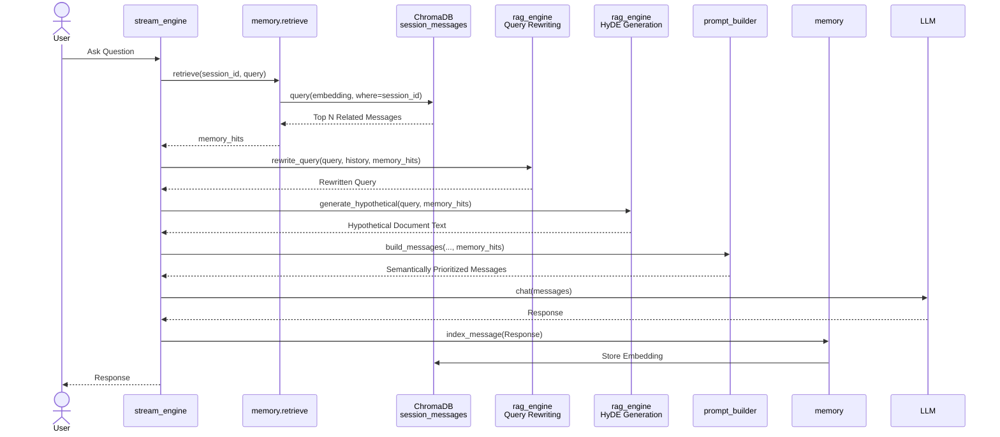

# Chapter 9: Semantic Memory System

> **Prerequisite**: Chapter 8 (RAG — Retrieval-Augmented Generation, understanding the basics of vector stores)
> **Focus of this chapter**: Enabling AI to remember what you've talked about — not by rote memorization, but as semantically associative "intelligent recall."

---

## 9.1 The Essence of the Problem

LLMs are inherently **stateless**. If you ask "What did I change that parameter to just now?", it has no idea what "just now" refers to — because every request is isolated, and the context window only contains the raw text of the last few dozen messages.

But when you and I have a conversation, it's different:

- You don't need to restate the project background from three turns ago
- When I say "that config", you can recall `rag_chunk_size` from half an hour ago
- Memory is evoked by **semantic relevance**, not chronological order

This project's memory system simulates that very mechanism — it's called **Semantic Active Working Memory**.

### 9.1.1 Comparison: Naive History vs. Semantic Memory

```
Naive history approach:
  [msg1] [msg2] [msg3] ... [msg50] → context full, old information is pushed out

Semantic memory approach:
  Current query → Vector search → Top 5 most relevant historical messages → Inject into context
```

The problem with the naive approach is **passive truncation** — the earliest messages are always dropped first, no matter how important they are. Semantic memory is **active selection** — the messages most relevant to the current question can always be retrieved, even if they happened 100 turns ago.

---

## 9.2 Architecture Design



The memory system reuses the existing ChromaDB and embedding infrastructure, using a dedicated `session_messages` collection that is completely isolated from `rag_documents`.

---

## 9.3 Message Indexing

Every message is indexed into the vector store immediately after it is generated:

```python
async def index_message(
    session_id: str,
    message_id: int,
    role: str,
    content: str,
    max_per_session: int = 500,
    cleanup_batch: int = 100,
):
    _ensure()  # Lazily initialize the collection

    text = content[:2000]  # Truncate to the first 2000 characters for embedding
    if not text.strip():
        return

    embedding = await get_embedding(text)

    await loop.run_in_executor(
        None,
        lambda: _collection.add(
            ids=[f"msg_{session_id[:8]}_{message_id}"],
            embeddings=[embedding],
            documents=[f"{role}: {text}"],
            metadatas=[{
                "session_id": session_id,
                "role": role,
                "message_id": message_id,
            }],
        ),
    )

    # Clean up the oldest messages when capacity is exceeded
    await loop.run_in_executor(
        None,
        lambda: _cleanup_session(session_id, max_per_session, cleanup_batch),
    )
```

Several design choices worth noting:

**Truncate to 2000 characters**: Embedding models typically have a limit of around 512 tokens. 2000 characters is safe for this limit, and the semantics of most messages are sufficiently expressed within the first 2000 characters.

**Document format `{role}: {content}`**: The stored text includes a role prefix. When retrieved later, you see the full context directly, e.g., `"user: Where do I set the Ollama timeout parameter?"`

**Sync-to-async**: As in the RAG chapter, ChromaDB's synchronous calls are wrapped via `run_in_executor` to avoid blocking the event loop.

---

## 9.4 Semantic Retrieval

Retrieval is the symmetric operation to indexing — given the embedding of the current query, find the N most similar entries in the `session_messages` collection:

```python
async def retrieve(
    session_id: str,
    query: str,
    top_k: int = 5,
    min_score: float = 0.4,
) -> list[dict]:
    query_emb = await get_embedding(query)

    results = await loop.run_in_executor(
        None,
        lambda: _collection.query(
            query_embeddings=[query_emb],
            where={"session_id": session_id},
            n_results=top_k + 5,  # Retrieve extra candidates then filter
            include=["documents", "metadatas", "distances"],
        ),
    )

    hits = []
    for doc, meta, dist in zip(docs, metas, dists):
        score = round(1.0 - dist, 4)
        if score >= min_score:  # Low-relevance filter
            hits.append({
                "text": doc,
                "role": meta.get("role", "user"),
                "message_id": meta.get("message_id"),
                "score": score,
            })
    return hits[:top_k]
```

`min_score=0.4` is a low-relevance filter — "recall" that is too irrelevant is better left unused, to avoid injecting noise into the LLM.

`n_results=top_k+5` is the over-fetch strategy: retrieve more candidates first, then filter out low-scoring ones before truncating, ensuring sufficient valid results.

---

## 9.5 Memory-Enhanced Query Rewriting

Chapter 8 mentioned "memory-enhanced rewriting" when discussing query rewriting. Now let's look at the concrete implementation:

```python
async def rewrite_query(self, query, history, memory_hits=None):
    if memory_hits:
        # Take the top 3 memories, each truncated to 200 characters
        ctx_lines = [h.get("text", "")[:200] for h in memory_hits[:3]]
        memory_ctx = "\n".join(ctx_lines)
        
        prompt = (
            "You are a query rewriting assistant. Below is a relevant conversation history and the original question.\n"
            "Please rewrite the original question to be more complete and self-contained, retaining all key information.\n"
            f"Relevant conversation:\n{memory_ctx}\n\n"
            f"Original question: {query}"
        )
        
        rewritten = await asyncio.wait_for(
            provider.complete([...], max_tokens=50, temperature=0),
            timeout=3,  # 3-second timeout, won't block the main flow
        )
        if rewritten:
            return rewritten
```

A concrete example:

```
Original query: "What is its default value?"
Memory hit:     "user: Where do I set the Ollama timeout parameter?"

Rewritten result: "What is the default value of the Ollama timeout parameter?"
```

Without memory, "its" can only be resolved by simple concatenation with the previous message. With memory, it can trace back to relevant content from any number of turns ago for precise completion.

---

## 9.6 Session Cleanup Strategy

Vector stores cannot grow indefinitely. Expired memories slow down retrieval, consume disk space, and reduce retrieval relevance (because the pool becomes too large).

```python
def _cleanup_session(session_id, max_messages, batch_size):
    result = _collection.get(where={"session_id": session_id}, include=["metadatas"])
    ids = result.get("ids", [])
    metas = result.get("metadatas", [])

    if len(ids) <= max_messages:
        return  # Within limit, no cleanup needed

    # Sort by message_id, delete the oldest batch_size entries
    sorted_pairs = sorted(zip(ids, metas), 
                          key=lambda x: x[1].get("message_id", 0))
    delete_count = min(len(ids) - max_messages, batch_size)
    delete_ids = [p[0] for p in sorted_pairs[:delete_count]]
    _collection.delete(ids=delete_ids)
```

The cleanup strategy is very conservative:

- **Trigger**: Message count exceeds 500 (`max_per_session` default)
- **Batch size**: Only 100 entries deleted at a time (`cleanup_batch`), gradual cleanup
- **Deletion rule**: Delete the oldest by `message_id` ascending — the further back in time, the lower the relevance typically is

This avoids the performance spikes caused by "one-shot" bulk cleanup.

---

## 9.7 Memory in Prompt Construction

The memory retrieval results are also passed to `prompt_builder.py` to enable "semantic-first" selection of historical messages:

```python
def build_messages(..., memory_hits=None, max_context_tokens=24000):
    # Retrieve all historical messages
    past = history[:-1]
    
    # Separate semantically relevant messages from others
    relevant_ids = {h["message_id"] for h in (memory_hits or [])}
    relevant_msgs = [msg for msg in past if msg.get("id") in relevant_ids]
    other_msgs = [msg for msg in past if msg.get("id") not in relevant_ids]

    # 1) Prioritize semantically relevant messages (descending by relevance)
    for msg in relevant_msgs:
        if accumulated + msg_tokens > history_budget: break
        selected.append(msg)

    # 2) Then fill with remaining messages from newest to oldest
    for msg in reversed(other_msgs):
        if accumulated + msg_tokens > history_budget: break
        selected.append(msg)

    # 3) Restore chronological order by original id
    selected.sort(key=lambda m: m.get("id", 0))
```

This dual-priority strategy is quite elegant:

1. **Semantic relevance first**: Messages hit by memory are retained first, no matter how old
2. **Recency second**: Remaining space is filled from newest to oldest
3. **Final sort restores timeline**: The LLM sees an ordered conversation timeline, not a jumbled patchwork

---

## 9.8 Configuration Control

The memory system is controlled by a global toggle in `config.py`:

```python
class Settings(BaseSettings):
    memory_enabled: bool = True  # Enabled by default
```

When disabled, neither `index_message` nor `retrieve` is called, and the memory system becomes completely silent. This is useful in the following scenarios:

- **One-off consultations**: The user only asks one or two questions and leaves; memory offers no cost-benefit
- **Sensitive scenarios**: Privacy-sensitive data where persistence of any content is undesirable
- **Debugging**: Isolating the memory system to troubleshoot issues

---

## 9.9 Complete Memory Retrieval Flow



Throughout the flow, memory participates in four stages:

1. **Retrieval**: Find historical messages semantically related to the current question
2. **Query Rewriting**: Use memory context to complete vague pronouns and short queries
3. **HyDE Generation**: Use memory context to generate more accurate hypothetical documents
4. **Prompt Construction**: Semantically relevant historical messages are prioritized into the context window

---

## 9.10 Usage Scenario Analysis

### When Memory is Effective

- **Follow-up questions in long conversations**: "How do I change that parameter you mentioned earlier?" — memory can precisely locate the parameter discussion from 30 turns ago
- **Interleaved topics**: First discuss deployment, then API authentication, then back to deployment — memory retrieves by semantics, not by time
- **Collaborative troubleshooting**: The user iterates through errors, each error report related to the previous ones

### When Memory Adds Little Value

- **Single-turn FAQ**: "What does Python's `__init__` mean?" — only one turn, no memory needed
- **Highly repetitive**: The same questions every time; memory retrieval results don't change much
- **Context already sufficient**: The question itself already has enough information within the most recent 10 messages

---

## 9.11 Session Lifecycle

```python
# Delete all memories for a session
async def delete_session(session_id):
    result = await loop.run_in_executor(
        None, lambda: _collection.get(where={"session_id": session_id}, include=[])
    )
    ids = result.get("ids", [])
    if ids:
        await loop.run_in_executor(None, lambda: _collection.delete(ids=ids))
```

When a user deletes a session or the entire conversation history, the associated memories are cleaned up synchronously, leaving no residual data.

---

## 9.12 Chapter Summary

The semantic memory system solves the LLM's "forgetfulness" problem with very low engineering cost (reusing existing ChromaDB + embedding):

1. **Message Indexing**: Each message is truncated to the first 2000 characters, embedded, and stored in a dedicated `session_messages` collection
2. **Semantic Retrieval**: The current query retrieves the most relevant historical messages, filtered by relevance score
3. **Multi-purpose Usage**: Memory is simultaneously used for query rewriting, HyDE generation, and prompt construction
4. **Controlled Cleanup**: 500 messages per session cap, with gradual deletion of the oldest messages
5. **Global Toggle**: Controlled by `memory_enabled`, can be turned off for sensitive scenarios

This is a classic "small but beautiful" design — no reinventing the wheel, no new dependencies, using existing vector infrastructure to achieve a transformative leap in user experience.

The next chapter will discuss **web search integration** — how to intelligently "search the internet" when the local knowledge base is insufficient.

