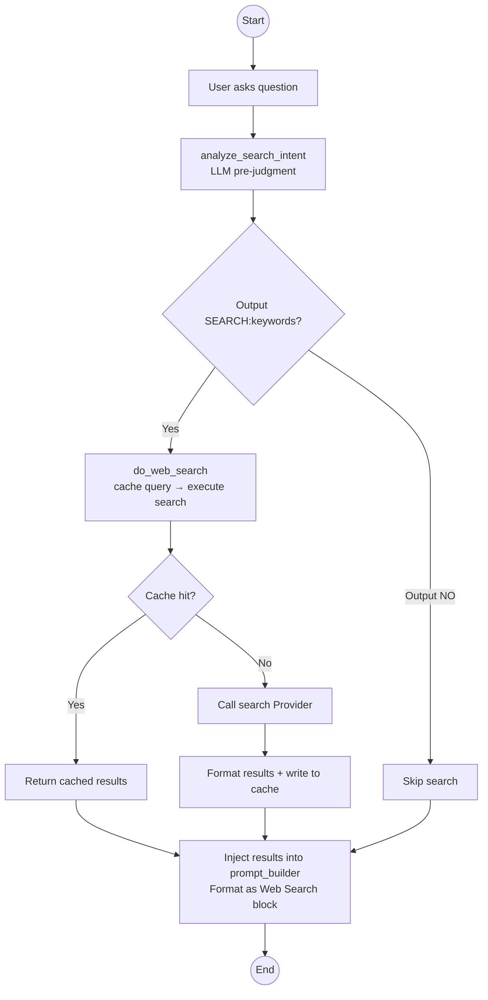
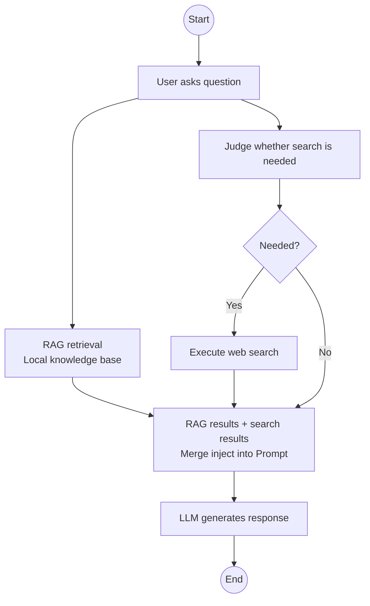

# Chapter 10 — Web Search Integration

> **Prerequisite**: Chapter 8 (RAG, understanding context enrichment mechanisms)  
> **Focus**: When the local knowledge base is insufficient, enabling the AI to intelligently decide and search the web.

---

## 10.1 Why Do We Need Web Search?

RAG solves the problem of **private knowledge** — your documents, code, meeting notes. But there are types of questions RAG cannot cover:

| Question Type | Can RAG answer? | Example |
|---|---|---|
| Your project deployment docs | Yes, because they're indexed | "How to configure Redis password?" |
| News from two days ago | No, no such document | "What did OpenAI release yesterday?" |
| Latest API docs | No, version too new | "Python 3.14 new features?" |
| Real-time data | No, outdated | "What's the current Bitcoin price?" |

Web search fills this gap — it allows the AI to proactively look things up online when it encounters a "knowledge blind spot," rather than making things up (hallucination) or saying "I don't know."

However, this project does not search for every question. **Blind search = wasted resources + noise injection**. It has an intelligent decision flow for "whether to search."

---

## 10.2 Search Decision Flow



The entire flow is divided into three layers: **Pre-judgment → Execution → Injection**. Pre-judgment is a zero-cost decision (LLM call, but only 15 tokens output), execution has search cost, and injection is purely text formatting.

---

## 10.3 Search Provider Abstraction

The project supports two search backends, switchable via configuration:

```python
# config.py
search_provider: str = "duckduckgo"
tavily_api_key: str = ""
```

### 10.3.1 DuckDuckGo (Default, Free)

- **Zero configuration**: No API Key needed, plug-and-play
- **Privacy-friendly**: No user tracking, no search history stored
- **Thread concurrency**: `ThreadPoolExecutor` accelerates multi-page fetching
- **Limitation**: Unstructured, requires self-extraction of content

### 10.3.2 Tavily (Optional, Enhanced)

- **Structured results**: Built-in content summaries with title, URL, relevance score
- **AI-oriented**: Search API specifically designed for AI applications
- **Requires API Key**: Configured via `TAVILY_API_KEY` environment variable

Provider switching is completely transparent to the upper layer — `get_search_provider()` returns the corresponding instance based on configuration, and the caller only cares about `provider.search(query, max_results)`.

---

## 10.4 Intelligent Pre-judgment: To Search or Not?

This is the most valuable design of the search module — not every question needs a search. An **extremely lightweight intent analysis** is performed using LLM (15-token output + 3-second timeout):

```python
async def analyze_search_intent(query, history):
    if not settings.web_search_precheck:  # toggle
        return query  # skip pre-judgment, search directly

    context_parts = []
    if history:
        # take last 2 user messages as conversation context
        for msg in reversed(history[-6:]):
            if msg.get("role") == "user" and len(context_parts) < 2:
                context_parts.append(msg.get("content", ""))

    prompt = (
        "判断是否需要联网搜索。\n\n"
        f"历史对话：{' | '.join(reversed(context_parts))}\n\n"
        f"问题：{query}\n\n"
        "仅输出：\n"
        "SEARCH:关键词（需搜索）\n"
        "NO（不需要）"
    )

    content = await asyncio.wait_for(
        provider.complete([...], max_tokens=15, temperature=0),
        timeout=3,
    )

    if content.startswith("SEARCH:"):
        return content[len("SEARCH:"):].strip()  # return search keywords
    return None  # no search needed
```

The output protocol has only two possibilities:

| LLM Output | Meaning | Next Action |
|---|---|---|
| `SEARCH:OpenAI o3 release` | Search needed, keywords extracted | Execute search with keywords |
| `NO` | Not needed | Skip search |
| Other/Timeout | Cannot determine | Fallback to `query`, execute search |

The accuracy of pre-judgment depends on the LLM's judgment. However, the 3-second timeout + 15-token output makes its cost extremely low — even with occasional misjudgments, "should have searched but didn't" is far worse than "shouldn't have searched but did."

**Fallback strategy** is also important — if pre-judgment times out or throws an exception, **execute the search** by default. Better to search once too many than miss once.

---

## 10.5 Search Execution + Cache

```python
# TTLCache: 128 entries, auto-expire after 5 minutes
_search_cache: TTLCache = TTLCache(maxsize=128, ttl=300)

async def cached_search(provider, query, max_results=5):
    key = (query.strip(), max_results)
    if key in _search_cache:
        return _search_cache[key]  # cache hit

    results = await provider.search(query, max_results=max_results)
    _search_cache[key] = results
    return results
```

`TTLCache` is a data structure from the `cachetools` library, supporting two eviction strategies simultaneously:

- **TTL expiry**: Auto-expires after 5 minutes, avoiding stale data
- **LRU eviction**: Max 128 entries, evicts least recently accessed when exceeded

The cache key is a `(query, max_results)` tuple — the same search term and result count only execute once within 5 minutes.

### Result Formatting

Search results are truncated based on a **token budget** to avoid blowing up the context window:

```python
async def do_web_search(query, max_results=5):
    results = await cached_search(provider, query, max_results)
    
    context = [
        {"source_file": r.url, "score": r.score, 
         "text": r.content, "title": r.title}
        for r in results
    ]
    
    # Truncate by character budget (1 token ≈ 4 chars)
    max_chars = get_config("search_max_context_tokens") * 4
    total = 0
    for i, item in enumerate(context):
        total += len(item["text"])
        if total > max_chars:
            context = context[:i]
            break
    return context
```

The error handling here is thoughtful: when `total > max_chars`, it **keeps the already-loaded results** rather than directly discarding the current item — ensuring at least some search results are available.

---

## 10.6 Search Context Injection into Prompt

The format of search results is similar to RAG results, but with **different instructions**:

```python
def _format_web_section(web_context):
    lines = []
    for i, r in enumerate(web_context):
        title = r.get("title", "") or r["source_file"]
        lines.append(f"[联网搜索] [{i+1}] {title}\n\n{r['text']}")
    return "<联网搜索>\n" + "\n\n".join(lines) + "\n</联网搜索>"

def _pick_instruction(has_rag, has_web):
    if has_rag and has_web:
        return (
            "请参考以上资料回答。对于参考资料中的内容请严格依据并标注来源；"
            "对于联网搜索结果请结合你的知识回答，不要照搬原文。"
            "引用联网搜索时用 [N] 标注来源编号（如 [1][2]）。"
            "若资料不足请直接说不知道。"
        )
    if has_rag:
        return "请严格依据以上参考资料回答，必要时标注来源。若资料不足请直接说不知道。"
    return (
        "以下是联网搜索结果，每项以 [N] 编号。请结合你的知识回答，"
        "引用时用 [N] 标注来源（如 [1][2]）。"
        "不要直接照搬搜索内容。"
    )
```

In the RAG scenario, the instruction is "strictly follow" because you trust your own documents. In the search scenario, the instruction is "integrate with your knowledge, cite sources, don't copy verbatim" — because the reliability of search results varies.

Source citation `[1] [2]` provides users with verifiable references, which is also a key mechanism for reducing hallucinations.

---

## 10.7 Collaboration Mode Between Search and RAG

In `stream_engine.py`, search and RAG execute **in parallel**:



This is not a serial mode where you search RAG first and then Web if insufficient — it's **simultaneous execution**. Advantages:

- **Minimal latency**: Both searches are parallel, total latency = `max(RAG latency, Search latency)`
- **No mutual blocking**: RAG returns fast but low quality? Web is already searching too
- **Cross-reference possible**: LLM can reference both sources simultaneously for cross-verification

---

## 10.8 Configuration Parameters

| Parameter | Default | Description |
|---|---|---|
| `search_provider` | `"duckduckgo"` | Search backend selection |
| `web_search_precheck` | `True` | Enable LLM pre-judgment (disable = search everything) |
| `search_cache_ttl` | `300` | Cache validity period (seconds) |
| `search_max_results` | `5` | Number of results per search |
| `search_max_context_tokens` | `4000` | Max tokens for search results in context |

All parameters support runtime hot modification (via JSON persistence in `runtime_config.py`).

---

## 10.9 Privacy Considerations

The project uses **DuckDuckGo** as the default search Provider by intentional choice:

1. **No tracking**: DDG does not collect users' search history
2. **Local execution**: Search requests originate locally, no need to pass through third-party AI services
3. **No API Key**: No risk of key leakage

When switching to **Tavily**, note:
- Search content passes through Tavily's servers
- Requires `TAVILY_API_KEY` configuration (recommended via `.env` file)
- Suitable for scenarios with higher search quality requirements and less privacy sensitivity

---

## 10.10 Error Handling and Degradation

The search module's fault tolerance is robust:

```python
# Pre-judgment timeout → fallback to original query, continue search
except asyncio.TimeoutError:
    return query

# Pre-judgment exception → fallback to original query, continue search  
except Exception:
    return query

# Search failure → return None, upper layer perceives as "no search results"
if not results:
    return None
```

**Search failure does not affect the main Q&A flow.** Even if search goes down, RAG results remain available, and the LLM answers based solely on local knowledge.

---

## 10.11 Search Status API

The frontend can query the search configuration status (configured / not configured) via API, providing users with clear capability hints:

- DuckDuckGo: Always available (free, local)
- Tavily: Check if API Key is configured

This allows the UI to dynamically display the status of "Can web search be used right now?"

---

## 10.12 Chapter Summary

Web search expands the AI assistant's capability boundary from "what's in your documents" to "what can be found on the internet":

1. **Provider abstraction**: DuckDuckGo (free/privacy) and Tavily (structured) dual backends, switchable via configuration
2. **Intelligent pre-judgment**: LLM determines "whether to search" with extremely low cost (15-token output + 3-second timeout)
3. **Result caching**: TTLCache (128 entries, 5 minutes), avoiding duplicate searches
4. **Token budget**: Search results truncated by character budget to prevent context overflow
5. **Parallel execution**: Search and RAG run simultaneously, without mutual blocking
6. **Degradation and fault tolerance**: Search failure does not affect the main flow; default to executing search when pre-judgment throws exception

Next chapter we will discuss **History Compression Strategy** — how to intelligently trim and summarize when conversation length exceeds the context window, ensuring long conversation quality.
