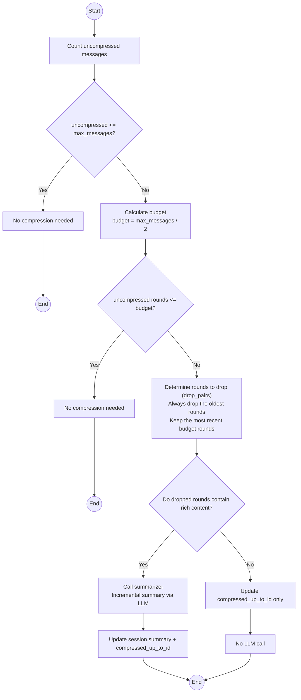
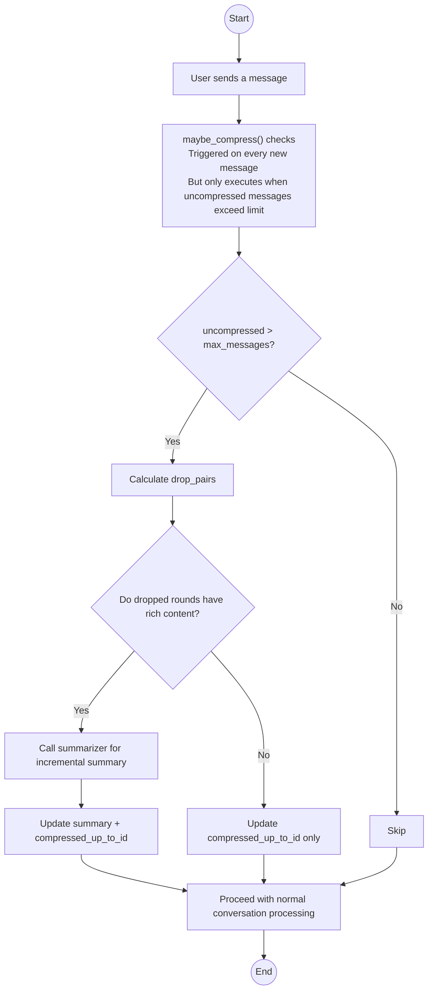

# Chapter 11: History Compression Strategy

> **Prerequisite**: Chapter 8 (RAG/Context Budget), Chapter 9 (Semantic Memory)  
> **Focus**: Long conversations don't expand infinitely — intelligent trimming + on-demand summarization, maintaining context quality.

---

## 11.1 The Context Window Paradox

LLM context windows keep growing (from 4K to 128K or even 1M), but this doesn't solve the fundamental problems:

| Phenomenon | Reason |
|---|---|
| Larger windows, slower responses | More tokens = longer inference time |
| Key information gets diluted | Old messages occupy space, LLM attention degrades in long contexts (Lost in the Middle) |
| Cost grows linearly | API billed per token; 104 messages vs. a 10-turn conversation differ by an order of magnitude |

**A context window is like a desk — bigger isn't always better; what matters is how you arrange things.** The compression strategy in this project isn't brute-force trimming — it's **hybrid compression**: trimming (free) + summarization (on-demand), spending only the necessary cost.

---

## 11.2 Hybrid Compression Strategy



Core design philosophy: **Two tools, different costs**.

| Tool | Cost | What It Does | Trigger Condition |
|---|---|---|---|
| **Trim** | Zero LLM cost | Discards the oldest N rounds of conversation | Always executed |
| **Summarize** | One LLM call | Generates a one-sentence summary of dropped rounds | Dropped rounds contain "rich content" |

---

## 11.3 Data Model: Watermark Pattern

Compression does not modify or delete database message records. Instead, it uses a **watermark** to mark which part of history has been "processed":

```python
# Key fields of the session table
compressed_up_to_id: int | None  # Messages up to this ID have been compressed
summary: str | None              # Accumulated summary text
```

How it works:

```
Messages table:
  id=1  id=2  id=3  ......  id=50  id=51  id=52
  |<---- compressed_up_to_id=50 ---->|<-- uncompressed -->|

When building the Prompt:
  - Compressed part: represented by the summary field (one sentence)
  - Uncompressed part: loaded as-is (most recent messages, fully preserved)
```

This is a classic Watermark pattern. It has several advantages:

1. **No data loss**: Not a single message is deleted from the database; the full history can be revisited at any time
2. **Idempotent re-entry**: Each compression only processes messages "above the watermark," never reprocessing
3. **Increment-friendly**: Each compression just updates the watermark — no need to recalculate all messages

---

## 11.4 Compression Trigger Conditions

```python
async def maybe_compress(db, session_id, max_messages):
    session = await get_session(db, session_id)
    compressed_up_to_id = session.get("compressed_up_to_id") if session else None

    # Only count uncompressed messages
    uncompressed = await count_messages(db, session_id, 
                                         after_id=compressed_up_to_id)

    if uncompressed <= max_messages:
        return (0, False)  # No compression needed

    # Get uncompressed messages
    all_msgs = await get_messages(db, session_id, 
                                   limit=uncompressed, after_id=compressed_up_to_id)
```

The trigger condition is straightforward: **uncompressed message count exceeds the threshold**. It's not judged by "total message count" but by "uncompressed message count" — already compressed parts won't trigger compression again.

---

## 11.5 Trimming Strategy

```python
pairs = _extract_pairs(all_msgs)  # user-assistant pairing

budget = max_messages // 2  # Round budget = message count / 2
if len(pairs) <= budget:
    return (0, False)

# Drop the oldest rounds, keep the most recent budget rounds
drop_pairs = pairs[:len(pairs) - budget]
last_id = drop_pairs[-1].last_id
```

Key design points:

- **Halved budget**: `budget = max_messages // 2`, ensuring enough space remains after compression
- **Minimum two rounds retained**: `_COMPRESS_MIN_ROUNDS` prevents over-compression leading to barren context
- **Trim by rounds**: Not by message count, but by "user-assistant" pair trimming — clean logic

The `_extract_pairs` implementation:

```python
def _extract_pairs(msgs):
    """Extract user-assistant round pairs from an ordered message list"""
    pairs = []
    i = 0
    while i < len(msgs):
        if msgs[i].get("role") == "user":
            user_msg = msgs[i]
            asst_msg = None
            last_id = user_msg["id"]
            if i + 1 < len(msgs) and msgs[i + 1].get("role") == "assistant":
                asst_msg = msgs[i + 1]
                last_id = asst_msg["id"]
                i += 2
            else:
                i += 1  # User message without assistant reply (possibly pending)
            pairs.append(_Pair(user=user_msg, assistant=asst_msg, last_id=last_id))
        else:
            i += 1
    return pairs
```

`last_id` takes the ID of the last message in each round. This value is used to update the watermark — only complete user-assistant rounds are marked as compressed.

---

## 11.6 Rich Content Detection

Not all dropped rounds are worth summarizing. A casual "hello" can be dropped without a second thought. But if a user spent half an hour debugging a bug with the AI, discarding it without a summary would be a serious information loss.

```python
_RICH_THRESHOLD = 200  # Assistant reply exceeding 200 characters is considered "rich content"

def _has_rich_content(pairs):
    for p in pairs:
        if p.assistant and len(p.assistant.get("content", "")) > _RICH_THRESHOLD:
            return True
    return False
```

200 characters is an empirical threshold — assistant replies longer than this typically contain code examples, configuration instructions, error analysis, and other valuable information.

---

## 11.7 Incremental Summarization

Only when rich content is detected is the LLM called to generate a summary. This avoids wasting LLM calls on casual chat:

```python
if _has_rich_content(drop_pairs):
    summary = await summarize_rich_rounds(drop_pairs, existing_summary=existing)
    if summary:
        await save_session_summary(db, session_id, summary, last_id)
        did_summarize = True
```

The summary generator is specifically optimized for **small local models**:

```python
async def summarize_rich_rounds(pairs, existing_summary=""):
    # Only input user messages, halving input tokens
    user_msgs = []
    for p in pairs:
        text = p.user.get("content", "")[:300]
        if text:
            user_msgs.append(text)

    if existing_summary:
        prompt = (
            "Below is the existing conversation summary and new conversation content.\n"
            "Please merge them into a concise new summary (within 50 words), retaining key information:\n\n"
            f"Existing summary: {existing_summary}\n\n"
            f"New conversation:\n" + "\n".join(user_msgs)
        )
    else:
        prompt = (
            "What is the core content of the following conversation? Summarize in one sentence (within 50 words):\n"
            + "\n".join(user_msgs)
        )

    summary = await provider.complete(
        [{"role": "user", "content": prompt}],
        max_tokens=100, temperature=0,
    )
```

Three optimizations:

| Optimization | Approach | Benefit |
|---|---|---|
| **Input user messages only** | Don't pass assistant replies, input halved | Faster, saves tokens |
| **temperature=0** | Deterministic output, no wasted compute on "creativity" | Faster, more stable |
| **max_tokens=100** | 50-80 words is enough for a summary | Very low output cost |

The incremental merge Prompt design is also worth noting — it doesn't summarize from scratch every time. Instead, it uses "existing summary + new content → merged summary." This ensures **continuity** of the summary.

```python
if existing_summary:
    # Incremental mode: merge existing summary with new content
    prompt = (
        "Please merge them into a concise new summary (within 50 words)..."
    )
else:
    # First compression: summarize from scratch
    prompt = (
        "What is the core content of the following conversation? Summarize in one sentence..."
    )
```

### Compression Without Rich Content

Even without rich content, `compressed_up_to_id` is still updated — only the summary stays unchanged:

```python
if not did_summarize:
    existing = session.get("summary", "") if session else ""
    await save_session_summary(db, session_id, existing, last_id)
```

This ensures the watermark always advances, preventing the next compression from reprocessing the same batch of messages just because "there was no rich content this time."

---

## 11.8 Compressed Context in Prompt Building

How is the session summary injected into the prompt? In `prompt_builder.py`:

```python
def build_messages(..., session_summary=None, ...):
    messages = [{"role": "system", "content": system_prompt}]
    
    if session_summary:
        # Summary injected as a second system message
        messages.append({
            "role": "system", 
            "content": f"[Session Summary] {session_summary}"
        })
    
    # Then the uncompressed history messages and the current user message
    messages.extend(selected)
    messages.append({"role": "user", "content": user_content})
```

The summary is placed after the system prompt and before the historical messages. The LLM reads the system instructions first, then the session summary (for a quick "previous episode recap"), and finally reads the most recent complete conversation in chronological order. This positioning ensures the summary is understood by the LLM as "background knowledge" rather than "conversation content."

---

## 11.9 Compression Decision Tree Summary



The compression trigger timing is **checked every time a new message is received** — this is a passive trigger strategy, simple and reliable. No scheduled tasks, no manual triggers needed.

---

## 11.10 Tuning Parameters

| Parameter | Default | Description |
|---|---|---|
| `max_history_messages` | 40 | Trigger threshold for uncompressed messages |
| `_RICH_THRESHOLD` | 200 | Assistant replies exceeding this character count are considered valuable content |
| `_COMPRESS_MIN_ROUNDS` | 2 | Minimum number of uncompressed rounds to retain |
| `max_context_tokens` | 20480 | Token budget upper limit when building the prompt |

Tuning suggestions:

- **Long document Q&A**: Increase `max_history_messages` to 60-80, retain more conversation context
- **Performance priority**: Decrease `max_history_messages` to 20-30, cleaner context, faster inference
- **Memory synergy**: If semantic memory is enabled (Chapter 9), `max_history_messages` can be reduced, as relevant history will be recalled through memory

---

## 11.11 Synergy with Semantic Memory

Compression and memory are two complementary mechanisms:

| Dimension | History Compression | Semantic Memory |
|---|---|---|
| What is retained | Most recent N rounds + accumulated summary | Content semantically related to the current query |
| Storage location | SQLite (summary + watermark) | ChromaDB (embedding) |
| Trigger condition | Message count exceeds limit | Every query |
| Cost | Zero (trimming) + occasional LLM (summarization) | Every message indexed + every retrieval |

Workflow when both are used together:

1. **Session summary** provides "overall context" — what this conversation is broadly about
2. **Semantic memory** provides "precise recall" — the most relevant detailed rounds related to the current query
3. **Uncompressed history** provides "recent context" — what was just said

The combination of these three information sources is more complete than any single approach.

---

## 11.12 Chapter Summary

The history compression strategy solves long-conversation context management with minimal LLM overhead:

1. **Hybrid strategy**: Trimming (zero cost) + summarization (on-demand), leveraging the strengths of each
2. **Watermark pattern**: `compressed_up_to_id` marks the processed range, no data loss, supports incremental updates
3. **Rich content detection**: 200-character threshold determines whether summarization is worthwhile, avoiding waste
4. **Incremental summarization**: Only input user messages (halved input), temperature=0, 50-word output
5. **Passive triggering**: Checked on every new message, simple and reliable
6. **Synergy with memory**: Compression handles "overall context," memory handles "precise relevance"

This is the final chapter of this tutorial series. Looking back at the entire project, we started from a FastAPI skeleton and progressively built the database layer, model Provider abstraction, SSE streaming engine, React frontend, RAG retrieval augmentation, semantic memory, web search, and history compression — a complete and production-quality AI intelligent assistant.

We hope this series helps you understand: building a useful AI application isn't about API calls — it's about **engineering thinking and implementation** — abstraction layering, error handling, caching, budget control, degradation strategies — these are what make AI go from "usable" to "truly useful."
