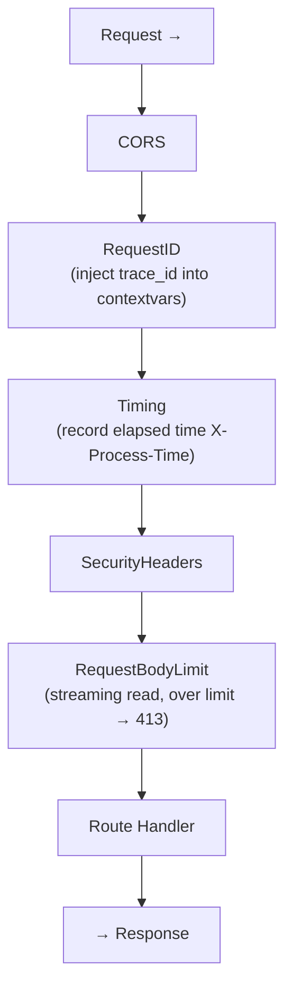
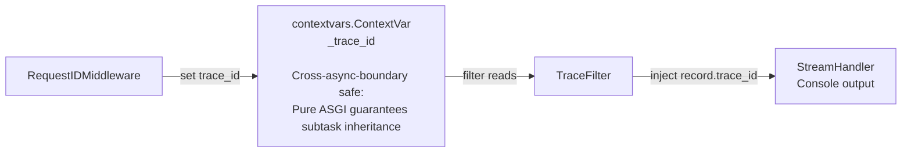

# Chapter 12: Middleware Architecture

> This chapter will take you deep into FastAPI's "onion model" of middleware, from full-link tracing to security hardening, from performance monitoring to request body flow control — deconstructing the design decisions of each middleware layer in this project.

---

## 12.1 What is Middleware?

If building a web framework is like constructing a house, then middleware is the "plumbing system" — every pipe for water, electricity, and gas is laid in a specific order. Water enters from the main valve (request entry), passes through layers of valves (middleware), eventually reaches the faucet (route handler), and then returns along the same path.

FastAPI's middleware follows the **onion model**:



**Key Insight**: Registration order is opposite to execution order. `add_middleware` wraps the onion layer by layer — the first `add`'ed middleware is the outermost layer, and the last `add`'ed is the innermost (closest to the route).

---

## 12.2 Project Middleware Overview

This project registers 5 middleware, arranged by execution order:

| Order | Middleware | Responsibility | Implementation |
|-------|-----------|---------------|----------------|
| 1 | CORSMiddleware | Cross-origin security | Framework built-in |
| 2 | RequestIDMiddleware | Full-link tracing | **Pure ASGI** |
| 3 | TimingMiddleware | Performance monitoring | BaseHTTPMiddleware |
| 4 | SecurityHeadersMiddleware | Security response headers | BaseHTTPMiddleware |
| 5 | RequestBodyLimitMiddleware | Request body size limit | BaseHTTPMiddleware |

Middleware registration code (`main.py:116-141`):

```python
def _register_middleware(app: FastAPI) -> None:
    settings = get_settings()

    # Innermost: request body limit
    max_body = settings.max_upload_size + 1024 * 1024
    app.add_middleware(RequestBodyLimitMiddleware, max_size=max_body)

    # Security headers
    app.add_middleware(SecurityHeadersMiddleware)

    # Timing statistics
    app.add_middleware(TimingMiddleware)

    # Request ID (outermost, inject trace_id first)
    app.add_middleware(RequestIDMiddleware)

    # CORS (framework built-in, at the outermost layer)
    app.add_middleware(
        CORSMiddleware,
        allow_origins=settings.cors_origins,
        allow_credentials=True,
        allow_methods=["*"],
        allow_headers=["*"],
    )
```

**Why is RequestID outside Timing?** Because Timing's logs need `trace_id`, so `trace_id` must be injected into `contextvars` first. This is the meaning of "registered first, executed last; outer code runs first."

---

## 12.3 RequestIDMiddleware: The Foundation of Full-Link Tracing

This is the most meticulously designed middleware in this chapter. It solves one core problem: **How do you quickly find all logs belonging to the same request among a tangle of interleaved async logs?**

The answer is to give each request a unique ID.

### 12.3.1 Why Pure ASGI Instead of BaseHTTPMiddleware?

This is one of the most critical decisions in this project's middleware design. `BaseHTTPMiddleware` is based on `starlette`'s `anyio` implementation — it internally uses `anyio.start_soon()` to create subtasks, and `anyio`'s subtasks **do not inherit the parent task's contextvars context by default**. This means that `contextvars` values set in `BaseHTTPMiddleware` may be lost in downstream async call chains.

This project's `RequestIDMiddleware` uses a **pure ASGI protocol implementation** (`middleware/request_id.py`):

```python
from starlette.types import ASGIApp, Scope, Receive, Send, Message

class RequestIDMiddleware:
    def __init__(self, app: ASGIApp) -> None:
        self.app = app

    async def __call__(self, scope: Scope, receive: Receive, send: Send) -> None:
        if scope["type"] != "http":
            await self.app(scope, receive, send)
            return

        # 1. Read or generate request_id
        request_id = None
        for key, value in scope.get("headers", []):
            if key == b"x-request-id":
                request_id = value.decode()
                break
        if not request_id:
            request_id = uuid.uuid4().hex[:16]

        # 2. Inject into contextvars (log system reads from here)
        _trace_id.set(request_id)

        # 3. Inject into ASGI scope (accessible via starlette.Request.state downstream)
        scope.setdefault("state", {}).setdefault("request_id", request_id)

        # 4. Wrap send to write trace_id into response headers
        orig_send = send
        async def send_with_header(message: Message) -> None:
            if message["type"] == "http.response.start":
                headers = message.get("headers", [])
                headers.append((b"x-request-id", request_id.encode()))
                message["headers"] = headers
            await orig_send(message)

        await self.app(scope, receive, send_with_header)
```

**Design Highlights**:

1. **Prefer upstream ID**: If the request headers already carry `x-request-id` (e.g., from a frontend or upstream service), reuse that ID to enable cross-service link tracing.

2. **Dual-channel injection**: Writes to both `contextvars` (for the logging system) and `scope.state` (for downstream routes), covering different consumption scenarios.

3. **Non-HTTP passthrough**: For non-HTTP requests like WebSocket, pass through directly without interference.

### 12.3.2 Actual Effect

After starting the application, the console log shows something like:

```
2026-07-05 14:32:01 | INFO     | middleware.timing              | [a3b2c9d1e4f5a6b7] GET /api/models -> 200 (45.3ms)
```

`[a3b2c9d1e4f5a6b7]` is the trace_id. When multiple users are using the system simultaneously, you can trace each user's request chain through this ID.

---

## 12.4 TimingMiddleware: The "Stopwatch" for Performance Monitoring

This middleware is very simple but extremely practical — it times each request and writes the duration to both response headers and logs.

```python
class TimingMiddleware(BaseHTTPMiddleware):
    async def dispatch(self, request: Request, call_next: RequestResponseEndpoint) -> Response:
        start = time.perf_counter()
        response = await call_next(request)
        duration_ms = (time.perf_counter() - start) * 1000
        response.headers["X-Process-Time"] = f"{duration_ms:.1f}ms"

        if not request.url.path.startswith("/static"):
            logger.info(
                "%s %s -> %d (%.1fms)",
                request.method, request.url.path,
                response.status_code, duration_ms,
            )

        return response
```

**Design Decisions**:

- **`perf_counter()` instead of `time()`**: `perf_counter()` is a process-level monotonic clock, unaffected by system time adjustments — the standard choice for performance measurement.
- **Exclude `/static` paths**: Static file requests are extremely numerous; logging all of them would drown out useful information.
- **Response header exposure**: Frontend developers can see `X-Process-Time: 45.3ms` directly in the browser DevTools Response Headers section, making debugging convenient.

---

## 12.5 SecurityHeadersMiddleware: Defense in Depth

Security isn't a single measure but layers of protection. This middleware injects defensive HTTP headers into every response.

```python
class SecurityHeadersMiddleware(BaseHTTPMiddleware):
    SECURITY_HEADERS = {
        "X-Content-Type-Options": "nosniff",
        "X-Frame-Options": "DENY",
        "Referrer-Policy": "strict-origin-when-cross-origin",
        "X-XSS-Protection": "1; mode=block",
        "Permissions-Policy": "camera=(), microphone=(), geolocation=()",
    }

    async def dispatch(self, request: Request, call_next: RequestResponseEndpoint) -> Response:
        response = await call_next(request)
        for header, value in self.SECURITY_HEADERS.items():
            response.headers[header] = value
        return response
```

**Meaning of Each Header**:

| Response Header | Purpose | Attack Defended |
|----------------|---------|-----------------|
| `X-Content-Type-Options: nosniff` | Prevents browser MIME sniffing | MIME confusion attack |
| `X-Frame-Options: DENY` | Prevents page from being embedded in iframe | Clickjacking |
| `Referrer-Policy: strict-origin-when-cross-origin` | Does not send full Referrer on cross-origin requests | Information leakage |
| `X-XSS-Protection: 1; mode=block` | Enables browser's built-in XSS filter | Reflected XSS |
| `Permissions-Policy` | Disables camera, microphone, geolocation | Permission abuse |

**Why isn't this all the security you need?** HTML response headers are just one layer of defense in depth. True security also requires:
- Input validation and parameterized queries (against SQL injection)
- Content-Security-Policy (against XSS and data injection)
- HTTPS (against man-in-the-middle attacks)
- Rate limiting (against DDoS)

As a locally-run assistant tool, this project's security header configuration is at a **reasonable and robust** level.

---

## 12.6 RequestBodyLimitMiddleware: Streaming Size Validation

Large file uploads can exhaust server memory. The traditional approach reads the entire body before checking its size — but that is precisely the most memory-intensive method.

This project's solution is **streaming validation**: count as you receive, interrupt immediately when the limit is exceeded.

```python
class RequestBodyLimitMiddleware(BaseHTTPMiddleware):
    def __init__(self, app, max_size: int):
        super().__init__(app)
        self.max_size = max_size

    async def dispatch(self, request: Request, call_next: RequestResponseEndpoint) -> Response:
        original_receive = request.receive
        state = {"received": 0}

        async def guarded_receive():
            message = await original_receive()
            if message.get("type") == "http.request":
                state["received"] += len(message.get("body", b""))
                if state["received"] > self.max_size:
                    raise _BodyTooLarge()
            return message

        request._receive = guarded_receive

        try:
            return await call_next(request)
        except _BodyTooLarge:
            logger.warning(
                "Request body exceeds size limit (%d bytes), client=%s, path=%s",
                state["received"], request.client.host, request.url.path,
            )
            return JSONResponse(
                {"detail": "Request body exceeds size limit"},
                status_code=413,
            )
```

**Design Highlights**:

- **Non-intrusive replacement**: By replacing `request._receive`, the underlying ASGI receive function is transparently wrapped — downstream code needs zero changes.
- **1MB buffer design**: `max_size = settings.max_upload_size + 1024 * 1024`. Why the extra 1MB? Because an HTTP request includes not just the file content but also multipart boundaries, form fields, and other overhead.
- **Immediate interruption**: Throws an internal exception `_BodyTooLarge` and catches it, converting to a standard `413 Payload Too Large` JSON response.

---

## 12.7 Logging System: contextvars + TraceFilter

The logging system is the "consumer" of middleware — middleware writes to contextvars, and the logging system reads from contextvars.

### 12.7.1 Architecture Overview



### 12.7.2 Implementation Details

```python
import contextvars
import logging

# Define a context variable passed across coroutines
_trace_id: contextvars.ContextVar[str] = contextvars.ContextVar("trace_id", default="")

# Log format with trace_id placeholder
TRACE_FORMAT = (
    "%(asctime)s | %(levelname)-8s | %(name)-30s | %(trace_id)s%(message)s"
)

class TraceFilter(logging.Filter):
    """Reads trace_id from contextvars and injects it into each log record"""
    def filter(self, record: logging.LogRecord) -> bool:
        tid = _trace_id.get()
        record.trace_id = f"[{tid}] " if tid else ""
        return True  # Never filters, only injects fields

def setup_logging(level: str = "INFO") -> None:
    root = logging.getLogger()
    root.setLevel(getattr(logging, level.upper(), logging.INFO))

    # Clear existing handlers (avoid duplicate addition)
    for handler in root.handlers[:]:
        root.removeHandler(handler)

    console = logging.StreamHandler(sys.stdout)
    console.setFormatter(logging.Formatter(TRACE_FORMAT, datefmt="%Y-%m-%d %H:%M:%S"))
    console.addFilter(TraceFilter())
    root.addHandler(console)

    # Silence noisy third-party libraries
    logging.getLogger("httpx").setLevel(logging.WARNING)
    logging.getLogger("httpcore").setLevel(logging.WARNING)
    logging.getLogger("uvicorn.access").setLevel(logging.WARNING)
    logging.getLogger("ollama").setLevel(logging.WARNING)
```

**Design Points**:

- **`contextvars` lifecycle**: The value of `_trace_id` is only visible within the current request's coroutine tree. Two concurrent requests each have their own independent trace_id and do not interfere with each other.
- **Field injection, not filtering**: `TraceFilter.filter()` always returns `True` — its job is to inject fields, not to filter logs.
- **Silenced third-party libraries**: Logs from `httpx`, `httpcore`, `uvicorn.access`, and `ollama` are worthless during normal operation, so they are uniformly set to WARNING level.

---

## 12.8 Hands-On Practice: Adding a Custom IP Middleware

Suppose you want to add a feature that "records the source IP of every request." This exercise will help you understand the practical development of middleware.

**Requirement**: Append the client IP of each request to the log.

**Code** (create `middleware/client_ip.py`):

```python
import contextvars
import logging
from starlette.middleware.base import BaseHTTPMiddleware
from starlette.requests import Request
from starlette.responses import Response

logger = logging.getLogger(__name__)

class ClientIPMiddleware(BaseHTTPMiddleware):
    async def dispatch(self, request, call_next):
        client_ip = request.client.host if request.client else "unknown"
        logger.info("Client IP: %s", client_ip)
        return await call_next(request)
```

**Registration** (inside `_register_middleware`, placed after RequestID):

```python
app.add_middleware(ClientIPMiddleware)
```

**Runtime Output**:

```
2026-07-05 14:32:01 | INFO     | middleware.client_ip            | [a3b2c9d1] Client IP: 192.168.1.100
2026-07-05 14:32:01 | INFO     | middleware.timing               | [a3b2c9d1] GET /api/chat -> 200 (152.3ms)
```

You'll notice that both logs share the same `[a3b2c9d1]` trace_id — this is exactly the effect of RequestIDMiddleware injecting contextvars at an outer layer.

---

## 12.9 Chapter Summary

| Middleware | Core Technique | Use Case |
|-----------|---------------|----------|
| RequestID | Pure ASGI bypassing anyio isolation | Full-link tracing |
| Timing | perf_counter high-precision timing | Performance monitoring |
| SecurityHeaders | HTTP response header defense | Security hardening |
| RequestBodyLimit | Streaming byte counting | Preventing resource exhaustion |
| CORS | Framework built-in | Cross-origin control |

**Keywords**: Onion model, pure ASGI middleware, contextvars context propagation, streaming validation, defense in depth.

**Next Step**: Middleware provides the "pipeline" for request processing, but an AI assistant also needs "fuel" — models. The next chapter introduces this project's multi-model discovery and management architecture.

---

*Previous Chapter: [Chapter 11 · History Compression & Conversation Management](11-history-compression.md)* | *Next Chapter: [Chapter 13 · Model Management & Warmup](13-model-management-and-warmup.md)*
