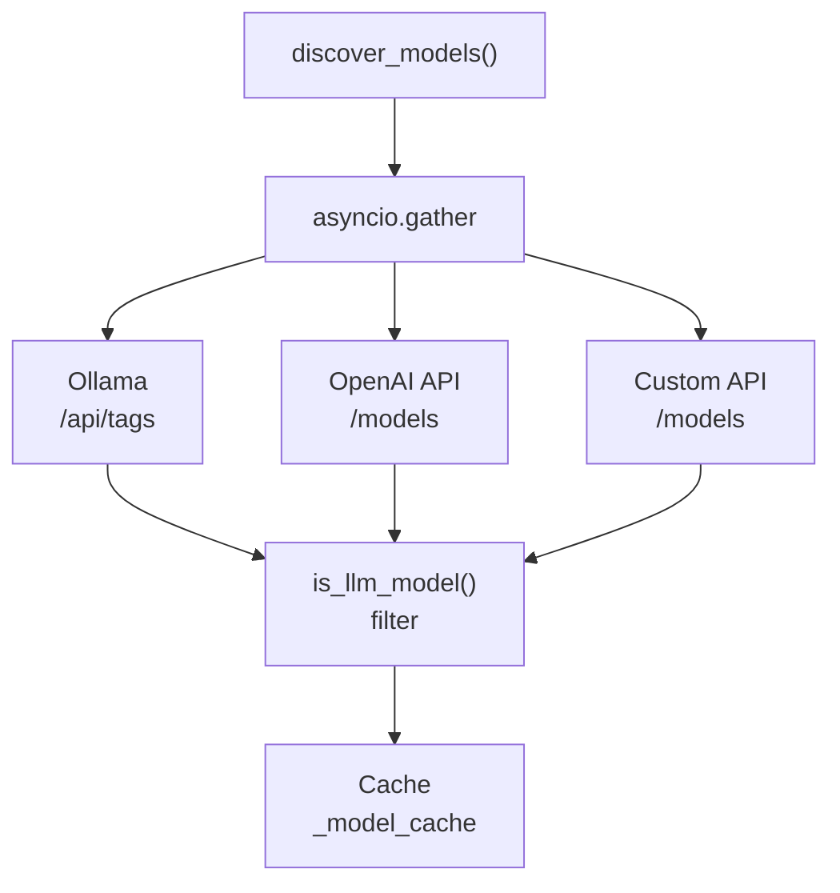
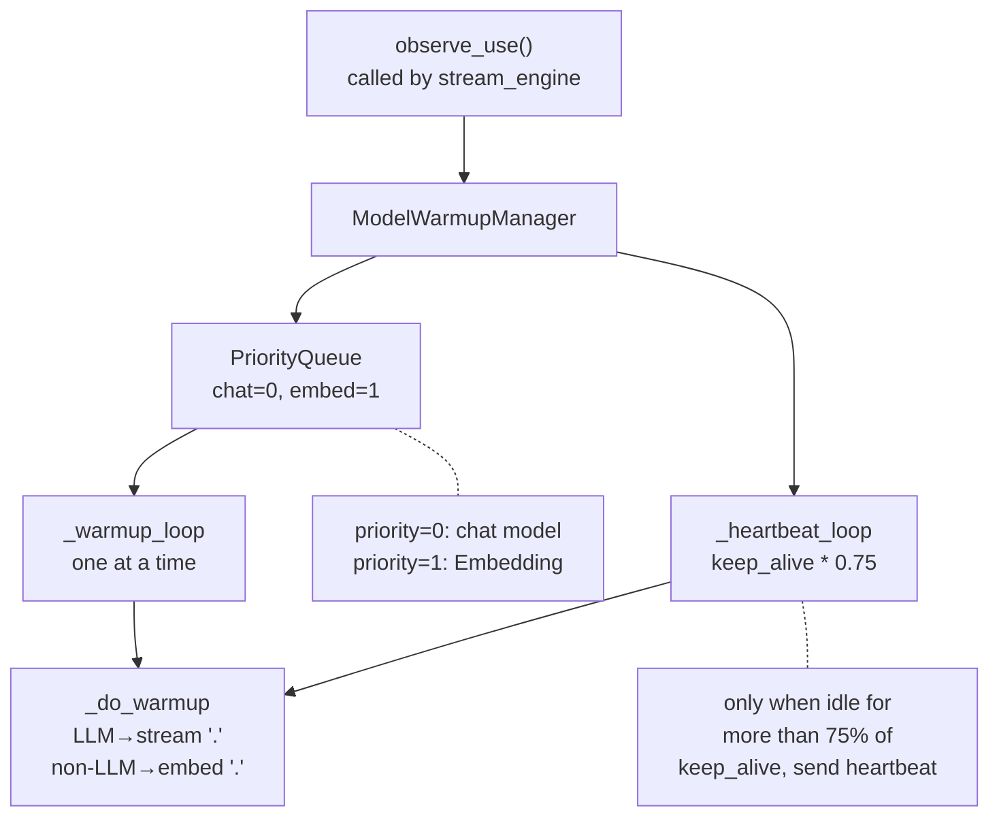
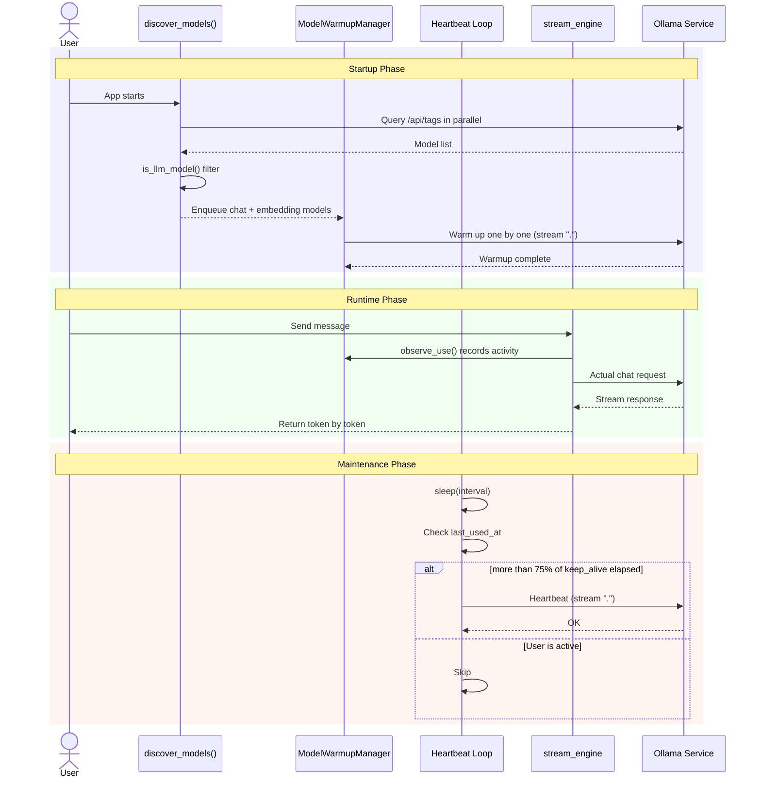

# Chapter 13: Model Management and Warmup

> If an AI assistant takes more than ten seconds to start a conversation after launch, the user experience suffers greatly. This chapter reveals how this project implements a "ready out of the box" model warmup mechanism, along with a unified management layer architecture for multiple model sources.

---

## 13.1 Why a Model Management Layer?

Modern AI applications draw from an increasingly diverse set of model sources:

- **Ollama**: Locally-run open-source LLMs (Qwen, Llama, DeepSeek...)
- **OpenAI Compatible API**: Private models deployed via vLLM, third-party API proxies
- **Cloud Services**: Some scenarios require a mix of local and cloud models

If every component that uses models had to discover, connect, and manage them on its own, the code would quickly devolve into "spaghetti." This project's answer: **a unified model discovery layer + a transparent invocation abstraction for upper layers**.

---

## 13.2 Multi-Source Model Discovery

### 13.2.1 Parallel Query Architecture

The core idea of model discovery: **`asyncio.gather` queries all sources in parallel, merges the results, and caches them**.



Implementation code (`services/model_manager.py:145-168`):

```python
async def discover_models(force_refresh: bool = False) -> list[dict]:
    global _model_cache
    if _model_cache is not None and not force_refresh:
        return _model_cache

    sources = get_model_sources()
    tasks = [_discover_source(s) for s in sources]
    results = await asyncio.gather(*tasks, return_exceptions=True)

    models: list[dict] = []
    for source, result in zip(sources, results):
        if isinstance(result, Exception):
            logger.warning("Model discovery failed [%s]: %s", source["name"], result)
        else:
            models.extend(result)
            logger.info("Model discovery: %s returned %d models", source["name"], len(result))

    _model_cache = models
    return models
```

**Design highlights**:

1. **Fault-tolerant parallelism**: `return_exceptions=True` ensures one source failing does not affect the results from other sources.
2. **On-demand refresh**: `_model_cache` serves as a module-level cache, avoiding frequent HTTP queries to Ollama/API. It only re-queries when `force_refresh=True` or a custom source changes.
3. **Unified pricing model**: All models from every source are converted to the `{"id": str, "source": str, "name": str, "type": str}` format.

### 13.2.2 Single-Source Discovery

```python
async def _discover_source(source: dict) -> list[dict]:
    client = HttpClientPool.get("discovery", timeout=10)
    if source["type"] == "ollama":
        base_url = source.get("base_url") or get_settings().ollama_host
        resp = await client.get(f"{base_url}/api/tags")
        if resp.status_code != 200:
            return []
        discovered = []
        for model in resp.json().get("models", []):
            name = model["name"]
            if is_llm_model(name):
                discovered.append({
                    "id": name, "source": source["name"],
                    "name": name, "type": "ollama",
                })
        return discovered

    if source["type"] == "openai":
        headers = {}
        if source.get("api_key"):
            headers["Authorization"] = f"Bearer {source['api_key']}"
        resp = await client.get(
            f"{source['base_url']}/models", headers=headers
        )
        if resp.status_code != 200:
            return []
        return [
            {"id": m["id"], "source": source["name"],
             "name": m["id"], "type": "openai"}
            for m in resp.json().get("data", [])
        ]

    return []
```

`HttpClientPool.get("discovery", timeout=10)` is the project's HTTP client pool — it allocates a dedicated connection pool for the "model discovery" scenario with a 10-second timeout. Different scenarios use different pool instances to avoid connection reuse conflicts.

---

## 13.3 Non-LLM Filtering Strategy

Ollama may have dozens of models installed, but not all of them can be used for conversation. You need to filter out the models that can "chat."

```python
_NON_LLM_NAMES = frozenset({
    # Embedding models (used for vectorization, cannot chat)
    "nomic-embed-text", "mxbai-embed-large", "bge-m3", "bge-large",
    "e5-large", "e5-base", "jina-embeddings", "stella", "m3e",
    # Vision models (pure vision, cannot do text chat)
    "llava", "bakllava", "minicpm-v", "cogvlm", "qwen-vl",
    # Re-rankers / tools
    "reranker", "cross-encoder",
})


def is_llm_model(model_name: str) -> bool:
    """Determine if a model is a chat-capable LLM""""
    base_name = model_name.split(":")[0].strip()
    if base_name in _NON_LLM_NAMES:
        return False
    return True
```

**Why `frozenset`?** This is a Python best practice: `frozenset` is an immutable set, `in` operations are O(1), and as a module-level constant it cannot be accidentally modified.

**Why `split(":")[0]`?** Ollama model names may carry a tag: `qwen2.5:7b`, `qwen2.5:14b`. We only care whether the base name is in the non-LLM list.

---

## 13.4 Custom API Source Management

Beyond hardcoded sources in the configuration file (such as Ollama), users can dynamically add OpenAI-compatible API endpoints at runtime.

### 13.4.1 Persistent Storage

Sources added by the user need to survive application restarts. The project uses **atomic JSON writes** to guarantee data safety:

```python
def save_custom_sources(sources: list[dict]):
    """Persist the custom API source list (atomic write to prevent corruption from mid-write crashes)"""
    try:
        atomic_json_write(get_custom_sources_path(), sources)
    except Exception as e:
        logger.warning("Failed to persist custom model sources: %s", e)

def add_custom_source(source: dict) -> list[dict]:
    sources = load_custom_sources()
    existing = [s for s in sources if s["name"] != source["name"]]
    existing.append(source)
    save_custom_sources(existing)
    invalidate_cache()  # Force re-discovery on next call
    return existing

def remove_custom_source(name: str) -> list[dict]:
    sources = load_custom_sources()
    sources = [s for s in sources if s["name"] != name]
    save_custom_sources(sources)
    invalidate_cache()
    return sources
```

**Atomic write** means: first write to a temporary file, then atomically replace. If a crash happens mid-write, the JSON file will not be corrupted — this is a basic production practice.

### 13.4.2 Source Merging

```python
def get_model_sources() -> list[dict]:
    settings = get_settings()
    config_sources = [s.model_dump() for s in settings.model_sources]
    custom_sources = load_custom_sources()
    return config_sources + custom_sources
```

Configuration file sources take higher priority (appear first), with custom sources appended afterward. In case of duplicate names, the configuration file definition takes precedence.

---

## 13.5 Model Warmup: Eliminating Cold Start

### 13.5.1 The Pain of Cold Start

Ollama's default behavior is: if a model is unused for N minutes, it is unloaded from GPU VRAM. The next time it is used, it must be reloaded — a process that can take **5-20 seconds**.

Imagine a user typing "Help me analyze..." in the browser, pressing send, and then staring at a spinner for 15 seconds — that is unacceptable.

### 13.5.2 Warmup Manager Architecture



### 13.5.3 Warmup Flow

**Step 1: Enqueue on Priority Queue**

```python
async def start(self):
    settings = get_settings()

    # Chat model gets highest priority
    self._queue.put_nowait(_WarmupJob(
        priority=0, model_source="ollama", model_id=settings.ollama_model
    ))
    # Embedding model gets secondary priority
    self._queue.put_nowait(_WarmupJob(
        priority=1, model_source="ollama", model_id=settings.embedding_model
    ))

    self._warmup_task = asyncio.create_task(self._warmup_loop())
    if settings.ollama_keep_alive:
        self._heartbeat_task = asyncio.create_task(
            self._heartbeat_loop(settings.ollama_keep_alive)
        )
```

`asyncio.PriorityQueue` sorts by priority value — lower numbers mean higher priority. The chat model with priority=0 is warmed up first, the embedding model with priority=1 comes second.

**Step 2: Warm Up Models One by One**

```python
async def _warmup_loop(self):
    while not self._shutdown_event.is_set():
        try:
            job = await asyncio.wait_for(self._queue.get(), timeout=1.0)
        except asyncio.TimeoutError:
            continue
        await self.warm(job.model_source, job.model_id)
```

**Only one model is warmed up at a time.** This is a key design for local small-model (resource-constrained) scenarios — parallel warmup would cause GPU VRAM contention and actually be slower.

**Step 3: Send an Ultra-Lightweight Payload**

```python
async def _do_warmup(self, model_source: str, model_id: str) -> None:
    if is_llm_model(model_id):
        from services.providers import get_provider
        provider = get_provider(model_source, model_id)
        async for _ in provider.stream(
            [{"role": "user", "content": "."}],
            show_thinking=False,
        ):
            break  # Only need one token to trigger model loading
    else:
        embedder = OllamaEmbeddingProvider()
        await embedder.embed(".")
```

For LLMs: a streaming request sends a single character `"."`, and the connection is interrupted immediately after receiving the first token — this is enough to make Ollama load the model into VRAM.
For embeddings: calling `embed(".")` works the same way.

### 13.5.4 Heartbeat Mechanism

Warmup only solves the "first use after startup" problem. But the model will still be unloaded after the `keep_alive` time expires. The heartbeat mechanism keeps the model alive just before it is about to expire.

```python
async def _heartbeat_loop(self, keep_alive: str):
    seconds = _parse_keep_alive(keep_alive)
    if seconds <= 0:
        return
    interval = seconds / 2  # Check frequency = half of keep_alive

    while not self._shutdown_event.is_set():
        await asyncio.sleep(interval)
        now = time.monotonic()
        for key, state in list(self._states.items()):
            if not state.warmed:
                continue
            # Only send heartbeat when idle for more than 75% of keep_alive
            if now - state.last_used_at < seconds * 0.75:
                continue
            model_source, model_id = key.split("/", 1)
            try:
                await self._do_warmup(model_source, model_id)
                state.last_used_at = now
            except Exception as e:
                logger.debug("Heartbeat failed %s: %s", key, e)
```

**Core design**: the `seconds * 0.75` threshold. If a model has been used within the last 75% of its keep_alive time, it means the user is active and no heartbeat is needed — let the normal chat requests refresh the timer themselves. Only models that are "about to expire and haven't been used" trigger a heartbeat.

### 13.5.5 observe_use(): User Activity Awareness

The heartbeat mechanism needs a "usage record" so it doesn't interrupt active users:

```python
def observe_use(self, model_source: str, model_id: str):
    """Record the timestamp when a model is used, to avoid heartbeats disturbing active models"""
    key = f"{model_source}/{model_id}"
    if key in self._states:
        self._states[key].last_used_at = time.monotonic()
```

This function is **called by `stream_engine` (the chat streaming engine) every time a user sends a message**. It acts as a "heartbeat suppressor" — telling the heartbeat system: "This model is in use, don't send heartbeats and interfere."

### 13.5.6 keep_alive Parser

Ollama's keep_alive supports multiple formats, and this project parses them uniformly:

```python
def _parse_keep_alive(value: str | int) -> float:
    if isinstance(value, (int, float)):
        return float(value)
    if value.endswith("m"):
        return float(value[:-1]) * 60
    if value.endswith("h"):
        return float(value[:-1]) * 3600
    if value.endswith("s"):
        return float(value[:-1])
    if value == "-1" or value == "-1m":
        return 86400  # -1 means forever, approximate with 24h
    try:
        return float(value)
    except ValueError:
        return 1800  # Default 30 minutes
```

Supports formats like `"30m"`, `"2h"`, `"60s"`, `"1800"`, `"-1"`, offering good user-friendliness.

---

## 13.6 Health Check: Understanding System State at a Glance

A health check is not just about being "alive" — it must answer: **which components are available, which are not, and is the overall system available?**

```python
async def check_all_health() -> dict:
    settings = get_settings()
    checks = {}

    # Database
    db_ok = await check_db_health()
    checks["database"] = {
        "status": "healthy" if db_ok else "unhealthy",
        "detail": "SQLite connection OK" if db_ok else "Database unreachable",
    }

    # Ollama
    ollama_ok, ollama_detail = await check_ollama_health()
    checks["ollama"] = {
        "status": "healthy" if ollama_ok else "degraded",
        "detail": ollama_detail,
    }

    # ChromaDB
    rag_ok, rag_detail = await check_rag_health()
    checks["chromadb"] = {
        "status": "healthy" if rag_ok else "degraded",
        "detail": rag_detail,
    }

    # Search service
    search_ok = bool(settings.tavily_api_key)
    checks["search"] = {
        "status": "healthy" if search_ok else "degraded",
        "detail": "Tavily configured" if search_ok else "Search API key not configured",
    }

    # Overall status
    if db_ok and ollama_ok and rag_ok:
        overall = "healthy"
    elif db_ok:
        overall = "degraded"
    else:
        overall = "unhealthy"

    return {"overall": overall, "checks": checks}
```

**Three-level status design**:

| Status | Meaning | Database | Ollama | ChromaDB |
|--------|---------|----------|--------|----------|
| `healthy` | All core components OK | OK | OK | OK |
| `degraded` | Some features unavailable, but core is available | OK | Any | Any |
| `unhealthy` | Core component failure, human intervention needed | FAIL | - | - |

The search service (Tavily) configuration is classified as `degraded` rather than `unhealthy`, because even without search, the chat functionality is still available.

---

## 13.7 Event Bus: Letting the Frontend "Hear" Backend Changes

Model loading status, indexing progress — these background task changes need to be pushed to the frontend in real time. That's where the event bus comes in.

### 13.7.1 Lightweight In-Memory Pub/Sub

```python
_subscribers: dict[str, list[asyncio.Queue]] = {}

async def publish(session_id: str, event: str, data: dict) -> None:
    """Publish an event to all subscribers of a given session"""
    queues = _subscribers.get(session_id, [])
    if not queues:
        return
    payload = {"event": event, "data": data}
    for q in queues:
        await q.put(payload)

def subscribe(session_id: str) -> asyncio.Queue:
    """Create a subscription queue for a given session"""
    q: asyncio.Queue = asyncio.Queue()
    _subscribers.setdefault(session_id, []).append(q)
    return q

def unsubscribe(session_id: str, queue: asyncio.Queue) -> None:
    """Unsubscribe and clean up empty lists"""
    queues = _subscribers.get(session_id)
    if queues:
        queues[:] = [q for q in queues if q is not queue]
        if not queues:
            _subscribers.pop(session_id, None)
```

**Why not use Redis/RabbitMQ?** This project is a single-process local application and does not need distributed pub/sub. Using `asyncio.Queue` for in-process pub/sub is **the lightest correct solution**.

### 13.7.2 SSE Event Stream Generator

```python
async def event_stream(session_id: str) -> AsyncGenerator[str, None]:
    queue = subscribe(session_id)
    try:
        while True:
            try:
                payload = await asyncio.wait_for(queue.get(), timeout=30)
                yield f"event: {payload['event']}\ndata: {json.dumps(payload['data'])}\n\n"
            except asyncio.TimeoutError:
                yield ": keepalive\n\n"  # Send keepalive when no events for 30s
    finally:
        unsubscribe(session_id, queue)
```

**`try/finally` is the essence here**: whether the client disconnects or exits abnormally, the `finally` block will execute resource cleanup, leaving no zombie subscribers behind.

**30-second keepalive**: HTTP long connections may be timed out by reverse proxies (like Nginx). Sending empty events every 30 seconds (SSE comment lines starting with `:`) keeps the connection alive.

---

## 13.8 Model Lifecycle Panorama

Tying together discovery, warmup, heartbeat, and health checks from this chapter:



---

## 13.9 Chapter Summary

| Component | Core Technique | Problem Solved |
|-----------|----------------|----------------|
| Model Discovery | asyncio.gather in parallel + frozenset filter | Unified management of multi-source models |
| Warmup Manager | PriorityQueue + single-token trigger | Eliminates cold-start latency |
| Heartbeat Mechanism | 75% threshold + observe_use suppression | Avoids disturbing active models |
| Health Check | Three-level status + component isolation | Rapid fault localization |
| Event Bus | In-process asyncio.Queue + SSE | Real-time status push |

**Keywords**: parallel discovery, cold start, warmup, heartbeat, priority queue, health check, event-driven.

**Next**: Models are ready, middleware is in place. The next chapter will tie all these components together, completing the full loop from startup to deployment.

---

*Previous: [Chapter 12: Middleware Architecture](12-middleware-architecture.md)* | *Next: [Chapter 14: Deployment, Operations & Summary](14-deployment-operations-and-summary.md)*
