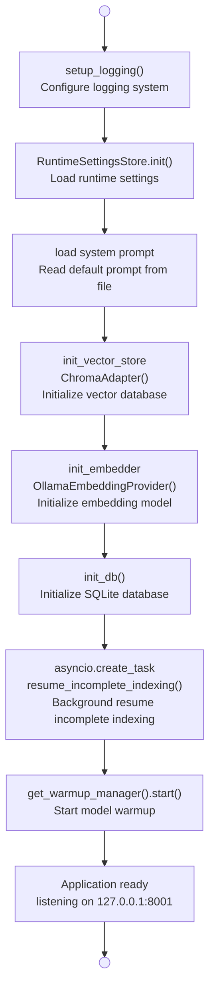
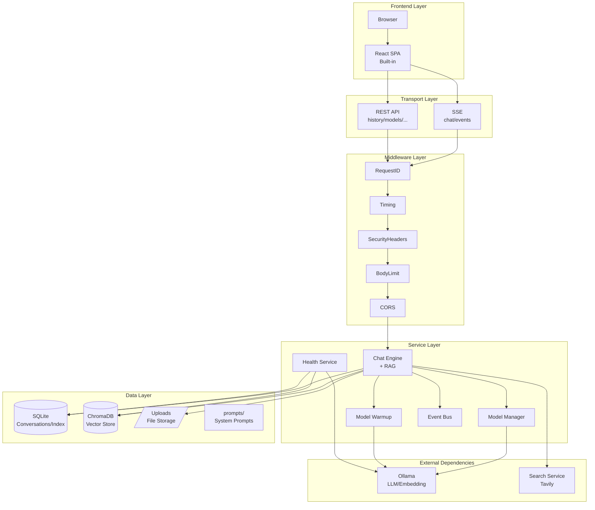

# Chapter 14: Deployment, Operations, and Summary

> This is the final chapter of this tutorial. We will stitch all the components built in the previous 13 chapters into a complete startup pipeline, then discuss the real-world considerations for production deployment, and finally look back at what we have built together and where we can go next.

---

## 14.1 Application Startup Sequence: The Birth of a Pipeline

The moment you press `python main.py`, the user only sees a browser window opening automatically. But within that 1.5 seconds, nearly 10 ordered initialization steps happen inside the system. Let us trace this pipeline.



### 14.1.1 lifespan Function Line by Line

```python
@asynccontextmanager
async def lifespan(app: FastAPI):
    settings = get_settings()

    # Step 1: Logging first
    setup_logging(settings.log_level)

    # Step 2: Runtime settings store
    RuntimeSettingsStore.init()

    # Step 3: Load system prompt
    prompt_path = os.path.join(os.path.dirname(__file__), settings.system_prompt_path)
    if os.path.isfile(prompt_path):
        with open(prompt_path, "r", encoding="utf-8") as f:
            settings.system_prompt = f.read()

    # Step 4: Vector store ready
    from services.vector_store import ChromaAdapter
    from services.providers import OllamaEmbeddingProvider
    init_vector_store(ChromaAdapter())

    # Step 5: Embedding model ready
    init_embedder(OllamaEmbeddingProvider())

    # Step 6: Database initialization
    await init_db()

    # Step 7: Crash recovery (background task, does not block startup)
    asyncio.create_task(resume_incomplete_indexing())

    # Step 8: Model warmup
    from services.model_warmup import get_warmup_manager
    await get_warmup_manager().start()

    logger.info("Application startup complete [model=%s] [rag=%s]",
                settings.ollama_model, get_config("rag_enabled"))

    yield  # ← Application starts accepting requests here

    # ---- Shutdown phase ----
    await get_warmup_manager().shutdown()
    await close_db()
    logger.info("Application shutdown")
```

**Why this order?**

| Order | Step | Reason |
|------|------|--------|
| 1 | Logging | Every subsequent step needs it for log output |
| 2 | Runtime settings | Subsequent component initialization depends on configuration items |
| 3 | System prompt | Core input for the conversation feature |
| 4-5 | Vector store + Embedding model | A pair of foundational components for RAG |
| 6 | Database | Persistence for conversation records and file indexing |
| 7 | Crash recovery | Depends on database being initialized |
| 8 | Model warmup | Depends on all foundational components being ready |

### 14.1.2 Why Is Warmup Last?

Model warmup is the **most patient** of all initializations—it has to wait for Ollama to load several GB of models into VRAM. Placing it last means that while warmup is in progress, the application **can already accept requests** (after `yield`). Users can open the interface before warmup completes, without experiencing an obvious "waiting for startup" delay.

---

## 14.2 Crash Recovery: Never Lose Work

Imagine this scenario: a user uploads a PDF, the system is slicing its text, vectorizing it, and storing it into ChromaDB—then the application crashes.

What happens after restart? `resume_incomplete_indexing` is the answer.

```python
async def resume_incomplete_indexing():
    try:
        from database import get_db, get_incomplete_tasks
        from services.rag_service import index_file

        db = await get_db()
        tasks = await get_incomplete_tasks(db)
        if not tasks:
            return

        logger.info("Found %d incomplete indexing tasks, resuming...", len(tasks))
        for task in tasks:
            file_path = task.get("file_path", "")
            if file_path and os.path.exists(file_path):
                from services.file_service import extract_text
                try:
                    text = extract_text(file_path)
                    await index_file(
                        db, task["session_id"], task["file_name"],
                        text, task_id=task["id"],
                    )
                    logger.info("Index recovery succeeded: %s", task["file_name"])
                except Exception as e:
                    logger.error("Index recovery failed %s: %s", task["file_name"], e)
            else:
                from database import mark_failed
                await mark_failed(db, task["id"], "Original file no longer exists")
    except Exception as e:
        logger.warning("Error during index task recovery: %s", e)
```

**Design rationale**:

1. **Mark incomplete tasks**: Index tasks in the database have three states: `pending`, `processing`, `completed`. On crash, tasks in the `processing` state are the "incomplete" ones.
2. **Idempotent recovery**: Re-execute indexing—if the file still exists, index from scratch; if the file has been deleted, mark as failed. No matter how many times you restart, the result is deterministic.
3. **Background execution**: `asyncio.create_task` means this recovery does not block application startup—users can start using it immediately while indexing silently resumes in the background.
4. **Comprehensive exception handling**: A single file recovery failure does not affect other files, and will not crash the entire startup flow.

This is an **industry-grade practice**: never assume the system will not crash; assume it will crash, and design the recovery path accordingly.

---

## 14.3 Static File Serving: Frontend and Backend "Living Together"

This project is a full-stack application—FastAPI both provides the API and directly hosts the React frontend.

```python
# Mount uploads static directory (for frontend preview of uploaded images/files)
app.mount("/uploads", StaticFiles(directory=get_settings().upload_dir), name="uploads")

# React frontend build output
_fe_dist = os.path.join(os.path.dirname(__file__), "frontend", "dist")
if os.path.isdir(_fe_dist):
    app.mount("/assets", StaticFiles(directory=os.path.join(_fe_dist, "assets")), name="fe_assets")

    @app.get("/", response_class=HTMLResponse)
    async def index_react():
        fe_index = os.path.join(_fe_dist, "index.html")
        if os.path.isfile(fe_index):
            with open(fe_index, "r", encoding="utf-8") as f:
                return HTMLResponse(f.read())
        return HTMLResponse("Frontend not built. Run: cd frontend && npm run build")
```

**Route priority**:

| Path | Handler | Purpose |
|------|--------|--------|
| `/api/*` | FastAPI routes | All REST APIs |
| `/uploads/*` | StaticFiles | Uploaded file preview |
| `/assets/*` | StaticFiles | React bundled JS/CSS/images |
| `/` | index_react() | React SPA entry point |

API routes are mounted via `include_router`, and static files are mounted via `mount`. FastAPI prioritizes routes from `include_router`, so `/api/health` works correctly without being swallowed by static file handling.

**Development-friendly hint**: If the `frontend/dist` folder does not exist (frontend not built), visiting the root path shows a "Frontend not built" hint instead of a 500 error.

### start.bat: One-Click Launch

```batch
@echo off
chcp 65001 >nul
title AI Assistant
echo ========================================
echo   AI Assistant is starting...
echo   The browser will open automatically after startup
echo   Close this window to stop the service
echo ========================================
cd /d "%~dp0"
python main.py
pause
```

`chcp 65001` sets the console encoding to UTF-8, ensuring correct display of Chinese output.

### main.py: Auto-Open Browser

```python
if __name__ == "__main__":
    import uvicorn, webbrowser, threading

    settings = get_settings()
    port = settings.port  # 8001

    threading.Timer(1.5, lambda: webbrowser.open(f"http://127.0.0.1:{port}")).start()
    uvicorn.run("main:app", host="127.0.0.1", port=port, reload=settings.dev_reload)
```

`threading.Timer(1.5, ...)` gives uvicorn 1.5 seconds to start, then automatically opens the browser. This is a small design detail but has a huge impact on user experience—after double-clicking `start.bat`, the user does not need to do anything; the browser automatically opens to the assistant interface.

---

## 14.4 Production Considerations

The target scenario for this project is local/single-machine operation, but it already has a foundation for migration to production environments. Here are several key upgrade directions.

### 14.4.1 From uvicorn to gunicorn + uvicorn Workers

A single-process uvicorn is limited by the GIL and cannot fully utilize multi-core CPUs. Production environments typically upgrade like this:

```bash
gunicorn main:app \
  --worker-class uvicorn.workers.UvicornWorker \
  --workers 4 \
  --bind 0.0.0.0:8001
```

`--workers 4` starts 4 uvicorn worker processes (recommended = CPU cores × 2 + 1).

**Note**: In multi-process mode, the event bus from section 14.5 (based on `asyncio.Queue`) is only effective within a single process. For cross-process event push, you need to introduce Redis pub/sub or a WebSocket Broker.

### 14.4.2 Nginx Reverse Proxy

```nginx
server {
    listen 80;
    server_name your-domain.com;

    client_max_body_size 50M;  # Match max_upload_size

    location / {
        proxy_pass http://127.0.0.1:8001;
        proxy_set_header Host $host;
        proxy_set_header X-Real-IP $remote_addr;
        proxy_set_header X-Request-ID $request_id;  # Pass to RequestIDMiddleware
        proxy_set_header X-Forwarded-For $proxy_add_x_forwarded_for;

        # SSE long-connection support
        proxy_buffering off;
        proxy_cache off;
        proxy_read_timeout 300s;
    }
}
```

Key configuration explanations:

- **`proxy_buffering off`**: SSE requires real-time push; Nginx's default buffering delays event delivery.
- **`proxy_read_timeout 300s`**: SSE is a long-lived connection; the timeout should be set long enough.
- **`X-Request-ID $request_id`**: Nginx has its own `$request_id` variable, passed to the backend's `RequestIDMiddleware` to achieve full-link tracing from frontend to backend.

### 14.4.3 HTTPS Configuration

```nginx
server {
    listen 443 ssl http2;
    server_name your-domain.com;

    ssl_certificate /etc/letsencrypt/live/your-domain.com/fullchain.pem;
    ssl_certificate_key /etc/letsencrypt/live/your-domain.com/privkey.pem;

    # ... remaining config same as above
}

server {
    listen 80;
    server_name your-domain.com;
    return 301 https://$host$request_uri;  # HTTP forced redirect to HTTPS
}
```

It is recommended to use Let's Encrypt + Certbot to automatically obtain and renew free certificates.

### 14.4.4 Environment Variables for Managing Secrets

`config.py` already supports `.env` files and environment variables. In production, never write API keys in code:

```bash
# .env (already added to .gitignore)
OLLAMA_MODEL=qwen2.5:7b
TAVILY_API_KEY=tvly-xxxxxxxxxxxx
PORT=8001
LOG_LEVEL=WARNING
DEV_RELOAD=false
```

```python
# Corresponding fields in config.py
class Settings(BaseSettings):
    tavily_api_key: str = ""
    log_level: str = "INFO"
    port: int = 8001
    dev_reload: bool = False

    model_config = {
        "env_file": ".env",
        "env_file_encoding": "utf-8",
    }
```

pydantic-settings handles it automatically: `.env` file → environment variable priority chain. `tavily_api_key: str = ""` means it can start without configuration (search functionality degrades gracefully but the system remains usable).

---

## 14.5 Complete Architecture Review

When we step back and look at the overall architecture of the project:



---

## 14.6 What We Built

From Chapter 1's environment setup to Chapter 14's deployment and operations, this project has grown from a "hello world" into a fully-featured, architecturally clear AI application. Let us review the core capabilities checklist:

| Chapter | Capability | Technical Keywords |
|------|------|------------|
| 1-2 | Project skeleton | FastAPI, pydantic-settings, .env |
| 3 | Database layer | SQLite, aiosqlite, async ORM |
| 4 | Model integration | Ollama, OpenAI-compatible API, streaming SSE |
| 5 | Frontend | React SPA, message bubbles, file upload |
| 6 | RAG retrieval | ChromaDB, document chunking, vector injection |
| 7 | Semantic memory | Key information extraction, long-term memory recall |
| 8 | File processing | PDF/Word/TXT parsing, auto-indexing |
| 9 | Web search | Tavily/DuckDuckGo, search caching |
| 10 | SSE streaming | Per-token push, frontend typewriter effect |
| 11 | History compression | Conversation history management, context window |
| **12** | **Middleware** | **Full-link tracing, security hardening, performance monitoring** |
| **13** | **Model management** | **Multi-source discovery, warmup mechanism, heartbeat keep-alive** |
| **14** | **Deployment & operations** | **Startup sequence, crash recovery, production deployment** |

### Architecture Highlights

1. **Onion model middleware**: Pure ASGI RequestID, streaming-decoupled BodyLimit, defense-in-depth SecurityHeaders—each layer does its job.

2. **Intelligent warmup**: Priority queue + single-token trigger + adaptive heartbeat, eliminating cold-start latency without consuming extra resources.

3. **Graceful degradation**: Search service unavailable? Conversations still work fine. Ollama down? The database still has your back. Health checks use a three-level status to truthfully reflect the degree of degradation.

4. **Crash recovery**: Application crashed mid-indexing? Restart automatically picks up where it left off. File deleted? Mark as failed without blocking.

5. **Full-stack in one**: Single `python main.py` startup, API + frontend + static files served in the same process, zero operations overhead.

---

## 14.7 Where to Go Next

This project is a "scaffold"—it provides a complete skeleton, but is far from the end. Here are some directions worth exploring:

### Feature Extensions

- **Multi-modal support**: Integrate vision models (Ollama already supports llava, etc.) for "upload image + text query"
- **Voice interaction**: Integrate Whisper (speech-to-text) + TTS (text-to-speech) for full voice conversation
- **Agent tool calling**: Enable models to call external tools (check weather, send emails, control smart home devices)
- **Multi-session parallelism**: Multiple users conversing simultaneously without interference (requires session isolation upgrade)
- **Plugin system**: Allow users to write Python scripts to extend assistant capabilities

### Performance Optimization

- **Streaming RAG**: Retrieve while generating, instead of "retrieve all first, then generate"
- **Quantized models**: Use GGUF quantized versions to reduce VRAM usage
- **Response caching**: Cache answers for similar questions
- **Message queue**: Decouple indexing tasks from the API thread

### Operations Upgrades

- **Docker containerization**: `docker-compose up` for one-click launch (including Ollama + ChromaDB)
- **Monitoring and alerting**: Prometheus + Grafana to monitor QPS, latency, VRAM usage
- **Log auditing**: ELK stack for centralized log collection and analysis

---

## 14.8 Learning Resources

If you wish to go deeper, the following resources are worth your attention:

- **FastAPI Official Documentation**: https://fastapi.tiangolo.com/ — complete reference for routing, middleware, and dependency injection
- **Ollama Documentation**: https://github.com/ollama/ollama — best practices for running LLMs locally
- **LangChain / LlamaIndex**: Two mainstream LLM application frameworks, great for comparative learning
- **ChromaDB Documentation**: https://docs.trychroma.com/ — in-depth guide to vector databases
- **"System Design Interview"**: by Alex Xu — helps you transition from single-machine architecture to distributed thinking

---

## 14.9 Final Words

Congratulations on completing the full journey of building an AI intelligent assistant from scratch.

Looking back at Chapter 1, you might have been agonizing over whether `pip install fastapi` needed the `-U` flag. Now you have personally written a full-stack application featuring onion middleware, multi-model management, RAG retrieval, streaming SSE, and crash recovery.

The most important takeaway from this process is not a specific API usage, but:

- **Layered thinking**: What goes in middleware, what goes in services, what goes in the data layer
- **Fault-tolerant philosophy**: Assume everything will fail, design the recovery path
- **User experience first**: Open the browser in 1.5 seconds, eliminate cold start with warmup, degrade gracefully instead of crashing

Code will become outdated, frameworks will be replaced, but these design principles will accompany you throughout your entire programming career.

---

*Previous chapter: [Chapter 13 · Model Management and Warmup](13-model-management-and-warmup.md)*
