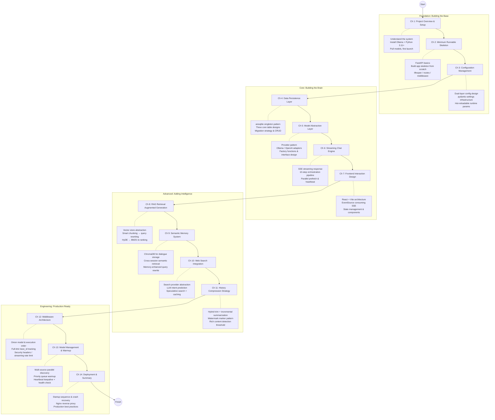

# Building an AI Assistant from Scratch — A Hands-On Tutorial with FastAPI + Ollama + ChromaDB

> **100% Local Data** · **100% Local Models** · **No Cloud API Required**

## About This Tutorial

This is a hands-on tutorial for beginners, guiding you through building a fully functional AI assistant from scratch. We don't talk about abstract theory — **every concept maps to real source code, every line of code is a production artifact from this project**.

After completing all chapters, you will have:

- An AI assistant with **multi-turn conversation** (powered by local Ollama models)
- A **file upload & RAG retrieval** knowledge base Q&A system
- **Semantic memory** for cross-session context awareness
- **Web search** integration for real-time information
- A full-stack application with a complete **React frontend**

## Learning Path



## Chapter Navigation

### Foundation: Building the Base

| Chapter | File | Topic | Difficulty |
|---------|------|-------|------------|
| Guide | [README.md](./README.md) | Tutorial overview & learning path | — |
| Ch 1 | [01-project-overview.md](./01-project-overview.md) | Feature overview, architecture, environment setup | ⭐ Beginner |
| Ch 2 | [02-minimum-runnable-skeleton.md](./02-minimum-runnable-skeleton.md) | FastAPI basics, app skeleton from scratch | ⭐ Beginner |
| Ch 3 | [03-configuration-management.md](./03-configuration-management.md) | Dual-layer config design, hot-reloadable runtime params | ⭐⭐ Elementary |

### Core: Building the Brain

| Chapter | File | Topic | Difficulty |
|---------|------|-------|------------|
| Ch 4 | [04-data-persistence-layer.md](./04-data-persistence-layer.md) | aiosqlite singleton, three-table design, migration & CRUD | ⭐⭐ Elementary |
| Ch 5 | [05-model-abstraction-layer.md](./05-model-abstraction-layer.md) | Provider pattern, Ollama/OpenAI adapters | ⭐⭐ Elementary |
| Ch 6 | [06-streaming-chat-engine.md](./06-streaming-chat-engine.md) | SSE streaming, 10-step orchestration, parallel prefetch | ⭐⭐⭐ Intermediate |
| Ch 7 | [07-frontend-interaction-design.md](./07-frontend-interaction-design.md) | React + Vite, EventSource, state management | ⭐⭐ Elementary |

### Advanced: Adding Intelligence

| Chapter | File | Topic | Difficulty |
|---------|------|-------|------------|
| Ch 8 | [08-rag-retrieval-augmented-generation.md](./08-rag-retrieval-augmented-generation.md) | Vector store, chunking strategy, query rewrite → HyDE → BM25 | ⭐⭐⭐ Intermediate |
| Ch 9 | [09-semantic-memory-system.md](./09-semantic-memory-system.md) | Dialogue embedding storage, cross-session semantic retrieval | ⭐⭐⭐ Intermediate |
| Ch 10 | [10-web-search-integration.md](./10-web-search-integration.md) | Search provider, LLM intent prediction, speculative search | ⭐⭐ Elementary |
| Ch 11 | [11-history-compression-strategy.md](./11-history-compression-strategy.md) | Hybrid trim + incremental summarization, watermark pattern | ⭐⭐⭐ Intermediate |

### Engineering: Production Ready

| Chapter | File | Topic | Difficulty |
|---------|------|-------|------------|
| Ch 12 | [12-middleware-architecture.md](./12-middleware-architecture.md) | Onion model, full-link tracing, security headers, streaming rate limit | ⭐⭐⭐ Intermediate |
| Ch 13 | [13-model-management-and-warmup.md](./13-model-management-and-warmup.md) | Multi-source discovery, priority warmup, heartbeat keepalive | ⭐⭐⭐ Intermediate |
| Ch 14 | [14-deployment-operations-and-summary.md](./14-deployment-operations-and-summary.md) | Startup sequence, crash recovery, Nginx, production deployment | ⭐⭐ Elementary |

## Target Audience

- **Python developers** who want to learn how to build AI applications
- **Backend engineers** familiar with FastAPI or willing to learn on the go
- **Learners** interested in RAG (Retrieval Augmented Generation) implementation
- **Individual developers** who want to build **local AI tools** (no cloud API required)

## Prerequisites

Before you begin, make sure you have:

| Requirement | Description |
|-------------|-------------|
| **Python 3.11+** | Backend language, requires async support |
| **Git** | Clone the project source code |
| **Ollama** | Run LLM models locally |
| **At least 8GB RAM** | Minimum requirement for running qwen3.5 |
| **Basic CLI skills** | Familiar with basic terminal commands |
| **(Optional) Node.js 18+** | To modify/build the frontend |

### Quick Pre-flight Check

```bash
# Check Python version
python --version  # must be >= 3.11

# Check if Ollama is installed
ollama --version

# Check Git
git --version
```

## What You Will Build

The complete project structure — this tutorial will walk through each module's design and implementation:

```
AI Intelligent Assistant/
├── main.py                  # FastAPI application entry
├── config.py                # Infrastructure config (pydantic-settings)
├── runtime_config.py        # Hot-reloadable runtime config
├── requirements.txt         # Python dependencies
├── logging_config.py        # Structured logging config
├── CONTEXT.md               # Domain language documentation
│
├── middleware/               # ASGI middleware
│   ├── request_id.py        # RequestID full-link tracing
│   ├── timing.py            # Request timing stats
│   └── security.py          # Security response headers
│
├── routers/                  # API routing layer
│   ├── chat.py              # Chat interface (SSE streaming)
│   ├── history.py            # Session history management
│   ├── index_routes.py       # RAG index management
│   ├── models.py             # Model discovery
│   ├── model_sources.py      # Custom API sources
│   ├── settings.py           # Runtime config API
│   ├── events.py             # SSE event push
│   ├── health.py             # Health check
│   └── dependencies.py       # Shared dependency injection
│
├── services/                 # Business logic layer (core)
│   ├── stream_engine.py      # SSE streaming chat engine
│   ├── rag_engine.py         # RAG retrieval orchestration
│   ├── rag_service.py        # RAG facade
│   ├── chunker.py            # Text chunking
│   ├── indexer.py            # File indexer
│   ├── memory.py             # Semantic memory
│   ├── compress.py           # History compression
│   ├── web_search.py         # Web search
│   ├── prompt_builder.py     # Prompt construction
│   └── providers/            # Adapter layer
│       ├── model.py          # Model provider
│       ├── embedding.py      # Embedding vectors
│       └── search.py         # Search provider
│
├── database/                 # Data persistence layer
│   ├── sessions.py           # Session table CRUD
│   ├── messages.py           # Message table CRUD
│   └── tasks.py              # Index task table CRUD
│
├── utils/                    # Utility functions
│   ├── json_store.py         # Atomic JSON read/write
│   ├── token_counter.py      # Token counting
│   └── http_client.py        # HTTP connection pool
│
├── models/schemas.py         # Pydantic data models
├── prompts/default_system.md # System prompt template
├── frontend/                 # React frontend
└── data/                     # Runtime data directory
```

## How to Use This Tutorial

### Follow the Order, Don't Skip

The tutorial follows **Scaffolding Theory** — each chapter builds on the previous one. Read in sequence:

1. **Ch 1-3** Foundation: environment, skeleton, configuration
2. **Ch 4-7** Core: database, model abstraction, chat engine, frontend
3. **Ch 8-11** Intelligence: RAG, semantic memory, web search, history compression
4. **Ch 12-14** Production: middleware, model warmup, deployment

### Code and Explanation Go Hand in Hand

Each chapter references key code snippets from the actual project with detailed annotations. Don't worry if you don't understand everything at first — the code comes with explanations of what each section does.

### Hands-On Practice

Each chapter ends with **practice tasks**. Try them after reading. The best way to learn is always "type the code, change a parameter, and see what happens."

### Stuck?

- Check if **your environment is properly set up** (Is Ollama running? Have you pulled the model?)
- Check the application's **console logs** — every log line has a request ID for easy debugging
- **Revert to the minimal working state from the previous chapter** to isolate where the issue was introduced

## Design Highlights

As you read through the tutorial, pay special attention to these **design highlights** — they are what set this project apart from a "toy project":

| Highlight | Description | Related Chapter |
|-----------|-------------|-----------------|
| **Dual-layer Configuration** | Infrastructure config (requires restart) separated from tuning params (hot-reloadable) | Ch 3 |
| **Provider/Adapter Pattern** | Models, embeddings, and search all abstracted behind interfaces, swappable implementations | Ch 5 |
| **SSE Streaming Response** | Responses streamed token-by-token, smooth user experience | Ch 6 |
| **Semantic Memory** | Cross-session semantic retrieval of historical messages, not just a time window | Ch 9 |
| **Hybrid History Compression** | Trim + LLM incremental summarization, solves long-context token explosion | Ch 11 |
| **RAG Pipeline** | Query rewriting → vector retrieval → HyDE → BM25 re-ranking | Ch 8 |
| **Atomic Persistence** | JSON config uses write-to-tmp + os.replace for write safety | Ch 3 |
| **Full-link Tracing** | RequestID traceable from HTTP request to log output | Ch 12 |
| **Model Warmup Management** | Priority queue + heartbeat keepalive, eliminates cold-start latency | Ch 13 |

---

Ready? Let's start with [Chapter 1: Project Overview & Setup](./01-project-overview.md)!
